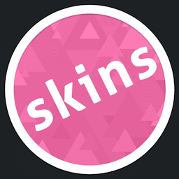

# Reddit

บทความนี้รวบรวมพื้นที่บน [Reddit](https://reddit.com) ที่ผู้ใช้สามารถเข้ามามีส่วนร่วมกับ osu! และชุมชนผู้เล่นได้

## ชุมชน (Community)

ซับเรดดิท (Subreddits) เหล่านี้ขับเคลื่อนโดยชุมชน โดยแต่ละแห่งมีจุดเน้นที่แตกต่างกันไป เช่น ด้านการเล่นเกม, การทำแมพ และการทำสกิน

| รูปโปรไฟล์ | ชื่อ | คำอธิบาย |
| :-: | :-: | :-- |
|  | [/r/osugame](https://reddit.com/r/osugame) | **/r/osugame** ปัจจุบันเป็นฟอรัมแบบรวมทุกโหมดที่ใหญ่ที่สุด สำหรับการพูดคุยทั่วไปและการแสดงผลงานคะแนนการเล่น |
|  | [/r/osumania](https://reddit.com/r/osumania) | **/r/osumania** เป็นพื้นที่เฉพาะสำหรับการพูดคุยเรื่องโหมด [osu!mania](/wiki/Game_mode/osu!mania) |
|  | [/r/osumapping](https://reddit.com/r/osumapping) | **/r/osumapping** ทำหน้าที่เป็นแพลตฟอร์มสำหรับทุกเรื่องที่เกี่ยวกับการทำแมพ |
|  | [/r/osuskins](https://reddit.com/r/osuskins) | **/r/osuskins** เปิดให้ผู้ใช้เข้ามาขอความช่วยเหลือเรื่องการทำสกิน, แลกเปลี่ยนแนวคิดงานดีไซน์ รวมถึงขอให้คนช่วยตามหาสกินที่ต้องการ |

## บัญชีส่วนตัว (Personal)

| รูปโปรไฟล์ | ชื่อบัญชี | คำอธิบาย |
| :-: | :-: | :-- |
|  | [/u/pepppppy](https://reddit.com/user/pepppppy) | บัญชี Reddit ส่วนตัวของ [ผู้สร้าง osu!](/wiki/People/peppy) ซึ่งส่วนใหญ่จะโพสต์เนื้อหาเกี่ยวกับ osu! แต่ก็มีหัวข้ออื่นๆ ด้วยเช่นกัน |
