# Akademia osu!

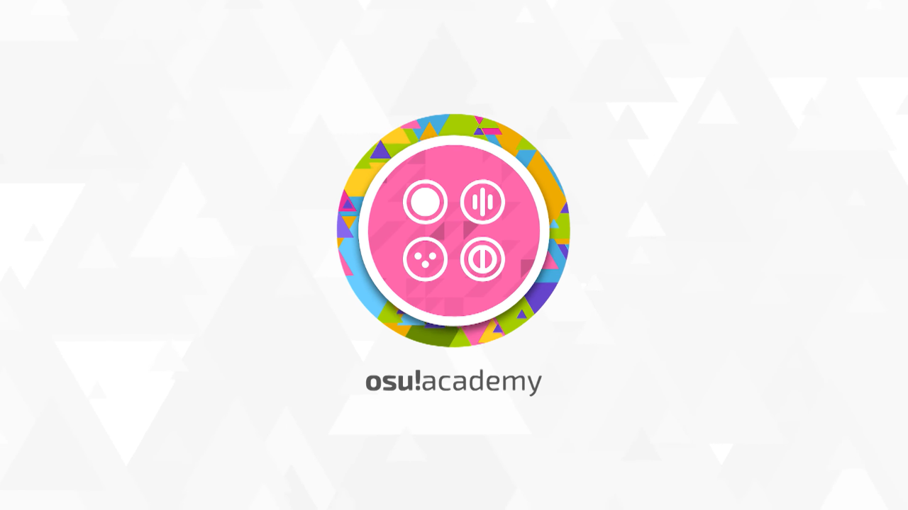

## Wprowadzenie

- [Źródło](https://osu.ppy.sh/home/news/2013-12-19-introducing-the-osu-academy)
- [Oficjalny kanał YouTube](https://www.youtube.com/user/osuacademy/videos)
- [Oficjalny wątek](https://osu.ppy.sh/community/forums/topics/169707)

**Akademia osu!** ma na celu wszechstronne ukazanie wszystkich aspektów osu!, od rozgrywki do mapowania i wszystkiego pomiędzy.

Mamy nadzieję, że filmiki te przekażą potrzebne informacje nowym graczom oraz ułatwią im wszelakie trudności związane z dalszą grą. Jeżeli masz jakieś pytania lub komentarze, proszę kieruj je do [ztrota](https://osu.ppy.sh/users/6347). Jest on praktycznie jedynym właścicielem kanału osu!academy jak i twórcą takowego projektu.

[Teraz ze zwiastunem!](https://www.youtube.com/watch?v=z5gy34k3RI0&feature=c4-overview&list=UUMeRgqzTfC5ja40B6kM6pdg).

## Odcinki

Kliknij na obrazek aby zostać zabranym do odpowiedniego odcinka.

| Odcinek | Opis |
| :-- | :-- |
|  | W tym odcinku, zajmiemy się instalacją gry i tworzeniem konta |
| [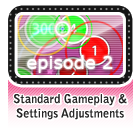](https://www.youtube.com/watch?v=mswLEXK0eDk) | W tym odcinku, weźmiemy pod lupę rozgrywkę trybu osu! i dostosowanie różnych stylów gry |
|  | W tym odcinku wraz z LoliFlan, zajmiemy się trybem gry osu!mania |
|  | W tym odcinku, weźmiemy pod lupę tryb gry CTB |
|  | W tym odcinku wraz z Tashą, zajmiemy się trybem gry Taiko |
|  | W tym odcinku, pokażemy tryb Multiplayer |
| [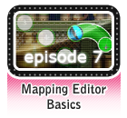](https://www.youtube.com/watch?v=WKS8Zhut9XU) | W tym odcinku, zrobimy krok do świata tworzenia beatmap |
| [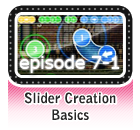](https://www.youtube.com/watch?v=RKLanv4pvJc) | W tym odcinku, zajmiemy się podstawami tworzenia sliderów |
| [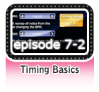](https://www.youtube.com/watch?v=8nsbrOhLE9w) | W tym odcinku, powiemy o ustawianiu rytmiki mapy |
|  | W tym odcinku, zajmiemy się siatkami i ich funkcjami |
|  | W tym odcinku, weźmiemy pod lupę ważną część mapowania, która może ulepszyć albo zespuć mapę: dźwiękami |
|  | W tym odcinku, powiemy o modowaniu beatmap |
| [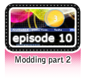](https://www.youtube.com/watch?v=SFSwmRdNbXM) | W tym odcinku, będziemy kontynuować dyskusję o modowaniu beatmap |
|  | W tym odcinku, zajmiemy się wskazówkami i sztuczkami osu! |
|  | W tym odcinku, powiemy o tworzeniu map dla trybu gry Taiko |
| [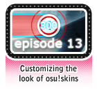](https://www.youtube.com/watch?v=oUvCBsGyTtw) | W tym odcinku, dowiemy się jak zmienić wygląd osu! poprzez skórki |
|  | W tym odcinku, powiemy o tworzeniu map dla trybu gry CTB |
|  | W tym odcinku, dowiemy się skąd brać muzykę oraz innych rzeczy których należy unikać |
| [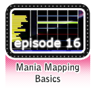](https://www.youtube.com/watch?v=uTnO_7bMV44) | W tym odcinku, powiemy o tworzeniu map dla trybu gry osu!mania |
|  | W tym odcinku, weźmiemy pod lupę różne komendy IRC oraz ich funkcje |
|  | W tym odcinku, będziemy dyskutować o przydatnym aspekcie forum Technical Support |
|  | W tym odcinku, zajmiemy się trochę delikatnym tematem: niewłaściwie zachowującymi się graczami i ich zgłaszaniem |
| [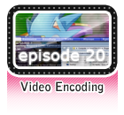](https://www.youtube.com/watch?v=exyuI9lv_OI) | W tym odcinku, powiemy o kolejnym aspekcie edytora beatmap, kodowaniu filmików |
|  | W tym odcinku, weźmiemy pod lupę podstawy streamowania na stronach takich jak twitch czy livestream |
|  | W tym odcinku, będziemy mówić o funkcji osu!direct i dodatkach dla supporterów |
|  | W tym odcinku wraz z Shiro, zajmiemy nową funkcją jaką jest Community Modding |
|  | W tym odcinku wraz z Kyonko Hizarą, powiemy jak poprawić się w technice streamowania |
|  | W tym odcinku, będziemy mówić o grupach załogi osu! |
| [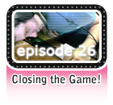](https://www.youtube.com/watch?v=y61v2QCHlpY) | Ten odcinek Akademii osu! jest dany tobie jako publiczne ogłoszenie serwisu |
| [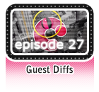](https://www.youtube.com/watch?v=nXWA1Qh9bT8) | W tym odcinku, zajmiemy się tworzeniem i udostępnianiem własnych gościnnych poziomów trudności |
|  | W tym odcinku, powiemy o podstawach forum takich jak odpowiednie zachowanie czy miejsce postowania |
|  | W tym odcinku, weźmiemy pod lupę podstawy tworzenia Storyboardów |
| [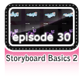](https://www.youtube.com/watch?v=EvICgPuOylk) | W tym odcinku, pokażemy bardziej zaawansowany Storyboarding |
| [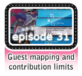](https://www.youtube.com/watch?v=s2ZK4o8V5tI) | W tym odcinku, pójdziemy jeszcze głębiej w temat gościnnych poziomów trudności oraz innych beatmapowych darów |
| [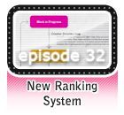](https://www.youtube.com/watch?v=wa_hNegtBw0) | W tym odcinku, powiemy o nowym systemie rankingowym |
|  | W tym odcinku, zajmiemy się zaawansowanymi wskazówkami do edytora |
