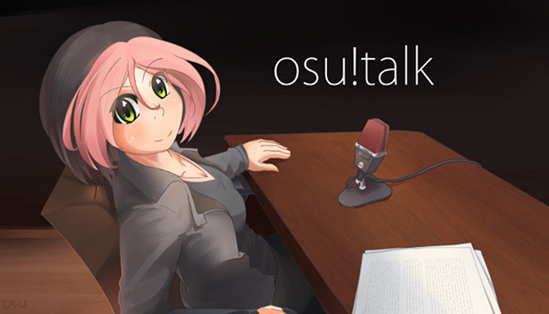

# osu!talk

**osu!talk** คือซีรีส์พอดแคสต์ที่ดำเนินรายการโดย [ztrot](https://osu.ppy.sh/users/6347) โดยมี [deadbeat](https://osu.ppy.sh/users/128370) เป็นผู้ดำเนินรายการร่วม รายการนี้เน้นไปที่การสัมภาษณ์ผู้ใช้งานหลากหลายกลุ่มในชุมชน osu! นอกจากการสัมภาษณ์แล้ว ยังมีการพูดคุยแบบกลุ่มเกี่ยวกับเหตุการณ์ต่างๆ ที่เกิดขึ้นในชุมชน เช่น การเปลี่ยนแปลงใน [ทีมงาน osu!](/wiki/People/osu!_team) หรือหัวข้อที่เป็นที่ถกเถียงกันมาอย่างยาวนาน เช่น เรื่อง overmapping

รูปแบบของพอดแคสต์นี้เปิดโอกาสให้ทุกคนสามารถเข้าร่วมฟังการบันทึกเสียงแบบสดๆ และสามารถตั้งคำถามในช่วงตอบคำถามสาธารณะ (Q&A) ของแต่ละตอนได้ โดยการบันทึกเสียงนี้จะไม่มีการถ่ายทอดสดผ่านช่องทางอื่น เพื่อสนับสนุนให้ผู้ใช้เข้ามามีส่วนร่วมในเหตุการณ์จริงด้วยตนเอง

## รายชื่อตอนการสัมภาษณ์ (Episodes)

| ตอนที่ | แขกรับเชิญ | บทบาท/ตำแหน่ง | ลิงก์ |
| :-- | :-- | :-- | :-- |
| 1 | [Charles445](https://osu.ppy.sh/users/85000) | GMT/BN | [Link](https://www.youtube.com/watch?v=e8lhBtcPbjw) |
| 2 | [MMzz](https://osu.ppy.sh/users/128993) | QAT | [Link](https://www.youtube.com/watch?v=fBBQ4bwNZcY) |
| 3 | [Loctav](https://osu.ppy.sh/users/71366) | ผู้ดูแลชุมชนและทัวร์นาเมนต์ | [Link](https://www.youtube.com/watch?v=gxZtxmUvDoQ) |
| 4 | [dkun](https://osu.ppy.sh/users/154400) | BAT/อดีตสมาชิก osu!monthly | [Link](https://www.youtube.com/watch?v=_nFI71fG7-c) |
| 5 | [LuigiHann](https://osu.ppy.sh/users/1079) | นักทำสกิน (Skinner) | [Link](https://www.youtube.com/watch?v=OVjq9ko83t0) |
| 6 | [JAKACHAN](https://osu.ppy.sh/users/718696) | ผู้เล่นระดับโปร | [Link](https://www.youtube.com/watch?v=WXFMggx94e0) |
| 7 | [Daru](https://osu.ppy.sh/users/32480) | นักวาดภาพ | [Link](https://www.youtube.com/watch?v=eBFaLRXmfYc) |
| 8 | [peppy](https://osu.ppy.sh/users/2) | ผู้สร้าง osu! | [Link](https://www.youtube.com/watch?v=x7vdW5uZutU) |
| 9 | [Cyclone](https://osu.ppy.sh/users/18589) | อดีตผู้เล่น/สมาชิกทีมงาน | [Link](https://www.youtube.com/watch?v=jPUSY0FMw2E) |
| 10 | [thelewa](https://osu.ppy.sh/users/475021) | ผู้เล่นระดับโปร | [Link](https://www.youtube.com/watch?v=N7P-J-5LJzk) |
| 11 | [WubWoofWolf](https://osu.ppy.sh/users/39828) | ผู้เล่นระดับโปร | [Link](https://www.youtube.com/watch?v=XYzKlfvQt-w) |
| 12 | [Ephemeral](https://osu.ppy.sh/users/102335) | อดีตผู้จัดการทีมงาน | [Link](https://www.youtube.com/watch?v=eXWmjo0-oyM) |
| 13 | [ztrot](https://osu.ppy.sh/users/6347) | ผู้สร้างสื่อ (Media creator) | [Link](https://www.youtube.com/watch?v=8COmLt0IBRs) |
| 14 | [Raiku](https://osu.ppy.sh/users/1525538) | ผู้เล่นระดับโปร | [Link](https://www.youtube.com/watch?v=5P9FaFrS0CM) |
| 15 | [smoogipooo](https://osu.ppy.sh/users/1040328) | นักพัฒนา (Developer) | [Link](https://www.youtube.com/watch?v=vG1yx1xVQsk) |
| 16 | [OnosakiHito](https://osu.ppy.sh/users/290128) | QAT | [Link](https://www.youtube.com/watch?v=ZYby7r3YNPg) |
| 17 | [RBRat3](https://osu.ppy.sh/users/307202) | นักวาดภาพ | [Link](https://www.youtube.com/watch?v=kSotXmkCN4I) |
| 18 | [Andrea](https://osu.ppy.sh/users/33599) | อดีตสมาชิก GMT/BN | [Link](https://www.youtube.com/watch?v=dKEOVBiljdc) |
| 19 | [Doomsday](https://osu.ppy.sh/users/18983) | ผู้เล่นระดับโปร | [Link](https://www.youtube.com/watch?v=0C74QeEcn_4) |
| 20 | [Tom94](https://osu.ppy.sh/users/1857058) | นักพัฒนา (Developer) | [Link](https://www.youtube.com/watch?v=ONnUrG4jrto) |
| 21 | [Flanster](https://osu.ppy.sh/users/447818) | GMT | [Link](https://www.youtube.com/watch?v=nvGP5x9ZseM) |
| 21.5 | [Blue Dragon](https://osu.ppy.sh/users/19048) | Mapper | [Link](https://puu.sh/cmOO3/a737a268da.mp3) |
| 22 | [HappyStick](https://osu.ppy.sh/users/256802) | ผู้เล่นระดับโปร | [Link](https://www.youtube.com/watch?v=zhAHOreuYp4) |
| 23 | [Hayabusa](https://osu.ppy.sh/users/3104108) | ผู้เล่นอันดับท็อปโหมด mania | [Link](https://www.youtube.com/watch?v=1C102Zzuyzg) |
| 24 | [Kyonko Hiraza](https://osu.ppy.sh/users/444868) | อดีตผู้เล่นระดับโปร | [Link](https://www.youtube.com/watch?v=6RhBqhhn9F0) |
| 25 | [PortalLife](https://osu.ppy.sh/users/929134) | ผู้จัดการแข่งขัน | [Link](https://www.youtube.com/watch?v=odGwuBwqcmc) |
| 26 | [MillhioreF](https://osu.ppy.sh/users/941094) | ผู้เล่นระดับโปร (Mod Easy) | [Link](https://www.youtube.com/watch?v=dO3kv8nutSI) |
| 27 | [machol30](https://osu.ppy.sh/users/5772) | Mapper ยุคบุกเบิก | [Link](https://www.youtube.com/watch?v=PR-ItQJLQTE) |
| 28 | [Nashmun](https://osu.ppy.sh/users/49031) | ผู้เล่นระดับเทพโหมด taiko | [Link](https://www.youtube.com/watch?v=C8I81f2Gw1s) |
| 29 | [Luna](https://osu.ppy.sh/users/588007) | ผู้เล่นโหมด taiko | [Link](https://www.youtube.com/watch?v=5akyzJuLLFI) |
| 30 | [Tasha](https://osu.ppy.sh/users/1031958) | นักข่าว osu!weekly | [Link](https://www.youtube.com/watch?v=9-TDEjfL1YQ) |
| 31 | [drum drum](https://osu.ppy.sh/users/4435526) | GMT | [Link](https://www.youtube.com/watch?v=Pna9rIzlZKk) |
| 32 | [p3n](https://osu.ppy.sh/users/123703) | ผู้จัดการทีมงาน, GMT | [Link](https://www.youtube.com/watch?v=stWmOmJgmLE) |
| 33 | [deadbeat](https://osu.ppy.sh/users/128370) | ผู้ดำเนินรายการร่วม, GMT | [Link](https://www.youtube.com/watch?v=LwsWUi94GmM) |
| 34 | [Zak](https://osu.ppy.sh/users/1375955) | ผู้เล่นระดับโปรโหมด catch | [Link](https://www.youtube.com/watch?v=VQ7MIshcA-E) |
| 35 | [juankristal](https://osu.ppy.sh/users/443656) | นักพากย์การแข่งขัน, ผู้เล่นโปรโหมด mania | [Link](https://www.youtube.com/watch?v=YiVCO2U4DLo) |
| 36 | [Halogen-](https://osu.ppy.sh/users/169992) | ผู้เล่นระดับโปรโหมด mania | [Link](https://www.youtube.com/watch?v=5E02YK5mNRk) |
| 37 | [Staiain](https://osu.ppy.sh/users/86188) | ผู้เล่นระดับโปรโหมด mania | [Link](https://www.youtube.com/watch?v=_SJA69rqB6w) |
| 38 | [Starrodkirby86](https://osu.ppy.sh/users/410) | Mapper เพลง Susumu Hirasawa | [Link](https://www.youtube.com/watch?v=54VUzflrXws) |
| 39 | [Arf](https://osu.ppy.sh/users/3716999) | นักพากย์การแข่งขัน | [Link](https://www.youtube.com/watch?v=K9_4nzs5idM) |
| 40 | [The8BitDrummer](https://www.twitch.tv/the8bitdrummer/profile) | นักดนตรี | [Link](https://www.youtube.com/watch?v=tuOv9E9QkJA) |
| 41 | [Histoire](https://osu.ppy.sh/users/3801463) | ผู้จัดการแข่งขัน Histy Championships | [Link](https://www.youtube.com/watch?v=3Q1ygMaAb7g) |
| 42 | [jakads](https://osu.ppy.sh/users/259972) | ผู้เล่นอันดับท็อปโหมด mania | [Link](https://www.youtube.com/watch?v=MXx6oknK6c8) |
| 43 | [Evening](https://osu.ppy.sh/users/2193881) | Mapper เพลง Camellia | [Link](https://www.youtube.com/watch?v=gHKzBz8hcoE) |
| 44 | [pishifat](https://osu.ppy.sh/users/3178418) | QAT | [Link](https://www.youtube.com/watch?v=YseljuHjmLo) |
| 45 | [Rafis](https://osu.ppy.sh/users/2558286) | ผู้เล่นระดับโปร | [Link](https://www.youtube.com/watch?v=wKhuovIMa8k) |
| 46 | [Spare](https://osu.ppy.sh/users/2204373) | ผู้เล่นอันดับท็อป | [Link](https://www.youtube.com/watch?v=MTWgwsIxPRc) |
| 47 | [Helblinde](https://osu.ppy.sh/users/48053) | ศิลปิน Featured Artist | [Link](https://www.youtube.com/watch?v=cviwU4xkM-w) |
| 48 | [MatsumotoRise](https://osu.ppy.sh/users/672726) | ผู้เล่นระดับโปร | [Link](https://www.youtube.com/watch?v=8-3d2ZHw2O4) |
| 49 | [Toy](https://osu.ppy.sh/users/2757689) | ผู้เล่นระดับโปร | [Link](https://www.youtube.com/watch?v=lI8mIJLOu_k) |

## รายการเสวนา (Discussions)

| ตอนที่ | หัวข้อ | แขกรับเชิญ | ลิงก์ |
| :-- | :-- | :-- | :-- |
| 1 | การปรับโครงสร้างทีมงาน | Charles445, Ephemeral, และ OnosakiHito | [Link](https://www.youtube.com/watch?v=c10Jiq1xZus) |
| 2 | Overmapping | Kyonko Hizara, Loctav, MMzz, และ OnosakiHito | [Link](https://www.youtube.com/watch?v=RepSYE3hN3A) |
| 3 | การดูแลความเรียบร้อย (Moderation) | Charles445, Flanster, และ Kitokofox | [Link](https://www.youtube.com/watch?v=C1hvpnW5A7k) |
| 8 | osu!next | flyte, และ peppy | [Link](https://www.youtube.com/watch?v=jBUNIDa427Q) |
| 11 | เสวนาเรื่องโหมด Catch the Beat | Kingkevin30, - Magic Bomb -, Candlestorm, Saki, และ Zak | [Link](https://www.youtube.com/watch?v=1SvUNLkcoQg) |
| 14 | ดนตรี (Music) | nekodex และ cYsmix | [Link](https://www.youtube.com/watch?v=qRnPEdVf4hU) |
| 21 | Aspire 2017 | Ephemeral, ProfessionalBox, pishifat, และ MinG3012 | [Link](https://www.youtube.com/watch?v=MyfupLRh1Io) |

## ลิงก์ที่เกี่ยวข้อง

- [ช่อง YouTube ทางการ](https://www.youtube.com/user/osuacademy/videos)
- [กระทู้ทางการในฟอรัม](https://osu.ppy.sh/community/forums/topics/225111)
