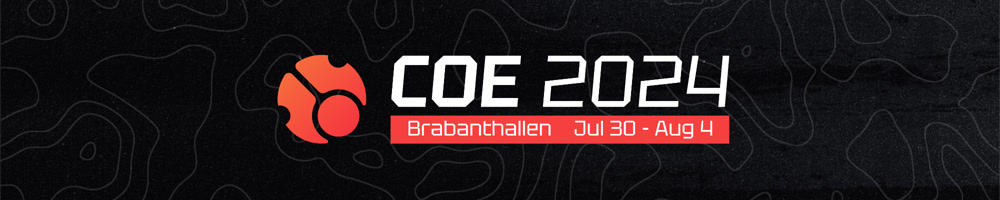
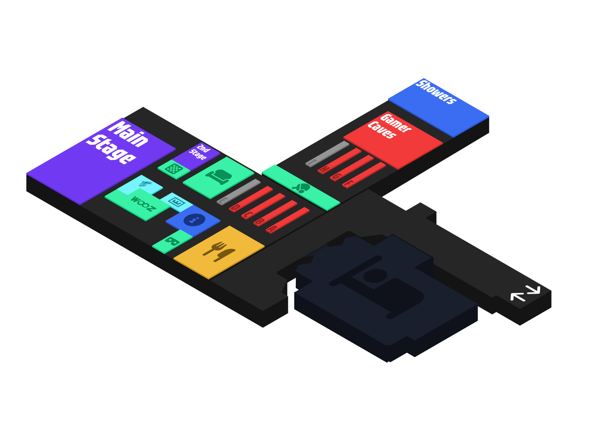

---
tags:
  - COE
  - COE2024
---

# cavoe's osu! event 2024

El **cavoe's osu! event 2024** (***COE 2024***) fue una convención de osu! organizada en **Brabanthallen en 's-Hertogenbosch (Den Bosch), Países Bajos**. Fue la sexta entrega del cavoe's osu! event.

## Cronograma

| Evento | Marca de tiempo (UTC+2) |
| --: | :-- |
| Venta inmediata de entradas | 22/8/2023 |
| Anuncio | 9/10/2023 |
| Venta de entradas | 13/10/2023 |
| Viaje a Efteling | 29/7/2024 (10:00) |
| Inicio | 30/7/2024 (14:00) |
| Discurso de inauguración | 30/7/2024 (16:00-16:30) |
| Cena de sushi | 30/7/2024 (17:00-19:30) |
| Karaoke (escenario principal) | 30/7/2024 (20:30-23:30) |
| Torneo de tenis de mesa | 31/7/2024 (12:00-14:30) |
| Panel de mapping de Nytro | 31/7/2024 (14:00-15:00) |
| Pub quiz de Mangomizer | 31/7/2024 (16:00-17:00) |
| Panel de storyboards | 31/7/2024 (19:00-19:30) |
| Octavos de final del torneo 1v1 de COE x Yuki Aim | 1/8/2024 (11:00-23:00) |
| YokesPai's Extravagant Accuracy Sightread Tournament | 2/8/2024 (13:00-15:30) |
| Cuartos de final del torneo 1v1 de COE x Yuki Aim | 2/8/2024 (13:30-20:00) |
| Bubbleman's PP Farming Race | 2/8/2024 (21:30-23:30) |
| Semifinales del torneo 1v1 de COE x Yuki Aim | 3/8/2024 (12:30-15:00) |
| Partidas de jugadores destacados del torneo 1v1 de COE x Yuki Aim | 3/8/2024 (15:30-16:30) |
| Finales del torneo 1v1 de COE x Yuki Aim | 3/8/2024 (17:30-18:30) |
| Gran final del torneo 1v1 de COE x Yuki Aim | 3/8/2024 (20:00-21:30) |
| Nyanaro's Mindblock | 4/8/2024 (12:30-13:30) |
| Bubbleman's Guess the Rank | 4/8/2024 (14:30-15:00) |
| Fin | 4/8/2024 |

## Enlaces

- **[Sitio web](https://cavoeboy.com/)**
- [Servidor de Discord](https://discord.com/invite/d6ru6PVcSY)
- [Twitter](https://twitter.com/CavoesOsuEvent)
- [Canal de YouTube](https://www.youtube.com/@coevent)
- [Canal de Twitch](https://www.twitch.tv/coevent)

## Mapa del lugar

## Organización

COE 2024 estuvo dirigido por varios miembros de la comunidad y organizaciones asociadas.

| Posición | Miembro(s) |
| :-- | :-- |
| Organizador | ::{ flag=NL }:: [cavoeboy](https://osu.ppy.sh/users/7361815), ::{ flag=DE }:: [Meyer](https://osu.ppy.sh/users/5452367) |
| Socios operativos | [osu!frlive](https://osufr.live/), [Wooting](https://next.wooting.io/), [WoozPC](https://woozpc.nl/), [Zed Up](https://www.zed-up.de/), [Yuki Aim](https://yuki.gg/) |

### Actividades externas

| Evento | Marca de tiempo (UTC+2) | Descripción |
| :-- | :-- | :-- |
| Viaje a Efteling | 29 de julio (10:00-20:00) | Un viaje a [Efteling](https://es.wikipedia.org/wiki/Efteling), un parque temático local |
| Cena de sushi | 30 de julio (17:00-19:30) | Cena de sushi en un restaurante de sushi privado |
| Proyección de *Blue Giant* en una pantalla de cine | 1 de agosto (20:30-22:30) | Proyección privada de [Blue Giant](https://en.wikipedia.org/wiki/Blue_Giant_(manga)) en el cine Kinépolis |
