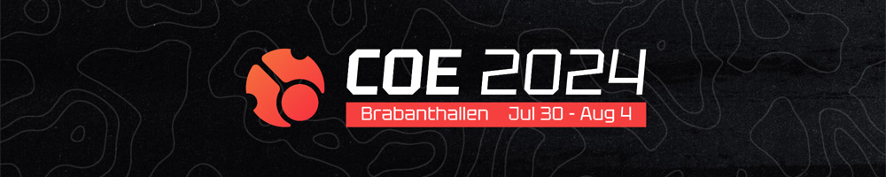

# cavoe's osu! event 2024

**cavoe's osu! event 2024** (***COE 2024***) é um evento de osu realizado no  **Brabanthallen in 's-Hertogenbosch (Den Bosch), Holanda**. Esta é a sexta edição do COE

## Schedule

| Evento | carimbo de data/hora (UTC+2) |
| --: | :-- |
| Vendas relâmpago de ingressos | 2023-08-22 |
| Anúncio | 2023-10-09 |
| Venda de bilhetes ao vivo | 2023-10-13 |
| Viagem ao Efteling | 2024-07-29 (10:00) |
| Começo | 2024-07-30 (14:00) |
| Discurso de abertura | 2024-07-30 (16:00–16:30) |
| Jantar de Sushi | 2024-07-30 (17:00–19:30) |
| Karaoke (palco principal) | 2024-07-30 (20:30–23:30) |
| Torneio de tênis de mesa | 2024-07-31 (12:00–14:30) |
| Painel de mapeamento de Nytro | 2024-07-31 (14:00–15:00) |
| Quiz do Mangomizer | 2024-07-31 (16:00–17:00) |
| Painel de storyboard | 2024-07-31 (19:00–19:30) |
| COE x Torneio Yuki Aim 1v1 RO16 | 2024-08-01 (11:00–23:00) |
| YokesPai's Torneio Extravagant Accuracy Sightread | 2024-08-02 (13:00–15:30) |
| COE x Yuki Aim 1v1 Tournament QF | 2024-08-02 (13:30–20:00) |
| Corrida de PP Farming do Bubbleman | 2024-08-02 (21:30–23:30) |
| COE x Torneio Yuki Aim 1v1 SF | 2024-08-03 (12:30–15:00) |
| COE x Torneio Yuki Aim 1v1 Showmatches | 2024-08-03 (15:30–16:30) |
| COE x Torneio Yuki Aim 1v1 Partida das Finais | 2024-08-03 (17:30–18:30) |
| COE x Torneio Yuki Aim 1v1 Grande Final | 2024-08-03 (20:00–21:30) |
| Nyanaro's Mindblock | 2024-08-04 (12:30–13:30) |
| Adivinhe o Rank com Bubbleman | 2024-08-04 (14:30–15:00) |
| Fim | 2024-08-04 |

## Links

- **[Website](https://cavoeboy.com/)**
- [Discord server](https://discord.com/invite/d6ru6PVcSY)
- [Twitter](https://twitter.com/CavoesOsuEvent)
- [YouTube channel](https://www.youtube.com/@coevent)
- [Twitch channel](https://www.twitch.tv/coevent)

## Venue map

## Organisation

COE 2024 foi realizado por vários membros da comunidade e organizações parceiras.

| Posição | Membro(s) |
| :-- | :-- |
| Organizador | ::{ flag=NL }:: [cavoeboy](https://osu.ppy.sh/users/7361815), ::{ flag=DE }:: [Meyer](https://osu.ppy.sh/users/5452367) |
| Parceiro Operacional | [osu!frlive](https://osufr.live/), [Wooting](https://next.wooting.io/), [WoozPC](https://woozpc.nl/), [Zed Up](https://www.zed-up.de/), [Yuki Aim](https://yuki.gg/) |

### Off-site activities

| Evento | Horário (UTC+2) | Descrição |
| :-- | :-- | :-- |
| Viagem a Efteling | July 29 (10:00–20:00) | Uma viagem ao [Efteling](https://en.wikipedia.org/wiki/Efteling), um parque temático local |
| Jantar de Sushi | July 30 (17:00–19:30) | Jantar em um restaurante de sushi privativo |
| *Blue Giant* cinema screening | August 1 (20:30–22:30) | Triagem privada de [Blue Giant](https://en.wikipedia.org/wiki/Blue_Giant_(manga)) no cinema de Kinepolis |
