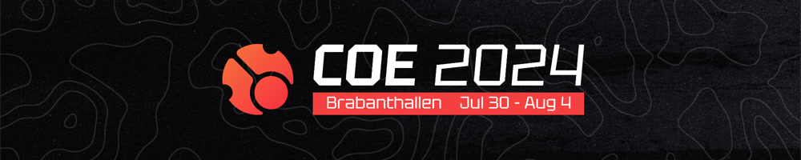
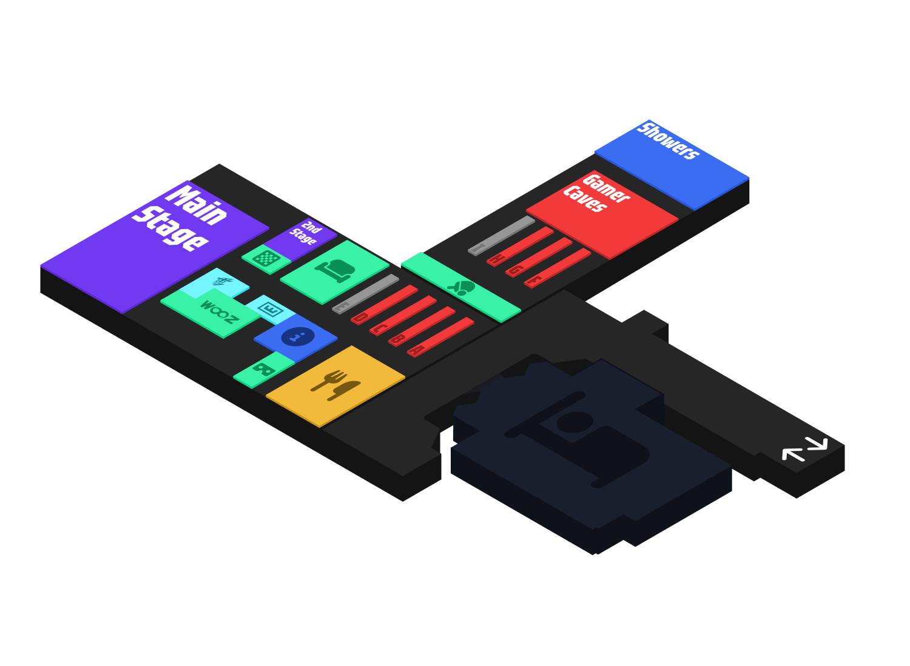

---
tags:
  - COE
  - COE2024
---

# cavoe's osu! event 2024

**cavoe's osu! event 2024** (***COE 2024***) คือกิจกรรมงานชุมนุม osu! ที่จัดขึ้นที่ **Brabanthallen ในเมือง 's-Hertogenbosch (Den Bosch) ประเทศเนเธอร์แลนด์** ถือเป็นการจัดงานครั้งที่ 6 ของ cavoe's osu! event

## กำหนดการ (Schedule)

| กิจกรรม | วันเวลา (UTC+2) |
| --: | :-- |
| เริ่มจำหน่ายบัตรแบบด่วน (Flash sales) | 2023-08-22 |
| ประกาศจัดงาน | 2023-10-09 |
| เริ่มจำหน่ายบัตรทั่วไป | 2023-10-13 |
| ทริปเที่ยวสวนสนุก Efteling | 2024-07-29 (10:00) |
| เริ่มงาน | 2024-07-30 (14:00) |
| สุนทรพจน์เปิดงาน | 2024-07-30 (16:00–16:30) |
| รับประทานอาหารค่ำซูชิ | 2024-07-30 (17:00–19:30) |
| คาราโอเกะ (เวทีหลัก) | 2024-07-30 (20:30–23:30) |
| การแข่งขันเทเบิลเทนนิส | 2024-07-31 (12:00–14:30) |
| กิจกรรมพูดคุยเรื่องการทำแมพโดย Nytro | 2024-07-31 (14:00–15:00) |
| กิจกรรม Pub Quiz โดย mangomizer | 2024-07-31 (16:00–17:00) |
| กิจกรรมพูดคุยเรื่อง Storyboard | 2024-07-31 (19:00–19:30) |
| การแข่งขัน COE x Yuki Aim 1v1 รอบ 16 คน | 2024-08-01 (11:00–23:00) |
| การแข่งขันความแม่นยำแบบอ่านสดโดย YokesPai | 2024-08-02 (13:00–15:30) |
| การแข่งขัน COE x Yuki Aim 1v1 รอบก่อนรองชนะเลิศ | 2024-08-02 (13:30–20:00) |
| การแข่งขันเก็บ pp โดย Bubbleman | 2024-08-02 (21:30–23:30) |
| การแข่งขัน COE x Yuki Aim 1v1 รอบรองชนะเลิศ | 2024-08-03 (12:30–15:00) |
| แมตช์การกุศล/โชว์ตัว COE x Yuki Aim 1v1 | 2024-08-03 (15:30–16:30) |
| การแข่งขัน COE x Yuki Aim 1v1 รอบชิงชนะเลิศ (Match Finals) | 2024-08-03 (17:30–18:30) |
| การแข่งขัน COE x Yuki Aim 1v1 รอบชิงชนะเลิศระดับสูงสุด (Grand Final) | 2024-08-03 (20:00–21:30) |
| รายการเกมโชว์ Mindblock โดย Nyanaro | 2024-08-04 (12:30–13:30) |
| กิจกรรมทายอันดับโดย Bubbleman | 2024-08-04 (14:30–15:00) |
| สิ้นสุดงาน | 2024-08-04 |

## ลิงก์ที่เกี่ยวข้อง

- **[เว็บไซต์](https://cavoeboy.com/)**
- [เซิร์ฟเวอร์ Discord](https://discord.com/invite/d6ru6PVcSY)
- [Twitter](https://twitter.com/CavoesOsuEvent)
- [ช่อง YouTube](https://www.youtube.com/@coevent)
- [ช่อง Twitch](https://www.twitch.tv/coevent)

## แผนผังสถานที่จัดงาน

## กิจกรรมภายนอกสถานที่ (Off-site activities)

| กิจกรรม | วันเวลา (UTC+2) | คำอธิบาย |
| :-- | :-- | :-- |
| ทริปเที่ยวสวนสนุก Efteling | 29 กรกฎาคม (10:00–20:00) | การเดินทางไปเที่ยวสวนสนุก [Efteling](https://en.wikipedia.org/wiki/Efteling) |
| รับประทานอาหารค่ำซูชิ | 30 กรกฎาคม (17:00–19:30) | รับประทานอาหารค่ำที่ร้านซูชิส่วนตัว |
| ชมภาพยนตร์เรื่อง *Blue Giant* | 1 สิงหาคม (20:30–22:30) | การฉายภาพยนตร์เรื่อง [Blue Giant](https://en.wikipedia.org/wiki/Blue_Giant_(manga)) รอบพิเศษที่โรงภาพยนตร์ Kinepolis |
