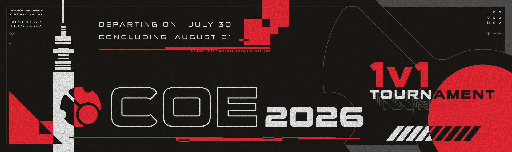
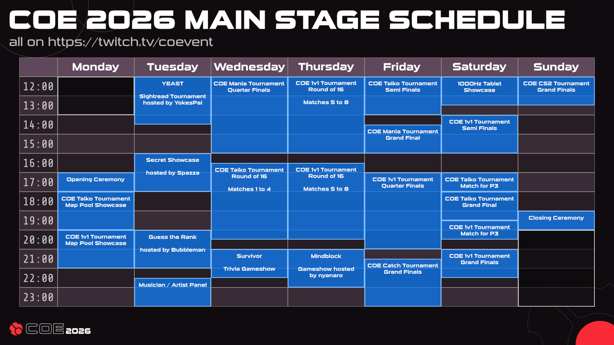
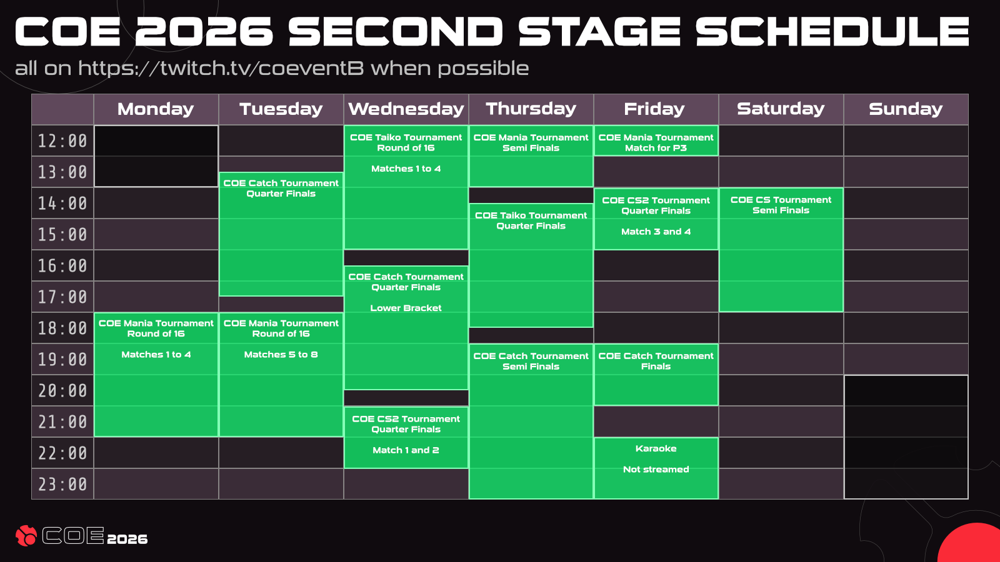
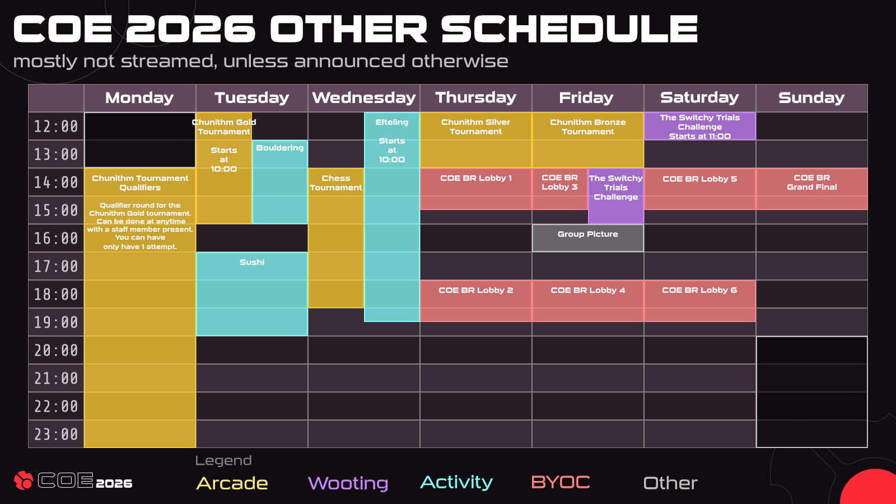

---
tags:
  - COE
  - COE2026
---

# cavoe's osu! event 2026

**cavoe's osu! event 2026** (***COE 2026***) is an osu! convention hosted at **Brabanthallen in 's-Hertogenbosch (Den Bosch), Netherlands** from the **27 July to 2 August**. It is the eighth instalment of cavoe's osu! event.

## Schedule

### Main stage

### Second stage

### Other activities

## Links

- **[Website](https://cavoe.events/)**
- [Discord server](https://discord.com/invite/d6ru6PVcSY)
- [Twitter](https://twitter.com/CavoesOsuEvent)
- [YouTube channel](https://www.youtube.com/@coevent)
- [Twitch channel](https://www.twitch.tv/coevent)
- [Announcement news post](https://osu.ppy.sh/home/news/2026-06-09-coe-2026)

## Venue map

## Activities

### Arcade & VR

COE 2026 features the following Pixel Arcade cabinets:

- Chunithm (2 cabs)
- Sound Voltex
- Taiko No Tatsujin
- Initial D
- Pump it up
- Sega Naomi

The Sega Naomi cabinet runs multiple games on the following schedule:

| Day | Games |
| :-: | :-- |
| Monday | Guilty Gear XX Accent Core |
| Tuesday | Melty Blood: Actress Again |
| Wednesday | Marvel vs. Capcom 2: New Age of Heroes |
| Thursday | Guilty Gear XX Accent Core |
| Friday | Melty Blood: Actress Again |
| Saturday | Marvel vs. Capcom 2: New Age of Heroes |
| Sunday | Popular pick / *TBD* |

The arcade will be open from **10:00** until at least **22:00** every day (UTC+2), except Monday where it opens later and Sunday where it closes early. Staff may keep it open after 22:00, but please abide staff direction when it is time to vacate the cabinets.

Two VR setups are also at the arcade and open at the same times.

### Console gaming area

In the main hall next to the Wooting booth, there is a small console gaming area equipped with bean bags, good for *Mario Kart* or *Mario Party* gameplay, among other games. The area is open 24/7.

### Wooting booth

[Wooting](https://wooting.io/) brings a booth with two PCs and "The Switchy Trials" minigame, played on a Hall effect knob. This booth is open from 9:00 to 17:00 every day.

### Tabletop, table tennis & pool table

A few tables for tabletop games, table tennis and pool are laid out between the two main halls, directly next to the arcades.

### Chess tournament

On Wednesday at 14:15 (UTC+2), there will be a small chess tournament in the tabletop area with a few prizes at stake.

[**Click here to sign up!**](https://docs.superhuman.com/form/COE-2026-Chess-Tournament-sign-up-form_dkZR4YzrjWz)

### CHUNITHM tournament

A *CHUNITHM* tournament is held throughout the week with the following schedule:

| Day | Stage | Sign-ups | Maximum participants |
| :-: | :-- | :-- | :-- |
| Monday | Gold Qualifiers | Contact staff to make your attempt. | Any |
| Tuesday | Chunithm Gold | [Chunithm Gold sign-up form](https://docs.superhuman.com/form/COE-CHUNITHM-GOLD-TOURNAMENT-SIGN-UP_dbeYbJg0BYu) | 16 |
| Thursday | Chunithm Silver | [Chunithm Silver sign-up form](https://docs.superhuman.com/form/COE-CHUNITHM-SILVER-TOURNAMENT-SIGN-UP_dnE14BONRPs) | 12 |
| Friday | Chunithm Bronze | [Chunithm Bronze sign-up form](https://docs.superhuman.com/form/COE-CHUNITHM-BRONZE-TOURNAMENT-SIGN-UP_dbXE3iuT9cL) | 12 |

In the qualifier round, sharing the charts with other competitors will disqualify both players. The top 16 highest scoring players will get to compete the next day.

Make sure you sign up for the correct tournament difficulty. See the [rule document for more information](https://coda.cavoe.events/arcade-2).

### YEAST tournament

**Yokespai's Extravagant Accuracy Sightread Tournament** (***YEAST***) is a an accuracy battle royale in the osu! game mode, where players compete in sightread duels. Instead of traditional maps, YEAST features unconventional maps with forced storyboards and unique gimmicks designed to test reading ability, adaptability and consistency.

Up to 16 players will battle through multiple rounds on Tuesday at 12:00 (UTC+2), with the winner receiving a Wooting 60HE V2 keyboard, while the runner-up receives a Wooting UwU keypad.

### Secret showcase

::{ flag=IT }:: [Spazza17](https://osu.ppy.sh/users/3516241) has a special showcase event featuring a big announcement and an exclusive reveal live on stage at Tuesday 16:00 (UTC+2).

### Guess the Rank

In the Guess the Rank show on Tuesday, 20:00 (UTC+2), attendees take the stage and showcase their osu! skills while the hosts try to predict their global leaderboard rank, all while the player themselves is hidden from the hosts. This show features a potential Wooting UwU keypad prize for every winner.

### Musician/artist panel

::{ flag=NL }:: [Kushper](https://osu.ppy.sh/users/4832514) and ::{ flag=US }:: [Naikou](https://osu.ppy.sh/beatmaps/artists/471) will be hosting a panel looking into the world of original tournament music and osu! music in general, at Tuesday 22:30 (UTC+2).

### Survivor

Survivor is a trivia quiz show featuring questions ranging from common knowledge to the most obscure facts. Surviving each round yields progressively harder questions, and the last player standing wins a Wooting UwU keypad plus a Lekker Tikken Light 20 switch pack. The show starts on Wednesday at 21:00 (UTC+2).

### Mindblock

Mindblock is a trivia game show hosted by ::{ flag=FI }:: [Nyanaro](https://osu.ppy.sh/users/4157611) on Thursday 21:00 (UTC+2), where participants compete on challenging questions, unexpected topics, and brain-teasing rounds where quick thinking and knowledge are key.

### 1000 Hz tablet showcase

On Saturday 12:00 (UTC+2), a special showcase is planned for a "1000 Hz tablet".

## Organisation

COE 2026 is run by various community members and partnered organisations.

| Position | Member(s) |
| :-- | :-- |
| Organiser | ::{ flag=NL }:: [cavoeboy](https://osu.ppy.sh/users/7361815), ::{ flag=DE }:: [Meyer](https://osu.ppy.sh/users/5452367) |
| Developer | ::{ flag=NL }:: [Anassm03](https://osu.ppy.sh/users/19743946), ::{ flag=NL }:: [dyl](https://osu.ppy.sh/users/9507985), ::{ flag=GB }:: [ilw8](https://osu.ppy.sh/users/14167692), ::{ flag=DE }:: [Meyer](https://osu.ppy.sh/users/5452367), ::{ flag=NL }:: [oliebol](https://osu.ppy.sh/users/2756335), ::{ flag=PT }:: [Pinossaur](https://osu.ppy.sh/users/15767298), ::{ flag=AU }:: [Syrin](https://osu.ppy.sh/users/5701575), ::{ flag=FR }:: [ThePooN](https://osu.ppy.sh/users/718454) |
| IT technician | ::{ flag=NL }:: [300mm](https://osu.ppy.sh/users/8958322), ::{ flag=NL }:: [dyl](https://osu.ppy.sh/users/9507985), ::{ flag=GB }:: [ilw8](https://osu.ppy.sh/users/14167692), ::{ flag=NL }:: [Kasll](https://osu.ppy.sh/users/4453686), ::{ flag=PL }:: [LiquidPL](https://osu.ppy.sh/users/5044384), ::{ flag=FR }:: [Nozhomi](https://osu.ppy.sh/users/2716981), ::{ flag=DK }:: [THEDUCK](https://osu.ppy.sh/users/6080866), ::{ flag=FR }:: [ThePooN](https://osu.ppy.sh/users/718454), ::{ flag=NL }:: [WhatTheHai](https://osu.ppy.sh/users/2447940), ::{ flag=DE }:: [WhyDontWePlay](https://osu.ppy.sh/users/10716359) |
| Stage hand | ::{ flag=NL }:: [jackylam5](https://osu.ppy.sh/users/1540807), Jupun__, ::{ flag=FR }:: [Nozhomi](https://osu.ppy.sh/users/2716981), ::{ flag=FR }:: [Paturages](https://osu.ppy.sh/users/1375479), ::{ flag=FR }:: [ThePooN](https://osu.ppy.sh/users/718454), toast, wesstrike, ::{ flag=DE }:: [Xhello123X](https://osu.ppy.sh/users/17460866) |
| Designer | ::{ flag=NL }:: [Lilily](https://osu.ppy.sh/users/6502403), ::{ flag=MY }:: [mochasan_](https://osu.ppy.sh/users/23804364), ::{ flag=IN }:: [Raybean](https://osu.ppy.sh/users/16676388), ::{ flag=DE }:: [thamkdr](https://osu.ppy.sh/users/23574071), ::{ flag=NL }:: [utaaa](https://osu.ppy.sh/users/9315038), ::{ flag=NL }:: [vifiiy](https://osu.ppy.sh/users/12876323) |
| Tournament staff | ::{ flag=NL }:: [Albionthegreat](https://osu.ppy.sh/users/9853595), ::{ flag=NL }:: [cavoeboy](https://osu.ppy.sh/users/7361815), ::{ flag=PL }:: [flapczek](https://osu.ppy.sh/users/8210988), ::{ flag=FR }:: [Glowez](https://osu.ppy.sh/users/13706157), ::{ flag=HU }:: [Himada](https://osu.ppy.sh/users/10959366), ::{ flag=FR }:: [Paturages](https://osu.ppy.sh/users/1375479), ::{ flag=PT }:: [Pinossaur](https://osu.ppy.sh/users/15767298), ::{ flag=DE }:: [TheHunter1](https://osu.ppy.sh/users/6496016), ::{ flag=FR }:: [ThePooN](https://osu.ppy.sh/users/718454), ::{ flag=NL }:: [Timper](https://osu.ppy.sh/users/11955929), ::{ flag=CA }:: [VINXIS](https://osu.ppy.sh/users/4323406) |
| Activity coordinator | ::{ flag=NL }:: [Anassm03](https://osu.ppy.sh/users/19743946), ::{ flag=DE }:: [Knorke](https://osu.ppy.sh/users/10455995), ::{ flag=AU }:: [Syrin](https://osu.ppy.sh/users/5701575) |
| Media coordinator | ::{ flag=FR }:: [JapWhite](https://osu.ppy.sh/users/7068158), ::{ flag=NL }:: [Tais993](https://osu.ppy.sh/users/15423699) |
| Sales handler | ::{ flag=DE }:: [Mou](https://osu.ppy.sh/users/1453009) |
| Other staff | ::{ flag=SK }:: [Conni](https://osu.ppy.sh/users/36300501), ::{ flag=DE }:: [DrachenKlinge](https://osu.ppy.sh/users/20033121), ::{ flag=FR }:: [GanyuMyBeloved](https://osu.ppy.sh/users/15812525), ::{ flag=NL }:: [HitSquid](https://osu.ppy.sh/users/23781291), ::{ flag=FI }:: [Iai](https://osu.ppy.sh/users/8019011), ::{ flag=CL }:: [Isita](https://osu.ppy.sh/users/13973026), ::{ flag=NL }:: [Kasll](https://osu.ppy.sh/users/4453686), ::{ flag=DE }:: [KnuffKirby](https://osu.ppy.sh/users/14187582), ::{ flag=NL }:: [kyudomaster](https://osu.ppy.sh/users/7267807), melon, ::{ flag=FR }:: [Paturages](https://osu.ppy.sh/users/1375479), ::{ flag=GB }:: [shoshuu](https://osu.ppy.sh/users/10337355), ::{ flag=US }:: [Shrocket](https://osu.ppy.sh/users/6591909), sleepy, ::{ flag=HU }:: [verto](https://osu.ppy.sh/users/2015300), ::{ flag=SE }:: [Walavouchey](https://osu.ppy.sh/users/5773079), ::{ flag=NL }:: [Zereliq](https://osu.ppy.sh/users/4059978), ::{ flag=DE }:: [Zixx4](https://osu.ppy.sh/users/13582160) |
| Operational partner | [Brabanthallen](https://www.brabanthallen.nl/), [osu!frlive](https://osufr.live/), [Pixel Arcade](https://pixelarcade.nl/), [Speedseats](https://www.speedseats.eu/over-ons/), [Zed Up](https://www.zed-up.de/) |
