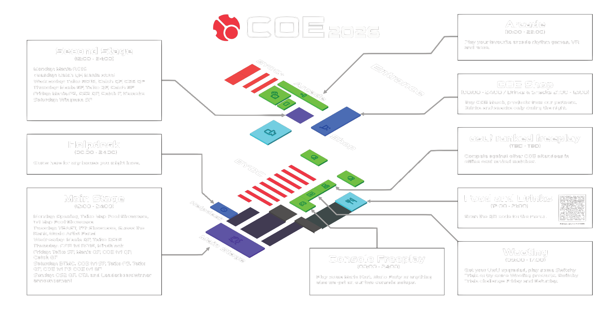

---
tags:
  - COE
  - COE2026
no_native_review: true
---

# cavoe's osu! event 2026

El **cavoe's osu! event 2026** (***COE 2026***) es una convención de osu! que se lleva a cabo en **Brabanthallen en 's-Hertogenbosch (Den Bosch), Países Bajos**, del **27 de julio al 2 de agosto**. Es la octava entrega del cavoe's osu! event.

## Cronograma

### Escenario principal

### Escenario secundario

### Otras actividades

## Enlaces

- **[Sitio web](https://cavoe.events/)**
- [Servidor de Discord](https://discord.com/invite/d6ru6PVcSY)
- [Twitter](https://twitter.com/CavoesOsuEvent)
- [Canal de YouTube](https://www.youtube.com/@coevent)
- [Canal de Twitch](https://www.twitch.tv/coevent)
- [Noticia del anuncio](https://osu.ppy.sh/home/news/2026-06-09-coe-2026)

## Mapa del lugar

## Actividades

### Arcade & VR

COE 2026 cuenta con las siguientes máquinas recreativas Pixel Arcade:

- Chunithm (2 cabinas)
- Sound Voltex
- Taiko No Tatsujin
- Initial D
- Pump it up
- Sega Naomi

La máquina Sega Naomi permite ejecutar varios juegos según el siguiente horario:

| Día | Juegos |
| :-: | :-- |
| Lunes | Guilty Gear XX Accent Core |
| Martes | Melty Blood: Actress Again |
| Miércoles | Marvel vs. Capcom 2: New Age of Heroes |
| Jueves | Guilty Gear XX Accent Core |
| Viernes | Melty Blood: Actress Again |
| Sábado | Marvel vs. Capcom 2: New Age of Heroes |
| Domingo | Elección popular / *Por determinar* |

La sala de juegos estará abierta desde las **10:00** hasta aproximadamente las **22:00** todos los días (UTC+2), excepto los lunes que abre más tarde, y los domingos que cierra antes. Es posible que el personal lo mantenga abierto después de las 22:00, pero, cuando llegue el momento de salir de las instalaciones, sigue las instrucciones del personal.

En la sala de juegos también hay dos equipos de realidad virtual, que abren en el mismo horario.

### Zona de videojuegos de consola

En la sala principal, junto al stand de Wooting, hay una pequeña zona de videojuegos para consolas equipada con asientos tipo puff, ideal para jugar a *Mario Kart* o *Mario Party*, entre otros juegos. La zona está abierta las 24 horas del día

### Stand de Wooting

[Wooting](https://wooting.io/) cuenta con un stand con dos ordenadores y un minijuego llamado «The Switchy Trials», que se juega con un mando de efecto Hall. Este stand está abierto todos los días de 9:00 a 17:00.

### Juegos de mesa, tenis de mesa y mesa de billar

Entre las dos salas principales, justo al lado de las máquinas de juegos, hay unas cuantas mesas para juegos de mesa, tenis de mesa y billar.

### Torneo de ajedrez

El miércoles a las 14:15 (UTC+2) se realizará un pequeño torneo de ajedrez en la zona de juegos de mesa, con algunos premios en juego.

[**¡Haz clic aquí para registrarte!**](https://docs.superhuman.com/form/COE-2026-Chess-Tournament-sign-up-form_dkZR4YzrjWz)

### Torneo de CHUNITHM

A lo largo de la semana se realizará un torneo de *CHUNITHM* con el siguiente horario:

| Día | Stage | Inscripciones | Número máximo de participantes |
| :-: | :-- | :-- | :-- |
| Lunes | Clasificación para la categoría de oro | Ponte en contacto con el personal para realizar tu intento. | Cualquiera |
| Martes | Chunithm de oro | [Formulario de registro para el Chunithm de oro](https://docs.superhuman.com/form/COE-CHUNITHM-GOLD-TOURNAMENT-SIGN-UP_dbeYbJg0BYu) | 16 |
| Jueves | Chunithm de plata | [Formulario de registro para el Chunithm de plata](https://docs.superhuman.com/form/COE-CHUNITHM-SILVER-TOURNAMENT-SIGN-UP_dnE14BONRPs) | 12 |
| Viernes | Chunithm de bronce | [Formulario de registro para el Chunithm de bronce](https://docs.superhuman.com/form/COE-CHUNITHM-BRONZE-TOURNAMENT-SIGN-UP_dbXE3iuT9cL) | 12 |

En la ronda clasificatoria, compartir los *charts* con otros competidores supondrá la descalificación de ambos jugadores. Los 16 jugadores con las puntuaciones más altas pasarán a competir al día siguiente.

Asegúrate de inscribirte en el torneo con el nivel de dificultad adecuado. Consulta el [documento de reglas para obtener más información](https://coda.cavoe.events/arcade-2).

### Torneo de YEAST

El **Yokespai's Extravagant Accuracy Sightread Tournament** (***YEAST***) es un battle royale de precisión en el modo de juego osu!, en el que los jugadores compiten en duelos de lectura a primera vista. En lugar de mapas tradicionales, YEAST incluye mapas poco convencionales con storyboards forzados y recursos únicos diseñados para poner a prueba la capacidad de lectura, la adaptabilidad y la consistencia.

Hasta 16 jugadores se enfrentarán en varias rondas el martes a las 12:00 (UTC+2); el ganador recibirá un teclado Wooting 60HE V2, mientras que el subcampeón recibirá un Wooting UwU.

### Presentación secreta

::{ flag=IT }:: [Spazza17](https://osu.ppy.sh/users/3516241) realizará un evento especial en el que se hará un gran anuncio y se revelará una primicia en directo desde el escenario el martes a las 16:00 (UTC+2).

### Adivina el rango

En el evento «Adivina el rango», que se realizará el martes a las 20:00 (UTC+2), los participantes subirán al escenario y mostrarán sus habilidades en osu!, mientras que los presentadores intentarán adivinar su rango en la clasificación mundial, todo ello sin que los presentadores sepan quién es el jugador. En este evento, cada ganador podrá ganar un Wooting UwU.

### Panel de músicos y artistas

::{ flag=NL }:: [Kushper](https://osu.ppy.sh/users/4832514) y ::{ flag=US }:: [Naikou](https://osu.ppy.sh/beatmaps/artists/471) llevarán a cabo un panel en el que se analizará el mundo de la música original de los torneos y la música de osu! en general, el martes a las 22:30 (UTC+2).

### Survivor

Survivor es un concurso de preguntas y respuestas en el que se plantean preguntas que van desde conocimientos generales hasta datos muy poco conocidos. Si sobrevives a cada ronda, las preguntas se van volviendo cada vez más difíciles, y el último jugador que quede en pie ganará un Wooting UwU y un paquete de switches Lekker Tikken Light 20. El evento comenzará el miércoles a las 21:00 (UTC+2).

### Mindblock

Mindblock es un concurso de preguntas y respuestas organizado por ::{ flag=FI }:: [Nyanaro](https://osu.ppy.sh/users/4157611) el jueves a las 21:00 (UTC+2), en el que los participantes compiten en preguntas difíciles, temas inesperados y rondas que ponen a prueba la mente, en las que la rapidez mental y los conocimientos son fundamentales.

### Presentación de tabletas de 1000 Hz

El sábado a las 12:00 (UTC+2) está prevista una presentación especial de una «tableta de 1000 Hz».

## Organización

COE 2026 es organizado por diversos miembros de la comunidad y organizaciones asociadas.

| Posición | Miembro(s) |
| :-- | :-- |
| Organizador | ::{ flag=NL }:: [cavoeboy](https://osu.ppy.sh/users/7361815), ::{ flag=DE }:: [Meyer](https://osu.ppy.sh/users/5452367) |
| Desarrollador | ::{ flag=NL }:: [Anassm03](https://osu.ppy.sh/users/19743946), ::{ flag=NL }:: [dyl](https://osu.ppy.sh/users/9507985), ::{ flag=GB }:: [ilw8](https://osu.ppy.sh/users/14167692), ::{ flag=DE }:: [Meyer](https://osu.ppy.sh/users/5452367), ::{ flag=NL }:: [oliebol](https://osu.ppy.sh/users/2756335), ::{ flag=PT }:: [Pinossaur](https://osu.ppy.sh/users/15767298), ::{ flag=AU }:: [Syrin](https://osu.ppy.sh/users/5701575), ::{ flag=FR }:: [ThePooN](https://osu.ppy.sh/users/718454) |
| Técnico informático | ::{ flag=NL }:: [300mm](https://osu.ppy.sh/users/8958322), ::{ flag=NL }:: [dyl](https://osu.ppy.sh/users/9507985), ::{ flag=GB }:: [ilw8](https://osu.ppy.sh/users/14167692), ::{ flag=NL }:: [Kasll](https://osu.ppy.sh/users/4453686), ::{ flag=PL }:: [LiquidPL](https://osu.ppy.sh/users/5044384), ::{ flag=FR }:: [Nozhomi](https://osu.ppy.sh/users/2716981), ::{ flag=DK }:: [THEDUCK](https://osu.ppy.sh/users/6080866), ::{ flag=FR }:: [ThePooN](https://osu.ppy.sh/users/718454), ::{ flag=NL }:: [WhatTheHai](https://osu.ppy.sh/users/2447940), ::{ flag=DE }:: [WhyDontWePlay](https://osu.ppy.sh/users/10716359) |
| Técnico de escenario | ::{ flag=NL }:: [jackylam5](https://osu.ppy.sh/users/1540807), Jupun__, ::{ flag=FR }:: [Nozhomi](https://osu.ppy.sh/users/2716981), ::{ flag=FR }:: [Paturages](https://osu.ppy.sh/users/1375479), ::{ flag=FR }:: [ThePooN](https://osu.ppy.sh/users/718454), toast, wesstrike, ::{ flag=DE }:: [Xhello123X](https://osu.ppy.sh/users/17460866) |
| Personal del torneo | ::{ flag=NL }:: [Albionthegreat](https://osu.ppy.sh/users/9853595), ::{ flag=NL }:: [cavoeboy](https://osu.ppy.sh/users/7361815), ::{ flag=PL }:: [flapczek](https://osu.ppy.sh/users/8210988), ::{ flag=FR }:: [Glowez](https://osu.ppy.sh/users/13706157), ::{ flag=HU }:: [Himada](https://osu.ppy.sh/users/10959366), ::{ flag=FR }:: [Paturages](https://osu.ppy.sh/users/1375479), ::{ flag=PT }:: [Pinossaur](https://osu.ppy.sh/users/15767298), ::{ flag=DE }:: [TheHunter1](https://osu.ppy.sh/users/6496016), ::{ flag=FR }:: [ThePooN](https://osu.ppy.sh/users/718454), ::{ flag=NL }:: [Timper](https://osu.ppy.sh/users/11955929), ::{ flag=CA }:: [VINXIS](https://osu.ppy.sh/users/4323406) |
| Coordinador de actividades | ::{ flag=NL }:: [Anassm03](https://osu.ppy.sh/users/19743946), ::{ flag=DE }:: [Knorke](https://osu.ppy.sh/users/10455995), ::{ flag=AU }:: [Syrin](https://osu.ppy.sh/users/5701575) |
| Coordinador de los medios de comunicación | ::{ flag=FR }:: [JapWhite](https://osu.ppy.sh/users/7068158), ::{ flag=NL }:: [Tais993](https://osu.ppy.sh/users/15423699) |
| Responsable de ventas | ::{ flag=DE }:: [Mou](https://osu.ppy.sh/users/1453009) |
| Personal adicional | ::{ flag=SK }:: [Conni](https://osu.ppy.sh/users/36300501), ::{ flag=DE }:: [DrachenKlinge](https://osu.ppy.sh/users/20033121), ::{ flag=FR }:: [GanyuMyBeloved](https://osu.ppy.sh/users/15812525), ::{ flag=NL }:: [HitSquid](https://osu.ppy.sh/users/23781291), ::{ flag=FI }:: [Iai](https://osu.ppy.sh/users/8019011), ::{ flag=CL }:: [Isita](https://osu.ppy.sh/users/13973026), ::{ flag=NL }:: [Kasll](https://osu.ppy.sh/users/4453686), ::{ flag=DE }:: [KnuffKirby](https://osu.ppy.sh/users/14187582), ::{ flag=NL }:: [kyudomaster](https://osu.ppy.sh/users/7267807), melon, ::{ flag=FR }:: [Paturages](https://osu.ppy.sh/users/1375479), ::{ flag=GB }:: [shoshuu](https://osu.ppy.sh/users/10337355), ::{ flag=US }:: [Shrocket](https://osu.ppy.sh/users/6591909), sleepy, ::{ flag=HU }:: [verto](https://osu.ppy.sh/users/2015300), ::{ flag=SE }:: [Walavouchey](https://osu.ppy.sh/users/5773079), ::{ flag=NL }:: [Zereliq](https://osu.ppy.sh/users/4059978), ::{ flag=DE }:: [Zixx4](https://osu.ppy.sh/users/13582160) |
| Socios operativos | [Brabanthallen](https://www.brabanthallen.nl/), [osu!frlive](https://osufr.live/), [Pixel Arcade](https://pixelarcade.nl/), [Speedseats](https://www.speedseats.eu/over-ons/), [Zed Up](https://www.zed-up.de/) |
