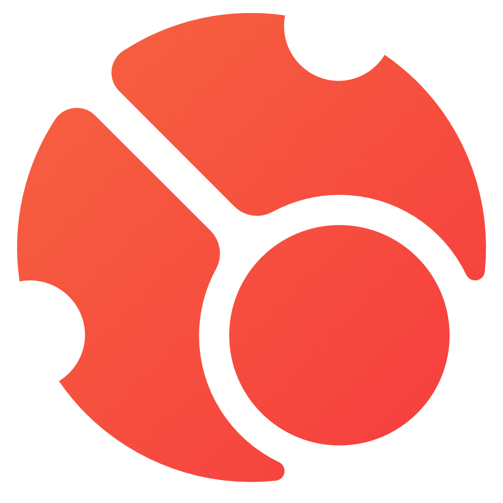

# cavoe's osu! event

::: Infobox

<!-- lint ignore heading-increment -->

#### cavoe's osu! event

[Situs web](https://cavoeboy.com/) • [Twitter](https://twitter.com/CavoesOsuEvent) • [YouTube](https://www.youtube.com/@coevent) • [Twitch](https://www.twitch.tv/coevent) • [Discord](https://discord.com/invite/d6ru6PVcSY)

:::

**cavoe's osu! event** (***COE***) merupakan konvensi osu! tahunan yang diadakan di Belanda dan dipelopori oleh ::{ flag=NL }:: [cavoeboy](https://osu.ppy.sh/users/7361815). Konvensi ini menghadirkan berbagai turnamen serta area *bring-your-own computer* (BYOC) khusus yang dapat direservasi, gerai permainan, acara panggung yang berhubungan dengan osu!, dan aneka aktivitas lain di dalamnya.

## Iterasi

- COE 2017
- COE 2018
- COE 2019
- COE 2022
- [COE 2023](2023)
- [COE 2024](2024)

## Tautan

- **[Situs web](https://cavoeboy.com/)**
- [Server Discord](https://discord.com/invite/d6ru6PVcSY)
- [Twitter](https://twitter.com/CavoesOsuEvent)
- [Kanal YouTube](https://www.youtube.com/@coevent)
- [Kanal Twitch](https://www.twitch.tv/coevent)

## Sejarah

COE bermula pada tahun 2007 sebagai "acara kopi darat nasional Belanda dengan beberapa pemain tamu dari negara lain" di kafe De Hangar, Eindhoven. Pada saat itu, konvensi ini hanya disebut sebagai "osu! event" dan hanya dihadiri oleh 35 peserta selama 3 hari.

Konvensi ini kemudian diangkat menjadi acara yang bergengsi pada tahun 2018. Dengan lebih dari 300 peserta selama 10 hari, COE tahun ini dihadiri oleh berbagai pemain kenamaan seperti ::{ flag=KR }:: [chocomint](https://osu.ppy.sh/users/124493) (yang saat itu masih bernama Cookiezi), ::{ flag=US }:: [BTMC](https://osu.ppy.sh/users/3171691) (BeasttrollMC), dan ::{ flag=PL }:: [WubWoofWolf](https://osu.ppy.sh/users/39828).

COE berpindah lokasi ke Brabanthallen di 's-Hertogenbosch (Den Bosch) pada tahun 2019. Dengan gedung yang lebih luas dan panggung yang lebih besar, COE tahun ini menampung lebih dari 500 peserta serta menawarkan lebih banyak gerai VR, acara panggung, dan area VIP khusus.

COE batal diselenggarakan pada tahun 2020 dan 2021 akibat [pandemi COVID-19](https://en.wikipedia.org/wiki/COVID-19_pandemic).

Memasuki tahun 2022, COE semakin bertambah besar dengan kehadiran 750 peserta, *arcade* khusus permainan ritme, lebih banyak mitra, lebih banyak acara panggung, dan "gua gamer"/"*gamer cave*" yang merupakan ruang pribadi yang dapat disewa di muka oleh pengunjung. COE tahun ini juga menghadirkan turnamen osu! dengan pundi hadiah yang totalnya mencapai 3.000 Euro.
