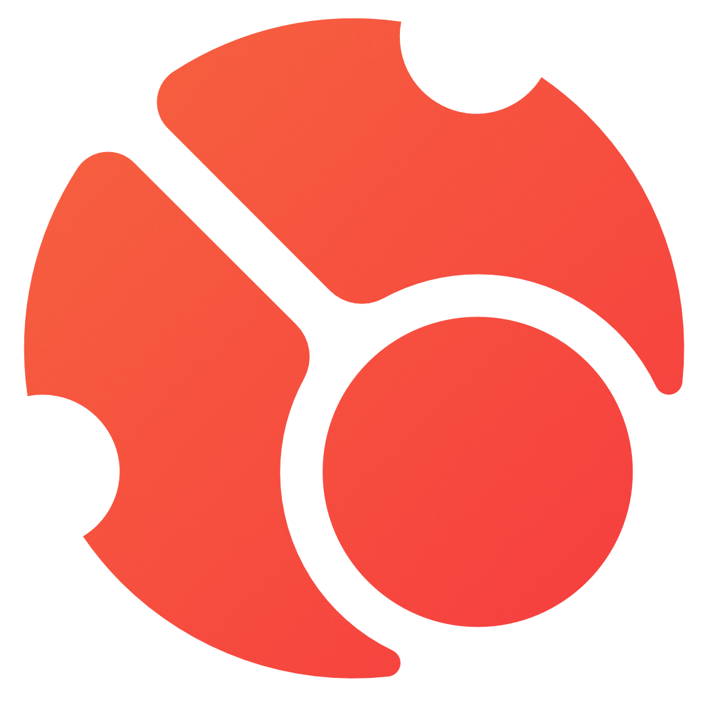

# กิจกรรม cavoe's osu! event

::: Infobox

<!-- lint ignore heading-increment -->

#### cavoe's osu! event

[เว็บไซต์](https://cavoeboy.com/) • [Twitter](https://twitter.com/CavoesOsuEvent) • [YouTube](https://www.youtube.com/@coevent) • [Twitch](https://www.twitch.tv/coevent) • [Discord](https://discord.com/invite/d6ru6PVcSY)

:::

**cavoe's osu! event** (***COE***) คือกิจกรรมงานชุมนุม (Convention) ประจำปีของชาว osu! ที่จัดขึ้นในประเทศเนเธอร์แลนด์ ก่อตั้งโดย ::{ flag=NL }:: [cavoeboy](https://osu.ppy.sh/users/7361815) ภายในงานมีการจัดการแข่งขันและมีโซนสำหรับนำคอมพิวเตอร์มาเอง (Bring-your-own-computer หรือ BYOC), ซุ้มเล่นเกม, กิจกรรมบนเวทีที่เกี่ยวกับ osu! และกิจกรรมอื่นๆ อีกมากมาย

## ลำดับการจัดงาน

- COE 2017
- COE 2018
- COE 2019
- COE 2022
- [COE 2023](2023)
- [COE 2024](2024)

## ลิงก์ที่เกี่ยวข้อง

- **[เว็บไซต์](https://cavoeboy.com/)**
- [เซิร์ฟเวอร์ Discord](https://discord.com/invite/d6ru6PVcSY)
- [Twitter](https://twitter.com/CavoesOsuEvent)
- [ช่อง YouTube](https://www.youtube.com/@coevent)
- [ช่อง Twitch](https://www.twitch.tv/coevent)

## ประวัติความเป็นมา (History)

เริ่มต้นจากการเป็นกิจกรรมเล็กๆ ในชื่อ "osu! event" ในปี 2017 โดยเป็นการนัดพบปะกันของชาวเนเธอร์แลนด์และผู้มาเยือนจากประเทศอื่นๆ เพียง 35 คน เป็นเวลา 3 วัน จัดขึ้นที่ café De Hangar ในเมืองไอนด์โฮเวน (Eindhoven)

ในปี 2018 งานได้ขยายตัวจนเป็นที่รู้จักโดยมีผู้เข้าร่วมกว่า 300 คน และจัดงานยาวนานถึง 10 วัน โดยมีผู้เล่นระดับท็อปมาร่วมงานมากมาย เช่น ::{ flag=KR }:: [chocomint](https://osu.ppy.sh/users/124493) (ในขณะนั้นคือ Cookiezi), ::{ flag=US }:: [BTMC](https://osu.ppy.sh/users/3171691) (ในขณะนั้นคือ BeasttrollMC) และ ::{ flag=PL }:: [WubWoofWolf](https://osu.ppy.sh/users/39828)

COE 2019 ได้ย้ายสถานที่จัดงานไปยัง Brabanthallen ในเมือง 's-Hertogenbosch (หรือที่รู้จักกันในชื่อ Den Bosch) ด้วยสถานที่ที่ใหญ่ขึ้นและมีเวทีขนาดใหญ่ ทำให้รองรับคนได้กว่า 500 คน พร้อมด้วยซุ้ม VR, กิจกรรมบนเวที และพื้นที่ VIP โดยเฉพาะ

สำหรับการจัดงานในปี 2020 และ 2021 ได้ถูกยกเลิกไปเนื่องจากสถานการณ์ [การระบาดของโควิด-19](https://en.wikipedia.org/wiki/COVID-19_pandemic)

ในปี 2022 COE ได้ขยายขนาดขึ้นอีกครั้งโดยมีผู้เข้าร่วมถึง 750 คน มีตู้เกมแนวจังหวะดนตรี (Arcade), พันธมิตรผู้สนับสนุนมากขึ้น, กิจกรรมบนเวทีที่หลากหลายขึ้น และมีการเปิดตัว "gamer caves" ซึ่งเป็นห้องส่วนตัวที่ผู้เข้าร่วมสามารถจองล่วงหน้าได้ นอกจากนี้ยังมีการจัดการแข่งขัน osu! ที่มีเงินรางวัลรวมสูงถึง 3,000 ยูโร (EUR)
