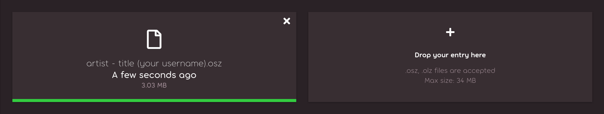
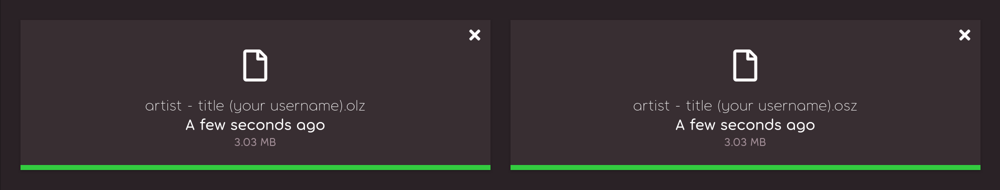

# Aspire 6

Aspire 6 was the sixth iteration of the [beatmapping](/wiki/Beatmapping) [contest](/wiki/Contests) where the mappers were encouraged to fully ignore the [ranking criteria](/wiki/Ranking_criteria) and explore gameplay mechanics that aren't typically used.

## Schedule

| Event | Date (UTC) |
| --: | :-- |
| Registrations and submissions | 14 June 2026 – 16 August 2026 (23:59 UTC) |
| Voting | 26 August 2026 – 2 September 2026 (23:59 UTC) |
| Results announcement | 11 September 2026 (15:00 UTC) |

## Links

- [**Forum thread for updates**](https://osu.ppy.sh/community/forums/topics/2216418)
- Contest inquiries: [aspire@ppy.sh](mailto:aspire@ppy.sh)
- [Contest announcement](https://osu.ppy.sh/home/news/2026-06-14-aspire-6)
- [Voting announcement](https://osu.ppy.sh/home/news/2026-08-26-aspire-6-voting)
- [Registration form](https://form-auth.ppy.sh/form/2026-aspire-6-registrations)
- [Results announcement](https://osu.ppy.sh/home/news/2026-09-11-aspire-6-results)
- Contest listings
  - [osu! (Visual Spectacle)](https://osu.ppy.sh/community/contests/290)
  - [osu! (Innovative Gameplay)](https://osu.ppy.sh/community/contests/291)
  - [osu!taiko](https://osu.ppy.sh/community/contests/292)
  - [osu!catch](https://osu.ppy.sh/community/contests/293)
  - [osu!mania](https://osu.ppy.sh/community/contests/294)
- [Mappers' Guild Aspire Hub](https://mappersguild.com/aspire)

## Prizes

The prizes for this contest are as follows:

- **osu!:** Prizes are split between *Visual Spectacle* and *Innovative Gameplay* categories, which one winning Aspirant and two runner-ups each.
- **osu!taiko:** One winning Aspirant.
- **osu!catch:** One winning Aspirant.
- **osu!mania:** One winning Aspirant and one runner-up.

**Aspirant**: Awarded to the winners of each Aspire category.

Both participants will receive:

- [*Elite Mapper: Aspirant* title](/wiki/People/Users_with_unique_titles#aspire-mapping-contest-winners) (or special increment for existing Elite Mappers)
- Aspire 6 winner [badge](/wiki/Community/Profile_badge)
- 1 year of [osu!supporter](/wiki/osu!supporter)

**Runner-Up**: Awarded to runners up and honourable mentions[^honourable-mention] of each category.

Both participants will receive:

- Aspire 6 runner-up [badge](/wiki/Community/Profile_badge)
- 6 months of [osu!supporter](/wiki/osu!supporter)
- 2 [contest points](/wiki/Contests/Contest_points)

All prize-winning entries were also added to the [Loved](/wiki/Community/Project_Loved) category, on the condition that the maps are passable by a human player and parser errors were removed.

## Organisation

Aspire 6 was run by various members of the [osu! team](/wiki/People/osu!_team) and community.

| Position | Member(s) |
| :-- | :-- |
| Host | ::{ flag=TN }:: ::Hivie::{ user=14102976 }, ::{ flag=GB }:: ::-Mo-::{ user=2202163 } |
| Designer | ::{ flag=GB }:: ::Tanza3D::{ user=10379965 } |
| General assistance | ::{ flag=AU }:: ::peppy::{ user=2 }, ::{ flag=US }:: ::pishifat::{ user=3178418 }, ::{ flag=SE }:: ::Walavouchey::{ user=5773079 } |
| Replayer | ::{ flag=NO }:: ::-GN::{ user=895581 }, ::{ flag=AT }:: ::Daletto::{ user=7592136 }, ::{ flag=NL }:: ::jackylam5::{ user=1540807 }, ::{ flag=GB }:: ::mangomizer::{ user=1893718 }, ::{ flag=SE }:: ::Walavouchey::{ user=5773079 } |
| Streamer | ::{ flag=ES }:: ::Trosk-::{ user=3469385 } |
| Audio mixer | ::{ flag=NL }:: ::Retiu::{ user=13475402 } |
| Guest commentator | ::{ flag=US }:: ::KoiFishu::{ user=4539930 } |

## Participants

| Team | Members |
| :-- | :-- |
|  | ::{ flag=PT }:: ::amongusrtx30080::{ user=27476898 } |
|  | ::{ flag=US }:: ::AdrianLazer::{ user=10292643 } |
| tma tsod | ::{ flag=CL }:: ::TheShadowOfDark::{ user=5795337 }, ::{ flag=US }:: ::TheMagicAnimals::{ user=17274052 } |
|  | ::{ flag=NO }:: ::Aspheria::{ user=14781224 } |
|  | ::{ flag=NL }:: ::StarLite4::{ user=39702838 } |
| nil | ::{ flag=SG }:: ::RyanAshazy1::{ user=27581177 } |
|  | ::{ flag=PL }:: ::h3oCharles::{ user=8712289 } |
|  | ::{ flag=TW }:: ::Solor::{ user=25201175 } |
|  | ::{ flag=US }:: ::WolfStarArtOSU::{ user=34821954 } |
|  | ::{ flag=US }:: ::The Jorker::{ user=32908054 } |
|  | ::{ flag=VN }:: ::\[-Crazy Boy-\]::{ user=33849459 } |
|  | ::{ flag=CN }:: ::Kieost::{ user=17823832 } |
|  | ::{ flag=PH }:: ::Imajinaree::{ user=18397685 } |
| dauylpaz | ::{ flag=KZ }:: ::tadahitotsu::{ user=11653544 } |
| Ça casse pas trois pattes à un canard | ::{ flag=BR }:: ::Jacques::{ user=6599241 }, ::{ flag=FR }:: ::SaYa-::{ user=14628734 } |
| ? | ::{ flag=RU }:: ::kuyusu::{ user=11758667 }, ::{ flag=NL }:: ::Apichu::{ user=14967853 } |
| Chloris | ::{ flag=VN }:: ::LunaUwU::{ user=39084830 } |
| two guys who like mapping taiko | ::{ flag=AU }:: ::Nintendo 64::{ user=30481748 }, ::{ flag=CA }:: ::EnderBlazegames::{ user=36292093 } |
| the Northernlion Supercruise | ::{ flag=KR }:: ::Akbo::{ user=7627061 } |
| SV | ::{ flag=AR }:: ::APRL03::{ user=11394892 }, ::{ flag=AR }:: ::el\_matero::{ user=23417934 } |
|  | ::{ flag=AE }:: ::ItzShadowCraft::{ user=27830521 } |
| Synthesizer | ::{ flag=CN }:: ::UTAU::{ user=13859320 } |
|  | ::{ flag=GB }:: ::Pastel Kitten::{ user=37602544 } |
| Kinflo x Björk Collab | ::{ flag=CA }:: ::ThunderBirdo::{ user=22228239 }, ::{ flag=GB }:: ::- zw\[A 3Q\]-K bg::{ user=22241162 } |
| kelompok 2 | ::{ flag=ID }:: ::Alicia::{ user=17258072 } |
| DergDergDerg | ::{ flag=HK }:: ::DraterTD::{ user=11671725 } |
|  | ::{ flag=NL }:: ::Poochylord::{ user=26861379 } |
| Chronospatial Disassociators | ::{ flag=US }:: ::Tomy::{ user=14889628 }, ::{ flag=PL }:: ::Tenexxt::{ user=34064854 } |
| The Jersey Club Sound Bank | ::{ flag=GB }:: ::Hydria::{ user=808176 }, ::{ flag=DO }:: ::Antalf::{ user=8793773 } |
| Marseille Pride | ::{ flag=FR }:: ::Natsuko::{ user=8266817 }, ::{ flag=FR }:: ::Pitsuwa::{ user=8417565 } |
| No Authors Listed | ::{ flag=DE }:: ::Tunnelblick::{ user=7737096 }, ::{ flag=US }:: ::Utiba::{ user=11354436 } |
| DDLC-ROM/Puya Love | ::{ flag=RO }:: ::Kat\_explodes::{ user=26376228 }, ::{ flag=RO }:: ::hello\_lol420::{ user=27609690 } |
| Luminescent Star | ::{ flag=ID }:: ::\_MilkTea::{ user=25019291 } |
|  | ::{ flag=AU }:: ::Levesile::{ user=12054043 } |
|  | ::{ flag=US }:: ::Karoo13::{ user=1882522 }, ::{ flag=IT }:: ::Emotive::{ user=12381359 } |
| Jumping Turtles | ::{ flag=AU }:: ::turt-::{ user=7630990 }, ::{ flag=AU }:: ::Trainjumper::{ user=2272587 } |
|  | ::{ flag=TH }:: ::PukPow::{ user=16407679 }, ::{ flag=TH }:: ::Zuika::{ user=10222009 } |
| T4PULI_BABUL1 | ::{ flag=RU }:: ::add222::{ user=14261013 }, ::{ flag=RU }:: ::\_necroplasma::{ user=10805852 } |
|  | ::{ flag=US }:: ::fowwo::{ user=4547551 } |
| BORN TO BEAT / WORLD IS A MAP / 音楽 Crash Em All 2026 / I am 2b / 3,215,697,262.574 BPM | ::{ flag=US }:: ::-Arko::{ user=8802914 }, ::{ flag=US }:: ::blixys::{ user=13015896 } |

## Results

### osu!

#### Visual Spectacle

| Creator(s) | Entry | Votes |
| :-- | :-- | --: |
| ::-Arko::{ user=8802914 } & [blixys](https://osu.ppy.sh/users/13015896) | **[Camellia - FM Synthesis Experiment](https://osu.ppy.sh/beatmapsets/2608578#osu/5839931)** | 748 |
| ::Karoo13::{ user=1882522 } & [Emotive](https://osu.ppy.sh/users/12381359) | [WangleLine - Doinkus](https://osu.ppy.sh/beatmapsets/2608566#osu/5839918) | 323 |
| ::add222::{ user=14261013 } & [_necroplasma](https://osu.ppy.sh/users/10805852) | [Frums (unknown "lambda") - 19ZZ](https://osu.ppy.sh/beatmapsets/2608542#osu/5839885) | 307 |
| ::fowwo::{ user=4547551 } | [THE ENTIRE EARTH - conic](https://osu.ppy.sh/beatmapsets/2608562#osu/5839914) | 303 |
| ::TheShadowOfDark::{ user=5795337 } & [TheMagicAnimals](https://osu.ppy.sh/users/17274052) | [Camellia - (The) Red * Room](https://osu.ppy.sh/beatmapsets/2608555#osu/5839905) | 114 |
| ::PukPow::{ user=16407679 } & [Zuika](https://osu.ppy.sh/users/10222009) | [BilliumMoto - HDHR](https://osu.ppy.sh/beatmapsets/2608581#osu/5839941) | 90 |
| ::LunaUwU::{ user=39084830 } | [Mili - world.execute(me);](https://osu.ppy.sh/beatmapsets/2608618#osu/5840004) | 90 |
| ::Akbo::{ user=7627061 } | [Frums - Credits](https://osu.ppy.sh/beatmapsets/2608565#osu/5839917) | 80 |
| ::ThunderBirdo::{ user=22228239 } & [bluirre](https://osu.ppy.sh/users/22241162) | [LeaF - Doppelganger](https://osu.ppy.sh/beatmapsets/2608568#osu/5839920) | 71 |
| ::UTAU::{ user=13859320 } | [LeaF - Aleph-0](https://osu.ppy.sh/beatmapsets/2608557#osu/5839908) | 70 |
| ::amongusrtx30080::{ user=27476898 } | [Frums - Mdrqnxtagon](https://osu.ppy.sh/beatmapsets/2608585#osu/5839947) | 66 |
| ::Imajinaree::{ user=18397685 } | [polysha - Papermoon](https://osu.ppy.sh/beatmapsets/2608592#osu/5839957) | 61 |
| ::Levesile::{ user=12054043 } | [Aquestion - We just wanted to live on the earth](https://osu.ppy.sh/beatmapsets/2608616#osu/5839997) | 50 |
| ::Jacques::{ user=6599241 } & [SaYa-](https://osu.ppy.sh/users/14628734) | [onumi - spider tank](https://osu.ppy.sh/beatmapsets/2608593#osu/5839958) | 35 |
| ::Aspheria::{ user=14781224 } | [Kikuo - Chiri Chiri Juso](https://osu.ppy.sh/beatmapsets/2608561#osu/5839912) | 30 |
| ::\1MilkTea::{ user=25019291 } | [LeaF - Calamity Fortune](https://osu.ppy.sh/beatmapsets/2608559#osu/5839910) | 29 |
| ::kuyusu::{ user=11758667 } & [Apichu](https://osu.ppy.sh/users/14967853) | [Kurubukko - Hometown in Ruins](https://osu.ppy.sh/beatmapsets/2608582#osu/5839942) | 19 |
| ::StarLite4::{ user=39702838 } | [Laur - Cosmic Blaster](https://osu.ppy.sh/beatmapsets/2608564#osu/5839916) | 16 |
| ::ItzShadowCraft::{ user=27830521 } | [Dimrain47 - Duality](https://osu.ppy.sh/beatmapsets/2608572#osu/5839925) | 16 |
| ::Kieost::{ user=17823832 } | [rN - opia](https://osu.ppy.sh/beatmapsets/2608588#osu/5839952) | 14 |
| ::turt-::{ user=7630990 } & [trainjumper](https://osu.ppy.sh/users/2272587) | [gladde paling - vleermuis](https://osu.ppy.sh/beatmapsets/2608597#osu/5839964) | 12 |
| ::AdrianLazer::{ user=10292643 } | [Akiri - Symphony Of The Beginning](https://osu.ppy.sh/beatmapsets/2608595#osu/5839960) | 12 |
| ::\1-Crazy Boy-\1::{ user=33849459 } | [KNOWER - More Than Just Another Try](https://osu.ppy.sh/beatmapsets/2608587#osu/5839949) | 10 |

#### Innovative Gameplay

| Creator(s) | Entry | Votes |
| :-- | :-- | --: |
| ::-Arko::{ user=8802914 } & [blixys](https://osu.ppy.sh/users/13015896) | **[Camellia - FM Synthesis Experiment](https://osu.ppy.sh/beatmapsets/2608578#osu/5839931)** | 354 |
| ::Karoo13::{ user=1882522 } & [Emotive](https://osu.ppy.sh/users/12381359) | [WangleLine - Doinkus](https://osu.ppy.sh/beatmapsets/2608566#osu/5839918) | 235 |
| ::PukPow::{ user=16407679 } & [Zuika](https://osu.ppy.sh/users/10222009) | [BilliumMoto - HDHR](https://osu.ppy.sh/beatmapsets/2608581#osu/5839941) | 218 |
| ::fowwo::{ user=4547551 } | [THE ENTIRE EARTH - conic](https://osu.ppy.sh/beatmapsets/2608562#osu/5839914) | 213 |
| ::kuyusu::{ user=11758667 } & [Apichu](https://osu.ppy.sh/users/14967853) | [Kurubukko - Hometown in Ruins](https://osu.ppy.sh/beatmapsets/2608582#osu/5839942) | 203 |
| ::TheShadowOfDark::{ user=5795337 } & [TheMagicAnimals](https://osu.ppy.sh/users/17274052) | [Camellia - (The) Red * Room](https://osu.ppy.sh/beatmapsets/2608555#osu/5839905) | 124 |
| ::add222::{ user=14261013 } & [_necroplasma](https://osu.ppy.sh/users/10805852) | [Frums (unknown "lambda") - 19ZZ](https://osu.ppy.sh/beatmapsets/2608542#osu/5839885) | 124 |
| ::Akbo::{ user=7627061 } | [Frums - Credits](https://osu.ppy.sh/beatmapsets/2608565#osu/5839917) | 98 |
| ::ItzShadowCraft::{ user=27830521 } | [Dimrain47 - Duality](https://osu.ppy.sh/beatmapsets/2608572#osu/5839925) | 72 |
| ::LunaUwU::{ user=39084830 } | [Mili - world.execute(me);](https://osu.ppy.sh/beatmapsets/2608618#osu/5840004) | 68 |
| ::ThunderBirdo::{ user=22228239 } & [bluirre](https://osu.ppy.sh/users/22241162) | [LeaF - Doppelganger](https://osu.ppy.sh/beatmapsets/2608568#osu/5839920) | 63 |
| ::Jacques::{ user=6599241 } & [SaYa-](https://osu.ppy.sh/users/14628734) | [onumi - spider tank](https://osu.ppy.sh/beatmapsets/2608593#osu/5839958) | 56 |
| ::Imajinaree::{ user=18397685 } | [polysha - Papermoon](https://osu.ppy.sh/beatmapsets/2608592#osu/5839957) | 53 |
| ::Aspheria::{ user=14781224 } | [Kikuo - Chiri Chiri Juso](https://osu.ppy.sh/beatmapsets/2608561#osu/5839912) | 50 |
| ::StarLite4::{ user=39702838 } | [Laur - Cosmic Blaster](https://osu.ppy.sh/beatmapsets/2608564#osu/5839916) | 43 |
| ::UTAU::{ user=13859320 } | [LeaF - Aleph-0](https://osu.ppy.sh/beatmapsets/2608557#osu/5839908) | 25 |
| ::amongusrtx30080::{ user=27476898 } | [Frums - Mdrqnxtagon](https://osu.ppy.sh/beatmapsets/2608585#osu/5839947) | 24 |
| ::Levesile::{ user=12054043 } | [Aquestion - We just wanted to live on the earth](https://osu.ppy.sh/beatmapsets/2608616#osu/5839997) | 13 |
| ::\1MilkTea::{ user=25019291 } | [LeaF - Calamity Fortune](https://osu.ppy.sh/beatmapsets/2608559#osu/5839910) | 12 |
| ::\1-Crazy Boy-\1::{ user=33849459 } | [KNOWER - More Than Just Another Try](https://osu.ppy.sh/beatmapsets/2608587#osu/5839949) | 9 |
| ::AdrianLazer::{ user=10292643 } | [Akiri - Symphony Of The Beginning](https://osu.ppy.sh/beatmapsets/2608595#osu/5839960) | 8 |
| ::Kieost::{ user=17823832 } | [rN - opia](https://osu.ppy.sh/beatmapsets/2608588#osu/5839952) | 8 |
| ::turt-::{ user=7630990 } & [trainjumper](https://osu.ppy.sh/users/2272587) | [gladde paling - vleermuis](https://osu.ppy.sh/beatmapsets/2608597#osu/5839964) | 5 |

### osu!taiko

| Creator(s) | Entry | Votes |
| :-- | :-- | --: |
| ::Solor::{ user=25201175 } | **[Kikuo - Gakkou o Yasunda Hi no Koto](https://osu.ppy.sh/beatmapsets/2608406#taiko/5839532)** | 110 |
| ::The Jorker::{ user=32908054 } | [Akiri - Break For Everest](https://osu.ppy.sh/beatmapsets/2608396#taiko/5839495) | 61 |
| ::tadahitotsu::{ user=11653544 } | [Toromaru - instant emotion](https://osu.ppy.sh/beatmapsets/2608407#taiko/5839533) | 57 |
| ::h3oCharles::{ user=8712289 } | [Camellia - Fly Wit Me](https://osu.ppy.sh/beatmapsets/2608398#taiko/5839509) | 10 |
| ::Nintendo 64::{ user=30481748 } & [EnderBlazegames](https://osu.ppy.sh/users/36292093) | [Yooh - RPG](https://osu.ppy.sh/beatmapsets/2608412#taiko/5839552) | 9 |

### osu!catch

| Creator(s) | Entry | Votes |
| :-- | :-- | --: |
| ::Natsuko::{ user=8266817 } & [Pitsuwa](https://osu.ppy.sh/users/8417565) | **[Aiobahn feat. KOTOKO - Internet Yamero](https://osu.ppy.sh/beatmapsets/2608394#fruits/5839492)** | 105 |
| ::Tomy::{ user=14889628 } & [Tenexxt](https://osu.ppy.sh/users/34064854) | [antiPLUR - Clockwork Spooks](https://osu.ppy.sh/beatmapsets/2608391#fruits/5839488) | 90 |
| ::WolfStarArtOSU::{ user=34821954 } | [Frums - Credits](https://osu.ppy.sh/beatmapsets/2608393#fruits/5839490) | 31 |

### osu!mania

| Creator(s) | Entry | Votes |
| :-- | :-- | --: |
| ::Tunnelblick::{ user=7737096 } & [Utiba](https://osu.ppy.sh/users/11354436) | **[Kobaryo feat. HiTNEX-X - SUPER MEMORIES](https://osu.ppy.sh/beatmapsets/2607785#mania/5837319)** | **255** |
| ::DraterTD::{ user=11671725 } | [BilliumMoto - Amethyst Aurora](https://osu.ppy.sh/beatmapsets/2607762#mania/5837268) | 217 |
| ::Hydria::{ user=808176 } & [Antalf](https://osu.ppy.sh/users/8793773) | [TWC Sound Team "Strike Back Squad" - BUZZ CUTZ](https://osu.ppy.sh/beatmapsets/2607773#mania/5837297) | 98 |
| ::Poochylord::{ user=26861379 } | [Camellia - Labyrinth in Kowloon: Walled World](https://osu.ppy.sh/beatmapsets/2607781#mania/5837308) | 39 |
| ::Alicia::{ user=17258072 } | [Camellia - BAD ACCESS (FROM A MOE MAID)](https://osu.ppy.sh/beatmapsets/2607766#mania/5837286) | 35 |
| ::APRL03::{ user=11394892 } & [el_matero](https://osu.ppy.sh/users/23417934) | [Camellia - KillerToy](https://osu.ppy.sh/beatmapsets/2607778#mania/5837304) | 27 |
| ::RyanAshazy1::{ user=27581177 } | [Symholic feat. Rina Komatsu - Veil of Ash](https://osu.ppy.sh/beatmapsets/2608389#mania/5839486) | 17 |
| ::Pastel Kitten::{ user=37602544 } | [Camellia - illegal trap](https://osu.ppy.sh/beatmapsets/2607775#mania/5837299) | 17 |
| ::Kat\1explodes::{ user=26376228 } & [hello_lol420](https://osu.ppy.sh/users/27609690) | [Akiri - ATOMIC RAILGUN](https://osu.ppy.sh/beatmapsets/2607765#mania/5837285) | 13 |

## Format

This iteration of Aspire will rely purely on community voting to determine the winners.

This iteration also features two key changes to the format:

**Entries will feature teams of up to 2 people**. Aspire is about using every available resource, and as such, the combination of skills should greatly elevate the potential of every entry, opening the doors for even greater spectacles. Participating as 1 person alone is still allowed.

**Prizing and categories have been simplified**. Instead of having many categories, there are now only two main categories:

- **Visual Spectacle:** Focuses on slider art, storyboards, and just raw aesthetics — this category is for the maps that aren't necessarily playable, but are for sure a sight to behold. This category fits best for the traditional Aspire entries like [Solace of Oblivion](https://osu.ppy.sh/beatmapsets/594751).
- **Innovative Gameplay:** Focuses on innovative gameplay mechanics that aren't typically used. This category fits best for the maps that are just as much as experience to play as they are cutting edge. Maps such as [Space Invaders](https://osu.ppy.sh/beatmapsets/1237212#fruits/2571609) fit best for this category.

In addition, osu!taiko, osu!catch, and osu!mania may have said categories depending on the entry count, else they will have a general game mode category.

Depending on the vote distribution, we may also consider awarding a mapper's pick for each category. This will be reviewed internally after submissions have closed.

## Operational procedures

### Team registration

Contestants must be registered in order to submit an entry. Contestants are allowed to choose their own team name on registration, but the osu! team reserves the right to request a change if deemed unsuitable for the event. Contestants are to remain anonymous for the duration of the contest — they will be revealed at its conclusion.

[Register through this form.](https://form-auth.ppy.sh/form/2026-aspire-6-registrations)

### Finding a partner

If you're struggling to find a partner to join you, don't forget to check out the [Mappers' Guild Aspire Hub](https://mappersguild.com/aspire) for potential candidates!

- This platform allows users to self-advertise.
- Potential participants who are looking to form a team may browse the Aspire Hub to contact someone who they feel is suitable, whether it be mappers seeking storyboarders or vice versa.
- Once a team has been registered, the team members' bios will be updated to indicate that they are no longer available.

**The Aspire Hub is an optional process.** It is designed as both a support system as well as an additional avenue to help individuals form teams. Participants are welcome to form teams through their own methods as well, but they must still register their team if they intend to participate.

### Submissions

**Visit the [contest page](https://osu.ppy.sh/community/contests/286) and drop your submission as a `.osz` file.** The deadline is 16 August 2026 (23:59 UTC). The contest page should look something like this:

If your entry takes advantage of the `.olz` file format in a significant way (such that converting to `.osz` would break it), then *submit the original `.olz` version in the [contest page](https://osu.ppy.sh/community/contests/286) as well*. In this case, both the original `.olz` archive and the converted `.osz` version must be submitted, and it should look something like this:

Before submitting, please check the following:

- Ensure that you have successfully [registered](#team-registration) for the contest, and that all your team members have confirmed their intent as well if applicable.
  - **Your submission will be ignored if you have not successfully registered for the contest.**
- Please read the [rules](#rules) thoroughly to check that your entry abides by all of them.
- The person who registered the team must be the one submitting the entry.
- Do **not** submit your entry via [BSS](/wiki/Beatmapping/Beatmap_submission).

### Voting

After determining categories, [contest listing pages](https://osu.ppy.sh/community/contests) will be created for each category.

The osu! game mode will feature the Visual Spectacle and Innovative Gameplay categories, with 3 votes available per category. osu!taiko, osu!catch, and osu!mania will feature a combined Aspire category, with 1 vote available for osu!taiko and osu!catch, and 2 votes available for osu!mania.

Entries will be anonymised and uploaded to the ::osu!team account::{ user=4341397 } for voting.

After voting closes and results are announced, the ownership of all entries will be transferred to one of the entrants — contestants will be contacted to ask who will be the main set owner.

Votes from mappers will also be tallied up — anyone who has a Ranked mapset or guest difficulty at the time voting ends will be counted as a mapper. Depending on the vote distribution among mappers and non-mappers, awarding a mapper's pick prize alongside the main one will be considered.

### General assistance

For any questions or inquiries, contact [aspire@ppy.sh](mailto:aspire@ppy.sh).

If your inquiry is urgent and you aren't getting a timely response, please contact ::Hivie::{ user=14102976 } or [-Mo-](https://osu.ppy.sh/users/2202163) directly.

## Rules

### Beatmap rules

- This contest is open to the osu!, osu!taiko, osu!catch, and osu!mania game modes.
- The ranking criteria **does not** apply to this contest.
- You may only map songs from the [Featured Artists](https://osu.ppy.sh/beatmaps/artists) listing with the **following restrictions**:
  - You may **not** choose the songs used in previous winning Aspire entries:
    - Camellia - Arche
    - Camellia - Treaty of Peace between GlitchHop and Moombahcore
    - Culprate - Acid Rain
    - Frums - XNOR XNOR XNOR
    - Function Phantom - Algebra
    - Helblinde - The Solace of Oblivion
    - IAHN - Transform
    - KNOWER - Time Traveler
    - LeaF - Evanescent (but the *extended ver.* is allowed)
    - LeaF - Mopemope (but the *extended ver.* is allowed)
    - OISHII - ONIGIRI FREEWAY
    - RiraN - Unshakable
    - Teminite & MDK - Space Invaders
  - You may **not** choose any songs that have been added to the Featured Artists listing after **14 June 2026**.
  - Please use [this tool](https://mappersguild.com/aspire/search) to check whether a Featured Artist song is allowed for use in Aspire 6.
- You may **not** make any edits to the `.mp3` files provided on the Featured Artists listing.
- You may **not** make any changes to the artist, title, source, or tags of your submission's metadata. The creator field should be set to the user name of the submitter.
- Your entry does not need to be passable. However, your entry may be ineligible for certain categories or prizes if it is not possible to be passed by a human player.
- Your entry must consist of **exactly one difficulty** that contains an interactive experience — storyboard-only entries aren't allowed.
- You may only participate in **one** entry for this contest.
- All assets in your entry must either be created by you or be permitted by license or explicit approval to be used. Direct contribution or commission of any part of the entry from a third party is **not** allowed.
- The size of the compressed archive (`.osz`/`.olz`) **must** be smaller than `5 * 1024^2 + map_length_seconds * 166667` bytes, where `map_length_seconds` is the end time of the last hit object. The maximum size is 200,000,000 bytes. This corresponds to osu!(lazer)'s beatmap submission limit.

### Operational rules

- You may enter as a team of up to 2 people — [please register your team via the form here](https://form-auth.ppy.sh/form/2026-aspire-6-registrations).
  - You may also enter as a solo contestant if you wish.
  - This form uses osu! OAuth to authenticate you. If you're not properly authenticated, your registration will not count. Please follow the instructions on the form carefully.
- You may only be part of **one** team for this contest.
- Any submitted entry that doesn't have a registration tied to it will be automatically disqualified.
- Entries must be submitted by the person who registered the team in the form.
- Teams and submissions must remain anonymous for the duration of the contest. Do **not** include any identifiable information in any element of your submission (this does not apply to the creator metadata field).
- Your entry **must not** be uploaded to the osu! website via the Beatmap Submission System (BSS).
- Your entry must be submitted in `.osz` format in the contest page, with the following exception:
  - If your entry takes advantage of the `.olz` beatmap archive format in a significant way, such that converting to `.osz` would break it, then both the original `.olz` archive and the converted `.osz` version must be submitted to the contest page.

Any entries that break these rules may be disqualified from the contest.

## Notes

[^honourable-mention]: Honourable mentions are entries selected by the osu!team that are deemed worthy of a special mention.
