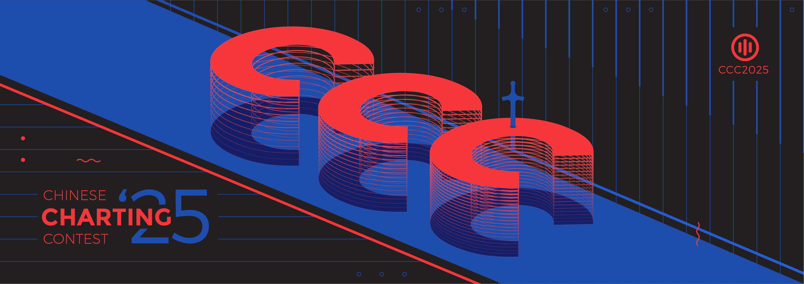

---
tags:
  - CCC2025
  - CCC 2025
---

# Chinese Charting Contest 2025

The **Chinese Charting Contest 2025** (***CCC2025***) is an osu!mania mapping contest for the Chinese players. It was the second installment of the Chinese Charting Contest.

## Contest schedule

| Event | Timestamp (UTC+8) |
| :-- | :-- |
| Contest announcement | 2025/06/05 |
| Submission phase | 2025/06/06 - 2025/07/06 |
| Judging phase | 2025/07/07 - 2025/08/07 |
| Results announcement | 2025/08/08 |

## Prizes

| Placing | Prize(s) |
| ------- | -------- |
|  Winner | 400 CNY, profile badge |
|  2nd place | 200 CNY |
|  3rd place | 100 CNY |
| Participation Award (4th-5th) | 20 CNY |

## Organisation

| Position | Member(s) |
| :------- | :-------- |
| Organiser | ::{ flag=CN }:: [_Stan](https://osu.ppy.sh/users/1653229) |
| Manager | ::{ flag=CN }:: [_Stan](https://osu.ppy.sh/users/1653229), ::{ flag=CN }:: [mafumafu](https://osu.ppy.sh/users/3076909) |
| Designer | ::{ flag=CN }:: [_Stan](https://osu.ppy.sh/users/1653229), ::{ flag=CN }:: [AlexDunk](https://osu.ppy.sh/users/9194799) |
| Judge | ::{ flag=MY }:: [AWMRone](https://osu.ppy.sh/users/10351684), ::{ flag=PH }:: [lenpai](https://osu.ppy.sh/users/5374513), ::{ flag=ES }:: [RandomeLoL](https://osu.ppy.sh/users/7080063), ::{ flag=CN }:: [Seiran-](https://osu.ppy.sh/users/14351534), ::{ flag=KR }:: [taba2](https://osu.ppy.sh/users/7850508)|
| Statistician | ::{ flag=CN }:: [[Crz]Alleyne](https://osu.ppy.sh/users/11279273) |

## Links

- [Forum thread](https://osu.ppy.sh/community/forums/topics/2087987)
- [Results Sheet](https://mappersguild.com/contests/results?contest=683ffce8fc4f78a77633a7f8)
- [Results Video](https://www.bilibili.com/video/BV1Ztt6zYEBX)
- [Entries](https://drive.google.com/file/d/1OOY7M5PhgIhAtu637Nl3OVmWdfArVDwG)

## Song List

| Song | Length | BPM |
| :--- | :----- | :-- |
| Yuta Imai - #CMFLG | 02:04 | 155 |
| Tsukasa Ohmae - Design | 02:33 | 133 |
| ariiol & PIKASONIC - 8BLUE | 02:16 | 110 |
| Ik4sumi - Scamper | 03:34 | 128 |
| lapix - Rosa azuL (Extended Mix) | 03:37 | 155 |
| kioik - Altitude |  02:27 | 188 |

## Results

| Place | Mapper(s) |
| :---- | :----- |
|  Winner |::{ flag=CN }:: [G1NYA](https://osu.ppy.sh/users/31767575)|
|  2nd place |::{ flag=CN }:: [wIntEr7z](https://osu.ppy.sh/users/16509588)|
|  3rd place |::{ flag=CN }:: [just a GRJ](https://osu.ppy.sh/users/29957843)|
| Participation Award (4th-5th) |::{ flag=CN }:: [tyrcs](https://osu.ppy.sh/users/13026904), ::{ flag=CN }:: [Wings_AnChen](https://osu.ppy.sh/users/12694894)|

## Ruleseta

### Contest rules

- **This contest is for the `osu!mania` mode only.**
- **This contest is for Chinese players only, including players with the flags of ::{ flag=CN }:: Chinese mainland, ::{ flag=HK }:: Hong Kong, ::{ flag=MO }:: Macao, and ::{ flag=TW }:: Taiwan eligible for participation.** If your flags aren't those four but actually it, you can participate this contest if player can prove that.
- **Your account must be valid and can log in [Mappers' Guild](https://mappersguild.com).**
- **Submissions must be in the `.osz` format.**
- **The osu! client must be able to load and read your submission.**
- **Submission must be `4K`, `5K`, `6K` or `7K`.** Other key modes are not considered in this contest (including n+1 playstyle).
- **Beatmaps' mapping procress should be based on [Ranking Criteria.](https://osu.ppy.sh/wiki/en/Ranking_criteria/osu%21mania)** There are no requirements to follow RC compulsory, but the beatmap needs to be used Ranking Criteria as a fundamental reference, or that will effect your final score.
- **Videos, Skins, Storyboards and Hitsounds are NOT allowed.**
- **Title, Artist, MP3, Source, Tags, Background and Preview Point must NOT be modified.**
- **Your submission must be solely made by you.** Collaborations are not allowed for this contest!
- **Submissions must NOT be uploaded to the osu! website until after the contest's results are finalised.**
- **Submitting entries means understanding and agreement to the ruleset above.**

### Judging criteria

- **Musical Representation (30 points):** How the beatmap expresses the song through overall layering, patterning and structure to interpreting song appropriate relatively, such as instruments, melodies, sounds, rhythms, etc.
- **Creativity(30 points):** How innovative the beatmap is throught the beatmap desgin. Like unique structural arrangement, logical changes, and technique presentation.
- **Playablity (30 points):** How the beatmap shows playing, visual and entertainment experience to players at sametime, and control them whithin a reasonable difficulty curve.
- **Judges' Impression (10 points):** This is the part of the score left to the Judges' personal preferences on the submission, or the factors which didn't relate to the three aspects said above.

Jugde's score will be standardized, check the formula in Mappers' Guild wrote: *judge X's final score = (judge X's raw score - judge X's average raw score) / judge X's standard deviation*

Submissions are anonymous to judges.
