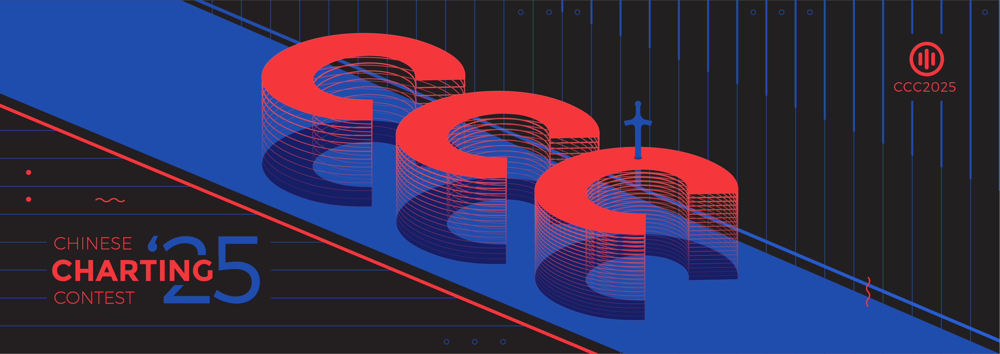

---
tags:
  - CCC2025
  - CCC 2025
---

# Chinese Charting Contest 2025

**Chinese Charting Contest 2025** (***CCC2025***) 是一个面向华人玩家参与的osu!mania写谱比赛。这次是 Chinese Charting Contest 赛事的第二次比赛。

## 比赛日程

| 阶段 | 时间（UTC+8） |
| :-- | :-- |
| 赛事宣布 | 2025/06/05 |
| 提交阶段 | 2025/06/06 - 2024/07/06 |
| 评审阶段 | 2025/07/07 - 2024/08/07 |
| 结果宣布 | 2025/08/08 |

## 奖项

| 名次 | 奖项 |
| ------- | -------- |
|  冠军 | 400元, 徽章 |
|  亚军 | 200元 |
|  季军 | 100元 |
| 参与奖（第4-第5） | 20元 |

## 组委会

| 职位 | 成员 |
| :-- | :-------- |
| 主办 | ::{ flag=CN }:: [_Stan](https://osu.ppy.sh/users/1653229) |
| 管理 | ::{ flag=CN }:: [_Stan](https://osu.ppy.sh/users/1653229), ::{ flag=CN }:: [mafumafu](https://osu.ppy.sh/users/3076909) |
| 设计 | ::{ flag=CN }:: [_Stan](https://osu.ppy.sh/users/1653229), ::{ flag=CN }:: [AlexDunk](https://osu.ppy.sh/users/9194799) |
| 评委 | ::{ flag=MY }:: [AWMRone](https://osu.ppy.sh/users/10351684), ::{ flag=PH }:: [lenpai](https://osu.ppy.sh/users/5374513), ::{ flag=ES }:: [RandomeLoL](https://osu.ppy.sh/users/7080063), ::{ flag=CN }:: [Seiran-](https://osu.ppy.sh/users/14351534), ::{ flag=KR }:: [taba2](https://osu.ppy.sh/users/7850508)|
| 统计 | ::{ flag=CN }:: [[Crz]Alleyne](https://osu.ppy.sh/users/11279273) |

## 其他链接

- [论坛主帖](https://osu.ppy.sh/community/forums/topics/2087987)
- [结果数据](https://mappersguild.com/contests/results?contest=683ffce8fc4f78a77633a7f8)
- [结果视频](https://www.bilibili.com/video/BV1Ztt6zYEBX)
- [参赛作品](https://drive.google.com/file/d/1OOY7M5PhgIhAtu637Nl3OVmWdfArVDwG)

## 歌曲列表

| 歌曲 | 长度 | BPM |
| ---- | ------ | --- |
| Yuta Imai - #CMFLG | 02:04 | 155 |
| Tsukasa Ohmae - Design | 02:33 | 133 |
| ariiol & PIKASONIC - 8BLUE | 02:16 | 110 |
| Ik4sumi - Scamper | 03:34 | 128 |
| lapix - Rosa azuL (Extended Mix) | 03:37 | 155 |
| kioik - Altitude |  02:27 | 188 |

## 规章制度

### 比赛规则

- **该比赛的游戏模式为 `osu!mania`**
- **该比赛的参赛选手只能是华人玩家，只有持有 ::{ flag=CN }:: 中国大陆地区，::{ flag=HK }:: 香港地区，::{ flag=MO }:: 澳门地区和 ::{ flag=TW }:: 台湾地区旗帜的玩家才有资格参加比赛。** 若是非以上旗帜的玩家，需要有足够的事实证明事实是以上四个地区的玩家才可以参赛。
- **你的账号要处于正常状态，且能够登录[Mappers' Guild](https://mappersguild.com)官网。**
- **提交的文件必须是 `.osz` 格式。**
- **osu!客户端必须能够加载并读取您提交的内容。**
- **提交的谱面必须是 `4K`, `5K`, `6K` 或 `7K`.** 其他键位模式在本比赛中不被考虑（包括n+1模式）。
- **写谱的过程需要以 [Ranking Criteria](https://osu.ppy.sh/wiki/en/Ranking_criteria/osu%21mania) 为基准。**虽然没有要求必须遵守RC，但谱面需要以RC作为基本参考，否则会影响你的最终成绩。
- **谱面文件中的视频、皮肤、故事板和音效不被允许自定义。**
- **谱面信息中的标题、艺术家、歌曲文件、标签、来源、背景图片和预览点不允许被修改。**
- **你提交的谱面必须完全由您自己完成。** 此次比赛不允许合作模式。
- **在比赛结果没有公布之前，参赛者不允许将自己的谱面进行任何层面的公开。**
- **提交条目意味着理解并同意上述规则集。**

### 评审标准

---
对于每一个符合条件的提交难度，评委会将根据以下标准进行评分。

- **音乐表现 (30分):** 谱面如何通过整体的层次、模式和结构来表达歌曲，从而相对恰当地诠释歌曲的乐器、旋律、声音、节奏等。
- **谱面创意 (30分):** 通过谱面的设计来展示排列的创新。如独特的结构安排、逻辑变化和技巧性的呈现。
- **游戏体验 (30分):** 谱面如何同时向玩家展示良好的游戏、视觉和娱乐体验，并以控制他们处于合理的难度曲线中。
- **评委印象 (10分):** 评委对谱面的整体感受，或是对上述三个方面皆没有提到的因素进行考虑，这可能会带有主观的判断在里面。

评委评分将会作标准化处理，更多可以查看 Mappers' Guild 官网的公式：*judge X's final score = (judge X's raw score - judge X's average raw score) / judge X's standard deviation*

再进行评审环节之前，所有的谱面会被匿名化处理。

## 结果

| 名次 | 谱师 |
| :---- | :----- |
|  冠军 |::{ flag=CN }:: [G1NYA](https://osu.ppy.sh/users/31767575)|
|  亚军 |::{ flag=CN }:: [wIntEr7z](https://osu.ppy.sh/users/16509588)|
|  季军 |::{ flag=CN }:: [just a GRJ](https://osu.ppy.sh/users/29957843)|
| 参与奖（第4-第5） |::{ flag=CN }:: [tyrcs](https://osu.ppy.sh/users/13026904), ::{ flag=CN }:: [Wings_AnChen](https://osu.ppy.sh/users/12694894)|
