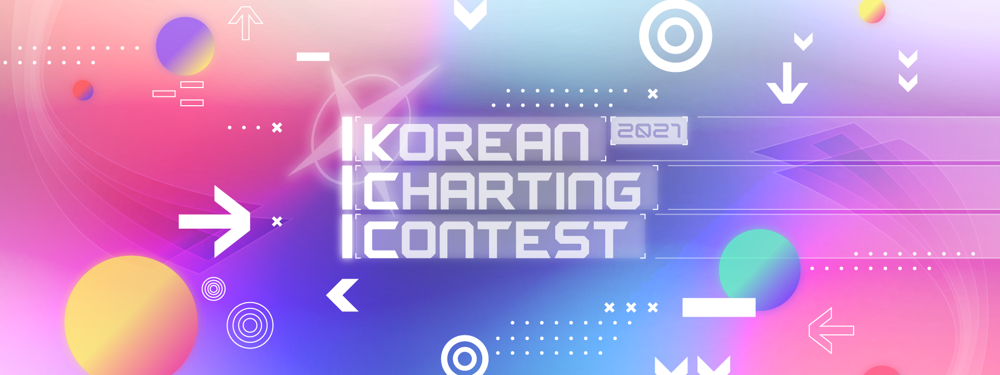
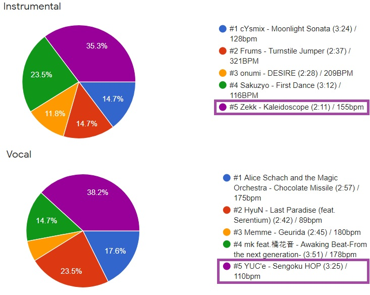

---
tags:
  - KCC2021
  - KCC 2021
---

# Korean Charting Contest 2021

Le **Korean Charting Contest 2021** (***KCC2021***) est un concours de mapping osu!mania pour les utilisateurs venant de ::{ flag=KR }:: Corée du Sud. Il s'agit de la première édition du Korean Charting Contest.

## Programme du concours

| Événement | Horodatage (UTC+9) |
| --: | :-- |
| Phase d'inscription, vote de musique | 01/02/2021 - 07/02/2021 |
| Phase de soumission | 08/02/2021 - 07/03/2021 |
| Phase de jugement | 08/03/2021 - 21/03/2021 |
| Annonce des résultats | 22/03/2021 |

## Prix

| Places | Prix(s) |
| :-: | :-- |
|  | 40,000 KRW, badge de profil |
|  | 20,000 KRW |
|  | 10,000 KRW |

## Organisation

| Position | Membre(s) |
| :-- | :-- |
| Organisateur | ::{ flag=KR }:: [Garalulu](https://osu.ppy.sh/users/757783) |
| Responsable | ::{ flag=KR }:: [Oni Suika](https://osu.ppy.sh/users/4848023) |
| Designer | ::{ flag=KR }:: [POCARI SWEAT](https://osu.ppy.sh/users/5082685) |
| Juges | ::{ flag=PL }:: [_underjoy](https://osu.ppy.sh/users/2235750), ::{ flag=KR }:: [Garalulu](https://osu.ppy.sh/users/757783), ::{ flag=GT }:: [Hoto Cocoa](https://osu.ppy.sh/users/6974536), ::{ flag=KR }:: [Kawawa](https://osu.ppy.sh/users/4647754), ::{ flag=KR }:: [Pengdoll](https://osu.ppy.sh/users/6392061) |

## Liens

- [Sujet du forum](https://osu.ppy.sh/community/forums/topics/1230057)
- [Feuille de résultats](https://docs.google.com/spreadsheets/d/1O0Ygpning0te62S850M42oPo0lCYd1Ct8VeYnAWRcYE/edit?usp=sharing)
- [Entrées](https://lulu.s-ul.eu/D2M3x9LH)

## Liste des musiques

### Instrumentale

- cYsmix - Moonlight Sonata (3:24) / 128bpm
- Frums - Turnstile Jumper (2:37) / 321bpm
- onumi - DESIRE (2:28) / 209bpm
- Sakuzyo - First Dance (3:12) / 116bpm
- **Zekk - Kaleidoscope (2:11) / 155bpm**

### Vocal

- Alice Schach and the Magic Orchestra - Chocolate Missile (2:57) / 175bpm
- HyuN - Last Paradise (feat. Serentium) (2:42) / 89bpm
- Memme - Geurida (2:45) / 180bpm
- mk feat.橘花音 - Awaking Beat-From the next generation- (3:51) / 178bpm
- **YUC'e - Sengoku HOP (3:25) / 110bpm**

### Résultats du vote

## Résultats

| Places | Mappeur |
| :-: | :-- |
|  | ::{ flag=KR }:: [11Bit](https://osu.ppy.sh/users/14804526) |
|  | ::{ flag=KR }:: [Sherie](https://osu.ppy.sh/users/9113475) |
|  | ::{ flag=CA }:: [arpia97](https://osu.ppy.sh/users/6363008) |

## Règles

### Règlement du concours

- Ce concours est réservé au mode osu!mania.
- Seules les personnes coréennes peuvent participer à ce concours. Si votre drapeau de profil n'indique pas que vous êtes en ::{ flag=KR }:: Corée du Sud pour des raisons telles que la résidence à l'étranger, vous pouvez quand même participer si vous êtes en mesure de prouver que vous êtes Coréen.
- Vous devez choisir une musique que vous souhaitez mapper lors de votre inscription (une musique pour la catégorie Instrumentale et une pour la catégorie Vocal). Vous pouvez mapper une de ces deux musiques après la fin du vote.
- Le client d'osu! doit être capable de charger et de lire votre beatmap.
- La beatmap doit être au format `.osz`.
- Les hitsounds personnalisés sont autorisés.
- Le titre, l'artiste, le fichier MP3, la source, les tags et le fond ne doivent PAS être modifiés. Cependant, le point de prévisualisation peut être personnalisé.
- Les vidéos, skins et storyboards ne sont PAS autorisés. Cependant, les hitsounds des storyboards peuvent être modifiés.
- Le nombre de keys de la beatmap doit être entre 4K et 9K.
- Le mod Auto doit être en mesure d'effectuer un full combo (score de 1 000 000) sur votre beatmap.
- La beatmap doit être terminée par le concurrent seul. Aucune collaboration n'est autorisée.
- Les beatmaps ne doivent pas être publiées sur le site d'osu! par le biais du Beatmap Submission System (BSS). Toutes les soumissions au concours doivent être anonymes pendant les phases de jugement afin d'éviter toute partialité.
- Une seule difficulté est autorisée. Si plusieurs difficultés sont soumises, celle qui a le plus grand nombre d'étoiles sera celle acceptée.
- Seules les difficultés Insane ou plus sont autorisées. Veuillez consulter les règles spécifiques aux difficultés dans les [critères de classement](/wiki/Ranking_criteria).
- Si vous soumettez plusieurs beatmaps, la dernière sera celle prise en compte.
- L'envoi d'une participation implique la compréhension et l'acceptation des règles énoncées ci-dessus.

### Critères de jugement

Pour chaque difficulté admissible soumise, le jury attribuera des points en fonction des critères suivants :

- **Expertise (25 pts) :** La façon dont la soumission démontre des techniques concernant la structure, la représentation de la musique, le flow, les hitsounds, etc.
- **Cohésion (25 pts) :** La cohérence de la soumission en ce qui concerne la structure, la représentation de la musique, le flow, les hitsounds, etc., notamment entre les différentes sections.
- **Créativité (25 pts) :** Dans quelle mesure la proposition fait preuve d'originalité et d'unicité par rapport aux autres propositions, avec un respect raisonnable de la jouabilité.
- **Impression des juges (25 pts) :** Il s'agit de la partie de la note laissée aux préférences personnelles des juges sur la soumission.
