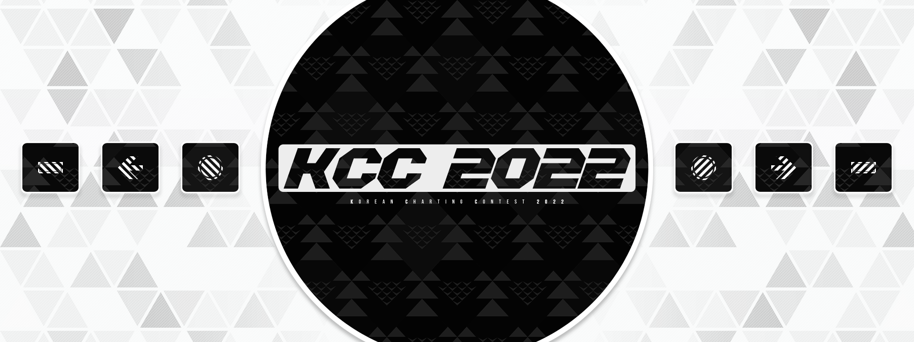

---
tags:
  - KCC2022
  - KCC 2022
---

# Korean Charting Contest 2022

**Korean Charting Contest 2022** (***KCC2022***) 은 한국인을 위한 osu!mania 매핑 대회입니다. 이 대회는 두 번째 대회였습니다.

## 대회 일정

| 일정 | 날짜 (UTC+9) |
| --: | :-- |
| 제출 기간 | 2022-01-30/2022-02-27 |
| 심사 기간 | 2022-02-28/2022-03-12 |
| 결과 발표 | 2022-03-13 |

## 상품

| 순위 | 상품 |
| :-: | :-- |
|  | 50,000 KRW, 프로필 뱃지 (미정) |
|  | 20,000 KRW |
|  | 10,000 KRW |

## 주최

| 직책 | 인원 |
| :-- | :-- |
| 주최자 | ::{ flag=KR }:: [Garalulu](https://osu.ppy.sh/users/757783) |
| 매니저 | ::{ flag=KR }:: [Oni Suika](https://osu.ppy.sh/users/4848023) |
| 디자이너 | ::{ flag=KR }:: [Manwon](https://osu.ppy.sh/users/4129020) |
| 심사위원 | ::{ flag=CN }:: [_Stan](https://osu.ppy.sh/users/1653229), ::{ flag=SG }:: [Evening](https://osu.ppy.sh/users/2193881), ::{ flag=KR }:: [Garalulu](https://osu.ppy.sh/users/757783), ::{ flag=PH }:: [lenpai](https://osu.ppy.sh/users/5314573), ::{ flag=KR }:: [Remuring](https://osu.ppy.sh/users/6522146) |

## 링크

- [포럼 스레드](https://osu.ppy.sh/community/forums/topics/1507792)
- [결과 시트](https://docs.google.com/spreadsheets/d/1IBIBR7fjgqM90sQEiBWg_J1x1IZqD1PoCevrm7RHZ1g/edit?usp=sharing)
- [엔트리 모음](https://lulu.s-ul.eu/PkrKU3sx)

## 곡 리스트

### Instrumental

| 곡 | 길이 | BPM |
| :-- | :-- | :-- |
| lapix - shime (Extended Mix) | 3:44 | 160 |
| Mitsukiyo - rolling beat | 2:31 | 170 |
| Laur - PRAGMATISM -RESURRECTION- | 2:36 | 174 |

### Vocal

| 곡 | 길이 | BPM |
| :-- | :-- | :-- |
| fishbowl feat.Yukichi Kasaku/men - Shinkai | 3:37 | 133 |
| Tokyo Jihen - Sounan | 3:20 | 156 |
| Kabocha feat. Sennzai - Morphobia | 3:54 | 145 |

## 결과

| 순위 | 매퍼 |
| :-: | :-- |
|  | ::{ flag=KR }:: [Rio1-](https://osu.ppy.sh/users/5604329) |
|  | ::{ flag=KR }:: [JuHaa](https://osu.ppy.sh/users/15526127) |
|  | ::{ flag=KR }:: [WintMin](https://osu.ppy.sh/users/11161386) |

## 규칙

### 대회 규칙

- osu!mania 모드 전용 대회입니다.
- '한국인'만 참가 가능합니다. 외국 거주, 교포 2세 등의 사유로 osu! 내에서의 국기가 대한민국이 아닌 경우, 이미 한국인이라고 널리 알려져 있거나 어떠한 방식으로든 입증만 가능하다면 한국인으로서 참가할 수 있습니다.
- 참가자들은 사전에 선정된 Instrumental과 Vocal 그룹 각각 3곡 총 6곡 중 하나를 매핑해 제출할 수 있습니다.
- 제출한 맵은 osu! 클라이언트에서 실행 가능해야 합니다.
- `.osz` 포맷으로 제출해야 합니다.
- 커스텀 히트사운드는 사용 가능합니다.
- 제목, 아티스트, MP3, 소스, 태그, BPM 포인트(빨간 선), 배경은 수정할 수 없습니다. 단, 프리뷰 포인트는 수정 가능합니다.
- 비디오, 스킨과 스토리보드는 추가할 수 없습니다. 단, 스토리보드 히트사운드는 사용 가능합니다.
- 4K ~ 9K만 제출 가능합니다
- 제출한 맵은 오토로 풀콤(1,000,000점)이 가능해야 합니다.
- 제출한 맵은 반드시 혼자서 완성해야 하고 다른 사람과 콜랍 등 공동작업을 할 수 없습니다.
- 제출한 맵은 결과가 나오기 전까지 osu! 웹사이트 (BSS) 에 업로드할 수 없습니다. 편향 심사을 피하기 위해 모든 맵은 익명으로 심사됩니다.
- 참가자당 한 개의 난이도만 심사 대상이 됩니다. 여러 난이도를 제출할 경우, 가장 상위 난이도만 심사 대상이 됩니다.
- 참가자들은 Insane 난이도 이상의 맵을 제작해야 합니다. [랭킹 크리테리아](/wiki/Ranking_criteria)가 제시하는 특정 난이도 규칙 (Difficulty-specific Rule) 을 참고하세요.
- 만약 여러 번 맵을 제출할 경우, 가장 마지막으로 제출한 맵만 심사 대상이 됩니다.
- 제출한 모든 맵은 상위 규칙을 인지하였다는 가정 하에 심사됩니다.

### 심사 기준

심사 패널은 제출한 모든 맵에 대해 아래에 명시된 기준에 의거해 점수를 부여합니다:

- **Expertise (25 pts):** 맵이 구조, 노래 표현, 흐름과 관련된 기술력을 얼마나 잘 보여주고 있는가
- **Cohesion (25 pts):** 맵이 구조, 음악 표현, 흐름에 대해 얼마나 일관성을 가지고 있는가
- **Creativity (25 pts):** 다른 맵과 비교했을 때 플레이성 면에서 독창성과 특별함을 가지고 있는가
- **Judge's Impression (25 pts):** 심사위원들의 개인적 선호도를 나타내는 점수
