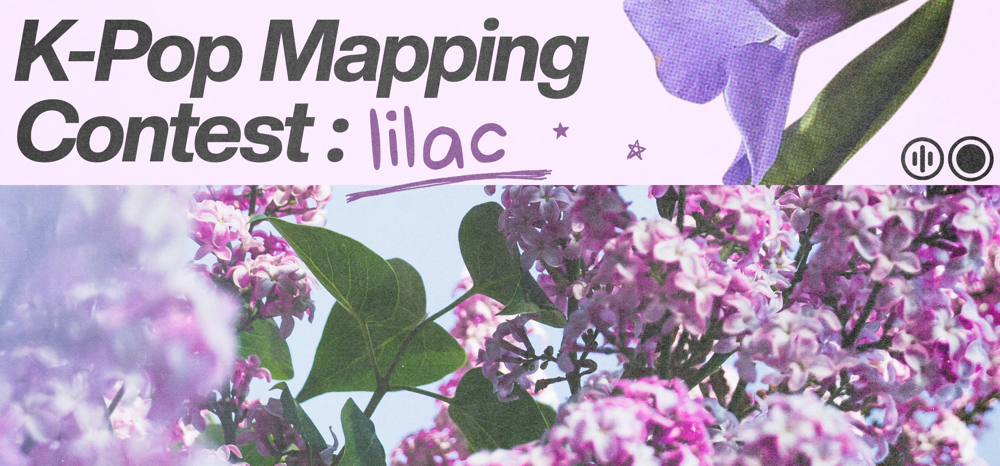

---
tags:
  - KPMC2
  - KPMC#2
  - KPMC 2
---

# K-Pop Mapping Contest #2

The **K-Pop Mapping Contest #2** (***KPMC#2***) was a mapping contest hosted by the #sd_kpop team for the osu!mania and osu!standard game modes, with an aim to promote K-pop songs to a wider audience of mappers and players. It was the second instalment of the K-Pop Mapping Contest.

## Contest schedule

| Event | Dates |
| --: | :-- |
| Submission phase | 2025-12-12/2026-01-19 |
| Judging phase | 2026-01-19/2026-02-07 |
| Results announcement | 2026-02-15 (12:00 UTC) |

The playtester's pick and top 5 beatmaps were showcased during the [results announcement YouTube premiere](https://www.youtube.com/watch?v=U3iYXu4F8qs&list=PL2kaEwseHcSAvQcA6D8f6bxKZPKGOeb_t).

## Organisation

| Position | Member(s) |
| :-- | :-- |
| Host | ::{ flag=CA }:: [Aurele](https://osu.ppy.sh/users/654108), ::{ flag=AU }:: [fvrex](https://osu.ppy.sh/users/11863699), ::{ flag=ID }:: [Ilham](https://osu.ppy.sh/users/3057154) |
| Designer | ::{ flag=ID }:: [kim hyunjin](https://osu.ppy.sh/users/9456733) |
| Playtester | ::{ flag=ID }:: [_yea](https://osu.ppy.sh/users/20834055), ::{ flag=PL }:: [Korzei](https://osu.ppy.sh/users/11921815) |
| Judge (osu!mania) | ::{ flag=PH }:: [Hytex](https://osu.ppy.sh/users/8536263), ::{ flag=ID }:: [Maxus](https://osu.ppy.sh/users/4335785), ::{ flag=KR }:: [secXcscX](https://osu.ppy.sh/users/13543418), ::{ flag=ID }:: [Syrion-](https://osu.ppy.sh/users/15380643), ::{ flag=ID }:: [Ucitysm](https://osu.ppy.sh/users/14768693) |
| Judge (osu!standard) | ::{ flag=PE }:: [dakiwii](https://osu.ppy.sh/users/10447058), ::{ flag=CH }:: [Irreversible](https://osu.ppy.sh/users/1287964), ::{ flag=TH }:: [Kensuke](https://osu.ppy.sh/users/4314710), ::{ flag=FR }:: [Nozhomi](https://osu.ppy.sh/users/2716981), ::{ flag=US }:: [Passionate](https://osu.ppy.sh/users/10194509) |

## Prizes

| Placing | Prize(s) |
| :-: | :-- |
|  | 6 months osu!supporter, profile badge (TBD), Ranked status[^ranked] |
|  | 4 months osu!supporter, Ranked status[^ranked] |
|  | 2 months osu!supporter, Ranked status[^ranked] |
| Playtester's Pick[^playtester] | 1 month osu!supporter |

 

## Links

- [Forum thread](https://osu.ppy.sh/community/forums/topics/2161124)
- [Results sheet](https://docs.google.com/spreadsheets/d/1VOiEYJq3tzeCNwfJ5gMLJpuOMiVPpdjBwKefijlq6io/edit?usp=sharing)
- [Entries](https://drive.google.com/drive/folders/1BEUEugl59XFIGDGOwY5joGoWArp68IzJ?usp=sharing)

## Results

More detailed scores and judge comments are available to view on the respective game modes' Mappers' Guild listing:

- [osu!mania](https://mappersguild.com/contests/results?contest=69198d9689c030b585d6804b)
- [osu!standard](https://mappersguild.com/contests/results?contest=69198f2a89c030b585d68132)

### osu!mania

| Place | Mapper | Song (map link) | Raw score (500) | Standardised score |
| :-: | :-- | :-- | :-- | :-- |
|  | ::{ flag=ID }:: [Antipole](https://osu.ppy.sh/users/17258072) | [Dreamcatcher - BEcause](https://osu.ppy.sh/beatmapsets/2508561) | 423 | 6.101 |
|  | ::{ flag=ID }:: [Pyra-san](https://osu.ppy.sh/users/31126430) | [TWICE - What Is Love?](https://osu.ppy.sh/beatmapsets/2508559) | 407 | 4.264 |
|  | ::{ flag=VN }:: [Micleak](https://osu.ppy.sh/users/16140674) | [ITZY - 8-BIT HEART](https://osu.ppy.sh/beatmapsets/2508590) | 406 | 3.998 |
| Playtester's Pick[^playtester] | ::{ flag=NO }:: [Chrisse](https://osu.ppy.sh/users/18382591) | [QWER - REBOUND](https://osu.ppy.sh/beatmapsets/2508792) | 359 | -0.183 |

### osu!standard

| Place | Mapper | Song (map link) | Raw score (500) | Standardised score |
| :-: | :-- | :-- | :-- | :-- |
|  | ::{ flag=ID }:: [William K](https://osu.ppy.sh/users/2261651) | [PARK JIHOON - Gallery](https://osu.ppy.sh/beatmapsets/2508518) | 420 | 5.214 |
|  | ::{ flag=CL }:: [Vyassel](https://osu.ppy.sh/users/14450486) | [LE SSERAFIM - CRAZY](https://osu.ppy.sh/beatmapsets/2508541) | 392 | 3.765 |
|  | ::{ flag=US }:: [im yeojin](https://osu.ppy.sh/users/20907417) | [ARTMS - Birth](https://osu.ppy.sh/beatmapsets/2508861) | 396 | 3.598 |
| Playtester's Pick[^playtester] | ::{ flag=PL }:: [Gresiu](https://osu.ppy.sh/users/3930357) | [Yves - Soap (feat. PinkPantheress)](https://osu.ppy.sh/beatmapsets/2508713) | 246 | -7.865 |

## Ruleset

### Contest rules

- **Collaboration work is not allowed for this contest.** Submissions must be made individually.
- **Only one submission per user is allowed.** Participants must submit for either the osu!mania or osu!standard game mode.
- Submissions must be in .osz format.
- Submissions must be made for the **osu!mania** or **osu!standard** game mode only.
- Submissions can follow an open song choice, as long as the song is **Korean language and Pop genre**.
- Submissions must not contain music by disallowed artists under [content usage permissions](/wiki/Rules/Content_usage_permissions#audio).
- Submissions must adhere to the [ranking criteria](/wiki/Ranking_criteria).
- Submissions must include a background that complies with [visual content considerations](/wiki/Rules/Visual_content_considerations).
- Videos, skins, and storyboards are not allowed.
- Submitting your map to the BSS before the results announcement is not allowed and will result in disqualification.

**osu!mania-specific rules**

- Submissions must be between 4K and 7K.
- Submissions must include a custom hitnormal file.
- Submissions must be one single beatmap with a difficulty of Hard or higher.

**osu!standard-specific rules**

- Submissions must include custom or regular hitsounds.
- Submissions must be one single beatmap with a difficulty between 3.7* to 6.0*.

### Judging criteria

Each map is scored out of 100 points. The judging criteria for each mode are as follows:

| Criteria |  |  | Description |
| :-- | :-: | :-: | :-- |
| **Music Representation** | 25 | 25 | How well the map reflects the music through its emphasis, patterning, etc. |
| **Creativity** | 25 | 20 | How the map stands out compared to the other submissions. |
| **Gameplay** | 25 | 20 | How fun and enjoyable the map is to play, as well as how it keeps a reasonable difficulty curve in relation to the music. |
| **Judge Impression** | 20 | 20 | How well the judges believe the map is put together. They can award points based on aspects they find noteworthy or memorable. |
| **Technicality** | 5 | 5 | How suitable the map is for ranking. This means ensuring it is timed correctly and follows its mode-specific ranking criteria (ignoring spread rules). |
| **Hitsounding** | 0 | 10 | Assessing the quality of hitsounding and how well it conveys the music. |

## Notes
[^ranked]: The top 3 submissions will receive 2 nominations if the mapper wishes.
[^playtester]: The anonymised submission chosen by the game mode's playtester based on its playability aspect, outside the top 3.
