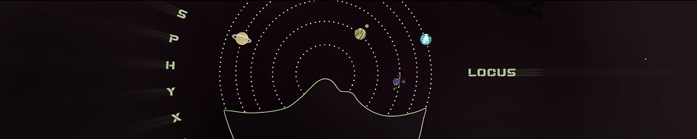
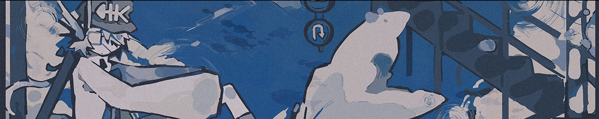

# Locus 2025

**Locus 2025** was a multi-layered contest launched in early 2025 to bring the creative circles on osu! closer together.

Submissions to this contest included the following elements:

- An original song of length 1:30–3:00.
- A full beatmap spread on the osu! game mode that satisfies the ranking criteria.
- Visual assets (e.g. background/storyboarding/video).

## Schedule

| Event | Date (UTC) |
| --: | :-- |
| Teaser #1 submission | 1 April 2025 |
| Trial voting start | 16 March 2025 |
| Teaser #2 submission | 1 May 2025 |
| Trial voting end | 16 May 2025 |
| Entry submission deadline | 30 June 2025 (12:00) |
| Community voting period | 1 August to 16 August 2025 (12:00) |
| Results stream | 17 August 2025 (14:00) |
| Results news publication | 21 August 2025 |

## Prizes

The top 5 entries of the contest earned equal prizes. This number was decided based on the number of entries (42).

- The beatmap is bundled as part of the default osu! installation as "recommended beatmaps" for at least 1 year.
- Team members received a unique profile badge themed around their entry.
- Team members were awarded an **Architect** user title befitting of their role, i.e. one of **Visual Architect**, **Musical Architect**, or **Mapping Architect**.

For any entry that was submitted by the entry submission deadline, **team members are awarded a profile badge if they are able to rank the set before the end of the next iteration of the contest**.

Additionally, the player with the highest score on [this osu!(lazer) playlist of all the entries](https://osu.ppy.sh/multiplayer/rooms/1539920) received a "Locus playlist winner" badge.

Finally, there was a wildcard prize. ::{ flag=AU }:: [peppy](https://osu.ppy.sh/users/2), the game's creator, picked his favourite entry and that team earned a separate mystery prize, revealed to be the following:

- The entry also got bundled with new installations of the game.
- The entry got a favourite from peppy.

## Organisation

Locus 2025 is run by various members of the [osu! team](/wiki/People/osu!_team) alongside some prominent members of the community.

| Position | Member(s) |
| :-- | :-- |
| Manager | ::{ flag=GB }:: [mangomizer](https://osu.ppy.sh/users/1893718), ::{ flag=JP }:: [Matrix](https://osu.ppy.sh/users/5052899) |
| Developers | ::{ flag=GB }:: [Komm](https://osu.ppy.sh/users/7671790), ::{ flag=PL }:: [Venix](https://osu.ppy.sh/users/5999631) |
| Graphic designers | ::{ flag=AU }:: [Adarin](https://osu.ppy.sh/users/118360), ::{ flag=GB }:: [Tanza](https://osu.ppy.sh/users/10379965) |
| General assistance | ::{ flag=GB }:: [Doomsday](https://osu.ppy.sh/users/18983), ::{ flag=AU }:: [Ephemeral](https://osu.ppy.sh/users/102335), ::{ flag=TN }:: [Hivie](https://osu.ppy.sh/users/14102976), ::{ flag=US }:: [pishifat](https://osu.ppy.sh/users/3178418), ::{ flag=SE }:: [Walavouchey](https://osu.ppy.sh/users/5773079) |

## Links

- [Contest listing](https://osu.ppy.sh/community/contests/238)
- [Contest announcement](https://osu.ppy.sh/home/news/2025-01-31-locus)
- [Contest update #1](https://osu.ppy.sh/home/news/2025-04-14-locus-2025-update-1)
- [Contest update #2](https://osu.ppy.sh/home/news/2025-06-03-locus-2025-update-2)
- [Voting announcement](https://osu.ppy.sh/home/news/2025-08-01-locus-2025-voting-open)
- [Voting announcement VOD at COE](https://www.twitch.tv/videos/2528089150?t=02h32m33s)
- [Results announcement](https://osu.ppy.sh/home/news/2025-08-21-locus-2025-results)

## Entries

|  |  |
| :-- | :-- |
| **Entry** |  [Koto Spirit - Locus of Hexagram](https://osu.ppy.sh/beatmapsets/2412260) |
| **Team name** | Hexagram |
| **Mapper / Assisting Musician** | ::{ flag=HK }:: [Chaoslitz](https://osu.ppy.sh/users/3621552) |
| **Musician / Mapper** | ::{ flag=HK }:: [Otosaka-Yu](https://osu.ppy.sh/users/3170678) |
| **Mapper** | ::{ flag=HK }:: [seros](https://osu.ppy.sh/users/10562853) |
| **Mapper** | ::{ flag=KR }:: [momoyo](https://osu.ppy.sh/users/12469536) |
| **Illustrator / VFX Artist** | ::{ flag=JP }:: [TARA-376](https://osu.ppy.sh/users/37407910) |

|  |  |
| :-- | :-- |
| **Entry** |  [takehirotei - Haiboku no Altra Vita](https://osu.ppy.sh/beatmapsets/2412331) |
| **Team name** | Sylenth2 v7.2769420 "Unlimited Synth Works" |
| **Illustrator / Designer / Storyboarder / Mapper** | ::{ flag=MY }:: [Iyouka](https://osu.ppy.sh/users/7138499) |
| **Musician / Mapper** | ::{ flag=MY }:: [takehirotei](https://osu.ppy.sh/users/11793794) |
| **Mapper** | ::{ flag=MY }:: [Mahiru Shiina](https://osu.ppy.sh/users/13866023) |
| **Mapper** | ::{ flag=MY }:: [Etsuko Marvia](https://osu.ppy.sh/users/13893348) |
| **Mapper** | ::{ flag=MY }:: [Kardshark](https://osu.ppy.sh/users/4724315) |

|  |  |
| :-- | :-- |
| **Entry** | [Will Stetson - Of Our Time](https://osu.ppy.sh/beatmapsets/2412232) |
| **Team name** | 5Head |
| **Mapper / Hitsounder** | ::{ flag=FR }:: [Sotarks](https://osu.ppy.sh/users/4452992) |
| **Vocalist** | ::{ flag=US }:: [Will Stetson](https://osu.ppy.sh/users/4909088) |
| **Musician** | ::{ flag=CA }:: [KiAme](https://osu.ppy.sh/users/37416442) |
| **Storyboarder** | ::{ flag=US }:: [Noffy](https://osu.ppy.sh/users/1541323) |
| **Illustrator** | ::{ flag=US }:: [tofumang](https://osu.ppy.sh/users/4817223) |

|  |  |
| :-- | :-- |
| **Entry** |   [Akiri - Vespera Stella](https://osu.ppy.sh/beatmapsets/2412328) |
| **Team name** | Vespera |
| **VFX Artist** | ::{ flag=CN }:: [Sakura006](https://osu.ppy.sh/users/10365024) |
| **Musician** | ::{ flag=US }:: [Akiri-](https://osu.ppy.sh/users/19587411) |
| **Mapper** | ::{ flag=US }:: [fieryrage](https://osu.ppy.sh/users/3533958) |
| **Illustrator** | ::{ flag=ID }:: [Dreamxiety](https://osu.ppy.sh/users/13103233) |
| **Illustrator** | ::{ flag=CA }:: [Xiaoraini](https://osu.ppy.sh/users/3607337) |

[.jpg)](https://osu.ppy.sh/beatmapsets/2412292)

|  |  |
| :-- | :-- |
| **Entry** |  [ArXe - Locus Amoenus (feat. Megurine Luka)](https://osu.ppy.sh/beatmapsets/2412292) |
| **Team name** | Vocaloid Lovers |
| **VFX Artist / Storyboarder / Mapper** | ::{ flag=IT }:: [Kuroise](https://osu.ppy.sh/users/14547127) |
| **Musician / Mapper** | ::{ flag=ID }:: [ArXe](https://osu.ppy.sh/users/14013313) |
| **Vocaloid Tuning / Mapper** | ::{ flag=US }:: [Defy](https://osu.ppy.sh/users/15428357) |
| **Lyricist / Mapper** | ::{ flag=KR }:: [Kawashiro](https://osu.ppy.sh/users/1533796) |
| **Illustrator** | ::{ flag=SG }:: [Type](https://osu.ppy.sh/users/7520534) |

|  |  |
| :-- | :-- |
| **Entry** | [kanase. - Lost Night Meteor](https://osu.ppy.sh/beatmapsets/2412691) |
| **Team name** | Meteors |
| **Storyboarder / Mapper** | ::{ flag=TW }:: [9ami](https://osu.ppy.sh/users/1499997) |
| **Musician** | ::{ flag=JP }:: [unikanase](https://osu.ppy.sh/users/32453922) |
| **Mapper** | ::{ flag=TW }:: [LeeGod](https://osu.ppy.sh/users/15148343) |
| **Illustrator / Mapper** | ::{ flag=HK }:: [Arushii](https://osu.ppy.sh/users/15664628) |
| **Mapper** | ::{ flag=TW }:: [Matsuyuki Ame](https://osu.ppy.sh/users/12763959) |

|  |  |
| :-- | :-- |
| **Entry** | [nm-y - Datura Sh//va](https://osu.ppy.sh/beatmapsets/2412263) |
| **Team name** | Meguro |
| **Mapper** | ::{ flag=GB }:: [DeviousPanda](https://osu.ppy.sh/users/4966334) |
| **Mapper** | ::{ flag=EE }:: [iljaaz](https://osu.ppy.sh/users/8501291) |
| **Musician** | ::{ flag=US }:: [nm-y](https://osu.ppy.sh/users/31725557) |
| **Storyboarder** | ::{ flag=AU }:: [LowGraphics](https://osu.ppy.sh/users/5383942) |
| **Illustrator** | ::{ flag=MY }:: [mochasan_](https://osu.ppy.sh/users/23804364) |

|  |  |
| :-- | :-- |
| **Entry** |  [kanemiko - distance of -RADIAL-](https://osu.ppy.sh/beatmapsets/2412247) |
| **Team name** | CN2K |
| **Mapper / Designer** | ::{ flag=CA }:: [Sing](https://osu.ppy.sh/users/3795679) |
| **Mapper / Hitsounder** | ::{ flag=US }:: [captin1](https://osu.ppy.sh/users/689997) |
| **Storyboarder** | ::{ flag=US }:: [Storyboarder](https://osu.ppy.sh/users/6124671) |
| **Illustrator / Musician** | ::{ flag=JP }:: [kanemiko](https://osu.ppy.sh/users/37401224) |

|  |  |
| :-- | :-- |
| **Entry** |  [Kry.exe - Rift Walker](https://osu.ppy.sh/beatmapsets/2412244) |
| **Team name** | AXIOMA |
| **Project Manager** | ::{ flag=US }:: [BTMC](https://osu.ppy.sh/users/3171691) |
| **Musician / Hitsounder** | ::{ flag=AR }:: [KryDotExe](https://osu.ppy.sh/users/1229195) |
| **Designer / Storyboarder** | ::{ flag=DZ }:: [VenerableNyanta](https://osu.ppy.sh/users/12243368) |
| **Illustrator** | ::{ flag=US }:: [Spoo](https://osu.ppy.sh/users/11805037) |
| **Mapper** | ::{ flag=CN }:: [Ryuusei Aika](https://osu.ppy.sh/users/7777875) |

|  |  |
| :-- | :-- |
| **Entry** |  [Juwubi - H1GH D!VE](https://osu.ppy.sh/beatmapsets/2412255) |
| **Team name** | fruit salad |
| **Mapper / Hitsounder** | ::{ flag=US }:: [nuclei](https://osu.ppy.sh/users/25134566) |
| **Mapper** | ::{ flag=BE }:: [R3m](https://osu.ppy.sh/users/6990066) |
| **Illustrator / Mapper** | ::{ flag=AU }:: [-pineapple-](https://osu.ppy.sh/users/11523326) |
| **Storyboarder / Mapper** | ::{ flag=US }:: [binarie](https://osu.ppy.sh/users/15632854) |
| **Musician** | ::{ flag=PH }:: [JuwubiDTM](https://osu.ppy.sh/users/36335947) |

[.jpg)](https://osu.ppy.sh/beatmapsets/2412236)

|  |  |
| :-- | :-- |
| **Entry** |  [nominomu - against cacophony (feat. Mai)](https://osu.ppy.sh/beatmapsets/2412236) |
| **Team name** | :owoyay: |
| **Musician / Storyboarder / Mapper** | ::{ flag=AU }:: [nominomu](https://osu.ppy.sh/users/30485380) |
| **Illustrator** | ::{ flag=MY }:: [NyuPenyu](https://osu.ppy.sh/users/12233680) |
| **Mapper** | ::{ flag=GB }:: [KnightC0re](https://osu.ppy.sh/users/7894340) |
| **Mapper** | ::{ flag=LT }:: [Amefystol](https://osu.ppy.sh/users/26748801) |

|  |  |
| :-- | :-- |
| **Entry** |    [Redside - First Adventure](https://osu.ppy.sh/beatmapsets/2412285) |
| **Team name** | Team Red but Blue |
| **Musician** | ::{ flag=CA }:: [Redside](https://osu.ppy.sh/users/16039046) |
| **Mapper** | ::{ flag=CA }:: [v0x](https://osu.ppy.sh/users/18128385) |
| **Mapper** | ::{ flag=CA }:: [Zer0-G](https://osu.ppy.sh/users/12577911) |
| **Illustrator** | ::{ flag=CA }:: [RedcXca](https://osu.ppy.sh/users/14056601) |
| **Storyboarder** | ::{ flag=CA }:: [Meow Mix](https://osu.ppy.sh/users/3021634) |

[.jpg)](https://osu.ppy.sh/beatmapsets/2412277)

|  |  |
| :-- | :-- |
| **Entry** | [Xyris - Vitality Charger (feat. Hanakuma Chifuyu)](https://osu.ppy.sh/beatmapsets/2412277) |
| **Team name** | s-sigma... |
| **Mapper / Storyboarder** | ::{ flag=US }:: [Tycani](https://osu.ppy.sh/users/6693266) |
| **Musician** | ::{ flag=US }:: [_Xyris_](https://osu.ppy.sh/users/11246193) |
| **Illustrator** | ::{ flag=PH }:: [Danimato](https://osu.ppy.sh/users/23541645) |

[.jpg)](https://osu.ppy.sh/beatmapsets/2412259)

|  |  |
| :-- | :-- |
| **Entry** | [Fox Rush - Paint The Ocean Blue (feat. Cassylish)](https://osu.ppy.sh/beatmapsets/2412259) |
| **Team name** | Gumiho |
| **Musician** | ::{ flag=IL }:: [AngeI](https://osu.ppy.sh/users/4271860) |
| **Mapper** | ::{ flag=US }:: [Mejiro McQueen](https://osu.ppy.sh/users/11555612) |
| **Mapper** | ::{ flag=ID }:: [ceras](https://osu.ppy.sh/users/13356408) |
| **Illustrator** | ::{ flag=CA }:: [Kylerius](https://osu.ppy.sh/users/10253968) |
| **Storyboarder / VFX Artist** | ::{ flag=CH }:: [Schoki](https://osu.ppy.sh/users/13260523) |

|  |  |
| :-- | :-- |
| **Entry** | [MetaHumanBoi - kinetic flux](https://osu.ppy.sh/beatmapsets/2412316) |
| **Team name** | metamorphosis |
| **Designer** | ::{ flag=US }:: [Boolmaster Flex](https://osu.ppy.sh/users/5394681) |
| **Storyboarder** | ::{ flag=CN }:: [RiceSS](https://osu.ppy.sh/users/8271436) |
| **Musician** | ::{ flag=US }:: [MetaHumanBoi](https://osu.ppy.sh/users/14782369) |
| **Mapper** | ::{ flag=CA }:: [Gordon](https://osu.ppy.sh/users/7856835) |
| **Mapper** | ::{ flag=US }:: [mintIceCream_](https://osu.ppy.sh/users/13221589) |

[.jpg)](https://osu.ppy.sh/beatmapsets/2412294)

|  |  |
| :-- | :-- |
| **Entry** |  [Krimek - Dahlia (feat. eili)](https://osu.ppy.sh/beatmapsets/2412294) |
| **Team name** | we need a poll |
| **Musician / Mapper / Hitsounder** | ::{ flag=DE }:: [Krimek](https://osu.ppy.sh/users/2345078) |
| **Mapper** | ::{ flag=DE }:: [Pho](https://osu.ppy.sh/users/3624692) |
| **Vocalist / VFX Artist** | ::{ flag=US }:: [eilivox](https://osu.ppy.sh/users/37455438) |
| **Illustrator** | ::{ flag=US }:: [CMDR Saturn](https://osu.ppy.sh/users/22001295) |
| **Designer** | ::{ flag=MY }:: [Z419](https://osu.ppy.sh/users/9912966) |

|  |  |
| :-- | :-- |
| **Entry** |  [Cityyy - Asphyxia](https://osu.ppy.sh/beatmapsets/2412274) |
| **Team name** | Picardia |
| **Musician** | ::{ flag=US }:: [Cityyy](https://osu.ppy.sh/users/25198721) |
| **Mapper** | ::{ flag=US }:: [Astronic](https://osu.ppy.sh/users/9320502) |
| **Mapper** | ::{ flag=US }:: [Firiiu](https://osu.ppy.sh/users/7825971) |
| **Storyboarder / Designer** | ::{ flag=US }:: [Syvatzia](https://osu.ppy.sh/users/19082107) |
| **Storyboarder** | ::{ flag=DE }:: [aoratos](https://osu.ppy.sh/users/19240320) |

[.jpg)](https://osu.ppy.sh/beatmapsets/2412365)

|  |  |
| :-- | :-- |
| **Entry** | [Xeven - Become One Again (feat. Hatsune Miku)](https://osu.ppy.sh/beatmapsets/2412365) |
| **Team name** | "we couldn't agree on naming" |
| **Musician** | ::{ flag=US }:: [sxvnty](https://osu.ppy.sh/users/8111085) |
| **Mapper / Hitsounder** | ::{ flag=RU }:: [Daycore](https://osu.ppy.sh/users/5596337) |
| **Mapper** | ::{ flag=RU }:: [alvearia](https://osu.ppy.sh/users/6248691) |
| **Mapper / Storyboarder** | ::{ flag=UZ }:: [Shmiklak](https://osu.ppy.sh/users/5504231) |
| **VFX Artist** | ::{ flag=SG }:: [Polytetral](https://osu.ppy.sh/users/8612061) |

|  |  |
| :-- | :-- |
| **Entry** |   [furtrash - LONG LIVE THE KING](https://osu.ppy.sh/beatmapsets/2412245) |
| **Team name** | church of ppy |
| **Mapper / Hitsounder** | ::{ flag=CL }:: [Evil-](https://osu.ppy.sh/users/10234313) |
| **Storyboarder** | ::{ flag=DE }:: [minisbett](https://osu.ppy.sh/users/13431764) |
| **Mapper / Storyboarder** | ::{ flag=DE }:: [Omekyu](https://osu.ppy.sh/users/14348073) |
| **Mapper** | ::{ flag=AR }:: [-Links](https://osu.ppy.sh/users/10804237) |
| **Musician / Illustrator / Hitsounder** | ::{ flag=FI }:: [Nihkee](https://osu.ppy.sh/users/14244740) |

|  |  |
| :-- | :-- |
| **Entry** |   [WangleLine - Super Kitten Travel Hex](https://osu.ppy.sh/beatmapsets/2412252) |
| **Team name** | Fetchquest |
| **VFX Artist / Mapper** | ::{ flag=US }:: [Utiba](https://osu.ppy.sh/users/11354436) |
| **Musician** | ::{ flag=DE }:: [WangleLine](https://osu.ppy.sh/users/7994819) |
| **Storyboarder / Mapper** | ::{ flag=AU }:: [Coppertine](https://osu.ppy.sh/users/7279762) |
| **Illustrator** | ::{ flag=SI }:: [- Arisu -](https://osu.ppy.sh/users/33795284) |
| **Mapper** | ::{ flag=US }:: [chidodou](https://osu.ppy.sh/users/13868581) |

|  |  |
| :-- | :-- |
| **Entry** | [Darkney - Prism Fall](https://osu.ppy.sh/beatmapsets/2412267) |
| **Team name** | Miku Fan Club |
| **Musician / Designer** | ::{ flag=DE }:: [Darkney](https://osu.ppy.sh/users/14700596) |
| **Storyboarder** | ::{ flag=ID }:: [Kafaka](https://osu.ppy.sh/users/9148291) |
| **Mapper** | ::{ flag=AU }:: [bobbybaseball06](https://osu.ppy.sh/users/4967662) |
| **Mapper** | ::{ flag=AU }:: [awawa](https://osu.ppy.sh/users/4166621) |

|  |  |
| :-- | :-- |
| **Entry** | [Star* aka liaoxingyao - Inochi](https://osu.ppy.sh/beatmapsets/2412248) |
| **Team name** | Crychic ghost |
| **Mapper** | ::{ flag=CN }:: [Karen](https://osu.ppy.sh/users/3143784) |
| **Musician** | ::{ flag=CN }:: [liaoxingyao](https://osu.ppy.sh/users/3620963) |
| **Designer** | ::{ flag=CN }:: [Sonwpalace](https://osu.ppy.sh/users/37871521) |
| **Mapper** | ::{ flag=HK }:: [Skystar](https://osu.ppy.sh/users/873961) |
| **Mapper** | ::{ flag=CN }:: [Garden](https://osu.ppy.sh/users/2849992) |

|  |  |
| :-- | :-- |
| **Entry** | [aidolon - Replay](https://osu.ppy.sh/beatmapsets/2412321) |
| **Team name** | Team Divergence |
| **Mapper / Storyboarder** | ::{ flag=TH }:: [PukPow](https://osu.ppy.sh/users/16407679) |
| **Musician / VFX Artist** | ::{ flag=US }:: [aidolon](https://osu.ppy.sh/users/17174676) |
| **Illustrator** | ::{ flag=TH }:: [SuperGreentea](https://osu.ppy.sh/users/16416058) |
| **Hitsounder** | ::{ flag=TR }:: [Kanui](https://osu.ppy.sh/users/14940019) |

|  |  |
| :-- | :-- |
| **Entry** |   [Viatores Nebulae feat. Megurine Luka - Heart of Epitaph](https://osu.ppy.sh/beatmapsets/2412283) |
| **Team name** | Taiko World Cup |
| **Mapper** | ::{ flag=KZ }:: [-Hitomi](https://osu.ppy.sh/users/15583987) |
| **Musician** | ::{ flag=TH }:: [ptar124](https://osu.ppy.sh/users/4325444) |
| **Musician** | ::{ flag=SG }:: [Raveille](https://osu.ppy.sh/users/1388767) |
| **Mapper** | ::{ flag=GB }:: [Shii](https://osu.ppy.sh/users/9186316) |
| **VFX Artist** | ::{ flag=SG }:: [TheFunk](https://osu.ppy.sh/users/13981991) |

|  |  |
| :-- | :-- |
| **Entry** |  [trung-nova - Starry Comet](https://osu.ppy.sh/beatmapsets/2412271) |
| **Team name** | osu2vn |
| **Mapper** | ::{ flag=VN }:: [Ducky-](https://osu.ppy.sh/users/9351565) |
| **Musician / VFX Artist** | ::{ flag=VN }:: [TrungSabito0159](https://osu.ppy.sh/users/14927934) |
| **Mapper** | ::{ flag=VN }:: [-Eresh](https://osu.ppy.sh/users/7605060) |
| **Mapper** | ::{ flag=VN }:: [sanzu](https://osu.ppy.sh/users/8919422) |
| **Storyboarder** | ::{ flag=VN }:: [Ningguang](https://osu.ppy.sh/users/8500334) |

|  |  |
| :-- | :-- |
| **Entry** | [RRolanDD - Almom](https://osu.ppy.sh/beatmapsets/2412270) |
| **Team name** | Ocskai |
| **Musician / Mapper** | ::{ flag=HU }:: [RRolanDD](https://osu.ppy.sh/users/12291981) |
| **Mapper** | ::{ flag=HU }:: [Magor](https://osu.ppy.sh/users/13214099) |
| **Storyboarder / Illustrator / Mapper** | ::{ flag=HU }:: [HyBer](https://osu.ppy.sh/users/15025665) |
| **Mapper** | ::{ flag=HU }:: [Nyartin](https://osu.ppy.sh/users/3436625) |

|  |  |
| :-- | :-- |
| **Entry** | [Riprider - ENC0DED : ENTR0PY](https://osu.ppy.sh/beatmapsets/2412246) |
| **Team name** | Augment:Nova |
| **Musician** | ::{ flag=US }:: [Riprider500](https://osu.ppy.sh/users/33269592) |
| **Mapper** | ::{ flag=CA }:: [honne](https://osu.ppy.sh/users/3988240) |
| **Mapper** | ::{ flag=PL }:: [Tenexxt](https://osu.ppy.sh/users/34064854) |
| **Mapper** | ::{ flag=AU }:: [Kyairie](https://osu.ppy.sh/users/10910405) |
| **VFX Artist / Storyboarder / Illustrator** | ::{ flag=AE }:: [X-ill](https://osu.ppy.sh/users/21771922) |

[.jpg)](https://osu.ppy.sh/beatmapsets/2412261)

|  |  |
| :-- | :-- |
| **Entry** |  [Chamiracqua - The Epiphany (feat. smoothycloud)](https://osu.ppy.sh/beatmapsets/2412261) |
| **Team name** | Lazy Seals |
| **Illustrator / Storyboarder** | ::{ flag=RU }:: [LeeNarie](https://osu.ppy.sh/users/2667849) |
| **Musician** | ::{ flag=RU }:: [Vivaru](https://osu.ppy.sh/users/12777806) |
| **Musician** | ::{ flag=RU }:: [SmoothyCloud](https://osu.ppy.sh/users/15831826) |
| **Mapper** | ::{ flag=RU }:: [Rootynator](https://osu.ppy.sh/users/9824686) |
| **Mapper** | ::{ flag=RU }:: [nine19](https://osu.ppy.sh/users/8874115) |

|  |  |
| :-- | :-- |
| **Entry** |  [rikvinyas - Ryuu no Majo](https://osu.ppy.sh/beatmapsets/2412231) |
| **Team name** | 1head |
| **Musician / Mapper / Designer** | ::{ flag=PL }:: [Rolniczy](https://osu.ppy.sh/users/8331132) |

|  |  |
| :-- | :-- |
| **Entry** |   [Aphel - Pondering Magic](https://osu.ppy.sh/beatmapsets/2412293) |
| **Team name** | we do well with deadlines |
| **Mapper** | ::{ flag=AU }:: [chlortal](https://osu.ppy.sh/users/30827435) |
| **Mapper** | ::{ flag=GB }:: [Melons](https://osu.ppy.sh/users/12049607) |
| **Musician** | ::{ flag=EC }:: [Aphel](https://osu.ppy.sh/users/37650616) |
| **Illustrator** | ::{ flag=BR }:: [kyermaniac](https://osu.ppy.sh/users/32859564) |

|  |  |
| :-- | :-- |
| **Entry** | [agu - unbound](https://osu.ppy.sh/beatmapsets/2412346) |
| **Team name** | hdm enjoyers |
| **Musician** | ::{ flag=NO }:: [roufou](https://osu.ppy.sh/users/1109122) |
| **VFX Artist** | ::{ flag=NZ }:: [krabtown](https://osu.ppy.sh/users/3388033) |
| **Mapper** | ::{ flag=FI }:: [bob](https://osu.ppy.sh/users/5346261) |
| **Mapper** | ::{ flag=BR }:: [vetoed](https://osu.ppy.sh/users/10909373) |

|  |  |
| :-- | :-- |
| **Entry** | [Ttmouse - NatsuUtsu feat. Kasane Teto](https://osu.ppy.sh/beatmapsets/2412239) |
| **Team name** | aniteam |
| **Musician / Mapper / VFX Artist** | ::{ flag=CN }:: [TtmnZk](https://osu.ppy.sh/users/2495509) |
| **Mapper** | ::{ flag=CN }:: [Asaba Harumasa](https://osu.ppy.sh/users/8984146) |
| **Illustrator / Mapper** | ::{ flag=CN }:: [Yorita Yoshino](https://osu.ppy.sh/users/4279523) |
| **Mapper** | ::{ flag=NZ }:: [nika mika](https://osu.ppy.sh/users/3878832) |
| **Mapper** | ::{ flag=CN }:: [yf_bmp](https://osu.ppy.sh/users/1243669) |

|  |  |
| :-- | :-- |
| **Entry** |  [Attoclef ft. ∅ - EynohR](https://osu.ppy.sh/beatmapsets/2412250) |
| **Team name** | Demiurge Zero |
| **Musician** | ::{ flag=US }:: [Attoclef](https://osu.ppy.sh/users/30958520) |
| **Mapper** | ::{ flag=CL }:: [KChronoZ](https://osu.ppy.sh/users/7918770) |
| **Mapper** | ::{ flag=MY }:: [ItsCactus](https://osu.ppy.sh/users/15553329) |
| **Mapper** | ::{ flag=MY }:: [Agagak](https://osu.ppy.sh/users/3645490) |
| **Illustrator** | ::{ flag=CO }:: [mayonesachan](https://osu.ppy.sh/users/34808672) |

|  |  |
| :-- | :-- |
| **Entry** | [sugosugiii - Maelstrom](https://osu.ppy.sh/beatmapsets/2412254) |
| **Team name** | Drumstep4 - LYRICS! |
| **Mapper / Hitsounder** | ::{ flag=NL }:: [nik](https://osu.ppy.sh/users/10077264) |
| **Mapper** | ::{ flag=IT }:: [-kevincela-](https://osu.ppy.sh/users/266596) |
| **Mapper** | ::{ flag=IT }:: [Nemis](https://osu.ppy.sh/users/1635091) |
| **Mapper** | ::{ flag=US }:: [Wispy](https://osu.ppy.sh/users/11106929) |
| **Musician / Illustrator** | ::{ flag=SG }:: [sugosugiii](https://osu.ppy.sh/users/15118952) |

|  |  |
| :-- | :-- |
| **Entry** |  [Artackni - Brainfryer](https://osu.ppy.sh/beatmapsets/2412287) |
| **Team name** | Team RGB |
| **Mapper** | ::{ flag=DE }:: [Amon-](https://osu.ppy.sh/users/18161041) |
| **Hitsounder** | ::{ flag=DE }:: [fujinn](https://osu.ppy.sh/users/11221442) |
| **Illustrator** | ::{ flag=PH }:: [Hoetoplay](https://osu.ppy.sh/users/22439032) |
| **Musician** | ::{ flag=RU }:: [Artackni](https://osu.ppy.sh/users/24948698) |

|  |  |
| :-- | :-- |
| **Entry** | [Tufani - Along the Cycle](https://osu.ppy.sh/beatmapsets/2412269) |
| **Team name** | moonleaf++++ EXTEND |
| **Mapper** | ::{ flag=US }:: [bakery](https://osu.ppy.sh/users/9665030) |
| **Mapper** | ::{ flag=DE }:: [Kojio](https://osu.ppy.sh/users/2054596) |
| **Musician** | ::{ flag=US }:: [Tufani](https://osu.ppy.sh/users/15505067) |
| **Illustrator** | ::{ flag=US }:: [sardines](https://osu.ppy.sh/users/16247587) |

|  |  |
| :-- | :-- |
| **Entry** | [Tsukishiro feat. Inti - Neon Rebellion](https://osu.ppy.sh/beatmapsets/2412288) |
| **Team name** | The Abyss |
| **Mapper** | ::{ flag=CL }:: [Cris-](https://osu.ppy.sh/users/6175280) |
| **Musician** | ::{ flag=GR }:: [KakashiSensei_](https://osu.ppy.sh/users/18254930) |
| **Musician / Mapper** | ::{ flag=US }:: [intiaz](https://osu.ppy.sh/users/6223841) |
| **Mapper** | ::{ flag=CL }:: [Hazu-](https://osu.ppy.sh/users/4668230) |
| **Illustrator / Storyboarder** | ::{ flag=CL }:: [Cosmolade](https://osu.ppy.sh/users/2172778) |

|  |  |
| :-- | :-- |
| **Entry** | [eluixx - untitled_1](https://osu.ppy.sh/beatmapsets/2412290) |
| **Team name** | The Microwaves |
| **Mapper / Hitsounder** | ::{ flag=CA }:: [Sparhten](https://osu.ppy.sh/users/7601720) |
| **Storyboarder** | ::{ flag=CA }:: [Enkrypton](https://osu.ppy.sh/users/5178122) |
| **Mapper** | ::{ flag=ES }:: [CebollaVladimir](https://osu.ppy.sh/users/15308238) |
| **Musician** | ::{ flag=US }:: [Chromapoly](https://osu.ppy.sh/users/37406471) |
| **Illustrator** | ::{ flag=US }:: [Eririker](https://osu.ppy.sh/users/37541567) |

|  |  |
| :-- | :-- |
| **Entry** | [Evangelion_guy - it doesn't feel like home to me](https://osu.ppy.sh/beatmapsets/2412237) |
| **Team name** | Angevin Eulogy |
| **Musician / Mapper / Designer** | ::{ flag=CH }:: [Evangelion_MAN](https://osu.ppy.sh/users/16818096) |

|  |  |
| :-- | :-- |
| **Entry** | [Maemi no Yume - Free Your Heart](https://osu.ppy.sh/beatmapsets/2412235) |
| **Team name** | 5pc chicken mcnuggets |
| **Mapper** | ::{ flag=PH }:: [Onegai](https://osu.ppy.sh/users/11849100) |
| **Mapper** | ::{ flag=PH }:: [LeCandy](https://osu.ppy.sh/users/6626249) |
| **Hitsounder** | ::{ flag=PH }:: [iFinixe](https://osu.ppy.sh/users/10501608) |
| **Vocalist / Illustrator** | ::{ flag=PH }:: [peko_](https://osu.ppy.sh/users/18268524) |
| **Musician** | ::{ flag=BR }:: [Maemi no Yume](https://osu.ppy.sh/users/4377273) |

|  |  |
| :-- | :-- |
| **Entry** | [airlemoneX - Be with you](https://osu.ppy.sh/beatmapsets/2412323) |
| **Team name** | Limerence |
| **Mapper** | ::{ flag=DE }:: [Lulu-](https://osu.ppy.sh/users/4201715) |
| **Mapper** | ::{ flag=TH }:: [Typ4](https://osu.ppy.sh/users/6902361) |
| **Storyboarder** | ::{ flag=MY }:: [R3aCt10n](https://osu.ppy.sh/users/17020051) |
| **Musician** | ::{ flag=JP }:: [motidora](https://osu.ppy.sh/users/38102083) |

|  |  |
| :-- | :-- |
| **Entry** | [ZxKirara feat. Shian - Shiny Day Roam](https://osu.ppy.sh/beatmapsets/2412281) |
| **Team name** | Shiny morning |
| **Musician / Mapper / Illustrator** | ::{ flag=CN }:: [ZxKirara](https://osu.ppy.sh/users/8442415) |

## Podium

### Community picks

This contest has come to an end and resulted in the following podium:

### peppy's pick

::{ flag=AU }:: [peppy](https://osu.ppy.sh/users/2) also picked an entry to receive the [additional mystery prize](#prizes):

### Playlist winner

::{ flag=US }:: [Wispy](https://osu.ppy.sh/users/11106929) won the [Locus 2025 osu!(lazer) playlist](https://osu.ppy.sh/multiplayer/rooms/1539920) and received a badge:

## Statistics

## Results

| # | Team | Entry | Elo | Graphics | Music | Mapping | Votes[^vote-count] |
| :-: | :-- | :-- | --: | --: | --: | --: | --: |
| 1 | Hexagram | [Koto Spirit - Locus of Hexagram](https://osu.ppy.sh/beatmapsets/2412260) | **5205.7** | 1751.1 | 1730.4 | 1724.3 | 134 |
| 2 | Sylenth2 v7.2769420 "Unlimited Synth Works" | [takehirotei - Haiboku no Altra Vita](https://osu.ppy.sh/beatmapsets/2412331) | **5078** | 1815.1 | 1685.3 | 1577.6 | 109 |
| 3 | 5Head | [Will Stetson - Of Our Time](https://osu.ppy.sh/beatmapsets/2412232) | **4977.2** | 1706.8 | 1654.1 | 1616.3 | 113 |
| 4 | Vespera | [Akiri - Vespera Stella](https://osu.ppy.sh/beatmapsets/2412328) | **4969.5** | 1793 | 1572.3 | 1604.2 | 105 |
| 5 | Vocaloid Lovers | [ArXe - Locus Amoenus (feat. Megurine Luka)](https://osu.ppy.sh/beatmapsets/2412292) | **4962** | 1807.2 | 1594.9 | 1559.9 | 117 |
| 6 | Meteors | [kanase. - Lost Night Meteor](https://osu.ppy.sh/beatmapsets/2412691) | **4905.3** | 1696.9 | 1583.1 | 1625.3 | 111 |
| 7 | Meguro | [nm-y - Datura Sh//va](https://osu.ppy.sh/beatmapsets/2412263) | **4885.1** | 1739.9 | 1546.3 | 1599 | 110 |
| 8 | CN2K | [kanemiko - distance of -RADIAL-](https://osu.ppy.sh/beatmapsets/2412247) | **4882** | 1745.8 | 1565.4 | 1570.7 | 108 |
| 9 | AXIOMA | [Kry.exe - Rift Walker](https://osu.ppy.sh/beatmapsets/2412244) | **4867.5** | 1728.5 | 1620.7 | 1518.4 | 113 |
| 10 | fruit salad | [Juwubi - H1GH D!VE](https://osu.ppy.sh/beatmapsets/2412255) | **4845.5** | 1660.7 | 1576.4 | 1608.4 | 110 |
| 11 | :owoyay: | [nominomu - against cacophony (feat. Mai)](https://osu.ppy.sh/beatmapsets/2412236) | **4793.8** | 1608.2 | 1584.9 | 1600.7 | 126 |
| 12 | Team Red but Blue | [Redside - First Adventure](https://osu.ppy.sh/beatmapsets/2412285) | **4790.9** | 1590.2 | 1615.1 | 1585.7 | 116 |
| 13 | s-sigma... | [Xyris - Vitality Charger (feat. Hanakuma Chifuyu)](https://osu.ppy.sh/beatmapsets/2412277) | **4776.4** | 1580.1 | 1600.4 | 1595.9 | 111 |
| 14 | Gumiho | [Fox Rush - Paint The Ocean Blue (feat. Cassylish)](https://osu.ppy.sh/beatmapsets/2412259) | **4762.3** | 1623.6 | 1561.3 | 1577.4 | 114 |
| 15 | metamorphosis | [MetaHumanBoi - kinetic flux](https://osu.ppy.sh/beatmapsets/2412316) | **4742.7** | 1613.8 | 1577.3 | 1551.5 | 106 |
| 16 | we need a poll | [Krimek - Dahlia (feat. eili)](https://osu.ppy.sh/beatmapsets/2412294) | **4689.4** | 1537.3 | 1601.1 | 1551 | 102 |
| 17 | Picardia | [Cityyy - Asphyxia](https://osu.ppy.sh/beatmapsets/2412274) | **4678.8** | 1622 | 1480.2 | 1576.6 | 101 |
| 18 | "we couldn't agree on naming" | [Xeven - Become One Again (feat. Hatsune Miku)](https://osu.ppy.sh/beatmapsets/2412365) | **4625.9** | 1590.9 | 1498.1 | 1536.9 | 115 |
| 19 | church of ppy | [furtrash - LONG LIVE THE KING](https://osu.ppy.sh/beatmapsets/2412245) | **4616** | 1511.5 | 1511.2 | 1593.3 | 119 |
| 20 | Fetchquest | [WangleLine - Super Kitten Travel Hex](https://osu.ppy.sh/beatmapsets/2412252) | **4601.6** | 1456.1 | 1617.3 | 1528.1 | 114 |
| 21 | Miku Fan Club | [Darkney - Prism Fall](https://osu.ppy.sh/beatmapsets/2412267) | **4598.2** | 1586.8 | 1474.8 | 1536.6 | 105 |
| 22 | Crychic ghost | [Star* aka liaoxingyao - Inochi](https://osu.ppy.sh/beatmapsets/2412248) | **4584.4** | 1439.5 | 1541.6 | 1603.3 | 107 |
| 23 | Team Divergence | [aidolon - Replay](https://osu.ppy.sh/beatmapsets/2412321) | **4476.1** | 1541.2 | 1442.7 | 1492.2 | 117 |
| 24 | Taiko World Cup | [Viatores Nebulae feat. Megurine Luka - Heart of Epitaph](https://osu.ppy.sh/beatmapsets/2412283) | **4437.4** | 1474.4 | 1498.1 | 1464.9 | 113 |
| 25 | osu2vn | [trung-nova - Starry Comet](https://osu.ppy.sh/beatmapsets/2412271) | **4412.6** | 1382.6 | 1523.8 | 1506.2 | 124 |
| 26 | Ocskai | [RRolanDD - Almom](https://osu.ppy.sh/beatmapsets/2412270) | **4373.5** | 1516.1 | 1418.6 | 1438.8 | 100 |
| 27 | Augment:Nova | [Riprider - ENC0DED : ENTR0PY](https://osu.ppy.sh/beatmapsets/2412246) | **4305.8** | 1319.3 | 1473.7 | 1512.8 | 106 |
| 28 | Lazy Seals | [Chamiracqua - The Epiphany (feat. smoothycloud)](https://osu.ppy.sh/beatmapsets/2412261) | **4297.8** | 1508.9 | 1354.1 | 1434.9 | 115 |
| 29 | 1head | [rikvinyas - Ryuu no Majo](https://osu.ppy.sh/beatmapsets/2412231) | **4293.6** | 1328.4 | 1440.7 | 1524.5 | 124 |
| 30 | we do well with deadlines | [Aphel - Pondering Magic](https://osu.ppy.sh/beatmapsets/2412293) | **4243.5** | 1364.8 | 1413 | 1465.6 | 110 |
| 31 | hdm enjoyers | [agu - unbound](https://osu.ppy.sh/beatmapsets/2412346) | **4236.7** | 1421.2 | 1364.7 | 1450.8 | 106 |
| 32 | aniteam | [Ttmouse - NatsuUtsu feat. Kasane Teto](https://osu.ppy.sh/beatmapsets/2412239) | **4198.6** | 1323.5 | 1429.2 | 1445.9 | 113 |
| 33 | Demiurge Zero | [Attoclef ft. Γêà - EynohR](https://osu.ppy.sh/beatmapsets/2412250) | **4182.3** | 1339.4 | 1386.8 | 1456.1 | 84 |
| 34 | Drumstep4 - LYRICS! | [sugosugiii - Maelstrom](https://osu.ppy.sh/beatmapsets/2412254) | **4167.7** | 1314.2 | 1379.9 | 1473.6 | 103 |
| 35 | Team RGB | [Artackni - Brainfryer](https://osu.ppy.sh/beatmapsets/2412287) | **4160** | 1293.6 | 1449.7 | 1416.7 | 111 |
| 36 | moonleaf++++ EXTEND | [Tufani - Along the Cycle](https://osu.ppy.sh/beatmapsets/2412269) | **4136.6** | 1378.1 | 1403.1 | 1355.5 | 92 |
| 37 | The Abyss | [Tsukishiro feat. Inti - Neon Rebellion](https://osu.ppy.sh/beatmapsets/2412288) | **4052.7** | 1370.3 | 1271.8 | 1410.7 | 120 |
| 38 | The Microwaves | [eluixx - untitled_1](https://osu.ppy.sh/beatmapsets/2412290) | **4050.3** | 1282 | 1384.2 | 1384.1 | 118 |
| 39 | Angevin Eulogy | [Evangelion_guy - it doesn't feel like home to me](https://osu.ppy.sh/beatmapsets/2412237) | **3834.1** | 1185.3 | 1287.9 | 1360.9 | 106 |
| 40 | 5pc chicken mcnuggets | [Maemi no Yume - Free Your Heart](https://osu.ppy.sh/beatmapsets/2412235) | **3828.5** | 785.1 | 1503.7 | 1539.7 | 105 |
| 41 | Limerence | [airlemoneX - Be with you](https://osu.ppy.sh/beatmapsets/2412323) | **3752.4** | 1443.7 | 1449.7 | 859 | 117 |
| 42 | Shiny morning | [ZxKirara feat. Shian - Shiny Day Roam](https://osu.ppy.sh/beatmapsets/2412281) | **3722.2** | 1223.3 | 1332.6 | 1166.4 | 120 |

### Graphics category results

| # | Entry | Graphics Elo | Win rate[^win-rate] |
| :-: | :-- | --: | --: |
| 1 | [takehirotei - Haiboku no Altra Vita](https://osu.ppy.sh/beatmapsets/2412331) | 1815.1 | 81% |
| 2 | [ArXe - Locus Amoenus (feat. Megurine Luka)](https://osu.ppy.sh/beatmapsets/2412292) | 1807.2 | 81% |
| 3 | [Akiri - Vespera Stella](https://osu.ppy.sh/beatmapsets/2412328) | 1793 | 80% |
| 4 | [Koto Spirit - Locus of Hexagram](https://osu.ppy.sh/beatmapsets/2412260) | 1751.1 | 76% |
| 5 | [kanemiko - distance of -RADIAL-](https://osu.ppy.sh/beatmapsets/2412247) | 1745.8 | 75% |
| 6 | [nm-y - Datura Sh//va](https://osu.ppy.sh/beatmapsets/2412263) | 1739.9 | 74% |
| 7 | [Kry.exe - Rift Walker](https://osu.ppy.sh/beatmapsets/2412244) | 1728.5 | 74% |
| 8 | [Will Stetson - Of Our Time](https://osu.ppy.sh/beatmapsets/2412232) | 1706.8 | 71% |
| 9 | [kanase. - Lost Night Meteor](https://osu.ppy.sh/beatmapsets/2412691) | 1696.9 | 69% |
| 10 | [Juwubi - H1GH D!VE](https://osu.ppy.sh/beatmapsets/2412255) | 1660.7 | 67% |
| 11 | [Fox Rush - Paint The Ocean Blue (feat. Cassylish)](https://osu.ppy.sh/beatmapsets/2412259) | 1623.6 | 63% |
| 12 | [Cityyy - Asphyxia](https://osu.ppy.sh/beatmapsets/2412274) | 1622 | 63% |
| 13 | [MetaHumanBoi - kinetic flux](https://osu.ppy.sh/beatmapsets/2412316) | 1613.8 | 62% |
| 14 | [nominomu - against cacophony (feat. Mai)](https://osu.ppy.sh/beatmapsets/2412236) | 1608.2 | 61% |
| 15 | [Xeven - Become One Again (feat. Hatsune Miku)](https://osu.ppy.sh/beatmapsets/2412365) | 1590.9 | 61% |
| 16 | [Redside - First Adventure](https://osu.ppy.sh/beatmapsets/2412285) | 1590.2 | 60% |
| 17 | [Darkney - Prism Fall](https://osu.ppy.sh/beatmapsets/2412267) | 1586.8 | 60% |
| 18 | [Xyris - Vitality Charger (feat. Hanakuma Chifuyu)](https://osu.ppy.sh/beatmapsets/2412277) | 1580.1 | 59% |
| 19 | [aidolon - Replay](https://osu.ppy.sh/beatmapsets/2412321) | 1541.2 | 53% |
| 20 | [Krimek - Dahlia (feat. eili)](https://osu.ppy.sh/beatmapsets/2412294) | 1537.3 | 53% |
| 21 | [RRolanDD - Almom](https://osu.ppy.sh/beatmapsets/2412270) | 1516.1 | 52% |
| 22 | [furtrash - LONG LIVE THE KING](https://osu.ppy.sh/beatmapsets/2412245) | 1511.5 | 50% |
| 23 | [Chamiracqua - The Epiphany (feat. smoothycloud)](https://osu.ppy.sh/beatmapsets/2412261) | 1508.9 | 51% |
| 24 | [Viatores Nebulae feat. Megurine Luka - Heart of Epitaph](https://osu.ppy.sh/beatmapsets/2412283) | 1474.4 | 47% |
| 25 | [WangleLine - Super Kitten Travel Hex](https://osu.ppy.sh/beatmapsets/2412252) | 1456.1 | 44% |
| 26 | [airlemoneX - Be with you](https://osu.ppy.sh/beatmapsets/2412323) | 1443.7 | 43% |
| 27 | [Star* aka liaoxingyao - Inochi](https://osu.ppy.sh/beatmapsets/2412248) | 1439.5 | 41% |
| 28 | [agu - unbound](https://osu.ppy.sh/beatmapsets/2412346) | 1421.2 | 40% |
| 29 | [trung-nova - Starry Comet](https://osu.ppy.sh/beatmapsets/2412271) | 1382.6 | 36% |
| 30 | [Tufani - Along the Cycle](https://osu.ppy.sh/beatmapsets/2412269) | 1378.1 | 36% |
| 31 | [Tsukishiro feat. Inti - Neon Rebellion](https://osu.ppy.sh/beatmapsets/2412288) | 1370.3 | 35% |
| 32 | [Aphel - Pondering Magic](https://osu.ppy.sh/beatmapsets/2412293) | 1364.8 | 34% |
| 33 | [Attoclef ft. Γêà - EynohR](https://osu.ppy.sh/beatmapsets/2412250) | 1339.4 | 30% |
| 34 | [rikvinyas - Ryuu no Majo](https://osu.ppy.sh/beatmapsets/2412231) | 1328.4 | 30% |
| 35 | [Ttmouse - NatsuUtsu feat. Kasane Teto](https://osu.ppy.sh/beatmapsets/2412239) | 1323.5 | 30% |
| 36 | [Riprider - ENC0DED : ENTR0PY](https://osu.ppy.sh/beatmapsets/2412246) | 1319.3 | 28% |
| 37 | [sugosugiii - Maelstrom](https://osu.ppy.sh/beatmapsets/2412254) | 1314.2 | 30% |
| 38 | [Artackni - Brainfryer](https://osu.ppy.sh/beatmapsets/2412287) | 1293.6 | 27% |
| 39 | [eluixx - untitled_1](https://osu.ppy.sh/beatmapsets/2412290) | 1282 | 26% |
| 40 | [ZxKirara feat. Shian - Shiny Day Roam](https://osu.ppy.sh/beatmapsets/2412281) | 1223.3 | 21% |
| 41 | [Evangelion_guy - it doesn't feel like home to me](https://osu.ppy.sh/beatmapsets/2412237) | 1185.3 | 17% |
| 42 | [Maemi no Yume - Free Your Heart](https://osu.ppy.sh/beatmapsets/2412235) | 785.1 | 0%[^free-your-heart-dq] |

### Music category results

| # | Entry | Music Elo | Win rate[^win-rate] |
| :-: | :-- | --: | --: |
| 1 | [Koto Spirit - Locus of Hexagram](https://osu.ppy.sh/beatmapsets/2412260) | 1730.4 | 77% |
| 2 | [takehirotei - Haiboku no Altra Vita](https://osu.ppy.sh/beatmapsets/2412331) | 1685.3 | 73% |
| 3 | [Will Stetson - Of Our Time](https://osu.ppy.sh/beatmapsets/2412232) | 1654.1 | 68% |
| 4 | [Kry.exe - Rift Walker](https://osu.ppy.sh/beatmapsets/2412244) | 1620.7 | 65% |
| 5 | [WangleLine - Super Kitten Travel Hex](https://osu.ppy.sh/beatmapsets/2412252) | 1617.3 | 65% |
| 6 | [Redside - First Adventure](https://osu.ppy.sh/beatmapsets/2412285) | 1615.1 | 65% |
| 7 | [Krimek - Dahlia (feat. eili)](https://osu.ppy.sh/beatmapsets/2412294) | 1601.1 | 62% |
| 8 | [Xyris - Vitality Charger (feat. Hanakuma Chifuyu)](https://osu.ppy.sh/beatmapsets/2412277) | 1600.4 | 63% |
| 9 | [ArXe - Locus Amoenus (feat. Megurine Luka)](https://osu.ppy.sh/beatmapsets/2412292) | 1594.9 | 62% |
| 10 | [nominomu - against cacophony (feat. Mai)](https://osu.ppy.sh/beatmapsets/2412236) | 1584.9 | 61% |
| 11 | [kanase. - Lost Night Meteor](https://osu.ppy.sh/beatmapsets/2412691) | 1583.1 | 60% |
| 12 | [MetaHumanBoi - kinetic flux](https://osu.ppy.sh/beatmapsets/2412316) | 1577.3 | 60% |
| 13 | [Juwubi - H1GH D!VE](https://osu.ppy.sh/beatmapsets/2412255) | 1576.4 | 59% |
| 14 | [Akiri - Vespera Stella](https://osu.ppy.sh/beatmapsets/2412328) | 1572.3 | 59% |
| 15 | [kanemiko - distance of -RADIAL-](https://osu.ppy.sh/beatmapsets/2412247) | 1565.4 | 58% |
| 16 | [Fox Rush - Paint The Ocean Blue (feat. Cassylish)](https://osu.ppy.sh/beatmapsets/2412259) | 1561.3 | 58% |
| 17 | [nm-y - Datura Sh//va](https://osu.ppy.sh/beatmapsets/2412263) | 1546.3 | 55% |
| 18 | [Star* aka liaoxingyao - Inochi](https://osu.ppy.sh/beatmapsets/2412248) | 1541.6 | 55% |
| 19 | [trung-nova - Starry Comet](https://osu.ppy.sh/beatmapsets/2412271) | 1523.8 | 53% |
| 20 | [furtrash - LONG LIVE THE KING](https://osu.ppy.sh/beatmapsets/2412245) | 1511.2 | 50% |
| 21 | [Maemi no Yume - Free Your Heart](https://osu.ppy.sh/beatmapsets/2412235) | 1503.7 | 51% |
| 22 | [Xeven - Become One Again (feat. Hatsune Miku)](https://osu.ppy.sh/beatmapsets/2412365) | 1498.1 | 49% |
| 23 | [Viatores Nebulae feat. Megurine Luka - Heart of Epitaph](https://osu.ppy.sh/beatmapsets/2412283) | 1498.1 | 49% |
| 24 | [Cityyy - Asphyxia](https://osu.ppy.sh/beatmapsets/2412274) | 1480.2 | 47% |
| 25 | [Darkney - Prism Fall](https://osu.ppy.sh/beatmapsets/2412267) | 1474.8 | 48% |
| 26 | [Riprider - ENC0DED : ENTR0PY](https://osu.ppy.sh/beatmapsets/2412246) | 1473.7 | 46% |
| 27 | [airlemoneX - Be with you](https://osu.ppy.sh/beatmapsets/2412323) | 1449.7 | 43% |
| 28 | [Artackni - Brainfryer](https://osu.ppy.sh/beatmapsets/2412287) | 1449.7 | 44% |
| 29 | [aidolon - Replay](https://osu.ppy.sh/beatmapsets/2412321) | 1442.7 | 42% |
| 30 | [rikvinyas - Ryuu no Majo](https://osu.ppy.sh/beatmapsets/2412231) | 1440.7 | 42% |
| 31 | [Ttmouse - NatsuUtsu feat. Kasane Teto](https://osu.ppy.sh/beatmapsets/2412239) | 1429.2 | 40% |
| 32 | [RRolanDD - Almom](https://osu.ppy.sh/beatmapsets/2412270) | 1418.6 | 40% |
| 33 | [Aphel - Pondering Magic](https://osu.ppy.sh/beatmapsets/2412293) | 1413 | 38% |
| 34 | [Tufani - Along the Cycle](https://osu.ppy.sh/beatmapsets/2412269) | 1403.1 | 38% |
| 35 | [Attoclef ft. Γêà - EynohR](https://osu.ppy.sh/beatmapsets/2412250) | 1386.8 | 35% |
| 36 | [eluixx - untitled_1](https://osu.ppy.sh/beatmapsets/2412290) | 1384.2 | 35% |
| 37 | [sugosugiii - Maelstrom](https://osu.ppy.sh/beatmapsets/2412254) | 1379.9 | 34% |
| 38 | [agu - unbound](https://osu.ppy.sh/beatmapsets/2412346) | 1364.7 | 33% |
| 39 | [Chamiracqua - The Epiphany (feat. smoothycloud)](https://osu.ppy.sh/beatmapsets/2412261) | 1354.1 | 32% |
| 40 | [ZxKirara feat. Shian - Shiny Day Roam](https://osu.ppy.sh/beatmapsets/2412281) | 1332.6 | 30% |
| 41 | [Evangelion_guy - it doesn't feel like home to me](https://osu.ppy.sh/beatmapsets/2412237) | 1287.9 | 25% |
| 42 | [Tsukishiro feat. Inti - Neon Rebellion](https://osu.ppy.sh/beatmapsets/2412288) | 1271.8 | 23% |

### Mapping category results

| # | Entry | Mapping Elo | Win rate[^win-rate] |
| :-: | :-- | --: | --: |
| 1 | [Koto Spirit - Locus of Hexagram](https://osu.ppy.sh/beatmapsets/2412260) | 1724.3 | 76% |
| 2 | [kanase. - Lost Night Meteor](https://osu.ppy.sh/beatmapsets/2412691) | 1625.3 | 65% |
| 3 | [Will Stetson - Of Our Time](https://osu.ppy.sh/beatmapsets/2412232) | 1616.3 | 63% |
| 4 | [Juwubi - H1GH D!VE](https://osu.ppy.sh/beatmapsets/2412255) | 1608.4 | 62% |
| 5 | [Akiri - Vespera Stella](https://osu.ppy.sh/beatmapsets/2412328) | 1604.2 | 62% |
| 6 | [Star* aka liaoxingyao - Inochi](https://osu.ppy.sh/beatmapsets/2412248) | 1603.3 | 61% |
| 7 | [nominomu - against cacophony (feat. Mai)](https://osu.ppy.sh/beatmapsets/2412236) | 1600.7 | 62% |
| 8 | [nm-y - Datura Sh//va](https://osu.ppy.sh/beatmapsets/2412263) | 1599 | 61% |
| 9 | [Xyris - Vitality Charger (feat. Hanakuma Chifuyu)](https://osu.ppy.sh/beatmapsets/2412277) | 1595.9 | 61% |
| 10 | [furtrash - LONG LIVE THE KING](https://osu.ppy.sh/beatmapsets/2412245) | 1593.3 | 60% |
| 11 | [Redside - First Adventure](https://osu.ppy.sh/beatmapsets/2412285) | 1585.7 | 60% |
| 12 | [takehirotei - Haiboku no Altra Vita](https://osu.ppy.sh/beatmapsets/2412331) | 1577.6 | 59% |
| 13 | [Fox Rush - Paint The Ocean Blue (feat. Cassylish)](https://osu.ppy.sh/beatmapsets/2412259) | 1577.4 | 59% |
| 14 | [Cityyy - Asphyxia](https://osu.ppy.sh/beatmapsets/2412274) | 1576.6 | 58% |
| 15 | [kanemiko - distance of -RADIAL-](https://osu.ppy.sh/beatmapsets/2412247) | 1570.7 | 57% |
| 16 | [ArXe - Locus Amoenus (feat. Megurine Luka)](https://osu.ppy.sh/beatmapsets/2412292) | 1559.9 | 56% |
| 17 | [MetaHumanBoi - kinetic flux](https://osu.ppy.sh/beatmapsets/2412316) | 1551.5 | 55% |
| 18 | [Krimek - Dahlia (feat. eili)](https://osu.ppy.sh/beatmapsets/2412294) | 1551 | 56% |
| 19 | [Maemi no Yume - Free Your Heart](https://osu.ppy.sh/beatmapsets/2412235) | 1539.7 | 55% |
| 20 | [Xeven - Become One Again (feat. Hatsune Miku)](https://osu.ppy.sh/beatmapsets/2412365) | 1536.9 | 54% |
| 21 | [Darkney - Prism Fall](https://osu.ppy.sh/beatmapsets/2412267) | 1536.6 | 55% |
| 22 | [WangleLine - Super Kitten Travel Hex](https://osu.ppy.sh/beatmapsets/2412252) | 1528.1 | 53% |
| 23 | [rikvinyas - Ryuu no Majo](https://osu.ppy.sh/beatmapsets/2412231) | 1524.5 | 51% |
| 24 | [Kry.exe - Rift Walker](https://osu.ppy.sh/beatmapsets/2412244) | 1518.4 | 51% |
| 25 | [Riprider - ENC0DED : ENTR0PY](https://osu.ppy.sh/beatmapsets/2412246) | 1512.8 | 51% |
| 26 | [trung-nova - Starry Comet](https://osu.ppy.sh/beatmapsets/2412271) | 1506.2 | 50% |
| 27 | [aidolon - Replay](https://osu.ppy.sh/beatmapsets/2412321) | 1492.2 | 48% |
| 28 | [sugosugiii - Maelstrom](https://osu.ppy.sh/beatmapsets/2412254) | 1473.6 | 46% |
| 29 | [Aphel - Pondering Magic](https://osu.ppy.sh/beatmapsets/2412293) | 1465.6 | 44% |
| 30 | [Viatores Nebulae feat. Megurine Luka - Heart of Epitaph](https://osu.ppy.sh/beatmapsets/2412283) | 1464.9 | 45% |
| 31 | [Attoclef ft. Γêà - EynohR](https://osu.ppy.sh/beatmapsets/2412250) | 1456.1 | 43% |
| 32 | [agu - unbound](https://osu.ppy.sh/beatmapsets/2412346) | 1450.8 | 42% |
| 33 | [Ttmouse - NatsuUtsu feat. Kasane Teto](https://osu.ppy.sh/beatmapsets/2412239) | 1445.9 | 42% |
| 34 | [RRolanDD - Almom](https://osu.ppy.sh/beatmapsets/2412270) | 1438.8 | 41% |
| 35 | [Chamiracqua - The Epiphany (feat. smoothycloud)](https://osu.ppy.sh/beatmapsets/2412261) | 1434.9 | 42% |
| 36 | [Artackni - Brainfryer](https://osu.ppy.sh/beatmapsets/2412287) | 1416.7 | 38% |
| 37 | [Tsukishiro feat. Inti - Neon Rebellion](https://osu.ppy.sh/beatmapsets/2412288) | 1410.7 | 38% |
| 38 | [eluixx - untitled_1](https://osu.ppy.sh/beatmapsets/2412290) | 1384.1 | 35% |
| 39 | [Evangelion_guy - it doesn't feel like home to me](https://osu.ppy.sh/beatmapsets/2412237) | 1360.9 | 32% |
| 40 | [Tufani - Along the Cycle](https://osu.ppy.sh/beatmapsets/2412269) | 1355.5 | 30% |
| 41 | [ZxKirara feat. Shian - Shiny Day Roam](https://osu.ppy.sh/beatmapsets/2412281) | 1166.4 | 15% |
| 42 | [airlemoneX - Be with you](https://osu.ppy.sh/beatmapsets/2412323) | 859 | 1% |

## Rules

**Failure to abide by these rules MAY lead to immediate disqualification.**

- Team composition
  - There can only be a maximum of 5 people per team.
    - An individual can fill in for multiple roles (eg. a mapper can also contribute to some design elements).
    - How teams allocate these roles is entirely up to them.
  - Participants cannot be part of more than one team.
  - Teams must not publicise their entry anywhere outside of the officially sanctioned Teaser #1 and #2, or otherwise identify themselves until the contest results have been announced.
- Teams must submit their entry as a `.osz` by the submission deadline. Do not upload your entry to the website via BSS — there will be a separate submission for this.
  - Song requirements
    - Must contain the original song in `.mp3` (192 kbps) or `.ogg` (208 kbps) format.
    - DRAIN TIME SHOULD AIM TO be between 1:30–3:00. Length of song should be reasonably close to this.
    - No restrictions on genre, but must be suitable for all ages (ie. not explicit).
    - Composers must own all the usage rights to samples (so it can be licensed).
  - Spread
    - The `.osz` should aim to contain an ENHIX spread that satisfies the current ranking criteria for the osu! game mode. Your submission should contain no more than 5 difficulties.
    - Other game modes are not supported.
  - Visual elements
    - Any images, storyboards, or videos produced must be integrated into the `.osz` on submission.
    - Designers must own all the usage rights for these as well.
  - The entry must abide by the [song content rules](/wiki/Rules/Song_content_rules) and [visual content considerations](/wiki/Rules/Visual_content_considerations).
  - Teams may be asked to email examples of WIPs/assets used throughout to demonstrate ownership of said content. Full spread and graphical design elements are not mandatory requirements. However, the entry will be heavily penalised by the voting process (see [below](#voting-system)).
- Teams who submit an entry agree that we have the rights to use that song in anything and everything related to this contest.

## Operational procedures

### Team registration

Teams must be registered in order to submit an entry. Teams are allowed to choose their own team name on registration, but the osu! team reserves the right to request a change if deemed unsuitable for the event. Team members are to remain anonymous for the duration of the contest — they will be revealed at its conclusion.

[Register through this form.](https://form-auth.ppy.sh/form/2025-locus-registrations)

### Submission

**Visit the [contest page](https://osu.ppy.sh/community/contests/238) and drop your submission as a `.osz` file.** The deadline is 30 June 2025 (12:00 UTC).

Before submitting, please check the following:

- Ensure that you have successfully registered a team, and that all your team members have confirmed their intent as well (if you have not received an explicit email confirming this, then this has not been done).
  - **Your submission will be ignored if you have not successfully registered a team.**
- Please read the [rules](#rules) thoroughly to check that your entry abides by all of them, especially the ones relating to spread and anonymity.
- It is preferable that the team captain submits. Only one person from each team needs to submit (to prevent any ambiguity or confusion, please do not submit duplicates).
- Do not submit your entry via BSS.
- As an optional precaution, please reply to the existing email thread to let us know that you have submitted your entry.

During the week after the submission deadline, entries will be checked to ensure all rules are followed. **Any required changes will be communicated via email.**

### Nexus

We cannot expect every composer and graphic designer who is interested in participating to be familiar with navigating the osu! community, so the [Nexus](https://mappersguild.com/locus) was created as a support system to help those who are looking to form or join viable teams.

- The Nexus is a website that will allow users to self advertise.
- Potential participants who are looking to form a team may browse the Nexus to contact someone who they feel is suitable. We expect the majority of interactions to be composers seeking mappers.
- Once a team has been registered, the team member's bios will be updated to indicate that they are no longer available.

**The Nexus is not a compulsory process.** It is designed as both a support system as well as an additional avenue to help individuals form teams. Participants are welcome to form teams through their own methods as well, but they must still register their team if they intend to participate.

The Nexus is available on [the Mappers' Guild website](https://mappersguild.com/locus).

### Voting system

A form of community voting was chosen to determine the ranking of the submissions, as it best reflects the osu! community spirit. To combat bandwagoning, a unique elo voting system was developed:

- Voting will only be open to osu! accounts that are at least 6 months old.
- All valid submitted entries will be checked to ensure they are entirely anonymised.
- Voters will be assigned 5 random entries. They will be prompted to sort the entries under the following judging criteria:
  - Song Quality
  - Beatmap Quality
  - Visual Presentation
- Voters must submit a score on every entry before they are able to vote. They will be expected to evaluate the entries across a single difficulty of their choice (e.g. Normal).
  - If an entry is missing a specific difficulty or does not have any visual design elements, it automatically scores last place under their respective judging criteria.
- All votes will be treated as comparisons and fed into an elo system of sorts to determine the overall ranking of all entries.
  - The process is similar to a round-robin tournament where every player is matched against each other multiple times, except the match outcomes are decided by the voters, essentially taken as "wins" or "losses" and fed into an elo-rating system.
  - This is, in spirit, similar to ranking systems used by games like chess or *League of Legends*, and was constructed to make the voting more accessible to the general community (by not having to go through every single entry to participate in voting), and to help prevent bandwagoning.

### Teasers

Teaser #1 and #2 are optional submissions. Registered teams are allowed to freely submit a 5–10 second video clip showcasing their work. These clips will be stitched together to form a "trailer" that will be featured on osu!'s social media.

The osu! team reserves the right to deny any clip if deemed unsuitable for the event.

### General enquiries

A Discord channel (`#osu-locus`) will be created on the [osu! server](https://discord.com/invite/ppy). Announcements will be posted there — it will be up to teams to ensure they are caught up with the latest updates, though we will endeavour to inform registered teams of any updates.

For specific (private) enquiries or disputes, email [mangomizer@ppy.sh](mailto:mangomizer@ppy.sh).

## Trial voting

From 16 March to 7 May, a trial voting was conducted to allow people to familiarise themselves with the voting system.

Users were asked "What was the best osu! original tiebreaker from the osu! World Cups?". 378 voters got 5 randomly selected beatmaps to rank across two categories, music and mapping, with the votes being fed into an Elo algorithm. Unlike the actual voting, the resulting leaderboard was visible live on the trial voting website crafted for the event. At the end, the results were calculated as an average of 1,000 random voting runs to account for bias in voting order.

The results were as follows:

| # | Entry | Overall Elo | Music Elo | Graphic Elo |
| :-: | :-- | --: | --: | --: |
| 1 | [Camellia - Operation: Zenithfall](https://osu.ppy.sh/beatmapsets/2287992) | **3389** | 1622 | 1767 |
| 2 | [Ludicin - Lost Requiem](https://osu.ppy.sh/beatmapsets/2325151) | **3325** | 1630 | 1695 |
| 3 | [Release Hallucination - VANITAS](https://osu.ppy.sh/beatmapsets/2095177) | **3272** | 1624 | 1648 |
| 4 | [Imy feat. Natsume Itsuki - Lies playing Truth](https://osu.ppy.sh/beatmapsets/2271658) | **3230** | 1553 | 1677 |
| 5 | [Yooh - RPG](https://osu.ppy.sh/beatmapsets/1633250) | **3211** | 1670 | 1541 |
| 6 | [Umeboshi Chazuke - AJITAMA Adventure OST](https://osu.ppy.sh/beatmapsets/2274953) | **3202** | 1477 | 1725 |
| 7 | [kanemiko - Ruin in Cascade](https://osu.ppy.sh/beatmapsets/2318032) | **3188** | 1549 | 1639 |
| 8 | [Kou! - Frost Walker](https://osu.ppy.sh/beatmapsets/2202823) | **3166** | 1516 | 1650 |
| 9 | [nm-y vs. Kry.exe - Kaiju](https://osu.ppy.sh/beatmapsets/2284698) | **3109** | 1529 | 1580 |
| 10 | [Minstrel - today is the day](https://osu.ppy.sh/beatmapsets/2281434) | **3108** | 1466 | 1642 |
| 11 | [seatrus - DiSANiMATE](https://osu.ppy.sh/beatmapsets/2137728) | **3079** | 1514 | 1565 |
| 12 | [HyuN feat. Sennzai - Duplicity Shade](https://osu.ppy.sh/beatmapsets/1698284) | **3046** | 1546 | 1500 |
| 13 | [Halv vs. kuro - Evreka](https://osu.ppy.sh/beatmapsets/2011570) | **3039** | 1517 | 1522 |
| 14 | [Kurokotei feat. Sennzai - escape (the looking-glass, and what alice found there)](https://osu.ppy.sh/beatmapsets/1880652) | **3036** | 1566 | 1470 |
| 14 | [kanemiko & Kyutatsuki & Aoi - Fractal Vertex](https://osu.ppy.sh/beatmapsets/2253784) | **3036** | 1527 | 1509 |
| 16 | [D-D-Dice vs. siromaru - Catch the Glory](https://osu.ppy.sh/beatmapsets/1794214) | **3032** | 1613 | 1419 |
| 17 | [seatrus - EXXTRA JUDGEMENT](https://osu.ppy.sh/beatmapsets/1889132) | **3030** | 1496 | 1534 |
| 18 | [Akiri - Symphony Of The Lost Souls](https://osu.ppy.sh/beatmapsets/2130621) | **3029** | 1486 | 1543 |
| 19 | [SOOOO - illloved (osu! Edit)](https://osu.ppy.sh/beatmapsets/2195067) | **3019** | 1405 | 1614 |
| 20 | [aa...hisuichazuke... - steganography](https://osu.ppy.sh/beatmapsets/1846639) | **3016** | 1604 | 1412 |
| 21 | [Camellia - OOPARTS](https://osu.ppy.sh/beatmapsets/1312143) | **3003** | 1602 | 1401 |
| 22 | [polysha - Endverse](https://osu.ppy.sh/beatmapsets/2088576) | **2994** | 1486 | 1508 |
| 23 | [Cansol - Train of Thought](https://osu.ppy.sh/beatmapsets/2155531) | **2991** | 1452 | 1539 |
| 24 | [Genkaku Aria feat. KOKOMI - Whiteout](https://osu.ppy.sh/beatmapsets/2278209) | **2975** | 1423 | 1552 |
| 25 | [Camellia - Parallel Universe Shifter](https://osu.ppy.sh/beatmapsets/2062263) | **2920** | 1523 | 1397 |
| 26 | [Quarkee & Yuuni - Fabricated Exaltation](https://osu.ppy.sh/beatmapsets/2169950) | **2871** | 1390 | 1481 |
| 27 | [SUPER MWC KART - Purple Palace](https://osu.ppy.sh/beatmapsets/1569527) | **2847** | 1518 | 1329 |
| 28 | [Gram - Sigrdrifa](https://osu.ppy.sh/beatmapsets/1981053) | **2846** | 1457 | 1389 |
| 29 | [Frums - of Ambrosia](https://osu.ppy.sh/beatmapsets/1478486) | **2813** | 1491 | 1322 |
| 30 | [onumi & Akira Complex - Ethereal Cyber Angel XV](https://osu.ppy.sh/beatmapsets/1744942) | **2800** | 1418 | 1382 |
| 31 | [Frums - HALL](https://osu.ppy.sh/beatmapsets/2055332) | **2799** | 1475 | 1324 |
| 32 | [TWC Sound Team "Xurv Stasis Rasufim" - Kaze no Denwa](https://osu.ppy.sh/beatmapsets/2166504) | **2787** | 1322 | 1465 |
| 33 | [katagiri - Kyuukou](https://osu.ppy.sh/beatmapsets/1939261) | **2752** | 1510 | 1242 |
| 34 | [Viatores Nebulae (ptar124 & SiLiS) - Ad infinitum \~ein sof\~](https://osu.ppy.sh/beatmapsets/2159337) | **2717** | 1309 | 1408 |
| 35 | [Yuuni - Frozen Blood](https://osu.ppy.sh/beatmapsets/2152052) | **2698** | 1304 | 1394 |
| 36 | [TWC Sound Team "Zeroth Powers" - One One](https://osu.ppy.sh/beatmapsets/1422682) | **2621** | 1407 | 1214 |

[^win-rate]: Win rate is the ratio of total wins over losses against other entries during the Elo calculation.
[^vote-count]: Each voter is assigned 5 randomly selected entries to rank in each category. The vote count is the amount of voters assigned to a particular entry who also submitted their vote.
[^free-your-heart-dq]: This map was disqualified from the graphics category due to the beatmap's background being too heavily inspired by an existing artwork.
