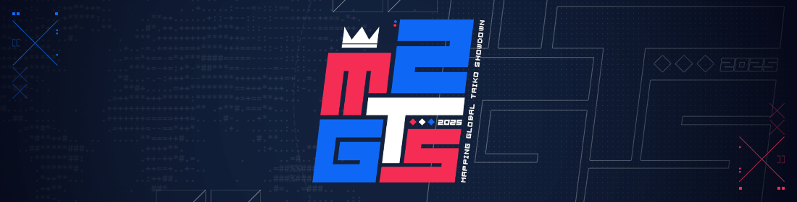

---
tags:
  - mgts
  - mgts2025
  - mapping gts
---

# Mapping Global Taiko Showdown 2025

The **Mapping Global Taiko Showdown 2025** (***MGTS 2025***) is a single-round team-based osu!taiko mapping contest where teams of 2 to 3 members will be competing to map 2 out of 3 custom-made songs.

## Contest schedule

| Event | Timestamp (UTC) |
| --: | :-- |
| Registration and submission phase | 1 June – 29 June 23:59 |
| Screening phase | *Tentative*[^screening] |
| Judging phase | 30 June – 26 July |
| Results | 27 July |

## Organisation

The MGTS 2025 is run by various community members.

| Position | Member(s) |
| :-- | :-- |
| Hosts | ::{ flag=TN }:: [**Hivie**](https://osu.ppy.sh/users/14102976), ::{ flag=SG }:: [arcpotato](https://osu.ppy.sh/users/12842392), ::{ flag=MY }:: [Jerry](https://osu.ppy.sh/users/605973) |
| Designer | ::{ flag=MY }:: [Z419](https://osu.ppy.sh/users/9912966) |
| Judges | ::{ flag=DE }:: [Greenshell](https://osu.ppy.sh/users/8693851), ::{ flag=HK }:: [iRedi](https://osu.ppy.sh/users/8005579), ::{ flag=MY }:: [ler1211](https://osu.ppy.sh/users/19901680), ::{ flag=US }:: [meiqth](https://osu.ppy.sh/users/12565402), ::{ flag=AU }:: [Yasuho](https://osu.ppy.sh/users/8458835) |

## Prizes

The top 3 teams will be awarded with the following prizes:

| Placing | Prize(s) |
| :-: | :-- |
|  | Unique profile badge (pending), [contest points](/wiki/Contests/Contest_points) (pending), Ranked status[^prizes-ranked] |
|  | [contest points](/wiki/Contests/Contest_points) (pending), Ranked status[^prizes-ranked] |
|  | [contest points](/wiki/Contests/Contest_points) (pending), Ranked status[^prizes-ranked] |

## Links

- [Main website](https://gtsosu.com/2025/mgts/home)
- [Contest news article](https://osu.ppy.sh/news/2025-06-01-mgts-2025-registrations)
- [Contest listing](https://osu.ppy.sh/community/contests/248)
- [Forum thread](https://osu.ppy.sh/community/forums/topics/2086331)
- [Discord server](https://discord.com/invite/3mGC3HB)
- [Twitch channel](https://www.twitch.tv/gtsosu)

## Songs

| Song | Artists |
| :-- | :-- |
| [ILLUSORYPROGRAM97](https://soundcloud.com/kyotsugyon/illusoryprogram97) | [Kyotsugyon](https://soundcloud.com/kyotsugyon), [Sh0wtime](https://soundcloud.com/sh0wtimelol) |
| axis::BREAK | [Foodbot](https://soundcloud.com/foodbot), [mrcool909090](https://soundcloud.com/mrcool909090), [SiLiS](https://soundcloud.com/silis) |
| [Hatching](https://blobdash.bandcamp.com/track/hatching) | [Faxyne](https://soundcloud.com/faxyne), [blobdash](https://soundcloud.com/blobdash) |

## Beatmap templates

Every team must start off by downloading one of the two provided templates:

- [Beatmap template 1: ILLUSORYPROGRAM97 + axis::BREAK](https://assets.ppy.sh/media/news/MGTS%202025%20Template%201.osz)
- [Beatmap template 2: ILLUSORYPROGRAM97 + Hatching](https://assets.ppy.sh/media/news/MGTS%202025%20Template%202.osz)

## Ruleset

### Contest rules

- This contest is an **osu!taiko single-round team-based contest** with teams of **2 players minimum**, and **3 players maximum**.
- **All submissions should abide by the [Ranking Criteria](https://osu.ppy.sh/wiki/en/Ranking_Criteria).** Mistakes happen and may affect judging, but submissions that cannot be ranked without major changes will be disqualified. (It's allowed to ignore spread rules for the sake of this contest.)
- **Submissions must NOT be uploaded/shared with others before judging and results are announced.** Sharing entries publicly by any means before the results are announced will result in a disqualification, no questions asked.
- **Submissions will not be accepted after the deadlines.** No exceptions.
- Participants must have read this ruleset **entirely** (and we will assume you did so throughout the contest).
- Any team that hasn't followed the **team creation process** and the **entry submission process** properly **will** risk disqualification.
- **All participants must collaborate on all songs.** This is a team-based competition. Collaboration is necessary to determine the strengths of each participating team as a whole. We want to avoid pure carry situations amongst teams. Collaboration does not include anything other than mapping.
- Any rule changes or unexpected occurrences will be announced in the Discord server.

### Registration and team creation

- In order to participate you need to need to be in a team of **2 to 3 players** of your choosing. There is no limit to who you can have on your team, with exception to the contest's staff members and people who are already on another team.
- One member of the team will need to be the captain. This should be decided before you sign up.
- The captain is going to be the one to submit the entry through the [osu! contest listing](https://osu.ppy.sh/community/contests/248).
- To sign up, the captain will need to register your entire team via the `register` button on the [contest's website page](https://gtsosu.com/2025/mgts/home).
  - The person in the first slot is the captain. This will be filled in automatically with the player who is registering, hence why the captain needs to be the one registering.
  - You must add a custom team name.
  - You can add a custom flag, a link to an image of size 70x47. This isn't mandatory, but leaving this blank means the country flag of the team captain is taken as your team's flag.

### Submission process

- In order to prepare a valid submission, you need to start mapping via one of the two provided templates.
- Upon downloading the template and loading it in osu!, **you must change the beatmap creator's name to your team's captain's name in the metadata in order to have a valid submission**.
- The captain will need to submit the \`.osz\` file through the [osu! contest listing](https://osu.ppy.sh/community/contests/248).
  - If any one other than the captain submits the entry, the entry will be disqualified.

If you're having any issues with the registration/submission process, please don't hesitate to [send Hivie a message](https://osu.ppy.sh/community/chat?sendto=14102976)!

### Judging criteria

Total score will consist of the (standardized) combined scores of the 2 maps. Each map will be judged with the following criteria:

- **Structure (10 Points):** Points will be assigned based on how well the map is internally designed (consistency, concept introduction, etc.).
- **Relevance (10 Points):** Points will be assigned based on how well the map represents the song and how well it plays.
- **Creativity (10 Points):** Points will be assigned based on how the submission uses creative and fitting elements to make itself stand out.
- **Judge's Impression (5 Points):** Points will be assigned based on what the judge thinks about your entry.
- **Ranking Criteria (5 Points):** Points will be assigned based on how well the map abides by the ranking criteria.

## Notes

- [^screening]: Screening may be used in the case of a large number of submissions. If this is the case, the screening phase will delay the judging phase by approximately 2 weeks.
- [^prizes-ranked]: The top 3 teams' entries will be fast-tracked to the Ranked section if the mappers choose to.
