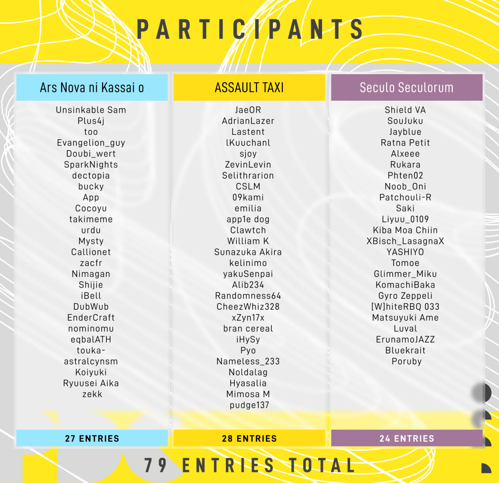

---
tags:
  - PDC2024
  - PDC
---

# Pending Cup 2024

The **Pending Cup** is originally a Chinese mapping contest, which had its first iteration in 2013 held by [NatsumeRin](https://osu.ppy.sh/users/151679). This year's contest was hosted by [Chaoslitz](https://osu.ppy.sh/users/3621552), [seros](https://osu.ppy.sh/users/10562853) and [Elayue](https://osu.ppy.sh/users/6400861).

## Schedule

| Event | Dates |
| --: | :-- |
| Beatmapping (2 months) | 2024-08-25/2024-10-24 (15:59 UTC) |
| Judging (2 months) | 2024-10-24/2024-12-23 |
| Results (1 week) | 2024-12-30 |

## Prizes

### Track prizes

The contest had **3** separate **1st to 3rd rankings** for each track. Since only one submission was allowed, there may have been a higher chance of winning by picking the track carefully.

| Placement | Prizes |
| :-: | :-- |
| 1st | $75 USD, 12 months of osu! supporter, [*Elite Mapper* contest points](/wiki/Contests/Contest_points), *Track Winner* profile badge |
| 2nd | $35 USD, 6 months of osu! supporter, [*Elite Mapper* contest points](/wiki/Contests/Contest_points) |
| 3rd | $15 USD, 4 months of osu! supporter, [*Elite Mapper* contest points](/wiki/Contests/Contest_points) |

### Grand prizes

For the winner with the **highest points** out of the **3** tracks, there was a special **grand prize** section.

| Placement | Prizes |
| :-: | :-- |
| 1st | **Wooting 60HE+** (courtesy of [Ttmnzk](https://osu.ppy.sh/users/2495509)), custom Pending Cup 2024 sticker set and keychain |
| 2nd | **[osu! deskmat](https://osu.ppy.sh/store/products/1347) of your choice** (courtesy of [Chaoslitz](https://osu.ppy.sh/users/3621552)), custom Pending Cup 2024 sticker set and keychain |
| 3rd | Custom Pending Cup 2024 sticker set and keychain |

### Lucky draw

In addition, there were two lucky draws of 1 month of osu! supporter for anyone who participated (excluding prize winners).

## Contributors

| Position | Member(s) |
| --: | :-- |
| Hosts | ::{ flag=HK }:: [Chaoslitz](https://osu.ppy.sh/users/3621552), ::{ flag=HK }:: [seros](https://osu.ppy.sh/users/10562853), ::{ flag=CN }:: [Elayue](https://osu.ppy.sh/users/6400861) |
| Judges | ::{ flag=CN }:: [Firika](https://osu.ppy.sh/users/9590557), ::{ flag=CN }:: [Fycho](https://osu.ppy.sh/users/1876867), ::{ flag=CN }:: [pw384](https://osu.ppy.sh/users/1343783), ::{ flag=US }:: [captin1](https://osu.ppy.sh/users/689997), ::{ flag=BE }:: [enneya](https://osu.ppy.sh/users/10959501), ::{ flag=AU }:: [Gibune](https://osu.ppy.sh/users/5778687), ::{ flag=US }:: [KoldNoodl](https://osu.ppy.sh/users/12572294) ::{ flag=JP }:: [Reioli](https://osu.ppy.sh/users/8200707) |
| Sponsors | ::{ flag=CN }:: [TtmnZk](https://osu.ppy.sh/users/2495509), ::{ flag=CN }:: [Hollow Wings](https://osu.ppy.sh/users/416662), ::{ flag=HK }:: [Regou](https://osu.ppy.sh/users/419954), ::{ flag=JP }:: [Sphaela](https://osu.ppy.sh/users/7075821), ::{ flag=CN }:: [pw384](https://osu.ppy.sh/users/1343783), ::{ flag=CA }:: [Feiri](https://osu.ppy.sh/users/3214844), ::{ flag=CN }:: [Flower](https://osu.ppy.sh/users/1033017), ::{ flag=HK }:: [Kyle Y](https://osu.ppy.sh/users/3565813), ::{ flag=CN }:: [_Stan](https://osu.ppy.sh/users/1653229), ::{ flag=CN }:: [Gust](https://osu.ppy.sh/users/1244312), ::{ flag=CN }:: [Edmound](https://osu.ppy.sh/users/10932297), ::{ flag=HK }:: [Chaoslitz](https://osu.ppy.sh/users/3621552), ::{ flag=HK }:: [seros](https://osu.ppy.sh/users/10562853), ::{ flag=CN }:: [Elayue](https://osu.ppy.sh/users/6400861), ::{ flag=CN }:: [Mafumafu](https://osu.ppy.sh/users/3076909) |
| Design | ::{ flag=CA }:: [kaetwo](https://osu.ppy.sh/users/1997719), ::{ flag=DK }:: [tochiii](https://osu.ppy.sh/users/3664366) |
| Special thanks | ::{ flag=TN }:: [Hivie](https://osu.ppy.sh/users/14102976), ::{ flag=CA }:: [kaetwo](https://osu.ppy.sh/users/1997719), ::{ flag=CN }:: [Mafumafu](https://osu.ppy.sh/users/3076909), ::{ flag=ID }:: [Maxus](https://osu.ppy.sh/users/4335785), ::{ flag=US }:: [pishifat](https://osu.ppy.sh/users/3178418), ::{ flag=US }:: [Protastic101](https://osu.ppy.sh/users/6712747), ::{ flag=JP }:: [Satellite](https://osu.ppy.sh/users/1661227), ::{ flag=SE }:: [Walavouchey](https://osu.ppy.sh/users/5773079) |

## Links

- [Announcement news post](https://osu.ppy.sh/home/news/2024-08-25-pending-cup-2024)
- [Contest listing](https://osu.ppy.sh/community/contests/218)
- [Discord server](https://discord.com/invite/fVgU9pA)
- [Forum post (English)](https://osu.ppy.sh/community/forums/topics/1967987)
- [Forum post (Chinese)](https://osu.ppy.sh/community/forums/topics/1967986)

## Songs

This year included two non-FA songs as part of the song list, which also means a revisit to a previous Pending Cup format of having **3** different categories of tracks: **Vocal**, **Instrumental**, and **Featured Artist**.

| Category | Song | Beatmap template |
| --: | :-- | :-- |
| Vocal | qfeileadh feat. Resonance Moeko - Ars Nova ni Kassai o | [2:47 / 185 BPM](https://assets.ppy.sh/media/news/Pending%20Cup%202024%20-%20qfeileadh%20feat.%20Resonance%20Moeko%20-%20Ars%20Nova%20ni%20Kassai%20o.osz) |
| Instrumental | ASA – Assault TAXI | [2:30 / 154 BPM](https://assets.ppy.sh/media/news/Pending%20Cup%202024%20-%20ASA%20-%20Assault%20TAXI.osz) |
| Featured Artist | Rabbit House – Seculo Seculorum | [2:22 / 210 BPM](https://assets.ppy.sh/media/news/Pending%20Cup%202024%20-%20Rabbit%20House%20-%20Seculo%20Seculorum.osz) |

## Participants

## Podium

---

The [lucky draw](#lucky-draw) winners were [App](https://osu.ppy.sh/users/13650508) and [Gyro Zeppeli](https://osu.ppy.sh/users/3824882).

## Results

| # | Score | User | Beatmap |
| :-: | --: | :-: | :-- |
| 1 | 10.60 | Ryuusei Aika | [qfeileadh feat. Resonance Moeko - Ars Nova ni Kassai o](https://assets.ppy.sh/contests/218/entries/osz/qfeileadh%20feat.%20Resonance%20Moeko%20%2D%20Ars%20Nova%20ni%20Kassai%20o%20%28Ryuusei%20Aika%29.osz) |
| 2 | 10.17 | Shijie | [qfeileadh feat. Resonance Moeko - Ars Nova ni Kassai o](https://assets.ppy.sh/contests/218/entries/osz/qfeileadh%20feat.%20Resonance%20Moeko%20%2D%20Ars%20Nova%20ni%20Kassai%20o%20%28Shijie%29.osz) |
| 3 | 9.70 | Matsuyuki Ame | [Rabbit House - Seculo Seculorum](https://assets.ppy.sh/contests/218/entries/osz/Rabbit%20House%20%2D%20Seculo%20Seculorum%20%28Matsuyuki%20Ame%29.osz) |
| 4 | 9.59 | Jayblue | [Rabbit House - Seculo Seculorum](https://assets.ppy.sh/contests/218/entries/osz/Rabbit%20House%20%2D%20Seculo%20Seculorum%20%28Jayblue%29.osz) |
| 5 | 7.55 | Luval | [Rabbit House - Seculo Seculorum](https://assets.ppy.sh/contests/218/entries/osz/Rabbit%20House%20%2D%20Seculo%20Seculorum%20%28Luval%29.osz) |
| 6 | 7.44 | William K | [ASA - Assault TAXI](https://assets.ppy.sh/contests/218/entries/osz/ASA%20%2D%20Assault%20TAXI%20%28William%20K%29.osz) |
| 7 | 7.08 | Hyasalia | [ASA - Assault TAXI](https://assets.ppy.sh/contests/218/entries/osz/ASA%20%2D%20Assault%20TAXI%20%28Hyasalia%29.osz) |
| 8 | 6.96 | emilia | [ASA - Assault TAXI](https://assets.ppy.sh/contests/218/entries/osz/ASA%20%2D%20Assault%20TAXI%20%28emilia%29.osz) |
| 9 | 6.92 | iBell | [qfeileadh feat. Resonance Moeko - Ars Nova ni Kassai o](https://assets.ppy.sh/contests/218/entries/osz/qfeileadh%20feat.%20Resonance%20Moeko%20%2D%20Ars%20Nova%20ni%20Kassai%20o%20%28iBell%29.osz) |
| 10 | 6.83 | Plus4j | [qfeileadh feat. Resonance Moeko - Ars Nova ni Kassai o](https://assets.ppy.sh/contests/218/entries/osz/qfeileadh%20feat.%20Resonance%20Moeko%20%2D%20Ars%20Nova%20ni%20Kassai%20o%20%28Plus4j%29.osz) |
| 11 | 6.71 | \[W\]hiteRBQ 033 | [Rabbit House - Seculo Seculorum](https://assets.ppy.sh/contests/218/entries/osz/Rabbit%20House%20%2D%20Seculo%20Seculorum%20%28%5BW%5DhiteRBQ%20033%29.osz) |
| 12 | 6.30 | Pyo | [ASA - Assault TAXI](https://assets.ppy.sh/contests/218/entries/osz/ASA%20%2D%20Assault%20TAXI%20%28Pyo%29.osz) |
| 13 | 6.27 | Koiyuki | [qfeileadh feat. Resonance Moeko - Ars Nova ni Kassai o](https://assets.ppy.sh/contests/218/entries/osz/qfeileadh%20feat.%20Resonance%20Moeko%20%2D%20Ars%20Nova%20ni%20Kassai%20o%20%28Koiyuki%29.osz) |
| 14 | 6.02 | pudge137 | [ASA - Assault TAXI](https://assets.ppy.sh/contests/218/entries/osz/ASA%20%2D%20Assault%20TAXI%20%28pudge137%29.osz) |
| 15 | 5.57 | Randomness64 | [ASA - Assault TAXI](https://assets.ppy.sh/contests/218/entries/osz/ASA%20%2D%20Assault%20TAXI%20%28Randomness64%29.osz) |
| 16 | 5.48 | Mysty | [qfeileadh feat. Resonance Moeko - Ars Nova ni Kassai o](https://assets.ppy.sh/contests/218/entries/osz/qfeileadh%20feat.%20Resonance%20Moeko%20%2D%20Ars%20Nova%20ni%20Kassai%20o%20%28Mysty%29.osz) |
| 17 | 5.32 | 09kami | [ASA - Assault TAXI](https://assets.ppy.sh/contests/218/entries/osz/ASA%20%2D%20Assault%20TAXI%20%2809kami%29.osz) |
| 18 | 5.26 | Sunazuka Akira | [ASA - Assault TAXI](https://assets.ppy.sh/contests/218/entries/osz/ASA%20%2D%20Assault%20TAXI%20%28Sunazuka%20Akira%29.osz) |
| 19 | 5.03 | bucky | [qfeileadh feat. Resonance Moeko - Ars Nova ni Kassai o](https://assets.ppy.sh/contests/218/entries/osz/qfeileadh%20feat.%20Resonance%20Moeko%20%2D%20Ars%20Nova%20ni%20Kassai%20o%20%28bucky%29.osz) |
| 20 | 4.88 | Evangelion\_guy | [qfeileadh feat. Resonance Moeko - Ars Nova ni Kassai o](https://assets.ppy.sh/contests/218/entries/osz/qfeileadh%20feat.%20Resonance%20Moeko%20%2D%20Ars%20Nova%20ni%20Kassai%20o%20%28Evangelion%5Fguy%29.osz) |
| 21 | 4.78 | Cocoyu | [qfeileadh feat. Resonance Moeko - Ars Nova ni Kassai o](https://assets.ppy.sh/contests/218/entries/osz/qfeileadh%20feat.%20Resonance%20Moeko%20%2D%20Ars%20Nova%20ni%20Kassai%20o%20%28Cocoyu%29.osz) |
| 22 | 4.67 | Poruby | [Rabbit House - Seculo Seculorum](https://assets.ppy.sh/contests/218/entries/osz/Rabbit%20House%20%2D%20Seculo%20Seculorum%20%28Poruby%29.osz) |
| 23 | 4.29 | Ratna Petit | [Rabbit House - Seculo Seculorum](https://assets.ppy.sh/contests/218/entries/osz/Rabbit%20House%20%2D%20Seculo%20Seculorum%20%28Ratna%20Petit%29.osz) |
| 24 | 4.26 | Callionet | [qfeileadh feat. Resonance Moeko - Ars Nova ni Kassai o](https://assets.ppy.sh/contests/218/entries/osz/qfeileadh%20feat.%20Resonance%20Moeko%20%2D%20Ars%20Nova%20ni%20Kassai%20o%20%28Callionet%29.osz) |
| 25 | 3.93 | Patchouli-R | [Rabbit House - Seculo Seculorum](https://assets.ppy.sh/contests/218/entries/osz/Rabbit%20House%20%2D%20Seculo%20Seculorum%20%28Patchouli%2DR%29.osz) |
| 26 | 3.72 | kelinimo | [ASA - Assault TAXI](https://assets.ppy.sh/contests/218/entries/osz/ASA%20%2D%20Assault%20TAXI%20%28kelinimo%29.osz) |
| 27 | 3.71 | EnderCraft | [qfeileadh feat. Resonance Moeko - Ars Nova ni Kassai o](https://assets.ppy.sh/contests/218/entries/osz/qfeileadh%20feat.%20Resonance%20Moeko%20%2D%20Ars%20Nova%20ni%20Kassai%20o%20%28EnderCraft%29.osz) |
| 28 | 3.39 | Clawtch | [ASA - Assault TAXI](https://assets.ppy.sh/contests/218/entries/osz/ASA%20%2D%20Assault%20TAXI%20%28Clawtch%29.osz) |
| 29 | 3.39 | CSLM | [ASA - Assault TAXI](https://assets.ppy.sh/contests/218/entries/osz/ASA%20%2D%20Assault%20TAXI%20%28CSLM%29.osz) |
| 30 | 2.99 | SouJuku | [Rabbit House - Seculo Seculorum](https://assets.ppy.sh/contests/218/entries/osz/Rabbit%20House%20%2D%20Seculo%20Seculorum%20%28SouJuku%29.osz) |
| 31 | 2.67 | Selithrarion | [ASA - Assault TAXI](https://assets.ppy.sh/contests/218/entries/osz/ASA%20%2D%20Assault%20TAXI%20%28Selithrarion%29.osz) |
| 32 | 2.57 | iHySy | [ASA - Assault TAXI](https://assets.ppy.sh/contests/218/entries/osz/ASA%20%2D%20Assault%20TAXI%20%28iHySy%29.osz) |
| 33 | 2.03 | ZevinLevin | [ASA - Assault TAXI](https://assets.ppy.sh/contests/218/entries/osz/ASA%20%2D%20Assault%20TAXI%20%28ZevinLevin%29.osz) |
| 34 | 1.90 | touka- | [qfeileadh feat. Resonance Moeko - Ars Nova ni Kassai o](https://assets.ppy.sh/contests/218/entries/osz/qfeileadh%20feat.%20Resonance%20Moeko%20%2D%20Ars%20Nova%20ni%20Kassai%20o%20%28touka%2D%29.osz) |
| 35 | 1.59 | ErunamoJAZZ | [Rabbit House - Seculo Seculorum](https://assets.ppy.sh/contests/218/entries/osz/Rabbit%20House%20%2D%20Seculo%20Seculorum%20%28ErunamoJAZZ%29.osz) |
| 36 | 1.48 | SparkNights | [qfeileadh feat. Resonance Moeko - Ars Nova ni Kassai o](https://assets.ppy.sh/contests/218/entries/osz/qfeileadh%20feat.%20Resonance%20Moeko%20%2D%20Ars%20Nova%20ni%20Kassai%20o%20%28SparkNights%29.osz) |
| 37 | 1.27 | astralcynsm | [qfeileadh feat. Resonance Moeko - Ars Nova ni Kassai o](https://assets.ppy.sh/contests/218/entries/osz/qfeileadh%20feat.%20Resonance%20Moeko%20%2D%20Ars%20Nova%20ni%20Kassai%20o%20%28astralcynsm%29.osz) |
| 38 | 1.09 | xZyn17x | [ASA - Assault TAXI](https://assets.ppy.sh/contests/218/entries/osz/ASA%20%2D%20Assault%20TAXI%20%28xZyn17x%29.osz) |
| 39 | 1.09 | Lastent | [ASA - Assault TAXI](https://assets.ppy.sh/contests/218/entries/osz/ASA%20%2D%20Assault%20TAXI%20%28Lastent%29.osz) |
| 40 | 1.02 | Mimosa M | [ASA - Assault TAXI](https://assets.ppy.sh/contests/218/entries/osz/ASA%20%2D%20Assault%20TAXI%20%28Mimosa%20M%29.osz) |
| 41 | 0.97 | Saki | [Rabbit House - Seculo Seculorum](https://assets.ppy.sh/contests/218/entries/osz/Rabbit%20House%20%2D%20Seculo%20Seculorum%20%28Saki%29.osz) |
| 42 | 0.94 | Nimagan | [qfeileadh feat. Resonance Moeko - Ars Nova ni Kassai o](https://assets.ppy.sh/contests/218/entries/osz/qfeileadh%20feat.%20Resonance%20Moeko%20%2D%20Ars%20Nova%20ni%20Kassai%20o%20%28Nimagan%29.osz) |
| 43 | 0.84 | KomachiBaka | [Rabbit House - Seculo Seculorum](https://assets.ppy.sh/contests/218/entries/osz/Rabbit%20House%20%2D%20Seculo%20Seculorum%20%28KomachiBaka%29.osz) |
| 44 | 0.55 | bran cereal | [ASA - Assault TAXI](https://assets.ppy.sh/contests/218/entries/osz/ASA%20%2D%20Assault%20TAXI%20%28bran%20cereal%29.osz) |
| 45 | 0.52 | App | [qfeileadh feat. Resonance Moeko - Ars Nova ni Kassai o](https://assets.ppy.sh/contests/218/entries/osz/qfeileadh%20feat.%20Resonance%20Moeko%20%2D%20Ars%20Nova%20ni%20Kassai%20o%20%28App%29.osz) |
| 46 | 0.27 | takimeme | [qfeileadh feat. Resonance Moeko - Ars Nova ni Kassai o](https://assets.ppy.sh/contests/218/entries/osz/qfeileadh%20feat.%20Resonance%20Moeko%20%2D%20Ars%20Nova%20ni%20Kassai%20o%20%28takimeme%29.osz) |
| 47 | 0.08 | Phten02 | [Rabbit House - Seculo Seculorum](https://assets.ppy.sh/contests/218/entries/osz/Rabbit%20House%20%2D%20Seculo%20Seculorum%20%28Phten02%29.osz) |
| 48 | -0.01 | Gyro Zeppeli | [Rabbit House - Seculo Seculorum](https://assets.ppy.sh/contests/218/entries/osz/Rabbit%20House%20%2D%20Seculo%20Seculorum%20%28Gyro%20Zeppeli%29.osz) |
| 49 | -0.07 | lKuuchanl | [ASA - Assault TAXI](https://assets.ppy.sh/contests/218/entries/osz/ASA%20%2D%20Assault%20TAXI%20%28lKuuchanl%29.osz) |
| 50 | -0.32 | nominomu | [qfeileadh feat. Resonance Moeko - Ars Nova ni Kassai o](https://assets.ppy.sh/contests/218/entries/osz/qfeileadh%20feat.%20Resonance%20Moeko%20%2D%20Ars%20Nova%20ni%20Kassai%20o%20%28nominomu%29.osz) |
| 51 | -1.52 | AdrianLazer | [ASA - Assault TAXI](https://assets.ppy.sh/contests/218/entries/osz/ASA%20%2D%20Assault%20TAXI%20%28AdrianLazer%29.osz) |
| 52 | -1.65 | Liyuu\_0109 | [Rabbit House - Seculo Seculorum](https://assets.ppy.sh/contests/218/entries/osz/Rabbit%20House%20%2D%20Seculo%20Seculorum%20%28Liyuu%5F0109%29.osz) |
| 53 | -1.78 | too | [qfeileadh feat. Resonance Moeko - Ars Nova ni Kassai o](https://assets.ppy.sh/contests/218/entries/osz/qfeileadh%20feat.%20Resonance%20Moeko%20%2D%20Ars%20Nova%20ni%20Kassai%20o%20%28too%29.osz) |
| 54 | -2.09 | sjoy | [ASA - Assault TAXI](https://assets.ppy.sh/contests/218/entries/osz/ASA%20%2D%20Assault%20TAXI%20%28sjoy%29.osz) |
| 55 | -2.14 | urdu | [qfeileadh feat. Resonance Moeko - Ars Nova ni Kassai o](https://assets.ppy.sh/contests/218/entries/osz/qfeileadh%20feat.%20Resonance%20Moeko%20%2D%20Ars%20Nova%20ni%20Kassai%20o%20%28urdu%29.osz) |
| 56 | -2.37 | dectopia | [qfeileadh feat. Resonance Moeko - Ars Nova ni Kassai o](https://assets.ppy.sh/contests/218/entries/osz/qfeileadh%20feat.%20Resonance%20Moeko%20%2D%20Ars%20Nova%20ni%20Kassai%20o%20%28dectopia%29.osz) |
| 57 | -2.50 | zekk | [qfeileadh feat. Resonance Moeko - Ars Nova ni Kassai o](https://assets.ppy.sh/contests/218/entries/osz/qfeileadh%20feat.%20Resonance%20Moeko%20%2D%20Ars%20Nova%20ni%20Kassai%20o%20%28zekk%29.osz) |
| 58 | -2.99 | Alxeee | [Rabbit House - Seculo Seculorum](https://assets.ppy.sh/contests/218/entries/osz/Rabbit%20House%20%2D%20Seculo%20Seculorum%20%28Alxeee%29.osz) |
| 59 | -4.04 | Tomoe | [Rabbit House - Seculo Seculorum](https://assets.ppy.sh/contests/218/entries/osz/Rabbit%20House%20%2D%20Seculo%20Seculorum%20%28Tomoe%29.osz) |
| 60 | -4.08 | DubWub | [qfeileadh feat. Resonance Moeko - Ars Nova ni Kassai o](https://assets.ppy.sh/contests/218/entries/osz/qfeileadh%20feat.%20Resonance%20Moeko%20%2D%20Ars%20Nova%20ni%20Kassai%20o%20%28DubWub%29.osz) |
| 61 | -4.19 | Nameless\_233 | [ASA - Assault TAXI](https://assets.ppy.sh/contests/218/entries/osz/ASA%20%2D%20Assault%20TAXI%20%28Nameless%5F233%29.osz) |
| 62 | -4.28 | Noob\_Oni | [Rabbit House - Seculo Seculorum](https://assets.ppy.sh/contests/218/entries/osz/Rabbit%20House%20%2D%20Seculo%20Seculorum%20%28Noob%5FOni%29.osz) |
| 63 | -4.58 | Noldalag | [ASA - Assault TAXI](https://assets.ppy.sh/contests/218/entries/osz/ASA%20%2D%20Assault%20TAXI%20%28Noldalag%29.osz) |
| 64 | -4.95 | Doubi\_wert | [qfeileadh feat. Resonance Moeko - Ars Nova ni Kassai o](https://assets.ppy.sh/contests/218/entries/osz/qfeileadh%20feat.%20Resonance%20Moeko%20%2D%20Ars%20Nova%20ni%20Kassai%20o%20%28Doubi%5Fwert%29.osz) |
| 65 | -5.34 | eqbalATH | [qfeileadh feat. Resonance Moeko - Ars Nova ni Kassai o](https://assets.ppy.sh/contests/218/entries/osz/qfeileadh%20feat.%20Resonance%20Moeko%20%2D%20Ars%20Nova%20ni%20Kassai%20o%20%28eqbalATH%29.osz) |
| 66 | -6.45 | Unsinkable Sam | [qfeileadh feat. Resonance Moeko - Ars Nova ni Kassai o](https://assets.ppy.sh/contests/218/entries/osz/qfeileadh%20feat.%20Resonance%20Moeko%20%2D%20Ars%20Nova%20ni%20Kassai%20o%20%28Unsinkable%20Sam%29.osz) |
| 67 | -7.67 | Alib234 | [ASA - Assault TAXI](https://assets.ppy.sh/contests/218/entries/osz/ASA%20%2D%20Assault%20TAXI%20%28Alib234%29.osz) |
| 68 | -7.77 | zacfr | [qfeileadh feat. Resonance Moeko - Ars Nova ni Kassai o](https://assets.ppy.sh/contests/218/entries/osz/qfeileadh%20feat.%20Resonance%20Moeko%20%2D%20Ars%20Nova%20ni%20Kassai%20o%20%28zacfr%29.osz) |
| 69 | -8.00 | Bluekrait | [Rabbit House - Seculo Seculorum](https://assets.ppy.sh/contests/218/entries/osz/Rabbit%20House%20%2D%20Seculo%20Seculorum%20%28Bluekrait%29.osz) |
| 70 | -8.06 | app1e dog | [ASA - Assault TAXI](https://assets.ppy.sh/contests/218/entries/osz/ASA%20%2D%20Assault%20TAXI%20%28app1e%20dog%29.osz) |
| 71 | -9.83 | XBisch\_LasagnaX | [Rabbit House - Seculo Seculorum](https://assets.ppy.sh/contests/218/entries/osz/Rabbit%20House%20%2D%20Seculo%20Seculorum%20%28XBisch%5FLasagnaX%29.osz) |
| 72 | -10.61 | Glimmer\_Miku | [Rabbit House - Seculo Seculorum](https://assets.ppy.sh/contests/218/entries/osz/Rabbit%20House%20%2D%20Seculo%20Seculorum%20%28Glimmer%5FMiku%29.osz) |
| 73 | -11.14 | CheezWhiz328 | [ASA - Assault TAXI](https://assets.ppy.sh/contests/218/entries/osz/ASA%20%2D%20Assault%20TAXI%20%28CheezWhiz328%29.osz) |
| 74 | -11.57 | Kiba Moa Chiin | [Rabbit House - Seculo Seculorum](https://assets.ppy.sh/contests/218/entries/osz/Rabbit%20House%20%2D%20Seculo%20Seculorum%20%28Kiba%20Moa%20Chiin%29.osz) |
| 75 | -11.67 | yokuSenpai | [ASA - Assault TAXI](https://assets.ppy.sh/contests/218/entries/osz/ASA%20%2D%20Assault%20TAXI%20%28yokuSenpai%29.osz) |
| 76 | -12.01 | YASHIYO | [Rabbit House - Seculo Seculorum](https://assets.ppy.sh/contests/218/entries/osz/Rabbit%20House%20%2D%20Seculo%20Seculorum%20%28YASHIYO%29.osz) |
| 77 | -14.82 | JaeOR | [ASA - Assault TAXI](https://assets.ppy.sh/contests/218/entries/osz/ASA%20%2D%20Assault%20TAXI%20%28JaeOR%29.osz) |
| 78 | -15.29 | Rukara | [Rabbit House - Seculo Seculorum](https://assets.ppy.sh/contests/218/entries/osz/Rabbit%20House%20%2D%20Seculo%20Seculorum%20%28Rukara%29.osz) |
| 79 | -15.90 | Shield VA | [Rabbit House - Seculo Seculorum](https://assets.ppy.sh/contests/218/entries/osz/Rabbit%20House%20%2D%20Seculo%20Seculorum%20%28Shield%20VA%29.osz) |

## Rules

### Format

- **This is an osu! mode mapping contest.**

### Mapping

- **Submission must include ONE DIFFICULTY ONLY.**
- **Submission must use one of the provided songs.** You are only allowed to submit **ONE ENTRY** for one of the songs.
- **Collaborations are not allowed.** Submission must be a solo entry.
- **Submission must be in `.osz` format.**
- **Submission must use standard difficulty names:** Easy, Normal, Hard, Insane, and Expert.
- **You must not include a video or storyboard in your submission.**
- **You must not modify the background and metadata of your submission.** Metadata includes the title, artist, beatmap creator, source and tags.
- **You are allowed to modify timing (including red lines) based on your needs.** This action is at your own risk.
- **You are allowed to modify combo colours, bookmarks, and the preview time.**
- **Submission must not be publicly revealed until after the results are announced.**
- **The [ranking criteria](/wiki/Ranking_criteria) must be respected except in cases where they cannot be applied, such as beatmap spread.** While mistakes are tolerated, submissions containing major unrankable issues may result in a deduction of points.

### Submission

- Once you are finished, [head over to the contest listing to submit your map](https://osu.ppy.sh/community/contests/218). You are allowed to resubmit your entry anytime before the mapping phase has ended.

### Judging criteria[^criteria]

| Category | Details |
| :-: | :-- |
| Expertise (40%) | Expertise refers to how well the map executes itself to reflect the elements in the music. This reflects the technical skill of a mapper. However, in the Pending Cup, judging is not modding. Although we promote maps with expertise and professionalism and care about details, judges are discouraged from being nitpicky on small mistakes or minor unrankables, and will instead score in this category while considering an overarching picture of the map. |
| Creativity (40%) | Creativity refers to how reasonably outstanding the map is compared to the current mapping meta. A generic map in the current mapping meta or copy-pasting concepts from other "famous" maps is discouraged. The Pending Cup promotes creativity, so the winners of PDC should guide the mapping meta instead of following it. |
| Judge's Impression (20%) | Judges can use this for extra scores or penalties for their specific comments or remarks on something in the entry. The base Judge's Impression score is set to 10, and judges must explicitly mention why they apply any additions or deductions to that score. |

## Notes

[^criteria]: Judges are instructed to be consistent in their judging style across each track when judging.
