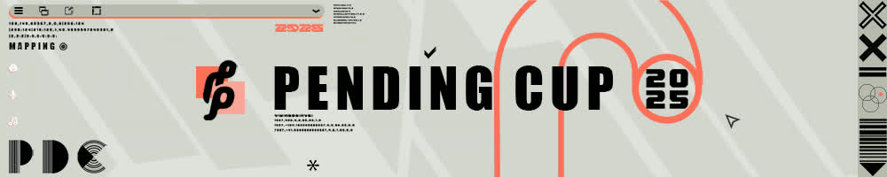
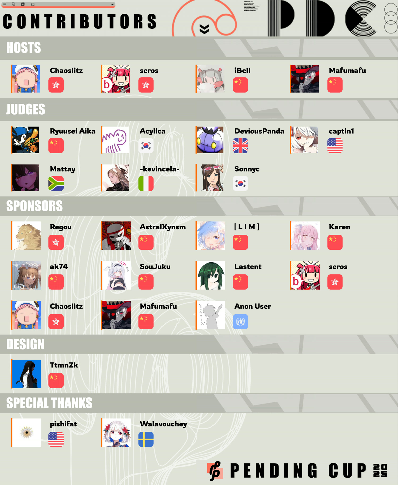

---
tags:
  - PDC2025
  - PDC
---

# Pending Cup 2025

The **Pending Cup** is originally a Chinese mapping contest, which had its first iteration in 2013 held by [NatsumeRin](https://osu.ppy.sh/users/151679). This year marks the 13th iteration, hosted by [Chaoslitz](https://osu.ppy.sh/users/3621552), [iBell](https://osu.ppy.sh/users/4298072), [seros](https://osu.ppy.sh/users/10562853), and [Mafumafu](https://osu.ppy.sh/users/3076909).

## Schedule

| Event | Dates |
| --: | :-- |
| Beatmapping (2 months) | 2025-10-24/2025-12-21 (15:59 UTC) |
| Judging (1.5 months) | 2025-12-22/2026-02-05 |
| Results (1 week) | 2026-02-14 |

## Prizes

### Track prizes

The contest has **3** separate **1st to 3rd rankings** for each track. Since only one submission is allowed, there may be a higher chance of winning by picking the track carefully.

This contest currently offers a cash prize pool of $400, distributed among the top 3 of each track category in a 12:6:4 ratio.

| Placement | Prizes |
| :-: | :-- |
| 1st | 18% of the cash prize pool, 12 months of osu!supporter, profile badge (tentative), [contest points](/wiki/Contests/Contest_points) |
| 2nd | 9% of the cash prize pool, 6 months of osu!supporter, [contest points](/wiki/Contests/Contest_points) |
| 3rd | 6% of the cash prize pool, 4 months of osu!supporter, [contest points](/wiki/Contests/Contest_points) |

### Grand prize

The winning entry with the highest judging score across all categories receives the following:

| Placement | Prize |
| :-: | :-- |
| 1st | [**osu!tablet**](https://osu.ppy.sh/store/products/1447) (courtesy of [Chaoslitz](https://osu.ppy.sh/users/3621552)) |

## Contributors

## Links

- [Announcement news post](https://osu.ppy.sh/home/news/2025-10-24-pending-cup-2025)
- [Contest listing](https://osu.ppy.sh/community/contests/267)
- [Discord server](https://discord.com/invite/fVgU9pA)
- [Forum post (English)](https://osu.ppy.sh/community/forums/topics/2143230)
- [Forum post (Chinese)](https://osu.ppy.sh/community/forums/topics/2143231)

## Songs

This year includes a selection of three songs like the previous year, with songs from the Featured Artist library including one [osu! original](/wiki/Community/Bespoke_music), forming three categories: **Vocal**, **Instrumental**, and **Original**.

| Category | Song | Beatmap template |
| --: | :-- | :-- |
| Vocal | Colorful Sounds Port feat. Sennzai - Jewelry Beans | [3:30 / 134 BPM](https://assets.ppy.sh/media/news/Pending%20Cup%202025%20-%20Colorful%20Sounds%20Port%20feat.%20Sennzai%20-%20Jewelry%20Beans.osz) |
| Instrumental | Kurubukko - alive | [2:17 / 260 BPM](https://assets.ppy.sh/media/news/Pending%20Cup%202025%20-%20Kurubukko%20-%20alive.osz) |
| Original | Trina Lydia - TETRATONE ALTiSSiMO | [2:19 / 186 BPM](https://assets.ppy.sh/media/news/Pending%20Cup%202025%20-%20Trina%20Lydia%20-%20TETRATONE%20ALTiSSiMO.osz) |

## Results

### Kurubukko - alive

| # | User | Score | Entry |
| :-: | :-- | --: | :-: |
| 1 | ::{ flag=US }:: [fowwo](https://osu.ppy.sh/users/4547551) | 9.3 |  |
| 2 | ::{ flag=TW }:: [Alty](https://osu.ppy.sh/users/16407988) | 8.06 |  |
| 3 | ::{ flag=JP }:: [eringiRa](https://osu.ppy.sh/users/16383529) | 7.78 |  |
| 4 | ::{ flag=CN }:: [YeLing](https://osu.ppy.sh/users/14726718) | 7.62 |  |
| 5 | ::{ flag=CN }:: [Firika](https://osu.ppy.sh/users/9590557) | 7.26 |  |
| 6 | ::{ flag=UA }:: [Judge1st](https://osu.ppy.sh/users/10610737) | 6.8 |  |
| 7 | ::{ flag=IT }:: [zekk](https://osu.ppy.sh/users/9704802) | 6.08 |  |
| 8 | ::{ flag=MY }:: [plork](https://osu.ppy.sh/users/10994474) | 5.49 |  |
| 9 | ::{ flag=CN }:: [AstralXynsm](https://osu.ppy.sh/users/16022233) | 5.46 |  |
| 10 | ::{ flag=KR }:: [Poruby](https://osu.ppy.sh/users/10890088) | 4.71 |  |
| 11 | ::{ flag=CN }:: [[W]hiteRBQ 033](https://osu.ppy.sh/users/8678443) | 3.76 |  |
| 12 | ::{ flag=CN }:: [X Light](https://osu.ppy.sh/users/1814662) | 3.48 |  |
| 13 | ::{ flag=CN }:: [Momoyaya](https://osu.ppy.sh/users/13859320) | 3.22 |  |
| 14 | ::{ flag=CH }:: [Evangelion_guy](https://osu.ppy.sh/users/16818096) | 1.47 |  |
| 15 | ::{ flag=AU }:: [Levesile](https://osu.ppy.sh/users/12054043) | 1.07 |  |
| 16 | ::{ flag=PH }:: [Buster](https://osu.ppy.sh/users/8208277) | -2.26 |  |
| 17 | ::{ flag=US }:: [AdrianLazer](https://osu.ppy.sh/users/10292643) | -2.46 |  |
| 18 | ::{ flag=BE }:: [enneya](https://osu.ppy.sh/users/10959501) | -2.49 |  |
| 19 | ::{ flag=CN }:: [Another Flower](https://osu.ppy.sh/users/6854920) | -2.8 |  |
| 20 | ::{ flag=CN }:: [Lastent](https://osu.ppy.sh/users/13353410) | -4.07 |  |
| 21 | ::{ flag=CN }:: [FreeTax](https://osu.ppy.sh/users/37408137) | -7.79 |  |
| 22 | ::{ flag=TW }:: [[Paw]OchiKouri](https://osu.ppy.sh/users/8693179) | -11.37 |  |

### Colorful Sounds Port feat. Sennzai - Jewelry Beans

| # | User | Score | Entry |
| :-: | :-- | --: | :-: |
| 1 | ::{ flag=AR }:: [MaestroSplinter](https://osu.ppy.sh/users/6707918) | 9.42 |  |
| 2 | ::{ flag=CN }:: [Aoinabi](https://osu.ppy.sh/users/10120527) | 6.2 |  |
| 3 | ::{ flag=FR }:: [Timevid](https://osu.ppy.sh/users/9125335) | 5.33 |  |
| 4 | ::{ flag=BR }:: [Kalindraz](https://osu.ppy.sh/users/2313166) | 2.97 |  |
| 5 | ::{ flag=CN }:: [Ellyu](https://osu.ppy.sh/users/4438154) | 1.67 |  |
| 6 | ::{ flag=CN }:: [SouJuku](https://osu.ppy.sh/users/20403654) | 0.94 |  |
| 7 | ::{ flag=HK }:: [CRYacho](https://osu.ppy.sh/users/17735305) | -0.24 |  |
| 8 | ::{ flag=CN }:: [Alaps](https://osu.ppy.sh/users/11746218) | -0.51 |  |
| 9 | ::{ flag=RO }:: [LuchiBuchi](https://osu.ppy.sh/users/10897656) | -1.11 |  |
| 10 | ::{ flag=SG }:: [zacfr](https://osu.ppy.sh/users/19094096) | -1.5 |  |
| 11 | ::{ flag=MY }:: [chiterihead](https://osu.ppy.sh/users/37910724) | -1.7 |  |
| 12 | ::{ flag=CN }:: [Edmound](https://osu.ppy.sh/users/10932297) | -2.3 |  |
| 13 | ::{ flag=CN }:: [BrokenShine](https://osu.ppy.sh/users/10235769) | -2.32 |  |
| 14 | ::{ flag=CN }:: [[ L I M ]](https://osu.ppy.sh/users/10229523) | -2.9 |  |
| 15 | ::{ flag=CN }:: [Doubi_wert](https://osu.ppy.sh/users/30512018) | -4.38 |  |
| 16 | ::{ flag=GB }:: [Pastel Kitten](https://osu.ppy.sh/users/37602544) | -10.27 |  |
| 17 | ::{ flag=JP }:: [sea_sawagase](https://osu.ppy.sh/users/32001486) | -10.64 |  |

### Trina Lydia - TETRATONE ALTiSSiMO

| # | User | Score | Entry |
| :-: | :-- | --: | :-: |
| 1 | ::{ flag=TW }:: [Matsuyuki Ame](https://osu.ppy.sh/users/12763959) | 9.19 |  |
| 2 | ::{ flag=DE }:: [0ppInOsu](https://osu.ppy.sh/users/12551840) | 8.76 |  |
| 3 | ::{ flag=HK }:: [Arushii](https://osu.ppy.sh/users/15664628) | 8.62 |  |
| 4 | ::{ flag=CN }:: [Decay Limerence](https://osu.ppy.sh/users/4814169) | 7.26 |  |
| 5 | ::{ flag=SE }:: [Meteo L-Drago](https://osu.ppy.sh/users/5087744) | 7.13 |  |
| 6 | ::{ flag=CN }:: [Uruha Migaki](https://osu.ppy.sh/users/21573458) | 5.85 |  |
| 7 | ::{ flag=JP }:: [Phten02](https://osu.ppy.sh/users/16678364) | 4.6 |  |
| 8 | ::{ flag=RU }:: [zadknus](https://osu.ppy.sh/users/12101917) | 3.96 |  |
| 9 | ::{ flag=CN }:: [Komeiji_Satori_](https://osu.ppy.sh/users/15114200) | 3.54 |  |
| 10 | ::{ flag=CN }:: [Lobelia](https://osu.ppy.sh/users/4030114) | 3.51 |  |
| 11 | ::{ flag=ES }:: [bucky](https://osu.ppy.sh/users/6750761) | 3.43 |  |
| 12 | ::{ flag=AU }:: [Eazy](https://osu.ppy.sh/users/31536964) | 2.57 |  |
| 13 | ::{ flag=RU }:: [columbina137](https://osu.ppy.sh/users/31970865) | 1.6 |  |
| 14 | ::{ flag=NZ }:: [Pass_ing](https://osu.ppy.sh/users/11798717) | 1.33 |  |
| 15 | ::{ flag=TW }:: [A04](https://osu.ppy.sh/users/15409186) | 0.52 |  |
| 16 | ::{ flag=SE }:: [TypoFanGirl](https://osu.ppy.sh/users/9489702) | 0.31 |  |
| 17 | ::{ flag=CN }:: [Graphical](https://osu.ppy.sh/users/21397778) | -0.12 |  |
| 18 | ::{ flag=RU }:: [Ziny](https://osu.ppy.sh/users/20098206) | -0.18 |  |
| 19 | ::{ flag=CN }:: [[Lily_White]](https://osu.ppy.sh/users/12749779) | -0.76 |  |
| 20 | ::{ flag=CN }:: [Baymax 3Ha](https://osu.ppy.sh/users/12965455) | -1.64 |  |
| 21 | ::{ flag=MO }:: [-PSC-](https://osu.ppy.sh/users/24350045) | -1.74 |  |
| 22 | ::{ flag=CN }:: [Noob_Oni](https://osu.ppy.sh/users/33455007) | -4.17 |  |
| 23 | ::{ flag=CN }:: [Ripforever](https://osu.ppy.sh/users/38293038) | -4.56 |  |
| 24 | ::{ flag=TW }:: [xiaohuankun](https://osu.ppy.sh/users/26009434) | -4.66 |  |
| 25 | ::{ flag=US }:: [sh4rkerin0](https://osu.ppy.sh/users/30837699) | -6.4 |  |
| 26 | ::{ flag=CN }:: [GalaxySpeaker](https://osu.ppy.sh/users/28319612) | -6.57 |  |
| 27 | ::{ flag=NO }:: [Jelo](https://osu.ppy.sh/users/17616566) | -6.81 |  |
| 28 | ::{ flag=US }:: [goul-](https://osu.ppy.sh/users/19835305) | -7.25 |  |
| 29 | ::{ flag=CN }:: [firebiaboom](https://osu.ppy.sh/users/35970452) | -7.88 |  |
| 30 | ::{ flag=VN }:: [anothermousey](https://osu.ppy.sh/users/30071502) | -8.03 |  |
| 31 | ::{ flag=VN }:: [RembrandInfX](https://osu.ppy.sh/users/29743746) | -9.05 |  |
| 32 | ::{ flag=MY }:: [miyoriii](https://osu.ppy.sh/users/33387396) | -11.33 |  |
| 33 | ::{ flag=CN }:: [Scker075](https://osu.ppy.sh/users/34078935) | -12.37 |  |
| 34 | ::{ flag=TH }:: [Dummy2614](https://osu.ppy.sh/users/37548347) | -15.65 |  |

## Rules

### Format

- **This is an osu! mode mapping contest.**

### Mapping

- **Submission must include ONE DIFFICULTY ONLY.**
- **Submission must use one of the selected songs.** Use one of  the provided [templates](#songs).
- **Collaborations are not allowed.** Submission must be a solo entry.
- **Submission must be in `.osz` format.**
- **Submission must use standard difficulty naming**: Easy, Normal, Hard, Insane, or Expert.
- **You must not include a background, video, or storyboard in your submission.** Leave only the background provided in the template.
- **You must not modify the metadata of your submission.** This includes titles, artists, creators, sources, and tags.
- **You are allowed to modify timing (including red-lines) based on your needs.** This action is also at your own risk.
- **You are allowed to modify combo colors, bookmarks, and preview time.** However, bookmarks will be removed during the judging phase.
- **Submission must not be publicly revealed until after the results are announced.**
- **[Ranking criteria](/wiki/Ranking_criteria) is respected except in cases where they cannot be applied, such as beatmap spread.** While mistakes are tolerated, submission containing major unrankable issues may result in a deduction of points.
- **Use of artificial intelligence (AI) is strictly prohibited.**
- **Any misconduct or violation of the rules may result in disqualification.**

### Submission

- Once you are finished, [head over to the contest listing to submit your map](https://osu.ppy.sh/community/contests/267). You are allowed to resubmit your entry anytime before the mapping phase has ended.

### Judging criteria[^criteria]

| Category | Details |
| :-: | :-- |
| Expertise (40%) | Expertise refers to how well the map executes itself to reflect the elements in the music. This reflects the technical skill of a mapper. However, in the Pending Cup, judging is not modding. Although we promote maps with expertise and professionalism and care about details, judges are discouraged from being nitpicky on small mistakes or minor unrankables, and will instead score in this category while considering an overarching picture of the map. |
| Creativity (40%) | Creativity refers to how reasonably outstanding the map is compared to the current mapping meta. A generic map in the current mapping meta or copy-pasting concepts from other "famous" maps is discouraged. The Pending Cup promotes creativity, so the winners of PDC should guide the mapping meta instead of following it. |
| Judge's Impression (20%) | Judges can use this for extra scores or penalties for their specific comments or remarks on something in the entry. The base Judge's Impression score is set to 10, and judges must explicitly mention why they apply any additions or deductions to that score. |

## Notes

[^criteria]: Judges are instructed to be consistent in their judging style across each track when judging.
