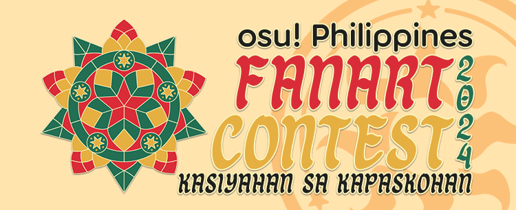

---
tags:
  - phfc
  - phfc 2024
---

# osu! Philippines Fanart Contest 2024 - "Kasiyahan sa Kapaskohan"

The **osu! Philippines Fanart Contest 2024 - "Kasiyahan sa Kapaskohan"** (***PHFC2024***) is a fanart contest for the Philippine osu! community. The contest features the four osu! Philippines mascots and is themed after the Christmas season.

## Schedule

| Event | Timestamp |
| --: | :-- |
| Submission period | 2024-10-12/2024-11-09 |
| Entry screening | 2024-11-09/2025-11-15 |
| Public voting | 2024-11-15/2024-11-29 |

## Prizes

The contest offers an initial prize pool of 2,500.00 PHP that is subject to increase via donations.

| Placing | Prize(s) |
| :-: | :-- |
|  | 50% of the prize pool, unique profile badge (*proposed*) |
|  | 35% of the prize pool |
|  | 15% of the prize pool |

## Organisation

The osu! Philippines Mascots Fanart Contest 2024 is run by the following staff:

| Position | Member(s) |
| :-- | :-- |
| Host | ::{ flag=NL }:: [Albionthegreat](https://osu.ppy.sh/users/9853595), ::{ flag=PH }:: [SurfChu85](https://osu.ppy.sh/users/4469895), ::{ flag=PH }:: [topecnz](https://osu.ppy.sh/users/2103927) |
| Contest moderator | ::{ flag=NL }:: [Albionthegreat](https://osu.ppy.sh/users/9853595), ::{ flag=CN }:: [Sakura006](https://osu.ppy.sh/users/10365024), ::{ flag=PH }::  [topecnz](https://osu.ppy.sh/users/2103927) |
| Developer | ::{ flag=PH }:: [-Ichinose](https://osu.ppy.sh/users/12635292), ::{ flag=PH }:: [topecnz](https://osu.ppy.sh/users/2103927) |
| Statistician | ::{ flag=NL }:: [Albionthegreat](https://osu.ppy.sh/users/9853595), ::{ flag=PH }:: [SurfChu85](https://osu.ppy.sh/users/4469895) |
| Wiki editor | ::{ flag=PH }:: [SurfChu85](https://osu.ppy.sh/users/4469895) |

## Links

- [Submission form](https://osuph-ce.topecnz.net/form/fanart/xmas24)
- [Discussion thread](https://osu.ppy.sh/community/forums/topics/1988918)
- [osu! Philippines Discord server](https://discord.gg/officialosuph)

## Rulesets

- By submitting your artwork to this contest, you give osu! Philppines the permission to use it for any promotional material for its activities, including (but not limited to) events, promotions, and the like. You will retain all of the rights to your work, and you will be permitted to sell or distribute it.
- Participants must have the Philippine flag on their profiles.
- All entries MUST follow the contest theme and contain AT LEAST two of osu! Philippines' community mascots, one of which must be Primrea. You may look at these links for your reference:
  - [Primrea, the osu! Philippines/`#filipino` mascot](https://up.topecnz.net/primrea_designv2.pdf)
  - [Primreadon, the osu!taiko PH mascot](https://up.topecnz.net/primreadon.pdf)
  - [Punica, the osu!catch PH mascot](https://twitter.com/iamnekocreates/status/1338499001147031555)
  - [Krysta, the osu!mania PH mascot](https://up.topecnz.net/maniaph_krysta_presskitv5.pdf)
- All entries MUST be suitable for viewing by all ages.
- Your submission must be your own original work. Redrawing and composite works are not allowed.
- You can only submit ONE entry. You may reupload your entry for adjustments as many times as you want, but once the submission deadline has passed, only your latest submission will be considered.
- Generative art programs or methods (like AI) are not permitted.
- Participants must keep a full file containing all of their entry's layers available. The staff will only ask you for this if they think it is needed to ascertain any claims regarding plagiarism or the use of generative art tools. If you do not/cannot provide this within a timely manner when asked, your entry will be disqualified.
- Artist attribution (names, social media handles, etc.) must be limited to no more than three lines total and be confined to any corner of the entry.
- Entries MUST meet the resolution requirements for social media banners, specifically those of Facebook and Discord. You may use [this template](img/template.png) as a reference.
  - The main subjects of your artwork must appear within the Facebook group page banner's dimensions.
  - *It is recommended that you submit your entries with as high of a resolution that you can provide. This is limited to a 4K resolution (3840x2160).*
- Please refrain from using characters from other intellectual properties, if possible. Official osu! mascots are fair game. If you are using other characters or OCs from other community members, please remember to treat them with respect.
