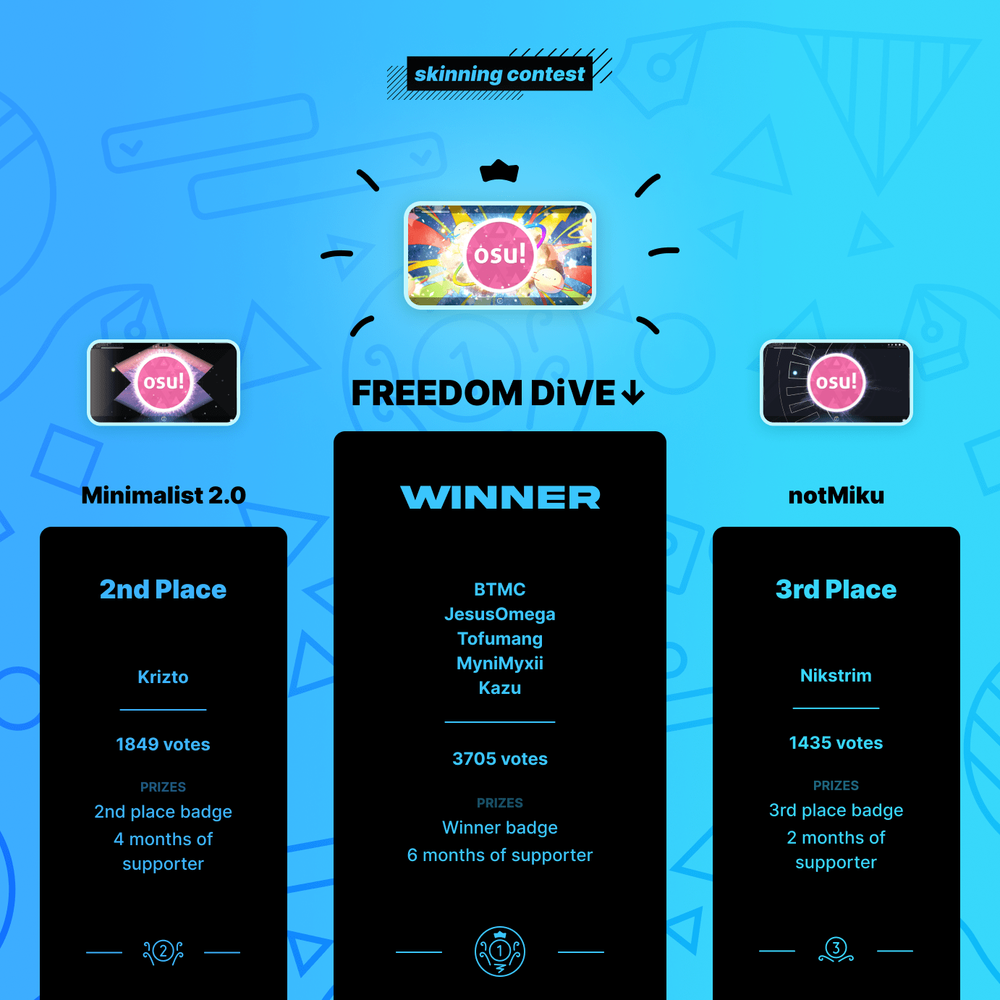

---
tags:
  - skinning
  - skinship
  - skins
---

# Skinning Contest #1

Le **Skinning Contest #1** était un concours de skinning ouvert à tous organisé par [skinship](https://skinship.xyz), une des plus grandes communautés de skinning d'osu!. C'était le premier concours de skinning officiel, et la première itération des Skinning Contests organisés par skinship.

## Planning du concours

| Evenement | Date |
| --: | :-- |
| Annonce | 08/03/2021 |
| Phase d'envoi | 08/03/2021 - 08/04/2021 |
| Phase de vote | 29/04/2021 - 13/05/2021 |
| Résultats | 27/05/2021 |

## Prix

| Position | Prix |
| :-: | :-- |
|  | 6 mois d'osu!supporter, un badge de profil unique |
|  | 4 mois d'osu!supporter, un badge de profil unique |
|  | 2 mois d'osu!supporter, un badge de profil unique |

  

## Organisation

Le Skinning Contest #1 a été tenu par plusieurs membres de la communauté.

| Membre | Rôle |
| :-- | :-- |
| ::{ flag=DE }:: [Master-TigerKun](https://osu.ppy.sh/users/10688456) | Planning du concours |
| ::{ flag=RO }:: [Matt2e2](https://osu.ppy.sh/users/12144912) | Planning du concours, design graphique |
| ::{ flag=NL }:: [Roan](https://osu.ppy.sh/users/8214639) | Planning du concours |
| ::{ flag=DE }:: [RockRoller](https://osu.ppy.sh/users/8388854) | Planning du concours, screening des entrées, préparation du showcase |
| ::{ flag=GB }:: [tetsui](https://osu.ppy.sh/users/10974678) | Planning du concours, préparation du showcase |
| ::{ flag=NL }:: [vvivi](https://osu.ppy.sh/users/10432755) | Planning du concours |
| ::{ flag=PL }:: [watterino](https://osu.ppy.sh/users/3512261) | Monteur vidéo, préparation du showcase |

## Liens

- **[Page du concours](https://osu.ppy.sh/community/contests/126)**
- [Article d'annonce](https://osu.ppy.sh/home/news/2021-03-08-skinning-contest-announcement)
- [Article des votes](https://osu.ppy.sh/home/news/2021-04-29-skinning-contest-voting-open)
- [Article des résultats](https://osu.ppy.sh/home/news/2021-05-27-skinning-contest-results)
- [Fil de discussion](https://osu.ppy.sh/community/forums/topics/1266342)
- [Post forum des entrées au concours](https://osu.ppy.sh/community/forums/topics/1266324)
- [Serveur Discord](https://discord.skinship.xyz)
- [Site officiel](https://skinship.xyz)

## Participants

| Skinner | Entrée |
| :-- | :-- |
| ::{ flag=SI }:: [\[ Foxxo \]](https://osu.ppy.sh/users/15183579) | [AI](https://osu.ppy.sh/community/forums/topics/1271982) |
| ::{ flag=DE }:: [5teven](https://osu.ppy.sh/users/8568397) | [5kin](https://osu.ppy.sh/community/forums/topics/1292897) |
| ::{ flag=ID }:: [ArchieA7](https://osu.ppy.sh/users/7087699) | [Simplified Dark](https://osu.ppy.sh/community/forums/topics/1270022) |
| ::{ flag=DE }:: [Aregularhuman](https://osu.ppy.sh/users/20727092) | [冷戦(Reisen)](https://osu.ppy.sh/community/forums/topics/1292152) |
| ::{ flag=AR }:: [Atreevete](https://osu.ppy.sh/users/2615199) | [Starcruiser](https://osu.ppy.sh/community/forums/topics/1289843) |
| ::{ flag=SA }:: [Beatzs](https://osu.ppy.sh/users/8095677) | [Beats's Own Negligible](https://osu.ppy.sh/community/forums/topics/1275236) |
| ::{ flag=PH }:: [BPChingu](https://osu.ppy.sh/users/4236855) | [FocusNeo: Focus to the Future](https://osu.ppy.sh/community/forums/topics/1291126) |
| ::{ flag=US }:: [BTMC](https://osu.ppy.sh/users/3171691) | [FREEDOM DiVE↓](https://osu.ppy.sh/community/forums/topics/1293207) |
| ::{ flag=FR }:: [Corne2Plum3](https://osu.ppy.sh/users/15646039) | [Night05](https://osu.ppy.sh/community/forums/topics/1292097) |
| ::{ flag=RU }:: [cyperdark](https://osu.ppy.sh/users/9893708) | [WhiteCat 2.1](https://osu.ppy.sh/community/forums/topics/1279815) |
| ::{ flag=NZ }:: [downy](https://osu.ppy.sh/users/4585661) | [New Zealand](https://osu.ppy.sh/community/forums/topics/1292880) |
| ::{ flag=PL }:: [h3oCharles](https://osu.ppy.sh/users/8712289) | [Untitled Red](https://osu.ppy.sh/community/forums/topics/1278791) |
| ::{ flag=PH }:: [Inflique](https://osu.ppy.sh/users/13865585) | [Ai Hayasaka non-weeb ver.](https://osu.ppy.sh/community/forums/topics/1293078) |
| ::{ flag=VE }:: [Kim Minnie](https://osu.ppy.sh/users/3858685) | [Elation](https://osu.ppy.sh/community/forums/topics/1293200) |
| ::{ flag=VN }:: [koomo](https://osu.ppy.sh/users/2168518) | [Loona](https://osu.ppy.sh/community/forums/topics/1285299) |
| ::{ flag=EE }:: [Krizto](https://osu.ppy.sh/users/13474556) | [Minimalist 2.0](https://osu.ppy.sh/community/forums/topics/1286223) |
| ::{ flag=CN }:: [McEndu](https://osu.ppy.sh/users/14059135) | [Rhombus](https://osu.ppy.sh/community/forums/topics/1288510) |
| ::{ flag=NL }:: [Mr HeliX](https://osu.ppy.sh/users/2330619) | [bingV](https://osu.ppy.sh/community/forums/topics/1293209) |
| ::{ flag=CA }:: [Nashboss100](https://osu.ppy.sh/users/15802424) | [The Nash Skin](https://osu.ppy.sh/community/forums/topics/1278022) |
| ::{ flag=ID }:: [Nikano](https://osu.ppy.sh/users/8196177) | [Neynda.](https://osu.ppy.sh/community/forums/topics/1291076) |
| ::{ flag=RU }:: [Nikstrim](https://osu.ppy.sh/users/10577559) | [notMiku](https://osu.ppy.sh/community/forums/topics/1292954) |
| ::{ flag=MX }:: [Nochito](https://osu.ppy.sh/users/15255804) | [Nochito Chocomint](https://osu.ppy.sh/community/forums/topics/1281445) |
| ::{ flag=TR }:: [NotConsistent](https://osu.ppy.sh/users/13845312) | [Space \[Universal Apocalypse\]](https://osu.ppy.sh/community/forums/topics/1267043) |
| ::{ flag=UA }:: [Pirasto](https://osu.ppy.sh/users/6766278) | [Prinz Heinrich](https://osu.ppy.sh/community/forums/topics/1292847) |
| ::{ flag=AU }:: [spiefie99](https://osu.ppy.sh/users/10934017) | [Glassmorphism](https://osu.ppy.sh/community/forums/topics/1269582) |
| ::{ flag=VE }:: [Suminoze](https://osu.ppy.sh/users/5308780) | [1stTry](https://osu.ppy.sh/community/forums/topics/1285565) |
| ::{ flag=PL }:: [tearek\_](https://osu.ppy.sh/users/20767121) | [Multicolor Diamond HUD](https://osu.ppy.sh/community/forums/topics/1272664) |
| ::{ flag=VN }:: [TKieen](https://osu.ppy.sh/users/12561202) | [Randoline](https://osu.ppy.sh/community/forums/topics/1291235) |
| ::{ flag=MX }:: [xet](https://osu.ppy.sh/users/16274977) | [Who Tao](https://osu.ppy.sh/community/forums/topics/1281532) |
| ::{ flag=PH }:: [Xyber Voltage](https://osu.ppy.sh/users/10443089) | [FreeMod is EZ](https://osu.ppy.sh/community/forums/topics/1269099) |
| ::{ flag=MX }:: [ZixkyST](https://osu.ppy.sh/users/11844975) | [ZixStar](https://osu.ppy.sh/community/forums/topics/1278132) |

## Podium

*Pour les résultats complets, se référer à la [page du concours](https://osu.ppy.sh/community/contests/126).*

## Règles

- Les entrées ne doivent pas contenir de contenu inaproprié, malveillant ou épileptique, et doivent suivre les [règles de la communauté d'osu!](/wiki/Rules).
- Tous les assets doivent être créés par vous-même, ou utilisés après demande et crédit de l'auteur. Cela inclut, mais ne se limite pas à :
  - polices
  - icônes
  - textures
  - œuvres (ex : œuvres d'animes)
  - sons
- La plupart des menus en jeu et au moins un mode de jeu doivent être skinnés. En d'autres termes, en plus des éléments de gameplay, les éléments suivants ne doivent pas être laissés par défaut :
  - Écran de résultats
  - Sélection de beatmap (pas forcément la sélection de mode)
  - Icônes des mods
  - Menus de pause et de fail
  - Le menu principal est optionnel, mais fortement recommandé
- Les entrées doivent être des nouvelles créations, seuls les skins postés durant la période d'envoi seront acceptés.
- Chaque entrée doit être accompagnée d'un post sur le forum pour participer au concours.
- Les entrées doivent être faites à temps, les retardataires ne seront pas acceptés.
