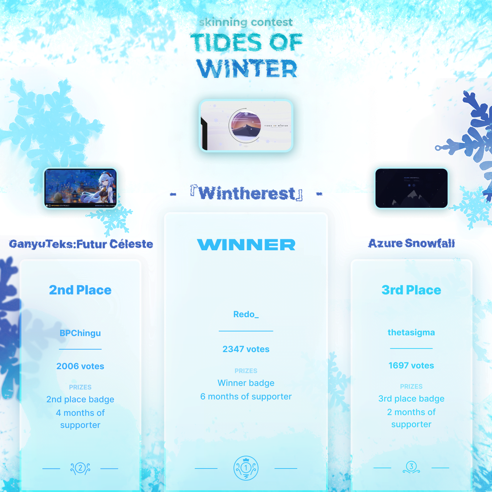

# Skinning Contest #2: Tides of Winter

Le **Skinning Contest #2: Tides of Winter** est un concours de skin osu! gratuit pour tous, organisé par [skinship](https://skinship.xyz), l'une des plus grandes communautés de skin sur osu!. C'est le deuxième concours de skin officiel d'osu!

## Calendrier du concours

| Événement | Horodatage |
| --: | :-- |
| Annonce | 02/12/2021 |
| Phase de soumission | 02/12/2021/09/01/2022 |
| Phase de vote | 16/01/2022/30/01/2022 |
| Résultats | 25/02/2022 |

## Prix

| Placement | Prix |
| :-: | :-- |
|  | 6 mois d'osu!supporter, badge de profil unique |
|  | 4 mois d'osu!supporter, badge de profil unique |
|  | 2 mois d'osu!supporter, badge de profil unique |

  

## Organisation

Le Skinning Contest #2 est organisé par différents membres de la communauté.

| Utilisateur | Responsabilité |
| :-- | :-- |
| ::{ flag=DE }:: [Master-TigerKun](https://osu.ppy.sh/users/10688456) | Planification du concours, conception graphique |
| ::{ flag=RO }:: [Matt2e2](https://osu.ppy.sh/users/12144912) | Planification du concours |
| ::{ flag=NL }:: [Roan](https://osu.ppy.sh/users/8214639) | Planification du concours, développement d'outils internes |
| ::{ flag=DE }:: [RockRoller](https://osu.ppy.sh/users/8388854) | Planification du concours, examen des soumissions |
| ::{ flag=GB }:: [tetsui](https://osu.ppy.sh/users/10974678) | Planification du concours |
| ::{ flag=NL }:: [vvivi](https://osu.ppy.sh/users/10432755) | Planification du concours |
| ::{ flag=PL }:: [watterino](https://osu.ppy.sh/users/3512261) | Éditeur vidéo |
| ::{ flag=TR }:: [Zeus-](https://osu.ppy.sh/users/5464437) | Planification du concours, rédacteur de news |

## Liens

- **[Page du concours](https://osu.ppy.sh/community/contests/137)**
- [Annonce de l'article de news](https://osu.ppy.sh/home/news/2021-12-02-skinning-contest-tides-of-winter-announcement)
- [Vote ouvert article de news](https://osu.ppy.sh/home/news/2022-01-16-skinning-contest-tides-of-winter-voting-open)
- [Résultats article de news](https://osu.ppy.sh/home/news/2022-02-25-skinning-contest-tides-of-winter-results)
- [Post de discussion](https://osu.ppy.sh/community/forums/topics/1472845)
- [Post de soumission](https://osu.ppy.sh/community/forums/topics/1472846)
- [Serveur Discord](https://discord.skinship.xyz)
- [Site officiel](https://skinship.xyz)

## Participants

| Skinner | Entrée |
| :-- | :-- |
| ::{ flag=PL }:: [Redo_](https://osu.ppy.sh/users/7122165) | [- 『Wintherest』 -](https://osu.ppy.sh/community/forums/topics/1498493) |
| ::{ flag=VN }:: [TKieen](https://osu.ppy.sh/users/12561202) | [105°C Chocolate](https://osu.ppy.sh/community/forums/topics/1496067) |
| ::{ flag=BY }:: [thetasigma](https://osu.ppy.sh/users/6234482) | [Azure Snowfall](https://osu.ppy.sh/community/forums/topics/1498492) |
| ::{ flag=VN }:: [koomo](https://osu.ppy.sh/users/2168518) | [CACTUS'](https://osu.ppy.sh/community/forums/topics/1481190) |
| ::{ flag=PH }:: [BPChingu](https://osu.ppy.sh/users/4236855) | [GanyuTeks:Futur Céleste](https://osu.ppy.sh/community/forums/topics/1489926) |
| ::{ flag=FR }:: [Ootsu](https://osu.ppy.sh/users/9634575) | [HotChocolate](https://osu.ppy.sh/community/forums/topics/1484895) |
| ::{ flag=PH }:: [Inflique](https://osu.ppy.sh/users/13865585) | [Inflique's Snow Machine](https://osu.ppy.sh/community/forums/topics/1498697) |
| ::{ flag=ID }:: [ArchieA7](https://osu.ppy.sh/users/7087699) | [Musim Dingin](https://osu.ppy.sh/community/forums/topics/1480386) |
| ::{ flag=BR }:: [JoSanInk](https://osu.ppy.sh/users/10848682) | [N-ice](https://osu.ppy.sh/community/forums/topics/1497539) |
| ::{ flag=JP }:: [too](https://osu.ppy.sh/users/12196931) | [Shirokuma シロクマ](https://osu.ppy.sh/community/forums/topics/1476743) |
| ::{ flag=ID }:: [Akshiro](https://osu.ppy.sh/users/10557490) | [Snow](https://osu.ppy.sh/community/forums/topics/1494794) |
| ::{ flag=FR }:: [Corne2Plum3](https://osu.ppy.sh/users/15646039) | [Snowy Circles](https://osu.ppy.sh/community/forums/topics/1498442) |
| ::{ flag=ID }:: [nayuu](https://osu.ppy.sh/users/12561379) | [snowyy](https://osu.ppy.sh/community/forums/topics/1498720) |
| ::{ flag=MX }:: [ZiskyST](https://osu.ppy.sh/users/11844975) | [The Lost Winter](https://osu.ppy.sh/community/forums/topics/1494537) |
| ::{ flag=US }:: [Icysandwich](https://osu.ppy.sh/users/10961544) | [Tides of osu!](https://osu.ppy.sh/community/forums/topics/1498620) |
| ::{ flag=CA }:: [RUDEKA](https://osu.ppy.sh/users/13015586) | [TOWN](https://osu.ppy.sh/community/forums/topics/1484572) |
| ::{ flag=MY }:: [HIDOKOMORI123](https://osu.ppy.sh/users/14216890) | [WINTERMACHI](https://osu.ppy.sh/community/forums/topics/1491283) |

## Podium

*Pour les résultats complets, voir la [page du concours](https://osu.ppy.sh/community/contests/137).*

## Règlement

- Les soumissions ne doivent pas contenir de contenu inapproprié, malveillant ou épileptique, et doivent respecter les [règles de la communauté d'osu!](/wiki/Rules).
- Tous les éléments doivent être créés par vous-même ou utilisés avec l'autorisation et la mention des auteurs. Cela inclut, mais n'est pas limité à :
  - polices de caractères
  - icônes
  - textures
  - les œuvres d'art (par exemple, les images d'archives ou les œuvres d'art animées)
  - sons
- La majorité de l'interface du menu du jeu et au moins deux modes de jeu doivent être skinnées. En d'autres termes, en plus des éléments de jeu, les segments suivants ne doivent pas être laissés par défaut :
  - Panel de classement
  - Sélection des musiques
  - Sélection du mode
  - Icônes des mods
  - Menu Pause et échec
  - Le menu principal est facultatif, mais fortement encouragé
- Les soumissions doivent être de nouvelles créations, seuls les skins postés pendant la période de soumission seront acceptés.
- Chaque soumission doit être accompagnée d'un post de discussion sur le forum afin de participer au concours.
- Les soumissions doivent être faites à temps. Les retardataires ne seront pas acceptés.
- Les candidatures doivent être créées individuellement. Les équipes/collaborations ne sont pas autorisées.
- Les contributions doivent être en accord avec le thème donné : "Tides of Winter".
- La taille du fichier de votre soumission .osk doit être inférieure à 100 Mo.
- Veuillez soumettre une image 16:9 représentant votre skin, car elle sera utilisée comme couverture sur la page du concours.
