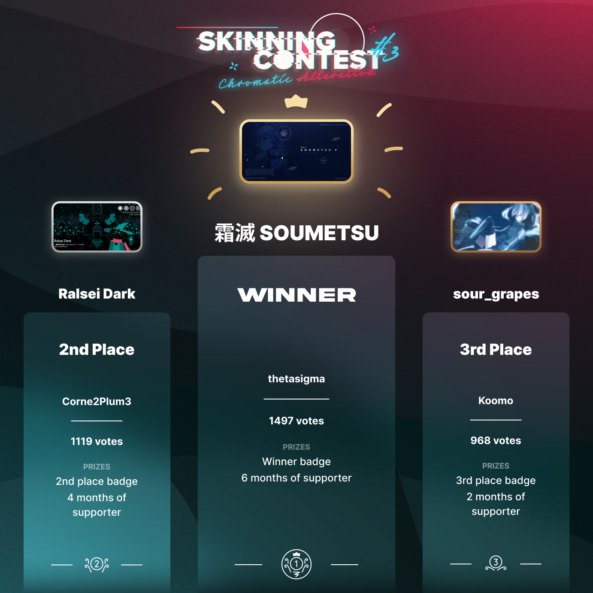
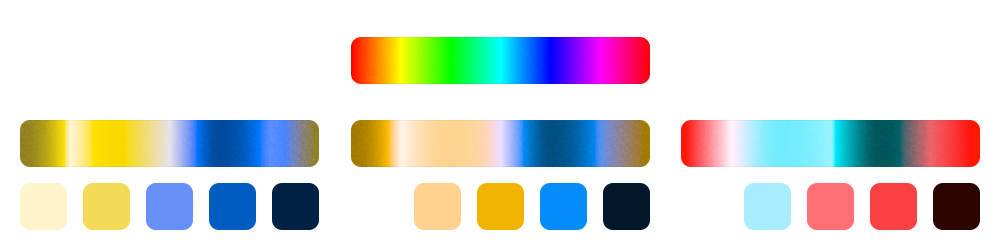

---
tags:
  - skinning
  - skinship
  - skins
---

# Skinning Contest #3: Chromatic Alteration

The **Skinning Contest #3: Chromatic Alteration** is a free-for-all osu! skinning contest hosted by [skinship](https://skinship.xyz), one of the largest skinning communities on osu!. It is the third official osu! skinning contest.

## Contest schedule

| Event | Timestamp |
| --: | :-- |
| Announcement | 2022-07-18 |
| Submission phase | 2022-07-18/2022-08-22 |
| Voting phase | 2022-09-08/2022-09-22 |
| Results | 2022-10-20 |

## Prizes

| Placing | Prize(s) |
| :-: | :-- |
|  | 6 months of osu!supporter, unique profile badge |
|  | 4 months of osu!supporter, unique profile badge |
|  | 2 months of osu!supporter, unique profile badge |

  

## Organisation

The Skinning Contest #3 is run by various community members.

| User | Responsibility |
| :-- | :-- |
| ::{ flag=DE }:: ::Master-TigerKun::{ user-id=10688456 } | Contest planning |
| ::{ flag=RO }:: ::Matt2e2::{ user-id=12144912 } | Contest planning |
| ::{ flag=NL }:: ::Roan::{ user-id=8214639 } | Contest planning, internal tool development |
| ::{ flag=DE }:: ::RockRoller::{ user-id=8388854 } | Contest planning, submission screening |
| ::{ flag=PL }:: ::Redo\1::{ user-id=7122165 } | Contest planning, graphic design |
| ::{ flag=GB }:: ::tetsui::{ user-id=10974678 } | Contest planning |
| ::{ flag=NL }:: ::vvivi::{ user-id=10432755 } | Contest planning |
| ::{ flag=PL }:: ::watterino::{ user-id=3512261 } | Video editor |
| ::{ flag=TR }:: ::Zeus-::{ user-id=5464437 } | Contest planning, newspost writer |

## Links

- **[Contest Page](https://osu.ppy.sh/community/contests/148)**
- [Announcement newspost](https://osu.ppy.sh/home/news/2022-07-18-skinning-contest-chromatic-alteration-announcement)
- [Voting newspost](https://osu.ppy.sh/home/news/2022-09-08-skinning-contest-chromatic-alteration-voting-open)
- [Results Out newspost](https://osu.ppy.sh/home/news/2022-10-20-skinning-contest-chromatic-alteration-results)
- [Discussion Thread](https://osu.ppy.sh/community/forums/topics/1612258)
- [Submission Thread](https://osu.ppy.sh/community/forums/topics/1612259)
- [Discord server](https://discord.skinship.xyz)
- [Official website](https://skinship.xyz)

## Participants

| Skinner | Entry |
| :-- | :-- |
| ::{ flag=ID }:: ::My Angel Fu Hua::{ user-id=18065446 } | [- Spektrum](https://osu.ppy.sh/community/forums/topics/1617742) |
| ::{ flag=RU }:: ::Shikima on osu::{ user-id=10793341 } | [Hortus](https://osu.ppy.sh/community/forums/topics/1621380) |
| ::{ flag=FR }:: ::EverestTiger::{ user-id=14972711 } | [GMK Blue Samurai](https://osu.ppy.sh/community/forums/topics/1625024) |
| ::{ flag=MX }:: ::NekoLoveFan::{ user-id=15581205 } | [Night_blue](https://osu.ppy.sh/community/forums/topics/1626271) |
| ::{ flag=TR }:: ::BatuhanYtho::{ user-id=12091015 } | [UmbraBlue Interface](https://osu.ppy.sh/community/forums/topics/1627623) |
| ::{ flag=CA }:: ::RUDEKA::{ user-id=13015586 } | [DknsK](https://osu.ppy.sh/community/forums/topics/1627924) |
| ::{ flag=ID }:: ::ArchieA7::{ user-id=7087699 } | [DeutanNami](https://osu.ppy.sh/community/forums/topics/1628183) |
| ::{ flag=US }:: ::Spoo::{ user-id=11805037 } | [- Crystalized -](https://osu.ppy.sh/community/forums/topics/1628271) |
| ::{ flag=BY }:: ::thetasigma::{ user-id=6234482 } | [霜滅 SOUMETSU](https://osu.ppy.sh/community/forums/topics/1628514) |
| ::{ flag=FR }:: ::Corne2Plum3::{ user-id=15646039 } | [Ralsei Dark](https://osu.ppy.sh/community/forums/topics/1629393) |
| ::{ flag=MX }:: ::ZixkyST::{ user-id=11844975 } | [RestriXion](https://osu.ppy.sh/community/forums/topics/1629589) |
| ::{ flag=ID }:: ::mousewing::{ user-id=10837448 } | [- Yupi Colorful -](https://osu.ppy.sh/community/forums/topics/1630720) |
| ::{ flag=US }:: ::Cieu::{ user-id=2837685 } | [minionalist.](https://osu.ppy.sh/community/forums/topics/1631007) |
| ::{ flag=US }:: ::-TunaSliders-::{ user-id=15420104 } | [+=NE0SYNTH=+](https://osu.ppy.sh/community/forums/topics/1631101) |
| ::{ flag=VN }:: ::koomo::{ user-id=2168518 } | [sour_grapes](https://osu.ppy.sh/community/forums/topics/1626950) |
| ::{ flag=GR }:: ::K-Riolf::{ user-id=30645221 } | [GΩLDEN OCΞΛN](https://osu.ppy.sh/community/forums/topics/1631636) |
| ::{ flag=PH }:: ::Creameries::{ user-id=15851364 } | [Lazuline Lutescent](https://osu.ppy.sh/community/forums/topics/1632482) |
| ::{ flag=VN }:: ::Tkieen::{ user-id=12561202 } | [Sakuropia](https://osu.ppy.sh/community/forums/topics/1632497) |
| ::{ flag=VN }:: ::Ben\15917::{ user-id=6026593 } | [sH/FT](https://osu.ppy.sh/community/forums/topics/1633136) |
| ::{ flag=DE }:: ::SiriusOnly::{ user-id=22287370 } | [SHINOBI](https://osu.ppy.sh/community/forums/topics/1633153) |
| ::{ flag=CA }:: ::WD\1ALT::{ user-id=21559352 } | [Iced Tea](https://osu.ppy.sh/community/forums/topics/1633310) |
| ::{ flag=US }:: ::Syvatzia::{ user-id=19082107 } | [Desert Tempest](https://osu.ppy.sh/community/forums/topics/1633645) |
| ::{ flag=US }:: ::Chromasia::{ user-id=7306251 } | [Auburn and Azure](https://osu.ppy.sh/community/forums/topics/1633624) |

## Podium

*For the full results, see the [contest page](https://osu.ppy.sh/community/contests/148).*

## Ruleset

- Submissions must not contain inappropriate, malicious, or epileptic content, and should adhere to the [osu! community rules](/wiki/Rules).
- All assets need to be created by yourself, or used with permission and proper credit to the authors. This includes, but is not limited to:
  - fonts
  - icons
  - textures
  - artworks (e.g. stock images or anime artwork)
  - sounds
- The majority of the in-game menu interface and at least two game modes have to be skinned. In other words, in addition to the gameplay elements, the following segments should not be left default:
  - Ranking Panel
  - Song Selection
  - Mode Selection
  - Mod Icons
  - Pause and Fail Menu
  - Main Menu is optional, but highly encouraged
- Submissions must be new creations, only skins posted within the submission period will be accepted.
- Each submission must be accompanied by a forum thread in order to participate in the contest.
- Submissions must be made in time. Latecomers will not be accepted.
- Submissions must not be created as a part of, or be involved in a paid commission of any sort.
- Submissions must be created individually. Teams/collaborations are not allowed.
- Submissions must be in line with the given challenge: ["Chromatic Alteration"](#challenge).
- The file size for your .osk submission must be below 100 MB.
- Please submit a 16:9 image representing your skin, since this will be used as a cover on the contest page. This image must be at least 1280x720.

## Challenge: Chromatic Alteration {id=challenge}

**The colour palettes of all skin submissions must be limited to the visible spectrum of the following types of colour vision deficiencies**:

- **Protanopia**
- **Deuteranopia**
- **Tritanopia**

Bear in mind that your skin must feature **only one** of these colour spectra. Additionally, while shades of grey are contained in these palettes, your skin must not be primarily grayscale.

Shown above are the spectra and example colour palettes for the three colour vision deficiencies mentioned prior in relation to normal colour vision. These spectra are based on normal colour vision at full saturation and brightness.
