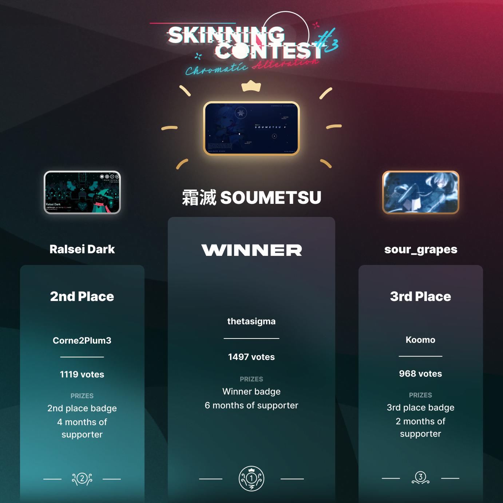

# Skinning Contest #3: Chromatic Alteration

Le **Skinning Contest #3: Chromatic Alteration** est un concours de skinning osu! gratuit pour tous, organisé par [skinship](https://skinship.xyz), l'une des plus grandes communautés de skinning sur osu!. C'est le troisième concours officiel de skinning d'osu!

## Calendrier du concours

| Événement | Horodatage |
| --: | :-- |
| Annonce | 18/07/2022 |
| Phase de soumission | 18/07/2022/22/08/2022 |
| Phase de vote | 08/09/2022/22/09/2022 |
| Résultats | 20/10/2022 |

## Prix

| Placement | Prix |
| :-: | :-- |
|  | 6 mois d'osu!supporter, badge de profil unique |
|  | 4 mois d'osu!supporter, badge de profil unique |
|  | 2 mois d'osu!supporter, badge de profil unique |

  

## Organisation

Le Skinning Contest #3 est organisé par différents membres de la communauté.

| Utilisateur | Responsabilité |
| :-- | :-- |
| ::{ flag=DE }:: [Master-TigerKun](https://osu.ppy.sh/users/10688456) | Planification du concours |
| ::{ flag=RO }:: [Matt2e2](https://osu.ppy.sh/users/12144912) | Planification du concours |
| ::{ flag=NL }:: [Roan](https://osu.ppy.sh/users/8214639) | Planification du concours, développement d'outils internes |
| ::{ flag=DE }:: [RockRoller](https://osu.ppy.sh/users/8388854) | Planification du concours, examen des soumissions |
| ::{ flag=PL }:: [Redo_](https://osu.ppy.sh/users/7122165) | Planification du concours, conception graphique |
| ::{ flag=GB }:: [tetsui](https://osu.ppy.sh/users/10974678) | Planification du concours |
| ::{ flag=NL }:: [vvivi](https://osu.ppy.sh/users/10432755) | Planification du concours |
| ::{ flag=PL }:: [watterino](https://osu.ppy.sh/users/3512261) | Éditeur vidéo |
| ::{ flag=TR }:: [Zeus-](https://osu.ppy.sh/users/5464437) | Planification du concours, rédacteur de news |

## Liens

- **[Page du concours](https://osu.ppy.sh/community/contests/148)**
- [Annonce de l'article de news](https://osu.ppy.sh/home/news/2022-07-18-skinning-contest-chromatic-alteration-announcement)
- [Phase de vote post de news](https://osu.ppy.sh/home/news/2022-09-08-skinning-contest-chromatic-alteration-voting-open)
- [Résultats post de news](https://osu.ppy.sh/home/news/2022-10-20-skinning-contest-chromatic-alteration-results)
- [Post de discussion](https://osu.ppy.sh/community/forums/topics/1612258)
- [Post de soumission](https://osu.ppy.sh/community/forums/topics/1612259)
- [Serveur Discord](https://discord.skinship.xyz)
- [Site officiel](https://skinship.xyz)

## Participants

| Skinner | Entrée |
| :-- | :-- |
| ::{ flag=ID }:: [My Angel Fu Hua](https://osu.ppy.sh/users/18065446) | [- Spektrum](https://osu.ppy.sh/community/forums/topics/1617742) |
| ::{ flag=RU }:: [Shikima on osu](https://osu.ppy.sh/users/10793341) | [Hortus](https://osu.ppy.sh/community/forums/topics/1621380) |
| ::{ flag=FR }:: [EverestTiger](https://osu.ppy.sh/users/14972711) | [GMK Blue Samurai](https://osu.ppy.sh/community/forums/topics/1625024) |
| ::{ flag=MX }:: [NekoLoveFan](https://osu.ppy.sh/users/15581205) | [Night_blue](https://osu.ppy.sh/community/forums/topics/1626271) |
| ::{ flag=TR }:: [BatuhanYtho](https://osu.ppy.sh/users/12091015) | [UmbraBlue Interface](https://osu.ppy.sh/community/forums/topics/1627623) |
| ::{ flag=CA }:: [RUDEKA](https://osu.ppy.sh/users/13015586) | [DknsK](https://osu.ppy.sh/community/forums/topics/1627924) |
| ::{ flag=ID }:: [ArchieA7](https://osu.ppy.sh/users/7087699) | [DeutanNami](https://osu.ppy.sh/community/forums/topics/1628183) |
| ::{ flag=US }:: [Spoo](https://osu.ppy.sh/users/11805037) | [- Crystalized -](https://osu.ppy.sh/community/forums/topics/1628271) |
| ::{ flag=BY }:: [thetasigma](https://osu.ppy.sh/users/6234482) | [霜滅 SOUMETSU](https://osu.ppy.sh/community/forums/topics/1628514) |
| ::{ flag=FR }:: [Corne2Plum3](https://osu.ppy.sh/users/15646039) | [Ralsei Dark](https://osu.ppy.sh/community/forums/topics/1629393) |
| ::{ flag=MX }:: [ZixkyST](https://osu.ppy.sh/users/11844975) | [RestriXion](https://osu.ppy.sh/community/forums/topics/1629589) |
| ::{ flag=ID }:: [mousewing](https://osu.ppy.sh/users/10837448) | [- Yupi Colorful -](https://osu.ppy.sh/community/forums/topics/1630720) |
| ::{ flag=US }:: [Cieu](https://osu.ppy.sh/users/2837685) | [minionalist.](https://osu.ppy.sh/community/forums/topics/1631007) |
| ::{ flag=US }:: [-TunaSliders-](https://osu.ppy.sh/users/15420104) | [+=NE0SYNTH=+](https://osu.ppy.sh/community/forums/topics/1631101) |
| ::{ flag=VN }:: [koomo](https://osu.ppy.sh/users/2168518) | [sour_grapes](https://osu.ppy.sh/community/forums/topics/1626950) |
| ::{ flag=GR }:: [K-Riolf](https://osu.ppy.sh/users/30645221) | [GΩLDEN OCΞΛN](https://osu.ppy.sh/community/forums/topics/1631636) |
| ::{ flag=PH }:: [Creameries](https://osu.ppy.sh/users/15851364) | [Lazuline Lutescent](https://osu.ppy.sh/community/forums/topics/1632482) |
| ::{ flag=VN }:: [Tkieen](https://osu.ppy.sh/users/12561202) | [Sakuropia](https://osu.ppy.sh/community/forums/topics/1632497) |
| ::{ flag=VN }:: [Ben_5917](https://osu.ppy.sh/users/6026593) | [sH/FT](https://osu.ppy.sh/community/forums/topics/1633136) |
| ::{ flag=DE }:: [SiriusOnly](https://osu.ppy.sh/users/22287370) | [SHINOBI](https://osu.ppy.sh/community/forums/topics/1633153) |
| ::{ flag=CA }:: [WD_ALT](https://osu.ppy.sh/users/21559352) | [Iced Tea](https://osu.ppy.sh/community/forums/topics/1633310) |
| ::{ flag=US }:: [Syvatzia](https://osu.ppy.sh/users/19082107) | [Desert Tempest](https://osu.ppy.sh/community/forums/topics/1633645) |
| ::{ flag=US }:: [Chromasia](https://osu.ppy.sh/users/7306251) | [Auburn and Azure](https://osu.ppy.sh/community/forums/topics/1633624) |

## Podium

*Pour les résultats complets, voir la [page du concours](https://osu.ppy.sh/community/contests/148).*

## Règlement

- Les soumissions ne doivent pas contenir de contenu inapproprié, malveillant ou épileptique, et doivent respecter les [règles de la communauté d'osu!](/wiki/Rules).
- Tous les éléments doivent être créés par vous-même ou utilisés avec l'autorisation et la mention des auteurs. Cela inclut, mais n'est pas limité à :
  - polices de caractères
  - icônes
  - textures
  - les œuvres d'art (par exemple, les images d'archives ou les œuvres d'art animées)
  - sons
- La majorité de l'interface du menu du jeu et au moins deux modes de jeu doivent être skinnées. En d'autres termes, en plus des éléments de jeu, les segments suivants ne doivent pas être laissés par défaut :
  - Panel de classement
  - Sélection des musiques
  - Sélection du mode
  - Icônes des mods
  - Menu Pause et échec
  - Le menu principal est facultatif, mais fortement encouragé
- Les soumissions doivent être de nouvelles créations, seuls les skins postés pendant la période de soumission seront acceptés.
- Chaque soumission doit être accompagnée d'un post de discussion sur le forum afin de participer au concours.
- Les soumissions doivent être faites à temps. Les retardataires ne seront pas acceptés.
- Les candidatures ne doivent pas être créées dans le cadre d'une commission rémunérée de quelque nature que ce soit, ni être impliquées dans une telle commission.
- Les candidatures doivent être créées individuellement. Les équipes/collaborations ne sont pas autorisées.
- Les soumissions doivent être conformes au défi donné : ["Chromatic Alteration"](#challenge).
- La taille du fichier de votre soumission .osk doit être inférieure à 100 Mo.
- Veuillez soumettre une image 16:9 représentant votre skin, car elle sera utilisée comme couverture sur la page du concours. Cette image doit avoir une taille minimale de 1280x720.

## Challenge: Chromatic Alteration {id=challenge}

**Les palettes de couleurs de toutes les soumissions de skin doivent être limitées au spectre visible des types suivants de déficiences de la vision des couleurs**:

- **Protanopie**
- **Deutéranopie**
- **Tritanopia**

Gardez à l'esprit que votre skin doit présenter **un seul** de ces spectres de couleurs. En outre, bien que ces palettes contiennent des nuances de gris, votre skin ne doit pas être principalement en niveaux de gris.

On trouvera ci-dessus les spectres et les exemples de palettes de couleurs pour les trois déficiences de la vision des couleurs mentionnées précédemment par rapport à la vision des couleurs normale. Ces spectres sont basés sur une vision normale des couleurs à saturation et luminosité maximales.
