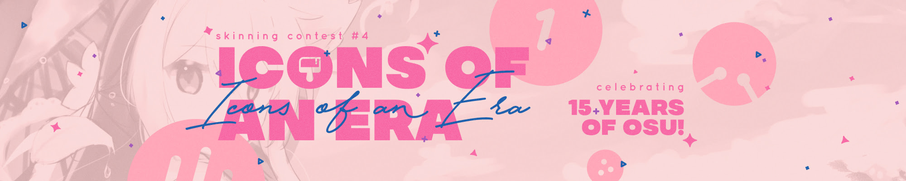

---
tags:
  - skinning
  - skinship
  - skins
---

# Skinning Contest #4: Icons of an Era

The **Skinning Contest #4: Icons of an Era** is a free-for-all osu! skinning contest hosted by [skinship](https://skinship.xyz), one of the largest skinning communities on osu!. It is the fourth official osu! skinning contest.

The above banner features [Kleinne Lui's](https://osu.ppy.sh/users/27725651) entry for the [Journey into a Beatmap World](https://osu.ppy.sh/community/contests/175) art contest.

## Contest schedule

| Event | Timestamp |
| --: | :-- |
| Announcement | 2023-05-10 |
| Submission phase | 2023-05-10/2023-07-14 |
| Voting phase | 2023-07-21/2023-08-04 |
| Results | 2023-08-10 |

## Prizes

| Placing | Prize(s) |
| :-: | :-- |
|  | 6 months of osu!supporter, unique profile badge |
|  | 4 months of osu!supporter, unique profile badge |
|  | 2 months of osu!supporter, unique profile badge |

  

## Organisation

The Skinning Contest #4 is run by various community members.

| User | Responsibility |
| :-- | :-- |
| ::{ flag=RS }:: [0x84f](https://osu.ppy.sh/users/7944724) | News post writing |
| ::{ flag=DE }:: [Master-TigerKun](https://osu.ppy.sh/users/10688456) | Contest planning |
| ::{ flag=RO }:: [Matt2e2](https://osu.ppy.sh/users/12144912) | Contest planning |
| ::{ flag=NL }:: [Roan](https://osu.ppy.sh/users/8214639) | Contest planning, internal tool development |
| ::{ flag=DE }:: [RockRoller](https://osu.ppy.sh/users/8388854) | Contest planning, submission screening |
| ::{ flag=GB }:: [tetsui](https://osu.ppy.sh/users/10974678) | Contest planning |
| ::{ flag=NL }:: [vvivi](https://osu.ppy.sh/users/10432755) | Contest planning |
| ::{ flag=PL }:: [watterino](https://osu.ppy.sh/users/3512261) | Video editing |
| ::{ flag=TR }:: [Zeus-](https://osu.ppy.sh/users/5464437) | Contest planning |

## Links

- **[Contest page](https://osu.ppy.sh/community/contests/178)**
- [Announcement news post](https://osu.ppy.sh/home/news/2023-05-10-skinning-contest-icons-of-an-era)
- [Voting news post](https://osu.ppy.sh/home/news/2023-07-21-skinning-contest-icons-of-an-era-voting)
- [Results news post](https://osu.ppy.sh/home/news/2023-08-10-skinning-contest-icons-of-an-era-results)
- [Discussion thread](https://osu.ppy.sh/community/forums/topics/1762288)
- [Submission thread](https://osu.ppy.sh/community/forums/topics/1762287)
- [Discord server](https://discord.skinship.xyz)
- [Website](https://skinship.xyz)

## Participants

| Skinner | Entry |
| :-- | :-- |
| ::{ flag=US }:: [Spoo](https://osu.ppy.sh/users/11805037) | [FOOL MOON NIGHT](https://osu.ppy.sh/community/forums/topics/1775136) |
| ::{ flag=PE }:: [Meowscarada](https://osu.ppy.sh/users/25025133) | [Decaplets](https://osu.ppy.sh/community/forums/topics/1775463) |
| ::{ flag=AU }:: [Saow](https://osu.ppy.sh/users/9782756) | [KEMOMINI EDM SQUAD](https://osu.ppy.sh/community/forums/topics/1791845) |
| ::{ flag=ID }:: [ArchieA7](https://osu.ppy.sh/users/7087699) | [Chirou](https://osu.ppy.sh/community/forums/topics/1792370) |
| ::{ flag=US }:: [Chromasia](https://osu.ppy.sh/users/7306251) | [Everlasting Moment](https://osu.ppy.sh/community/forums/topics/1792308) |
| ::{ flag=VN }:: [koomo](https://osu.ppy.sh/users/2168518) | [Granat (GRIS II)](https://osu.ppy.sh/community/forums/topics/1792512) |
| ::{ flag=VN }:: [Ben_5917](https://osu.ppy.sh/users/6026593) | [Kuro](https://osu.ppy.sh/community/forums/topics/1792854) |
| ::{ flag=MX }:: [XetThe](https://osu.ppy.sh/users/16274977) | [Artifact](https://osu.ppy.sh/community/forums/topics/1792809) |
| ::{ flag=US }:: [[LS]Glaxes](https://osu.ppy.sh/users/14444595) | [Rockefeller](https://osu.ppy.sh/community/forums/topics/1792911) |
| ::{ flag=BY }:: [thetasigma](https://osu.ppy.sh/users/6234482) | [QUAVER: DIVIDE BY 8](https://osu.ppy.sh/community/forums/topics/1792739) |
| ::{ flag=GB }:: [chromb](https://osu.ppy.sh/users/10238680) | [Taikonator](https://osu.ppy.sh/community/forums/topics/1792655) |
| ::{ flag=RU }:: [TogiraW](https://osu.ppy.sh/users/20149300) | [Verflucht](https://osu.ppy.sh/community/forums/topics/1792572) |
| ::{ flag=TR }:: [BatuhanYtho](https://osu.ppy.sh/users/12091015) | [Night of Knights](https://osu.ppy.sh/community/forums/topics/1792553) |
| ::{ flag=US }:: [Syvatzia](https://osu.ppy.sh/users/19082107) | [We Kicked a Kid (United)](https://osu.ppy.sh/community/forums/topics/1792954) |
| ::{ flag=PE }:: [- Koshiin -](https://osu.ppy.sh/users/19135423) | [Bring it on!!](https://osu.ppy.sh/community/forums/topics/1792821) |
| ::{ flag=PL }:: [Redo_](https://osu.ppy.sh/users/7122165) | [Ghost Rule](https://osu.ppy.sh/community/forums/topics/1792933) |

## Podium

*For the full results, see the [contest page](https://osu.ppy.sh/community/contests/178).*

## Ruleset

- Submissions must not contain inappropriate, malicious, or epileptic content, and should adhere to the [osu! community rules](/wiki/Rules).
- All assets need to be created by yourself, or used with permission and proper credit to the authors. This includes, but is not limited to:
  - fonts
  - icons
  - textures
  - artworks (e.g. stock images or anime artwork)
  - sounds
- The majority of the in-game menu interface and at least two game modes have to be skinned. In other words, in addition to the gameplay elements, the following segments should not be left default:
  - ranking panel
  - song selection
  - mode selection
  - mod icons
  - pause and fail menu
  - main menu (optional, but highly encouraged)
- Submissions must be new creations — only skins posted within the submission period will be accepted.
- Each submission must be accompanied by a forum thread in order to participate in the contest.
- Submissions must be made in time. Latecomers will not be accepted.
- Submissions must not be created as a part of, or be involved in a paid commission of any sort.
- Submissions must be created individually. Teams/collaborations are not allowed.
- Submissions must be in line with the given theme: "Icons of an Era".
- The file size for your `.osk` submission must be below 100 MB.
- Please submit a 16:9 image representing your skin, since this will be used as a cover on the contest page. This image must be at least 1280x720.

**Failure to comply with the contest rules may lead to disqualification, or, in severe cases, exclusion from future contests.**

## Theme: Icons of an Era {id=theme}

This iteration's theme, **Icons of an Era**, aims to spark the community's imagination by creating art around various iconic osu! beatmaps that were crafted and risen to glory throughout osu!'s lifetime, as well as the many either retired, official or community-made osu! mascots that have been introduced over the course of the past 15 years.

Each entry should have a prominent theme where the inspiration behind it is immediately recognisable, such as:

- skin centred around a beatmap background
- skin centred around a group of beatmap backgrounds
- skin focused around a specific mascot or group of mascots
- any combination of the above (e.g. pippi singing into the microphone from [The Big Black](https://osu.ppy.sh/beatmapsets/41823#osu/131891))
