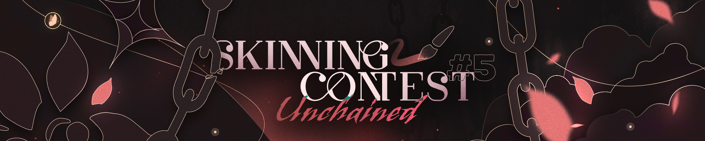

---
tags:
  - skinning
  - skinship
  - skins
---

# Skinning Contest #5: Unchained

The **Skinning Contest #5: Unchained** is a free-for-all osu! skinning contest hosted by [skinship](https://skinship.xyz), one of the largest skinning communities on osu!. It is the fifth official osu! skinning contest.

## Contest schedule

| Event | Timestamp |
| --: | :-- |
| Announcement | 2024-04-09 |
| Submission phase | 2024-04-09/2024-05-24 |
| Voting phase | 2024-06-23/2024-07-07 |
| Results | 2024-07-17 |

## Prizes

| Placing | Prize(s) |
| :-: | :-- |
|  | 6 months of osu!supporter, unique profile badge |
|  | 4 months of osu!supporter, unique profile badge |
|  | 2 months of osu!supporter, unique profile badge |

## Organisation

The Skinning Contest #4 is run by various community members.

| User | Responsibility |
| :-- | :-- |
| ::{ flag=RS }:: [0x84f](https://osu.ppy.sh/users/7944724) | News post writing |
| ::{ flag=DE }:: [Master-TigerKun](https://osu.ppy.sh/users/10688456) | Contest planning |
| ::{ flag=RO }:: [Matt2e2](https://osu.ppy.sh/users/12144912) | Contest planning |
| ::{ flag=NL }:: [Roan](https://osu.ppy.sh/users/8214639) | Contest planning, internal tool development |
| ::{ flag=DE }:: [RockRoller](https://osu.ppy.sh/users/8388854) | Contest planning, submission screening |
| ::{ flag=GB }:: [tetsui](https://osu.ppy.sh/users/10974678) | Contest planning |
| ::{ flag=TR }:: [Zeus-](https://osu.ppy.sh/users/5464437) | Contest planning |

## Links

- **[Contest page](https://osu.ppy.sh/community/contests/208)**
- [Announcement news post](https://osu.ppy.sh/home/news/2024-04-09-skinning-contest-unchained)
- [Voting news post](https://osu.ppy.sh/home/news/2024-06-23-skinning-contest-unchained-voting)
- [Results news post](https://osu.ppy.sh/home/news/2024-07-17-skinning-contest-unchained-results)
- [Discussion thread](https://osu.ppy.sh/community/forums/topics/1906590)
- [Submission thread](https://osu.ppy.sh/community/forums/topics/1906588)
- [Discord server](https://discord.skinship.xyz)
- [Website](https://skinship.xyz)

## Participants

| Skinner | Entry |
| :-- | :-- |
| ::{ flag=AU }:: [Mooyangon](https://osu.ppy.sh/users/18655444) | [Light Moon](https://osu.ppy.sh/community/forums/topics/1908624) |
| ::{ flag=SA }:: [Dijjin](https://osu.ppy.sh/users/18400287) | [Comet IS0N](https://osu.ppy.sh/community/forums/topics/1908734) |
| ::{ flag=CN }:: [1740-Tobari](https://osu.ppy.sh/users/24673124) | [-The adventures of ryunosuke seibu-(成歩堂龍ノ介の冒険)](https://osu.ppy.sh/community/forums/topics/1908862) |
| ::{ flag=BR }:: [MSF12](https://osu.ppy.sh/users/16085671) | [MY WORLD SKIN](https://osu.ppy.sh/community/forums/topics/1909545) |
| ::{ flag=RU }:: [xTerrion](https://osu.ppy.sh/users/15679478) | [TECH](https://osu.ppy.sh/community/forums/topics/1923252) |
| ::{ flag=TH }:: [atturbo555](https://osu.ppy.sh/users/5730417) | [Cherry Corolla](https://osu.ppy.sh/community/forums/topics/1912102) |
| ::{ flag=RU }:: [TogiraW](https://osu.ppy.sh/users/20149300) | [Bullet Hell Monday Finale [弾幕月曜日終章]](https://osu.ppy.sh/community/forums/topics/1918059) |
| ::{ flag=CN }:: [Citrusis](https://osu.ppy.sh/users/30298378) | [Rainbow⁵¹⁴](https://osu.ppy.sh/community/forums/topics/1919980) |
| ::{ flag=MX }:: [ZixStar](https://osu.ppy.sh/users/11844975) | [StickMania](https://osu.ppy.sh/community/forums/topics/1920401) |
| ::{ flag=US }:: [Miorine](https://osu.ppy.sh/users/12630408) | [Phosphor](https://osu.ppy.sh/community/forums/topics/1920571) |
| ::{ flag=TW }:: [fred9909](https://osu.ppy.sh/users/502239) | [Murasaki Purple](https://osu.ppy.sh/community/forums/topics/1923479) |
| ::{ flag=MX }:: [XetThe](https://osu.ppy.sh/users/16274977) | [LineageOS](https://osu.ppy.sh/community/forums/topics/1923880) |
| ::{ flag=FR }:: [GhoztTime](https://osu.ppy.sh/users/11635690) | [casinosu!](https://osu.ppy.sh/community/forums/topics/1924044) |
| ::{ flag=ID }:: [Akshiro](https://osu.ppy.sh/users/10557490) | [Eris Greyrat](https://osu.ppy.sh/community/forums/topics/1924459) |
| ::{ flag=BE }:: [maikayuii](https://osu.ppy.sh/users/27370842) | [「真実の魔女」 Witch Of Truth](https://osu.ppy.sh/community/forums/topics/1925018) |
| ::{ flag=MY }:: [NyuPenyu](https://osu.ppy.sh/users/12233680) | [chromb-chan](https://osu.ppy.sh/community/forums/topics/1925084) |
| ::{ flag=US }:: [Ayy Its L](https://osu.ppy.sh/users/17890847) | [Neon Purple](https://osu.ppy.sh/community/forums/topics/1925169) |
| ::{ flag=ID }:: [mousewing](https://osu.ppy.sh/users/10837448) | [Bstation Skin!](https://osu.ppy.sh/community/forums/topics/1925215) |
| ::{ flag=DE }:: [LeoFrn](https://osu.ppy.sh/users/19795875) | [I REFUSE TO LOSE](https://osu.ppy.sh/community/forums/topics/1925389) |
| ::{ flag=BY }:: [thetasigma](https://osu.ppy.sh/users/6234482) | [echoing inside.](https://osu.ppy.sh/community/forums/topics/1925867) |
| ::{ flag=AU }:: [Aveil](https://osu.ppy.sh/users/11635646) | [RAVENHUE](https://osu.ppy.sh/community/forums/topics/1925905) |
| ::{ flag=US }:: [Chromasia](https://osu.ppy.sh/users/7306251) | [ROSULA](https://osu.ppy.sh/community/forums/topics/1925929) |
| ::{ flag=US }:: [lilrawk](https://osu.ppy.sh/users/13799581) | [VISIONS](https://osu.ppy.sh/community/forums/topics/1925961) |
| ::{ flag=VN }:: [Ben_5917](https://osu.ppy.sh/users/6026593) | [cTRL](https://osu.ppy.sh/community/forums/topics/1926175) |
| ::{ flag=DE }:: [janmagtoast](https://osu.ppy.sh/users/16849319) | [osu!checkmate](https://osu.ppy.sh/community/forums/topics/1926184) |
| ::{ flag=US }:: [Icysandwich](https://osu.ppy.sh/users/10961544) | [Apple Camp](https://osu.ppy.sh/community/forums/topics/1926191) |
| ::{ flag=US }:: [Syvatzia](https://osu.ppy.sh/users/19082107) | [Reflections Unchained](https://osu.ppy.sh/community/forums/topics/1926206) |

## Podium

*For the full results, see the [contest page](https://osu.ppy.sh/community/contests/208).*

## Ruleset

- Submissions must not contain inappropriate, malicious, or epileptic content, and should adhere to the [osu! community rules](/wiki/Rules).
- All assets need to be created by yourself, or used with permission and proper credit to the authors. This includes, but is not limited to:
  - fonts
  - icons
  - textures
  - artworks (e.g. stock images or anime artwork)
  - sounds
- The majority of the in-game menu interface and at least two game modes have to be skinned. In other words, in addition to the gameplay elements, the following segments should not be left default:
  - ranking panel
  - song selection
  - mode selection
  - mod icons
  - pause and fail menu
  - main menu (optional, but highly encouraged)
- Submissions must be new creations — only skins posted within the submission period will be accepted.
- Each submission must be accompanied by a forum thread in order to participate in the contest.
- Submissions must be made in time. Latecomers will not be accepted.
- Submissions must not be created as a part of, or be involved in a paid commission of any sort.
- Submissions must be created individually. Teams/collaborations are not allowed.
- The file size for your `.osk` submission must be below 100 MB.
- Please submit a 16:9 image representing your skin, since this will be used as a cover on the contest page. This image must be at least 1280x720.

**Failure to comply with the contest rules may lead to disqualification, or, in severe cases, exclusion from future contests.**
