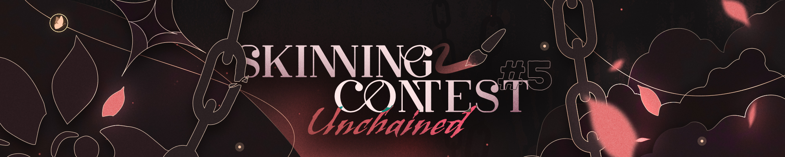

---
tags:
  - skinning
  - skinship
  - skins
---

# Skinning Contest #5: Unchained

The **Skinning Contest #5: Unchained** is a free-for-all osu! skinning contest hosted by [skinship](https://skinship.xyz), one of the largest skinning communities on osu!. It is the fifth official osu! skinning contest.

## Contest schedule

| Event | Timestamp |
| --: | :-- |
| Announcement | 2024-04-09 |
| Submission phase | 2024-04-09/2024-05-24 |
| Voting phase | 2024-06-23/2024-07-07 |
| Results | 2024-07-17 |

## Prizes

| Placing | Prize(s) |
| :-: | :-- |
|  | 6 months of osu!supporter, unique profile badge |
|  | 4 months of osu!supporter, unique profile badge |
|  | 2 months of osu!supporter, unique profile badge |

## Organisation

The Skinning Contest #4 is run by various community members.

| User | Responsibility |
| :-- | :-- |
| ::{ flag=RS }:: ::0x84f::{ user-id=7944724 } | News post writing |
| ::{ flag=DE }:: ::Master-TigerKun::{ user-id=10688456 } | Contest planning |
| ::{ flag=RO }:: ::Matt2e2::{ user-id=12144912 } | Contest planning |
| ::{ flag=NL }:: ::Roan::{ user-id=8214639 } | Contest planning, internal tool development |
| ::{ flag=DE }:: ::RockRoller::{ user-id=8388854 } | Contest planning, submission screening |
| ::{ flag=GB }:: ::tetsui::{ user-id=10974678 } | Contest planning |
| ::{ flag=TR }:: ::Zeus-::{ user-id=5464437 } | Contest planning |

## Links

- **[Contest page](https://osu.ppy.sh/community/contests/208)**
- [Announcement news post](https://osu.ppy.sh/home/news/2024-04-09-skinning-contest-unchained)
- [Voting news post](https://osu.ppy.sh/home/news/2024-06-23-skinning-contest-unchained-voting)
- [Results news post](https://osu.ppy.sh/home/news/2024-07-17-skinning-contest-unchained-results)
- [Discussion thread](https://osu.ppy.sh/community/forums/topics/1906590)
- [Submission thread](https://osu.ppy.sh/community/forums/topics/1906588)
- [Discord server](https://discord.skinship.xyz)
- [Website](https://skinship.xyz)

## Participants

| Skinner | Entry |
| :-- | :-- |
| ::{ flag=AU }:: ::Mooyangon::{ user-id=18655444 } | [Light Moon](https://osu.ppy.sh/community/forums/topics/1908624) |
| ::{ flag=SA }:: ::Dijjin::{ user-id=18400287 } | [Comet IS0N](https://osu.ppy.sh/community/forums/topics/1908734) |
| ::{ flag=CN }:: ::1740-Tobari::{ user-id=24673124 } | [-The adventures of ryunosuke seibu-(成歩堂龍ノ介の冒険)](https://osu.ppy.sh/community/forums/topics/1908862) |
| ::{ flag=BR }:: ::MSF12::{ user-id=16085671 } | [MY WORLD SKIN](https://osu.ppy.sh/community/forums/topics/1909545) |
| ::{ flag=RU }:: ::xTerrion::{ user-id=15679478 } | [TECH](https://osu.ppy.sh/community/forums/topics/1923252) |
| ::{ flag=TH }:: ::atturbo555::{ user-id=5730417 } | [Cherry Corolla](https://osu.ppy.sh/community/forums/topics/1912102) |
| ::{ flag=RU }:: ::TogiraW::{ user-id=20149300 } | [Bullet Hell Monday Finale [弾幕月曜日終章]](https://osu.ppy.sh/community/forums/topics/1918059) |
| ::{ flag=CN }:: ::Citrusis::{ user-id=30298378 } | [Rainbow⁵¹⁴](https://osu.ppy.sh/community/forums/topics/1919980) |
| ::{ flag=MX }:: ::ZixStar::{ user-id=11844975 } | [StickMania](https://osu.ppy.sh/community/forums/topics/1920401) |
| ::{ flag=US }:: ::Miorine::{ user-id=12630408 } | [Phosphor](https://osu.ppy.sh/community/forums/topics/1920571) |
| ::{ flag=TW }:: ::fred9909::{ user-id=502239 } | [Murasaki Purple](https://osu.ppy.sh/community/forums/topics/1923479) |
| ::{ flag=MX }:: ::XetThe::{ user-id=16274977 } | [LineageOS](https://osu.ppy.sh/community/forums/topics/1923880) |
| ::{ flag=FR }:: ::GhoztTime::{ user-id=11635690 } | [casinosu!](https://osu.ppy.sh/community/forums/topics/1924044) |
| ::{ flag=ID }:: ::Akshiro::{ user-id=10557490 } | [Eris Greyrat](https://osu.ppy.sh/community/forums/topics/1924459) |
| ::{ flag=BE }:: ::maikayuii::{ user-id=27370842 } | [「真実の魔女」 Witch Of Truth](https://osu.ppy.sh/community/forums/topics/1925018) |
| ::{ flag=MY }:: ::NyuPenyu::{ user-id=12233680 } | [chromb-chan](https://osu.ppy.sh/community/forums/topics/1925084) |
| ::{ flag=US }:: ::Ayy Its L::{ user-id=17890847 } | [Neon Purple](https://osu.ppy.sh/community/forums/topics/1925169) |
| ::{ flag=ID }:: ::mousewing::{ user-id=10837448 } | [Bstation Skin!](https://osu.ppy.sh/community/forums/topics/1925215) |
| ::{ flag=DE }:: ::LeoFrn::{ user-id=19795875 } | [I REFUSE TO LOSE](https://osu.ppy.sh/community/forums/topics/1925389) |
| ::{ flag=BY }:: ::thetasigma::{ user-id=6234482 } | [echoing inside.](https://osu.ppy.sh/community/forums/topics/1925867) |
| ::{ flag=AU }:: ::Aveil::{ user-id=11635646 } | [RAVENHUE](https://osu.ppy.sh/community/forums/topics/1925905) |
| ::{ flag=US }:: ::Chromasia::{ user-id=7306251 } | [ROSULA](https://osu.ppy.sh/community/forums/topics/1925929) |
| ::{ flag=US }:: ::lilrawk::{ user-id=13799581 } | [VISIONS](https://osu.ppy.sh/community/forums/topics/1925961) |
| ::{ flag=VN }:: ::Ben\15917::{ user-id=6026593 } | [cTRL](https://osu.ppy.sh/community/forums/topics/1926175) |
| ::{ flag=DE }:: ::janmagtoast::{ user-id=16849319 } | [osu!checkmate](https://osu.ppy.sh/community/forums/topics/1926184) |
| ::{ flag=US }:: ::Icysandwich::{ user-id=10961544 } | [Apple Camp](https://osu.ppy.sh/community/forums/topics/1926191) |
| ::{ flag=US }:: ::Syvatzia::{ user-id=19082107 } | [Reflections Unchained](https://osu.ppy.sh/community/forums/topics/1926206) |

## Podium

*For the full results, see the [contest page](https://osu.ppy.sh/community/contests/208).*

## Ruleset

- Submissions must not contain inappropriate, malicious, or epileptic content, and should adhere to the [osu! community rules](/wiki/Rules).
- All assets need to be created by yourself, or used with permission and proper credit to the authors. This includes, but is not limited to:
  - fonts
  - icons
  - textures
  - artworks (e.g. stock images or anime artwork)
  - sounds
- The majority of the in-game menu interface and at least two game modes have to be skinned. In other words, in addition to the gameplay elements, the following segments should not be left default:
  - ranking panel
  - song selection
  - mode selection
  - mod icons
  - pause and fail menu
  - main menu (optional, but highly encouraged)
- Submissions must be new creations — only skins posted within the submission period will be accepted.
- Each submission must be accompanied by a forum thread in order to participate in the contest.
- Submissions must be made in time. Latecomers will not be accepted.
- Submissions must not be created as a part of, or be involved in a paid commission of any sort.
- Submissions must be created individually. Teams/collaborations are not allowed.
- The file size for your `.osk` submission must be below 100 MB.
- Please submit a 16:9 image representing your skin, since this will be used as a cover on the contest page. This image must be at least 1280x720.

**Failure to comply with the contest rules may lead to disqualification, or, in severe cases, exclusion from future contests.**
