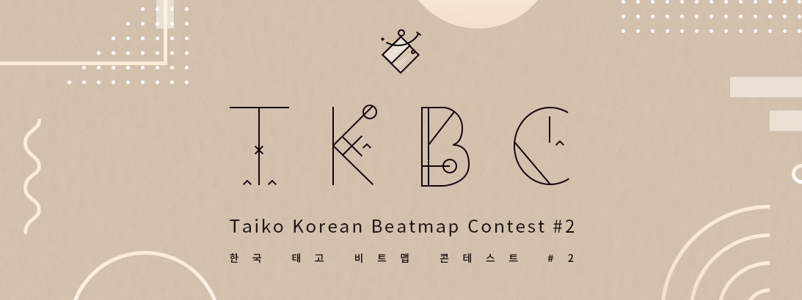

---
tags:
  - TKBC
  - TKBC2
---

# Taiko Korean Beatmap Contest #2

The **Taiko Korean Beatmap Contest #2** (***TKBC2***) was a osu!taiko mapping contest dedicated for users from ::{ flag=KR }:: South Korea. It was the second installment of the Taiko Korean Beatmap Contest.

## Contest schedule

| Event | Timestamp (UTC+09) |
| --: | :-- |
| Submission phase | 2020-11-30/2020-12-27 |
| Judging phase | 2020-12-28/2021-01-17 |
| Results announcement | 2021-01-17 |

## Organisation

The Taiko Korean Beatmap Contest #2 was run by members of the Korean osu!taiko mapping community.

| Position | Member(s) |
| :-- | :-- |
| Manager | ::{ flag=KR }:: [\[Karcher\] 2](https://osu.ppy.sh/users/9892196), ::{ flag=KR }:: [Civil oath](https://osu.ppy.sh/users/3216107) |
| Designer | ::{ flag=KR }:: [oL0](https://osu.ppy.sh/users/1134683) |
| Judge | ::{ flag=KR }:: [\[Karcher\] 2](https://osu.ppy.sh/users/9892196), ::{ flag=KR }:: [Petit](https://osu.ppy.sh/users/4637369), ::{ flag=KR }:: [Ozu](https://osu.ppy.sh/users/980092) |

## Prizes

| Placing | Prize(s) |
| :-: | :-- |
|  | Unique profile badge |
|  | 2 months of osu!supporter tag |
|  | 1 month of osu!supporter tag |

## Links

- [Discussion thread](https://osu.ppy.sh/community/forums/topics/1162734)

## Podium

This competition has come to an end and resulted in the following podium:

| Place | User |
| :-: | :-- |
|  | ::{ flag=KR }:: [applerss](https://osu.ppy.sh/users/983349) |
|  | ::{ flag=KR }:: [4\_4](https://osu.ppy.sh/users/1152851) |
|  | ::{ flag=KR }:: [ddm](https://osu.ppy.sh/users/7910282) |

## Ruleset

### Contest rules

- This contest is for osu!taiko mode.
- The theme for this installment is "Snow" or "Star".
- You should choose a song which matches the theme.
- The drain time should be higher than 80 and lower than 150.
- The difficulty should be Oni or higher.
- You must follow the [Ranking Criteria](/wiki/Ranking_criteria).
- If you submit several beatmaps, the last one will be your entry.
- You should not reveal your map before the results announcement.
- You can't submit a beatmap you have already uploaded.
- Only users from South Korea can participate in this contest.
- Judges can't participate in this contest.

### Metadata rules

- Artist must be `asdf`.
- Title must be `1223`.
- Difficulty must be Oni or Inner Oni.
- Source and tags must be left blank.
- While submitting your beatmap, include the metadata in the email.
