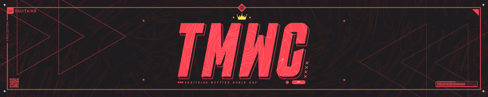
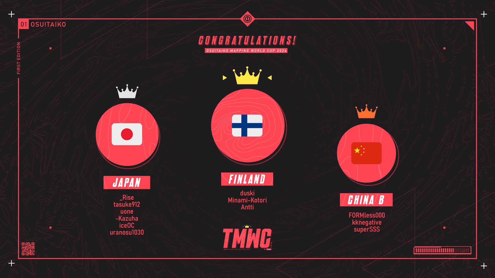

---
tags:
  - o!tmwc
  - tmwc
---

# osu!taiko Mapping World Cup 2024

The **osu!taiko Mapping World Cup 2024** (***TMWC 2024***) was a country-based, multi-stage osu!taiko mapping contest that aimed to crown which nation was the best at creating osu!taiko beatmaps.

## Schedule

Registrations were open from May 17 until June 8, 2024. Each round consisted of a mapping phase and a judging phase.

### Stage 1

| Event | Timestamp (UTC) |
| --: | :-- |
| Round 1 mapping phase | 2024-06-15 until 2024-06-29 |
| Round 1 judging phase | 2024-06-29 until 2024-07-13 |
| Round 2 mapping phase | 2024-06-22 until 2024-07-06 |
| Round 2 judging phase | 2024-07-06 until 2024-07-20 |
| Round 3 mapping phase | 2024-06-29 until 2024-07-13 |
| Round 3 Judging phase | 2024-07-13 until 2024-07-27 |
| Results | 2024-07-27 |

### Stage 2

| Event | Timestamp (UTC) |
| --: | :-- |
| Round 4 and 5 mapping phase | 2024-07-27 until 2024-08-10 |
| Round 4 and 5 judging phase | 2024-08-10 until 2024-08-31 |
| Results | 2024-08-31 |

### Stage 3

| Event | Timestamp (UTC) |
| --: | :-- |
| Round 6 and 7 mapping phase | 2024-08-31 until 2024-09-22 |
| Round 6 and 7 judging phase | 2024-09-22 until 2024-10-20 |
| Results | 2024-10-20 |

## Prizes

| Placing | Prize(s) |
| :-: | :-- |
|  | 55% of total cash prize[^cash-prize], unique profile badge, [3 contest points](/wiki/Contests/Contest_points) |
|  | 30% of total cash prize[^cash-prize], [2 contest points](/wiki/Contests/Contest_points) |
|  | 15% of total cash prize[^cash-prize], [1 contest point](/wiki/Contests/Contest_points) |

## Organisation

The osu!taiko Mapping World Cup 2024 was run by various community members.

| Position | Member(s) |
| :-- | :-- |
| Host | ::{ flag=NL }:: [ikin5050](https://osu.ppy.sh/users/4007649) |
| Advisor | ::{ flag=TN }:: [Hivie](https://osu.ppy.sh/users/14102976) |
| Designers | ::{ flag=MY }:: [Jerry](https://osu.ppy.sh/users/605973), ::{ flag=MY }:: [\[Zeth\]](https://osu.ppy.sh/users/9912966) |
| Judges | ::{ flag=US }:: [Nifty](https://osu.ppy.sh/users/4956097), ::{ flag=AT }:: [Yasuho](https://osu.ppy.sh/users/8458835), ::{ flag=DE }:: [Greenshell](https://osu.ppy.sh/users/8693851), ::{ flag=US }:: [op45667](https://osu.ppy.sh/users/21973491), ::{ flag=TH }:: [Ph0eNiiXZ](https://osu.ppy.sh/users/9463721), ::{ flag=HK }:: [Cynplytholowazy](https://osu.ppy.sh/users/3901754), ::{ flag=NL }:: [Boaz](https://osu.ppy.sh/users/13302996), ::{ flag=JP }:: [Maimaing](https://osu.ppy.sh/users/14520910), ::{ flag=DE }:: [OnosakiHito](https://osu.ppy.sh/users/290128), ::{ flag=JP }:: [TKS](https://osu.ppy.sh/users/940878), ::{ flag=VN }:: [davidminh0111](https://osu.ppy.sh/users/9623142), ::{ flag=AR }:: [Axer](https://osu.ppy.sh/users/7299864), ::{ flag=GB }:: [arialle](https://osu.ppy.sh/users/18597899), ::{ flag=GB }:: [mangomizer](https://osu.ppy.sh/users/1893718), ::{ flag=US }:: [Backfire](https://osu.ppy.sh/users/263110), ::{ flag=US }:: [meiqth](https://osu.ppy.sh/users/12565402), ::{ flag=US }:: [Asagi Mutsuki](https://osu.ppy.sh/users/2403621) |

## Links

- [Contest news article](https://osu.ppy.sh/home/news/2024-05-17-osu-taiko-mapping-world-cup-2024-registrations)
- [Contest forum post](https://osu.ppy.sh/community/forums/topics/1865674)
- [Contest listing](https://osu.ppy.sh/community/contests/212)
- [Discord server](https://discord.com/invite/A33s9SU9Bt)
- [Contest spreadsheet](https://docs.google.com/spreadsheets/d/1TJfreAbuk25zua2Zp5ncH1BA5QkhzEMpgkLhbal-Ri0/edit?usp=sharing)
- [Results stream VOD](https://www.twitch.tv/videos/2280875462)
- [**Registration form**](https://forms.gle/8da1riW77rrTUd2R9)

## Podium

A complete breakdown of the contest results, overview of participating teams, and links to detailled scores and feedback can be found in the [contest spreadsheet](https://docs.google.com/spreadsheets/d/1TJfreAbuk25zua2Zp5ncH1BA5QkhzEMpgkLhbal-Ri0/edit?usp=sharing).

## Ruleset

### Format

- Assuming that 16 teams will be formed, round 1 will have all 16 teams participate, and half will be eliminated. Round 2 will feature 8 teams, and half will be eliminated. If more teams end up participating, the format will be adjusted so every team will get to participate.
- Every round's judging criteria will be the same.
- Rounds will have varying numbers of maps required to be produced. Each map in each round will be produced according to a specific modifier that focuses on what skills mappers are expected to display. You do not need to adhere to this theme but will lose points for failing to do so.
- When choosing the songs you will map during a round, the songs **must** be chosen from the [Featured Artist listing](https://osu.ppy.sh/beatmaps/artists). If a specific song is provided, you must map only that song.
- Each team must produce exactly **one** difficulty for each song unless otherwise stated by the round specifications. If more than one difficulty is submitted, only the difficulty with the highest star rating will be judged.
- Custom additions such as hitsounds and storyboards are allowed, but **will not be considered in the judging process**. Judges will only get access to a `.osz` file containing the audio, background, and the singular `.osu` difficulty. You will not get points for background choice.

### Rules

- **The [osu! community rules](/wiki/Rules) are in place at all times during this contest.**
- **The [osu!taiko ranking criteria](/wiki/Ranking_criteria/osu!taiko) and the [general ranking criteria](/wiki/Ranking_criteria) are in effect for this contest.** No submission may be intentionally unrankable. Mistakes happen and points will be deducted for them, but submissions that cannot be ranked without major changes will be disqualified.
- **A team must consist of 3–6 players from the same country.** For countries that do not have enough members to participate, teams will be formed by the organisation team based on geographical location. Countries are defined as per the flag on user pages.
- **At least one (1) team member must join the contest's [Discord server](https://discord.com/invite/A33s9SU9Bt)**
- **At least two (2) mappers must collaborate per song.** This is a team-based competition. Collaboration is necessary to determine the strengths of each participating country. This is to avoid situations amongst teams where some members get "carried". Collaboration does not include anything other than mapping, which is defined as placing notes, or creating slider velocity changes.
- **At least three (3) mappers must participate in each phase.** Same as above, this is to prevent, for example, a 3-man team but only 2 members creating all maps.
- **A mapper on the winning team must participate in a minimum of 2 out of the 6 maps produced to receive their rewards for the contest.**
- **Submissions will not be accepted after the deadlines set for each round.**
- **Captains will be determined by the organisation team and given a list of potential teammates to choose from.** If this person does not want to be captain, a replacement will be selected. The captains will be responsible for selecting their teammates. If more than 6 people sign up for a single country, more than one team may be fielded. In this case a captain will be delegated for each team.
- **Everyone is expected to conduct themselves with a sporting attitude and with integrity. If you share your creations outside of your team channel before judging is complete, or attempt any form of leaking confidential information, you will be disqualified.**

### Judging criteria

- **Flow/Playability (5):** Points will be assigned based on a clear correlation between hand movements and the song, as well as how the map plays.
- **Judge's Impression (5):** Points will be assigned based on the judge's opinion of your submission.
- **Ranking Criteria (5):** Points will be assigned based on how well the map follows the ranking criteria.
- **Structure (10):** Points will be assigned based on consistency and how well the difficulty curve is constructed.
- **Creativity (10):** Points will be assigned based on how the submission uses creative and fitting elements to make itself stand out.
- **Relevance and Modifier (15):** Points will be assigned based on how well the map fits the song and how well the round modifier is incorporated.

## Notes

[^cash-prize]: The cash prize pool was crowdfunded by the osu!taiko community.
