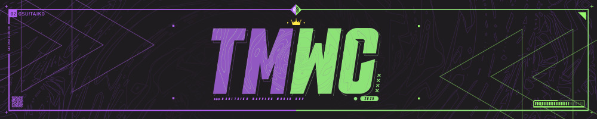

---
tags:
  - o!tmwc
  - tmwc
---

# osu!taiko Mapping World Cup 2025

The **osu!taiko Mapping World Cup 2025** (***TMWC 2025***) was a country-based, multi-stage osu!taiko mapping contest that aimed to crown which nation is the best at creating osu!taiko beatmaps.

## Schedule

Registrations opened 20 July 2025. Each round consisted of a mapping phase and a judging phase.

| Event | Timestamp (UTC) |
| --: | :-- |
| Round 1 mapping phase | 2025-08-23/2025-09-07 |
| Round 1 judging phase | 2025-09-07/2025-09-27 |
| Round 2 mapping phase | 2025-09-27/2025-10-12 |
| Round 2 judging phase | 2025-10-12/2025-11-01 |
| Round 3 mapping phase | 2025-11-01/2025-11-23 |
| Round 3 judging phase | 2025-11-23/2025-12-13 |
| Final results | 2025-12-13 |

## Prizes

| Placing | Prize(s) |
| :-: | :-- |
|  | 55% of total cash prize[^cash-prize], unique profile badge, [3 contest points](/wiki/Contests/Contest_points) |
|  | 30% of total cash prize[^cash-prize], [2 contest points](/wiki/Contests/Contest_points) |
|  | 15% of total cash prize[^cash-prize], [1 contest point](/wiki/Contests/Contest_points) |

## Organisation

The osu!taiko Mapping World Cup 2025 was run by various community members.

| Position | Member(s) |
| :-- | :-- |
| Host | ::{ flag=NL }:: [ikin5050](https://osu.ppy.sh/users/4007649), ::{ flag=AT }:: [Yasuho](https://osu.ppy.sh/users/8458835) |
| Designers | ::{ flag=MY }:: [Jerry](https://osu.ppy.sh/users/605973), ::{ flag=MY }:: [Z419](https://osu.ppy.sh/users/9912966) |
| Judges | ::{ flag=TH }:: [Ph0eNiiXZ](https://osu.ppy.sh/users/9463721), ::{ flag=HK }:: [Cynplytholowazy](https://osu.ppy.sh/users/3901754), ::{ flag=DE }:: [OnosakiHito](https://osu.ppy.sh/users/290128), ::{ flag=SG }:: [arcpotato](https://osu.ppy.sh/users/12842392), ::{ flag=CL }:: [ulko](https://osu.ppy.sh/users/1263669), ::{ flag=FR }:: [Kin](https://osu.ppy.sh/users/480689), ::{ flag=GB }:: [Skidooskei](https://osu.ppy.sh/users/10079029), ::{ flag=VN }:: [davidminh0111](https://osu.ppy.sh/users/9623142), ::{ flag=NO }:: [roufou](https://osu.ppy.sh/users/1109122), ::{ flag=SE }:: [Nurend](https://osu.ppy.sh/users/9905079), ::{ flag=SE }:: [Raphalge](https://osu.ppy.sh/users/3918650), ::{ flag=DE }:: [Nwolf](https://osu.ppy.sh/users/1910766) |

## Links

- [Announcement news post](https://osu.ppy.sh/home/news/2025-07-20-osu-taiko-mapping-world-cup-2025-registrations)
- [Forum post](https://osu.ppy.sh/community/forums/topics/2101898)
- [Contest listing](https://osu.ppy.sh/community/contests/252)
- [Discord server](https://discord.com/invite/5ewzEEcUCB)
- [Results spreadsheet](https://docs.google.com/spreadsheets/d/1vg0u3erwGcuugFkQv-U7pRUWUaPjuLKfVb_gxJZIinY)
- [**Registration form**](https://forms.gle/poJrvrceL3E19bSE6)

## Podium

A complete breakdown of the contest results, overview of participating teams, and links to detailled scores and feedback can be found in the [contest spreadsheet](https://docs.google.com/spreadsheets/d/1vg0u3erwGcuugFkQv-U7pRUWUaPjuLKfVb_gxJZIinY).

## Ruleset

### Format

- Round 1 will act as a seeding round. Round 2 will feature a group stage with teams split into groups according to their seeding from Round 1. The top teams from each group will progress to Round 3 (the final). Every team will get to participate in Rounds 1&2. Teams will be expected to produce 1 map per round.
- Every round's judging criteria will be the same.
- Each map in each round will be produced according to a specific modifier, encouraging teams to display their creativity within certain boundaries. You do not need to adhere to this theme but will lose points for failing to do so.
- When choosing the songs you will map during a round, the songs **must** be chosen from the [Featured Artist listing](https://osu.ppy.sh/beatmaps/artists). If a specific song is provided, you must map only that song.
- Each team must produce one (1) difficulty exactly for each song unless otherwise stated by the round specifications. If more than 1 difficulty is submitted, only the highest difficulty (chosen by star rating) will be judged.
- Custom additions such as hitsounds and storyboards are allowed, but **will not be considered in the judging process**. Judges will only get access to a `.osz` file containing the audio, background, and the singular `.osu` difficulty. You will not get points for background choice.

### Rules

- **The [osu! community rules](/wiki/Rules) are in place at all times during this contest.**
- **The [osu!taiko ranking criteria](/wiki/Ranking_criteria/osu!taiko) and the [general ranking criteria](/wiki/Ranking_criteria) are in effect for this contest.** No submission may be intentionally unrankable. Mistakes happen and points will be deducted for them, but submissions that cannot be ranked without major changes will be disqualified.
- **A team must consist of 3–6 players from the same country.** For countries that do not have enough members to participate, teams will be formed by the organisation team based on geographical location. Countries are defined as per the flag on user pages.
- **At least one (1) team member must join the contest's [Discord server](https://discord.com/invite/5ewzEEcUCB)**
- **At least three (3) mappers must collaborate per song.** This is a team-based competition. Collaboration is necessary to determine the strengths of each participating country. We want to avoid situations amongst teams where some members get ‘carried’. Collaboration does not include anything other than mapping (notes/scroll speed changes/volume changes), providing feedback does not count.
- **A mapper on the winning team must participate in a minimum of 2 out of the 3 maps produced to receive their rewards for the contest.**
- **Submissions will not be accepted after the deadlines set for each round.**
- **Captains will be determined by the organisation team and given a list of potential teammates to choose from.** If this person does not want to be captain, a replacement will be selected. The captains will be responsible for selecting their teammates. If more than 6 people sign up for a single country, more than one team may be fielded. In this case a captain will be delegated for each team.
- **We expect everyone to conduct themselves with a sporting attitude and with integrity. Respect toward fellow competitors, judges and organisers is expected at all times. If you share your creations outside of your team channel before judging is complete, or attempt any form of leaking confidential information, you will be disqualified.**

### Judging criteria

- **Flow/Playability (5):** Points will be assigned based on a clear correlation between hand movements and the song, as well as how the map plays.
- **Ranking Criteria (5):** Points will be assigned based on how well the map follows the ranking criteria.
- **Structure (10):** Points will be assigned based on consistency and how well the difficulty curve is constructed.
- **Judge's Impression (10):** Points will be assigned based on the judge's opinion of your submission.
- **Creativity (10):** Points will be assigned based on how the submission uses creative and fitting elements to make itself stand out.
- **Relevance and Modifier (10):** Points will be assigned based on how well the map fits the song and how well the round modifier is incorporated.

Scores were reported as standardised scores.

## Notes

[^cash-prize]: The cash prize pool was generously crowdfunded by the osu!taiko community.
