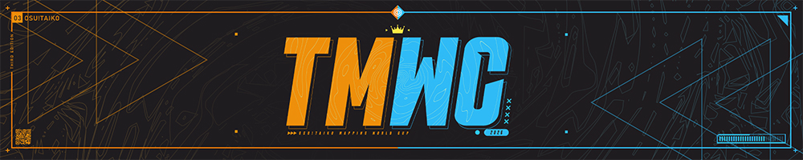

---
tags:
  - o!tmwc
  - tmwc
---

# osu!taiko Mapping World Cup 2026

The **osu!taiko Mapping World Cup 2026** (***TMWC 2026***) is an upcoming country-based, multi-stage osu!taiko mapping contest that aims to crown which nation is the best at creating osu!taiko beatmaps.

## Schedule

| Event | Timestamp (UTC) |
| --: | :-- |
| Round 1 mapping phase | July 11 until August 1 |
| Round 1 judging phase | August 1 until August 22 |
| Round 2 mapping phase | August 22 until September 20 |
| Round 2 judging phase | September 20 until October 10 |
| Round 3 mapping phase | October 10 until November 8 |
| Round 3 judging phase | November 8 until November 28 |
| Final results | November 28 |

Please note this schedule is subject to change.

## Prizes

| Placing | Prize(s) |
| :-: | :-- |
|  | 55% of total cash prize[^cash-prize], unique profile badge, [3 contest points](/wiki/Contests/Contest_points) |
|  | 30% of total cash prize[^cash-prize], [2 contest points](/wiki/Contests/Contest_points) |
|  | 15% of total cash prize[^cash-prize], [1 contest point](/wiki/Contests/Contest_points) |

The amount of contest points awarded will be determined by the number of mappers participating in the contest, as detailed in the [contest points key](/wiki/Contests/Contest_points#points-key). The cash prize will be crowd-funded and those who wish to support the contest can do so [here](https://ko-fi.com/ikin5050).

## Organisation

The osu!taiko Mapping World Cup 2025 is run by various community members.

| Position | Member(s) |
| :-- | :-- |
| Host | ::{ flag=NL }:: [ikin5050](https://osu.ppy.sh/users/4007649), ::{ flag=AT }:: [Yasuho](https://osu.ppy.sh/users/8458835),  ::{ flag=PT }:: [Warp](https://osu.ppy.sh/community/users/18649724) |
| Designers | ::{ flag=MY }:: [Jerry](https://osu.ppy.sh/users/605973) |
| Judges | ::{ flag=HK }:: [Cynplytholowazy](https://osu.ppy.sh/users/3901754), ::{ flag=DE }:: [OnosakiHito](https://osu.ppy.sh/users/290128), ::{ flag=CL }:: [ulko](https://osu.ppy.sh/users/1263669), ::{ flag=GB }:: [Skidooskei](https://osu.ppy.sh/users/10079029), ::{ flag=VN }:: [davidminh0111](https://osu.ppy.sh/users/9623142),  ::{ flag=DE }:: [Undead Alice](https://osu.ppy.sh/users/17415683), ::{ flag=FR }:: [Heaxys](https://osu.ppy.sh/users/5671417), ::{ flag=PH }:: [Kulalaying](https://osu.ppy.sh/users/1259391) |

## Links

- Announcement news post
- [Forum post](https://osu.ppy.sh/community/forums/topics/2215635?n=1)
- [Contest listing](https://osu.ppy.sh/community/contests/287)
- [Discord server](https://discord.com/invite/5ewzEEcUCB)

## Ruleset

### Format

- Round 1 will act as a seeding round. Round 2 will feature a knockout round according to the seeding from Round 1. The top teams from each group will progress to Round 3 (the final). Every team will get to participate in Rounds 1&2. Teams will be expected to produce 1 map per round.
- Every round's judging criteria will be the same.
- Each map in each round will be produced according to a specific modifier, encouraging teams to display their creativity within certain boundaries. You do not need to adhere to this theme but will lose points for failing to do so.
- When choosing the songs you will map during a round, the songs **must** be chosen from the [Featured Artist listing](https://osu.ppy.sh/beatmaps/artists). If a specific song is provided, you must map only that song.
- Each team must produce one (1) difficulty exactly for each song unless otherwise stated by the round specifications. If more than 1 difficulty is submitted, only the highest difficulty (chosen by star rating) will be judged.
- Custom additions such as hitsounds and storyboards are allowed, but **will not be considered in the judging process**. Judges will only get access to a `.osz` file containing the audio, background, and the singular `.osu` difficulty. You will not get points for background choice.

### Rules

- **The [osu! community rules](/wiki/Rules) are in place at all times during this contest.**
- **The [osu!taiko ranking criteria](/wiki/Ranking_criteria/osu!taiko) and the [general ranking criteria](/wiki/Ranking_criteria) are in effect for this contest.** No submission may be intentionally unrankable. Mistakes can happen, but submissions that cannot be ranked without major changes will be disqualified.
- **A team must consist of 3–4 players from the same country.** For countries that do not have enough members to participate, teams will be formed by the organisation team based on geographical location. If insufficient players from a country sign up, the hosts will suggest ways to combine with registrants from another country based on geographical proximity. You are allowed to sign up as a premade team but the hosts reserve the right to ask for someone to join your premade team to ensure every signup can participate.
- **At least one (1) team member must join the contest's [Discord server](https://discord.com/invite/5ewzEEcUCB)**
- **At least two (2) mappers must collaborate per song.** This is a team-based competition. Collaboration is necessary to determine the strengths of each participating country. We want to avoid situations amongst teams where some members get ‘carried’. Collaboration does not include anything other than mapping (notes/scroll speed changes/volume changes), providing feedback does not count.
- **A mapper on the winning team must participate in a minimum of 2 out of the 3 maps produced to receive their rewards for the contest.**
- **Submissions will not be accepted after the deadlines set for each round.**
- **Captains will be determined by the organisation team and given a list of potential teammates to choose from.** If this person does not want to be captain, a replacement will be selected. The captains will be responsible for selecting their teammates. If more than 4 people sign up for a single country, more than one team may be fielded. In this case a captain will be delegated for each team. If signing up as a premade team the host team reserves the right to ask inclusion of extra people to the premade in special cases.
- **We expect everyone to conduct themselves with a sporting attitude and with integrity. Respect toward fellow competitors, judges and organisers is expected at all times. If you share your creations outside of your team channel before judging is complete, or attempt any form of leaking confidential information, you will be disqualified.**

### Judging criteria

- **Flow/Playability (20):** Points will be assigned based on a clear correlation between hand movements and the song, as well as how the map plays. Difficulty curve and distribution in relation to the song progression will be assessed too.
- **Structure and representation(20):** Points will be assigned based on how well the song is represented through your mapping choices, consistency, and how well the collaborative mapping aspect was handled.
- **Judge Impression (20):** Points will be assigned based on the judge's opinion of your submission.
- **Creativity (20):** Points will be assigned based on how the submission uses creative and fitting elements to make itself stand out.

Scores will be reported as standardised scores.

## Notes

[^cash-prize]: The cash prize pool is generously crowdfunded by the osu!taiko community.
