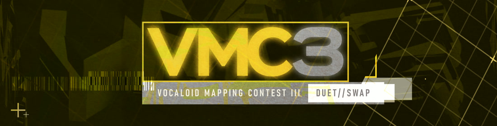

---
tags:
  - VMC3
  - VMC
---

# Vocaloid Mapping Contest 3

The **Vocaloid Mapping Contest** (***VMC***) is a beatmapping contest hosted by the Vocaloid Appreciation Team (VAT). Its purpose is to *promote VOCALOID, UTAU, and other vocal synth music*, giving both popular and overlooked songs a chance to shine.

Participants compete to create the *best beatmap possible*, with their entries judged by some of the most talented and respected VOCALOID-focused mappers in the osu! community.

The third iteration of the contest introduces a *multi-phase format* featuring the **PARALLEL**, **SWAP**, and **DUET** rounds. This year also celebrates multiple Featured Artists whose songs were specifically chosen for the competition, along with continued support for every game mode.

## Contest schedule

| Event | Timestamp |
| --: | :-- |
| Announcement | 2025-10-05 |
| PARALLEL submission deadline | 2025-11-13 |
| Screening | 2025-11-13/2025-11-15 |
| SWAP submission deadline | 2025-12-07 |
| Judging | 2025-12-19/2025-01-02 |
| Results livestream | 2026-01-11 (18:00 UTC) |
| DUET submission deadline | 2026-02-22 |
| Judging | 2026-02-25/2026-03-13 |
| Results livestream | 2026-03-22 |

All deadlines end at 23:59 UTC.

The **results livestreams** will be broadcast live on the [*Vocaloid Appreciation Team* Twitch channel](https://www.twitch.tv/vocaloidappreciationteam), with commentary and live reactions. Recordings will later be available on the [*Vocaloid Appreciation Team* YouTube channel](https://www.youtube.com/@VocaloidAppreciationTeam).

## Prizes

| Placing | Prize(s) |
| :-: | :-- |
| 1st | Two laptops (courtesy of [**Noobie_Potato**](https://osu.ppy.sh/users/15174655)) for osu! mode winners, 6 months of osu!supporter, [contest points](/wiki/Contests/Contest_points), **VMC3 Winner** profile badge, entry fast-tracked to Ranked status |
| 2nd | 3 months of osu!supporter, [contest points](/wiki/Contests/Contest_points) |
| 3rd | 1 month of osu!supporter, [contest points](/wiki/Contests/Contest_points) |
| SWAP round winner | 3 months of osu!supporter, possible badge and/or [contest points](/wiki/Contests/Contest_points) |

All participating mappers will receive feedback from experienced members of the community to help them improve their skills.

Reach out to [-White](https://osu.ppy.sh/users/16276548) or head over to the contest's [main website](https://www.vat.gg/vmc3) if you are interested in sponsoring this event!

## Links

- [Main website](https://www.vat.gg/vmc3)
- [Discord server](https://discord.com/invite/EruvDHaReY)
- [Twitch channel](https://www.twitch.tv/vocaloidappreciationteam)
- [YouTube channel](https://www.youtube.com/@VocaloidAppreciationTeam)
- [Announcement news post](https://osu.ppy.sh/home/news/2025-10-05-vocaloid-mapping-contest-3)
- [Phase 1 results news post](https://osu.ppy.sh/home/news/2026-01-11-vocaloid-mapping-contest-3-phase-1-results-new-featured-artist-epiaeon)
- **Contest listings**
  - [PARALLEL & SWAP round (osu!)](https://osu.ppy.sh/community/contests/261)
  - [PARALLEL & SWAP round (osu!taiko)](https://osu.ppy.sh/community/contests/262)
  - [PARALLEL & SWAP round (osu!catch)](https://osu.ppy.sh/community/contests/263)
  - [PARALLEL & SWAP round (osu!mania)](https://osu.ppy.sh/community/contests/264)

## Phase 1 results

### osu! results

View the [maps and scores on the contest page](https://osu.ppy.sh/community/contests/261).\
View the [full judge comments on the judging spreadsheet](https://docs.google.com/spreadsheets/d/1LU46D4zfCN5QDLqe1qMmUhar5pkSc3-cIOu2X_g7_GQ/edit?usp=sharing).

| # | Team | Entry | Results |
| :-: | :-- | :-- | :-- |
| 1st | ::{ flag=CN }:: [Garden](https://osu.ppy.sh/users/2849992) and ::{ flag=CN }:: [iBell](https://osu.ppy.sh/users/4298072) | [Everything will be broken. & Darling](https://assets.ppy.sh/contests/261/entries/osz/Everything%20will%20be%20broken.%20%26%20Darling%20%28Garden%20and%20iBell%29.osz) | [View](https://osu.ppy.sh/community/contests/261/entries/66694/results) |
| 2nd | ::{ flag=ES }:: [CebollaVladimir](https://osu.ppy.sh/users/15308238) and ::{ flag=HK }:: [Kyle Y](https://osu.ppy.sh/users/3565813) | [Umitagari & imperfect person](https://assets.ppy.sh/contests/261/entries/osz/Umitagari%20%26%20imperfect%20person%20%28CebollaVladimir%20and%20Kyle%20Y%29.osz) | [View](https://osu.ppy.sh/community/contests/261/entries/66692/results) |
| 3rd | ::{ flag=RU }:: [alvearia](https://osu.ppy.sh/users/6248691) and ::{ flag=RU }:: [Daycore](https://osu.ppy.sh/users/5596337) | [Magical Doctor & Tatakina](https://assets.ppy.sh/contests/261/entries/osz/Magical%20Doctor%20%26%20Tatakina%20%28alvearia%20and%20Daycore%29.osz) | [View](https://osu.ppy.sh/community/contests/261/entries/66689/results) |
| 4th | ::{ flag=AU }:: [nominomu](https://osu.ppy.sh/users/30485380) and ::{ flag=LT }:: [Amefystol](https://osu.ppy.sh/users/26748801) | [imperfect person & Magical Doctor](https://assets.ppy.sh/contests/261/entries/osz/imperfect%20person%20%26%20Magical%20Doctor%20%28nominomu%20and%20Amefystol%29.osz) | [View](https://osu.ppy.sh/community/contests/261/entries/66695/results) |
| 5th | ::{ flag=CL }:: [Evil-](https://osu.ppy.sh/users/10234313) and ::{ flag=CL }:: [Cris-](https://osu.ppy.sh/users/6175280) | [New Darling & End Of Fake!](https://assets.ppy.sh/contests/261/entries/osz/New%20Darling%20%26%20End%20Of%20Fake%21%20%28Evil-%20and%20Cris-%29.osz) | [View](https://osu.ppy.sh/community/contests/261/entries/66693/results) |
| 6th | ::{ flag=TW }:: [Alty](https://osu.ppy.sh/users/16407988) and ::{ flag=JP }:: [Phten02](https://osu.ppy.sh/users/16678364) | [imperfect person & Darling](https://assets.ppy.sh/contests/261/entries/osz/imperfect%20person%20%26%20Darling%20%28Alty%20and%20Phten02%29.osz) | [View](https://osu.ppy.sh/community/contests/261/entries/66688/results) |
| 7th | ::{ flag=US }:: [AndAda](https://osu.ppy.sh/users/10574844) and ::{ flag=US }:: [Sharqosity](https://osu.ppy.sh/users/6292234) | [New Darling & imperfect person](https://assets.ppy.sh/contests/261/entries/osz/New%20Darling%20%26%20imperfect%20person%20%28AndAda%20and%20Sharqosity%29.osz) | [View](https://osu.ppy.sh/community/contests/261/entries/66690/results) |
| 8th | ::{ flag=GB }:: [Asai Rumi](https://osu.ppy.sh/users/3399877) and ::{ flag=KR }:: [TetoTeTeto](https://osu.ppy.sh/users/17006877) | [Mind Brand & Tatakina](https://assets.ppy.sh/contests/261/entries/osz/Mind%20Brand%20%26%20Tatakina%20%28Asai%20Rumi%20and%20TetoTeTeto%29.osz) | [View](https://osu.ppy.sh/community/contests/261/entries/66691/results) |

### osu!taiko results

View the [maps and scores on the contest page](https://osu.ppy.sh/community/contests/262).\
View the [full judge comments on the judging spreadsheet](https://docs.google.com/spreadsheets/d/1Xjw1uGK5_Ful_Dr9KCS6h7xVUyVxKNAjogMnjYBV7ss/edit?usp=sharing).

| # | Team | Entry | Results |
| :-: | :-- | :-- | :-- |
| 1st | ::{ flag=SG }:: [\_gt](https://osu.ppy.sh/users/8301957) and ::{ flag=HK }:: [Irone OSU](https://osu.ppy.sh/users/10678230) | [SIU & Everything will be broken.](https://assets.ppy.sh/contests/262/entries/osz/SIU%20%26%20Everything%20will%20be%20broken.%20%28_gt%20and%20Irone%20OSU%29.osz) | [View](https://osu.ppy.sh/community/contests/262/entries/66703/results) |
| 2nd | ::{ flag=FI }:: [Jaltzu](https://osu.ppy.sh/users/2597417) and ::{ flag=CA }:: [SN707](https://osu.ppy.sh/users/31404061) | [Tatakina & White Happy](https://assets.ppy.sh/contests/262/entries/osz/Tatakina%20%26%20White%20Happy%20%28Jaltzu%20and%20SN707%29.osz) | [View](https://osu.ppy.sh/community/contests/262/entries/66699/results) |
| 3rd | ::{ flag=US }:: [Molybdenum](https://osu.ppy.sh/users/14708449) and ::{ flag=FR }:: [Kin](https://osu.ppy.sh/users/480689) | [White Happy & feel empty!](https://assets.ppy.sh/contests/262/entries/osz/White%20Happy%20%26%20feel%20empty%21%20%28Molybdenum%20and%20Kin%29.osz) | [View](https://osu.ppy.sh/community/contests/262/entries/66700/results) |
| 4th | ::{ flag=HK }:: [Cynplytholowazy](https://osu.ppy.sh/users/3901754) and ::{ flag=MY }:: [MTNTWarz](https://osu.ppy.sh/users/14036825) | [imperfect person & Magical Doctor](https://assets.ppy.sh/contests/262/entries/osz/imperfect%20person%20%26%20Magical%20Doctor%20%28Cynplytholowazy%20and%20MTNTWarz%29.osz) | [View](https://osu.ppy.sh/community/contests/262/entries/66697/results) |
| 5th | ::{ flag=IT }:: [chmekoe](https://osu.ppy.sh/users/7807444) and ::{ flag=JP }:: [uone](https://osu.ppy.sh/users/5321719) | [White Happy & Tatakina](https://assets.ppy.sh/contests/262/entries/osz/White%20Happy%20%26%20Tatakina%20%28chmekoe%20and%20uone%29.osz) | [View](https://osu.ppy.sh/community/contests/262/entries/66696/results) |
| 6th | ::{ flag=TW }:: [Solor](https://osu.ppy.sh/users/25201175) and ::{ flag=AU }:: [Nintendo 64](https://osu.ppy.sh/users/30481748) | [End Of Fake! & Umitagari](https://assets.ppy.sh/contests/262/entries/osz/End%20Of%20Fake%21%20%26%20Umitagari%20%28Solor%20and%20Nintendo%2064%29.osz) | [View](https://osu.ppy.sh/community/contests/262/entries/66701/results) |
| 7th | ::{ flag=EC }:: [Foco\_](https://osu.ppy.sh/users/11481057) and ::{ flag=EC }:: [Gamelan4](https://osu.ppy.sh/users/9856910) | [Packet Hero & Everything will be broken.](https://assets.ppy.sh/contests/262/entries/osz/Packet%20Hero%20%26%20Everything%20will%20be%20broken.%20%28Foco_%20and%20Gamelan4%29.osz) | [View](https://osu.ppy.sh/community/contests/262/entries/66698/results) |
| 8th | ::{ flag=US }:: [\_wholesome](https://osu.ppy.sh/users/19119172) and ::{ flag=PL }:: [h3oCharles](https://osu.ppy.sh/users/8712289) | [Tatakina & Packet Hero](https://assets.ppy.sh/contests/262/entries/osz/Tatakina%20%26%20Packet%20Hero%20%28_wholesome%20and%20h3oCharles%29.osz) | [View](https://osu.ppy.sh/community/contests/262/entries/66704/results) |
| 9th | ::{ flag=JP }:: [tasuke912](https://osu.ppy.sh/users/2774767) and ::{ flag=JP }:: [miyagishima](https://osu.ppy.sh/users/8027517) | [Packet Hero & Tatakina](https://assets.ppy.sh/contests/262/entries/osz/Packet%20Hero%20%26%20Tatakina%20%28tasuke912%20and%20miyagishima%29.osz) | [View](https://osu.ppy.sh/community/contests/262/entries/66702/results) |

### osu!catch results

View the [maps and scores on the contest page](https://osu.ppy.sh/community/contests/263).\
View the [full judge comments on the judging spreadsheet](https://docs.google.com/spreadsheets/d/18kNgoiH1mHng1Yx0TQjcIVqTaLwgU9euGobwzvgtmMI/edit?usp=sharing).

| # | Team | Entry | Results |
| :-: | :-- | :-- | :-- |
| 1st | ::{ flag=CA }:: [Unlucky\_w](https://osu.ppy.sh/users/4820793) and ::{ flag=TN }:: [-Ken](https://osu.ppy.sh/users/4430811) | [Magical Doctor & Tatakina](https://assets.ppy.sh/contests/263/entries/osz/Magical%20Doctor%20%26%20Tatakina%20%28Unlucky_w%20and%20-Ken%29.osz) | [View](https://osu.ppy.sh/community/contests/263/entries/66707/results) |
| 2nd | ::{ flag=PL }:: [Mniam](https://osu.ppy.sh/users/6050530) and ::{ flag=KR }:: [Spectator](https://osu.ppy.sh/users/702598) | [End Of Fake! & New Darling](https://assets.ppy.sh/contests/263/entries/osz/End%20Of%20Fake%21%20%26%20New%20Darling%20%28Mniam%20and%20Spectator%29.osz) | [View](https://osu.ppy.sh/community/contests/263/entries/66705/results) |
| 3rd | ::{ flag=TW }:: [Snow\_summer\_](https://osu.ppy.sh/users/15037158) and ::{ flag=CA }:: [SadEgg](https://osu.ppy.sh/users/10278243) | [New Darling & Tatakina](https://assets.ppy.sh/contests/263/entries/osz/New%20Darling%20%26%20Tatakina%20%28Snow_summer_%20and%20SadEgg%29.osz) | [View](https://osu.ppy.sh/community/contests/263/entries/66706/results) |

### osu!mania results

View the [maps and scores on the contest page](https://osu.ppy.sh/community/contests/264).\
View the [full judge comments on the judging spreadsheet](https://docs.google.com/spreadsheets/d/1sPpcx49bUitY2oC-zrvR3SCN6dnE_t6gdRMqJVIhR3w/edit?usp=sharing).

| # | Team | Entry | Results |
| :-: | :-- | :-- | :-- |
| 1st | ::{ flag=VN }:: [Lott](https://osu.ppy.sh/users/13821222) and ::{ flag=VN }:: [Micleak](https://osu.ppy.sh/users/16140674) | [Everything will be broken. & PINK](https://assets.ppy.sh/contests/264/entries/osz/Everything%20will%20be%20broken.%20%26%20PINK%20%28Lott%20and%20Micleak%29.osz) | [View](https://osu.ppy.sh/community/contests/264/entries/66711/results) |
| 2nd | ::{ flag=CA }:: [xstra](https://osu.ppy.sh/users/13106165) and ::{ flag=ID }:: [Reihynn](https://osu.ppy.sh/users/16630515) | [Magical Doctor & imperfect person](https://assets.ppy.sh/contests/264/entries/osz/Magical%20Doctor%20%26%20imperfect%20person%20%28xstra%20and%20Reihynn%29.osz) | [View](https://osu.ppy.sh/community/contests/264/entries/66712/results) |
| 3rd | ::{ flag=RU }:: [Kurisu Makise](https://osu.ppy.sh/users/2790640) and ::{ flag=CN }:: [Hoshimegu Mio](https://osu.ppy.sh/users/17753835) | [Everything will be broken. & White Happy](https://assets.ppy.sh/contests/264/entries/osz/Everything%20will%20be%20broken.%20%26%20White%20Happy%20%28Kurisu%20Makise%20and%20Hoshimegu%20Mio%29.osz) | [View](https://osu.ppy.sh/community/contests/264/entries/66710/results) |
| 4th | ::{ flag=US }:: [y u](https://osu.ppy.sh/users/30360950) and ::{ flag=JP }:: [Kanomi](https://osu.ppy.sh/users/37694048) | [Tatakina & Scrumize](https://assets.ppy.sh/contests/264/entries/osz/Tatakina%20%26%20Scrumize%20%28y%20u%20and%20Kanomi%29.osz) | [View](https://osu.ppy.sh/community/contests/264/entries/66713/results) |
| 5th | ::{ flag=US }:: [Znow](https://osu.ppy.sh/users/15513303) and ::{ flag=MX }:: [N4iveDx](https://osu.ppy.sh/users/21340543) | [imperfect person & Coin Locker Baby](https://assets.ppy.sh/contests/264/entries/osz/imperfect%20person%20%26%20Coin%20Locker%20Baby%20%28Znow%20and%20N4iveDx%29.osz) | [View](https://osu.ppy.sh/community/contests/264/entries/66714/results) |
| 6th | ::{ flag=VN }:: [GamerChris](https://osu.ppy.sh/users/36042814) and ::{ flag=US }:: [jazzman123](https://osu.ppy.sh/users/31943070) | [Coin Locker Baby & imperfect person](https://assets.ppy.sh/contests/264/entries/osz/Coin%20Locker%20Baby%20%26%20imperfect%20person%20%28GamerChris%20and%20jazzman123%29.osz) | [View](https://osu.ppy.sh/community/contests/264/entries/66708/results) |
| 7th | ::{ flag=GB }:: [Hydria](https://osu.ppy.sh/users/808176) and ::{ flag=RU }:: [-Enma-](https://osu.ppy.sh/users/34587251) | [Coin Locker Baby & imperfect person](https://assets.ppy.sh/contests/264/entries/osz/Coin%20Locker%20Baby%20%26%20imperfect%20person%20%28Hydria%20and%20-Enma-%29.osz) | [View](https://osu.ppy.sh/community/contests/264/entries/66709/results) |

## Ruleset

- **Submissions must use songs from [**MARETU**'s Featured Artist listing](https://osu.ppy.sh/beatmaps/artists/504) and [**mimizu**'s Featured Artist listing](https://osu.ppy.sh/beatmaps/artists/505).** Cut versions are not allowed.
- **Teams must submit a team roster anytime prior to submitting Round 1 entries.** Only teams of two are allowed to participate. Mappers may not participate solo. Teams may not be changed after roster submissions.
- **Submissions must be in `.osz` format.**
- **Beatmaps must follow the [ranking criteria](/wiki/Ranking_Criteria).** Minor mistakes (like an off-screen object) can be forgiven, but intentional unrankable elements will result in disqualification.
- **Maps must remain anonymous** until after the results are announced. Metadata will be anonymized before judging.
- **No storyboards or videos** are to be included in submissions.
- **No manual `.osu` file edits** beyond what is possible in the editor.
- **Each `.osz` submission must include all required difficulties and songs for that round.** Be sure to follow the instructions on the submission page to avoid issues!
- **Collaborative difficulties should feature approximately equal contribution between both mappers.**
- **All aspects of each submission must be created solely be a member of the team.** As such, artificial intelligence (AI) is not permitted.

## Registration

- To participate, a team of two (2) mappers must be formed. There is no restriction on who you can have on your team, with limited exceptions:
  - No mappers may be restricted or contest/tournament banned.
  - Mappers cannot participate on more than one team.
  - Mappers may not be a judge, screener, or other staff for the contest.
- One member of the team will need to be the captain. This should be decided prior to signing up.
- One member of each team, at minimum, is required to join the [VAT Discord server](https://discord.com/invite/EruvDHaReY) in order to receive important contest updates.
- [**Register here**](https://form-auth.ppy.sh/form/vmc3-signups).

## Judging

The judging process is split between **Phase 1 (PARALLEL & SWAP Rounds)** and **Phase 2 (DUET Round)**. Each phase includes its own unique primary category, while all other criteria apply equally to both.

In Phase 1, each map for Song A is scored individually in Relevance, Creativity, Expertise, and Overall Impression. The scores in each criteria are added. Then, these two maps are put side to side a 'Uniqueness' score is added. This is worth 25% of the raw score. This process repeats for Song B. Song B's averaged criteria scores are then averaged with Song A's, which are then standardized to determine the final placements.

| Criterion | Points | Description |
| :-: | :-: | :-- |
| **Phase 1 – Uniqueness** | **100** | How distinctive and innovative is the entry? Does it showcase fresh ideas that set it apart from typical mapping trends while feeling cohesive and enjoyable? |
| **Phase 2 – Cohesion** | **100** | How naturally do the swapped maps work as a single, unified entry? The final product should feel seamless and consistent despite being made by different team members. |
| **Relevance** | 100 | How well does the map fit the song? Are the gameplay elements fundamentally tied to the music? |
| **Creativity** | 60 | How bold and exciting are the mapper's ideas compared to current mapping trends? Does the map evoke reactions like "wow!" or "that's super interesting"? |
| **Expertise** | 60 | Technical skill, execution, and consistency of the map's design and structure. |
| **Overall Impression** | 80 | Subjective evaluation from the judging panel, factoring in personal enjoyment and interpretation. |

## Staff

| Role | User |
| :-: | :-- |
| Host | ::{ flag=US }:: [-White](https://osu.ppy.sh/users/16276548) |
| Special thanks | ::{ flag=US }:: [Pishifat](https://osu.ppy.sh/users/3178418), ::{ flag=SE }:: [Walavouchey](https://osu.ppy.sh/users/5773079) |
| Designer | ::{ flag=CA }:: [Kaetwo](https://osu.ppy.sh/users/1997719) |

| Game mode | Judges |
| :-: | :-- |
| osu! | ::{ flag=CN }}:: [Mafumafu](https://osu.ppy.sh/users/3076909), ::{ flag=US }}:: [squishyguppy](https://osu.ppy.sh/users/4116573), ::{ flag=US }}:: [Noffy](https://osu.ppy.sh/users/1541323), ::{ flag=RU }}:: [NeKroMan4ik](https://osu.ppy.sh/users/11387664), ::{ flag=CN }}:: [Ryuusei Aika](https://osu.ppy.sh/users/7777875), ::{ flag=BY }}:: [Flins](https://osu.ppy.sh/users/11119539), ::{ flag=CA }}:: [Shanipika](https://osu.ppy.sh/users/6336729) |
| osu!taiko | ::{ flag=US }}:: [Lumenite-](https://osu.ppy.sh/users/6256027), ::{ flag=RU }}:: [\_HeLLFly\_](https://osu.ppy.sh/users/14225226) |
| osu!catch | ::{ flag=NL }}:: [Chatie](https://osu.ppy.sh/users/6524765), ::{ flag=PH }}:: [Jemzuu](https://osu.ppy.sh/users/7890134), ::{ flag=NL }}:: [Greaper](https://osu.ppy.sh/users/2369776), ::{ flag=ES }}:: [Deif](https://osu.ppy.sh/users/318565), ::{ flag=AT }}:: [Daletto](https://osu.ppy.sh/users/7592136) |
| osu!mania | ::{ flag=ID }}:: [Maxus](https://osu.ppy.sh/users/4335785), ::{ flag=US }}:: [Monoseul](https://osu.ppy.sh/users/16010604), ::{ flag=DO }}:: [Antalf](https://osu.ppy.sh/users/8793773), ::{ flag=CN }}:: [Carpihat](https://osu.ppy.sh/users/10085090) |

## Contest format

The **VMC3** consists of three unique phases: **PARALLEL**, **SWAP**, and **DUET**, each with distinct objectives and rules.

### PARALLEL round

- Teams of **two mappers** must be formed before submitting for this round.
- One mapper will select and map a song from **MARETU**, while the other will select and map a song from **mimizu**.
- **Each team must submit two (2) separate maps** by the round deadline — one for each chosen song.
- After submissions close, a short screening phase will occur.
  - Teams that are eliminated will be notified via osu! private message or Discord.

Tip: form your team and start planning early to avoid last-minute rushes. Plan ahead for future rounds when selecting your teammate.

### SWAP round

- Surviving teams will now **swap songs** with their partners:
  - For example, if Mapper A mapped Song #1 in the PARALLEL Round, they will now map Song #2, which Mapper B originally mapped.
- Each team must again submit **two (2) completely new maps**, one for each swapped song.
- **The twist:** These new maps must reflect a different interpretation of the songs than in the PARALLEL Round.
  - Maps that are overly similar to their original versions will receive heavy penalties during judging.
- If you are confident your team will survive the screening phase, you may begin work on this round before results are announced.

### DUET round

*Note: Due to a judging error, the top 7 osu!taiko teams advance to this round.*

- The **top 6 teams** from the SWAP Round advance to this final phase.
- Both team members will **collaborate directly** to create a **single cohesive mapset** for a selected song.
- **Every difficulty in the submission must be created collaboratively.**

This three-phase structure challenges teams to demonstrate:

- Individual skill and creativity in the PARALLEL Round,
- Adaptability and innovation in the SWAP Round, and
- Collaborative harmony and teamwork in the DUET Round finale.
