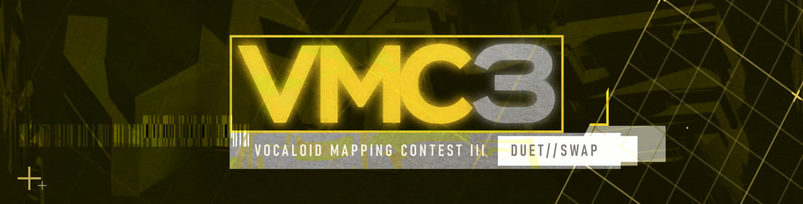

---
tags:
  - VMC3
  - VMC
---

# Vocaloid Mapping Contest 3

The **Vocaloid Mapping Contest** (***VMC***) was a beatmapping contest hosted by the Vocaloid Appreciation Team (VAT). Its purpose is to *promote VOCALOID, UTAU, and other vocal synth music*, giving both popular and overlooked songs a chance to shine.

Participants competed to create the *best beatmap possible*, with their entries judged by some of the most talented and respected VOCALOID-focused mappers in the osu! community.

This third iteration of the contest introduced a *multi-phase format* featuring the **PARALLEL**, **SWAP**, and **DUET** rounds. It also celebrates multiple Featured Artists whose songs were specifically chosen for the competition, along with continued support for every game mode.

## Contest schedule

| Event | Timestamp |
| --: | :-- |
| Announcement | 2025-10-05 |
| PARALLEL submission deadline | 2025-11-13 |
| Screening | 2025-11-13/2025-11-15 |
| SWAP submission deadline | 2025-12-07 |
| Judging | 2025-12-19/2025-01-02 |
| Results livestream | 2026-01-11 (18:00 UTC) |
| DUET submission deadline | 2026-03-01 |
| Judging | 2026-02-25/2026-03-18 |
| Results livestream | 2026-03-29 |

All deadlines end at 23:59 UTC.

The **results livestreams** were broadcast live on the [*Vocaloid Appreciation Team* Twitch channel](https://www.twitch.tv/vocaloidappreciationteam), with commentary and live reactions. Recordings are available on the [*Vocaloid Appreciation Team* YouTube channel](https://www.youtube.com/@VocaloidAppreciationTeam).

## Prizes

| Placing | Prize(s) |
| :-: | :-- |
| 1st | Two laptops (courtesy of ::**Noobie\1Potato**::{ user-id=15174655 }) for osu! mode winners, 6 months of osu!supporter, [contest points](/wiki/Contests/Contest_points), **VMC3 Winner** profile badge, entry fast-tracked to Ranked status |
| 2nd | 4 months of osu!supporter, [contest points](/wiki/Contests/Contest_points) |
| 3rd | 1 month of osu!supporter, [contest points](/wiki/Contests/Contest_points) |
| SWAP round winner | 4 months of osu!supporter, possible badge and/or [contest points](/wiki/Contests/Contest_points) |

## Links

- [Main website](https://www.vat.gg/things-we-do/mapping-contests/vmc3)
- [Discord server](https://discord.com/invite/EruvDHaReY)
- [Twitch channel](https://www.twitch.tv/vocaloidappreciationteam)
- [YouTube channel](https://www.youtube.com/@VocaloidAppreciationTeam)
- [Announcement news post](https://osu.ppy.sh/home/news/2025-10-05-vocaloid-mapping-contest-3)
- [Phase 1 results news post](https://osu.ppy.sh/home/news/2026-01-11-vocaloid-mapping-contest-3-phase-1-results-new-featured-artist-epiaeon)
- [Phase 2 results news post](https://osu.ppy.sh/home/news/2026-04-17-vocaloid-mapping-contest-3-results)
- [Phase 1 results announcement VOD](https://www.youtube.com/watch?v=7em6QqlrP9Q)
- [Phase 2 results announcement VOD](https://www.youtube.com/watch?v=ggkGNKPhbRs)
- **Contest listings**
  - [PARALLEL & SWAP round (osu!)](https://osu.ppy.sh/community/contests/261)
  - [PARALLEL & SWAP round (osu!taiko)](https://osu.ppy.sh/community/contests/262)
  - [PARALLEL & SWAP round (osu!catch)](https://osu.ppy.sh/community/contests/263)
  - [PARALLEL & SWAP round (osu!mania)](https://osu.ppy.sh/community/contests/264)
  - [DUET round (osu!)](https://osu.ppy.sh/community/contests/271)
  - [DUET round (osu!taiko)](https://osu.ppy.sh/community/contests/272)
  - [DUET round (osu!catch)](https://osu.ppy.sh/community/contests/273)
  - [DUET round (osu!mania)](https://osu.ppy.sh/community/contests/274)

## Phase 2 results

### osu! results

View the [maps and scores on the contest page](https://osu.ppy.sh/community/contests/271).\
View the [full judge comments on the judging spreadsheet](https://docs.google.com/spreadsheets/d/1RaDCueKmLPj9z_-c6s7Ry0eXqH2nhjSSQCoIMRa_SMk/edit?usp=sharing).

| # | Team | Entry | Results |
| :-: | :-- | :-- | :-- |
| 1st | ::{ flag=CN }:: ::Garden::{ user-id=2849992 } and ::{ flag=CN }:: ::iBell::{ user-id=4298072 } | [ePiaeon - FLOP ERA](https://assets.ppy.sh/user-contest-entries/17996/97536ec58a758d626ee6618d5cbc2c52df279b026792e3bff10689b1446eae08.osz) | [View](https://osu.ppy.sh/community/contests/271/entries/76558/results) |
| 2nd | ::{ flag=AU }:: ::nominomu::{ user-id=30485380 } and ::{ flag=LT }:: ::Amefystol::{ user-id=26748801 } | [ePiaeon - FLOP ERA](https://assets.ppy.sh/user-contest-entries/17862/623b160eb1dc6089cfc9d434fe8dc7e32a9045b66ee6f13282e66346f26cbd6e.osz) | [View](https://osu.ppy.sh/community/contests/271/entries/76554/results) |
| 3rd | ::{ flag=RU }:: ::alvearia::{ user-id=6248691 } and ::{ flag=RU }:: ::Daycore::{ user-id=5596337 } | [ePiaeon - FLOP ERA](https://assets.ppy.sh/user-contest-entries/17971/d9a77c140f1690260ef925ca78d438905055ae7d8f81cceb9e437e2604b222b7.osz) | [View](https://osu.ppy.sh/community/contests/271/entries/76557/results) |
| 4th | ::{ flag=TW }:: ::Alty::{ user-id=16407988 } and ::{ flag=JP }:: ::Phten02::{ user-id=16678364 } | [ePiaeon - FLOP ERA](https://assets.ppy.sh/user-contest-entries/17940/01b68cb359ec5f59932fcbb822a3bed7f73d0e7515c1733dbac1ec18caa4f157.osz) | [View](https://osu.ppy.sh/community/contests/271/entries/76556/results) |
| 5th | ::{ flag=ES }:: ::CebollaVladimir::{ user-id=15308238 } and ::{ flag=HK }:: ::Kyle Y::{ user-id=3565813 } | [ePiaeon - FLOP ERA](https://assets.ppy.sh/user-contest-entries/17921/2269e2487b185b25267ec2522fc60f5f5625a28f13602a1fc7241eb708649265.osz) | [View](https://osu.ppy.sh/community/contests/271/entries/76555/results) |

### osu!taiko results

View the [maps and scores on the contest page](https://osu.ppy.sh/community/contests/272).\
View the [full judge comments on the judging spreadsheet](https://docs.google.com/spreadsheets/d/1Xjw1uGK5_Ful_Dr9KCS6h7xVUyVxKNAjogMnjYBV7ss/edit?usp=sharing).

| # | Team | Entry | Results |
| :-: | :-- | :-- | :-- |
| 1st | ::{ flag=IT }:: ::chmekoe::{ user-id=7807444 } and ::{ flag=JP }:: ::uone::{ user-id=5321719 } | [ePiaeon - FLOP ERA](https://assets.ppy.sh/user-contest-entries/17946/fc4bfba0dfdf96474f441388512b4605ecb10c09db05a8069476210474508c50.osz) | [View](https://osu.ppy.sh/community/contests/272/entries/76566/results) |
| 2nd | ::{ flag=US }:: ::Molybdenum::{ user-id=14708449 } and ::{ flag=FR }:: ::Kin::{ user-id=480689 } | [ePiaeon - FLOP ERA](https://assets.ppy.sh/user-contest-entries/17978/6b856ffef813c033b594d64e165e6db289871296f7b06a42a1a9a24c1beea28d.osz) | [View](https://osu.ppy.sh/community/contests/272/entries/76570/results) |
| 3rd | ::{ flag=SG }:: ::\1gt::{ user-id=8301957 } and ::{ flag=HK }:: ::Irone OSU::{ user-id=10678230 } | [ePiaeon - FLOP ERA](https://assets.ppy.sh/user-contest-entries/17977/d2ddc577dccfc052aeccce61272761b9a9d43c66f8c231c9e22ac1dc1512ca52.osz) | [View](https://osu.ppy.sh/community/contests/272/entries/76569/results) |
| 4th | ::{ flag=FI }:: ::Jaltzu::{ user-id=2597417 } and ::{ flag=KR }:: ::SN707::{ user-id=31404061 } | [ePiaeon - FLOP ERA](https://assets.ppy.sh/user-contest-entries/17962/318e8d8174972813031cb49cd9ae08b21160425468f6bbdf1ba31bf69624351c.osz) | [View](https://osu.ppy.sh/community/contests/272/entries/76567/results) |
| 5th | ::{ flag=HK }:: ::Cynplytholowazy::{ user-id=3901754 } and ::{ flag=MY }:: ::MTNTWarz::{ user-id=14036825 } | [ePiaeon - FLOP ERA](https://assets.ppy.sh/user-contest-entries/17970/e2668ef9a52196a30e03b2bdcc81cf124e3dc90fa5f6033f4a5a2ef86d9ae489.osz) | [View](https://osu.ppy.sh/community/contests/272/entries/76568/results) |
| 6th | ::{ flag=EC }:: ::Foco\1::{ user-id=11481057 } and ::{ flag=EC }:: ::Gamelan4::{ user-id=9856910 } | [ePiaeon - FLOP ERA](https://assets.ppy.sh/user-contest-entries/17989/43d0390e788f6fe4b1d702a3fdfe8a0be7dd5aadb1c2fdbae3b1b7546b933de4.osz) | [View](https://osu.ppy.sh/community/contests/272/entries/76571/results) |
| 7th | ::{ flag=TW }:: ::Solor::{ user-id=25201175 } and ::{ flag=AU }:: ::Nintendo 64::{ user-id=30481748 } | [ePiaeon - FLOP ERA](https://assets.ppy.sh/user-contest-entries/17860/ae348c6a6a0585b2c39bd7d9b4acd1fc1348b44d19e642e0cd917ce2a7f488f2.osz) | [View](https://osu.ppy.sh/community/contests/272/entries/76565/results) |

### osu!catch results

Due to lack of participants, this round ended in no contest.

### osu!mania results

View the [maps and scores on the contest page](https://osu.ppy.sh/community/contests/274).\
View the [full judge comments on the judging spreadsheet](https://docs.google.com/spreadsheets/d/1bftw1GlZ6UKF7RtPT-C-DBM49kHNBLF3s3EZHVQVG7E/edit?usp=sharing).

| # | Team | Entry | Results |
| :-: | :-- | :-- | :-- |
| 1st | ::{ flag=RU }:: ::Kurisu Makise::{ user-id=2790640 } and ::{ flag=CN }:: ::Hoshimegu Mio::{ user-id=17753835 } | [ePiaeon - FLOP ERA](https://assets.ppy.sh/user-contest-entries/17924/befd38fb240c6b86739b6c9b5472dee6b2e416de3a0f72bee8c9b892903c0afd.osz) | [View](https://osu.ppy.sh/community/contests/274/entries/76560/results) |
| 2nd | ::{ flag=VN }:: ::Lott::{ user-id=13821222 } and ::{ flag=VN }:: ::Micleak::{ user-id=16140674 } | [ePiaeon - FLOP ERA](https://assets.ppy.sh/user-contest-entries/17993/cfd12baf72d4c3643ada347bc7382e4b5e408dcd68cc3bb049e1d3d67b48884c.osz) | [View](https://osu.ppy.sh/community/contests/274/entries/76563/results) |
| 3rd | ::{ flag=US }:: ::Znow::{ user-id=15513303 } and ::{ flag=MX }:: ::N4iveDx::{ user-id=21340543 } | [ePiaeon - FLOP ERA](https://assets.ppy.sh/user-contest-entries/17907/faf3ffca71ab0ee23696dd3e8336674db9dcd0707456c89f438c7187d450bf51.osz) | [View](https://osu.ppy.sh/community/contests/274/entries/76559/results) |
| 4th | ::{ flag=VN }:: ::GamerChris::{ user-id=36042814 } and ::{ flag=US }:: ::jazzman123::{ user-id=31943070 } | [ePiaeon - FLOP ERA](https://assets.ppy.sh/user-contest-entries/17965/82bbf1117497562b76cafcace105fe30b220137645a0ea8c3b5da8bdfdef9cdc.osz) | [View](https://osu.ppy.sh/community/contests/274/entries/76561/results) |
| 5th | ::{ flag=CA }:: ::xstra::{ user-id=13106165 } and ::{ flag=ID }:: ::Reihynn::{ user-id=16630515 } | [ePiaeon - FLOP ERA](https://assets.ppy.sh/user-contest-entries/17995/400a72a77b997213a8072617c9b1cf1f622c97ff3c97e166ff911ce3ea646bf8.osz) | [View](https://osu.ppy.sh/community/contests/274/entries/76564/results) |
| 6th | ::{ flag=US }:: ::y u::{ user-id=30360950 } and ::{ flag=JP }:: ::Kanomi::{ user-id=37694048 } | [ePiaeon - FLOP ERA](https://assets.ppy.sh/user-contest-entries/17992/56883cf047022b07e6dafeefeb667cc0d7bd07b5d9dfbf6121c07a0b01c5437a.osz) | [View](https://osu.ppy.sh/community/contests/274/entries/76562/results) |

## Phase 1 results

### osu! results

View the [maps and scores on the contest page](https://osu.ppy.sh/community/contests/261).\
View the [full judge comments on the judging spreadsheet](https://docs.google.com/spreadsheets/d/1LU46D4zfCN5QDLqe1qMmUhar5pkSc3-cIOu2X_g7_GQ/edit?usp=sharing).

| # | Team | Entry | Results |
| :-: | :-- | :-- | :-- |
| 1st | ::{ flag=CN }:: ::Garden::{ user-id=2849992 } and ::{ flag=CN }:: ::iBell::{ user-id=4298072 } | [Everything will be broken. & Darling](https://assets.ppy.sh/contests/261/entries/osz/Everything%20will%20be%20broken.%20%26%20Darling%20%28Garden%20and%20iBell%29.osz) | [View](https://osu.ppy.sh/community/contests/261/entries/66694/results) |
| 2nd | ::{ flag=ES }:: ::CebollaVladimir::{ user-id=15308238 } and ::{ flag=HK }:: ::Kyle Y::{ user-id=3565813 } | [Umitagari & imperfect person](https://assets.ppy.sh/contests/261/entries/osz/Umitagari%20%26%20imperfect%20person%20%28CebollaVladimir%20and%20Kyle%20Y%29.osz) | [View](https://osu.ppy.sh/community/contests/261/entries/66692/results) |
| 3rd | ::{ flag=RU }:: ::alvearia::{ user-id=6248691 } and ::{ flag=RU }:: ::Daycore::{ user-id=5596337 } | [Magical Doctor & Tatakina](https://assets.ppy.sh/contests/261/entries/osz/Magical%20Doctor%20%26%20Tatakina%20%28alvearia%20and%20Daycore%29.osz) | [View](https://osu.ppy.sh/community/contests/261/entries/66689/results) |
| 4th | ::{ flag=AU }:: ::nominomu::{ user-id=30485380 } and ::{ flag=LT }:: ::Amefystol::{ user-id=26748801 } | [imperfect person & Magical Doctor](https://assets.ppy.sh/contests/261/entries/osz/imperfect%20person%20%26%20Magical%20Doctor%20%28nominomu%20and%20Amefystol%29.osz) | [View](https://osu.ppy.sh/community/contests/261/entries/66695/results) |
| 5th | ::{ flag=CL }:: ::Evil-::{ user-id=10234313 } and ::{ flag=CL }:: ::Cris-::{ user-id=6175280 } | [New Darling & End Of Fake!](https://assets.ppy.sh/contests/261/entries/osz/New%20Darling%20%26%20End%20Of%20Fake%21%20%28Evil-%20and%20Cris-%29.osz) | [View](https://osu.ppy.sh/community/contests/261/entries/66693/results) |
| 6th | ::{ flag=TW }:: ::Alty::{ user-id=16407988 } and ::{ flag=JP }:: ::Phten02::{ user-id=16678364 } | [imperfect person & Darling](https://assets.ppy.sh/contests/261/entries/osz/imperfect%20person%20%26%20Darling%20%28Alty%20and%20Phten02%29.osz) | [View](https://osu.ppy.sh/community/contests/261/entries/66688/results) |
| 7th | ::{ flag=US }:: ::AndAda::{ user-id=10574844 } and ::{ flag=US }:: ::Sharqosity::{ user-id=6292234 } | [New Darling & imperfect person](https://assets.ppy.sh/contests/261/entries/osz/New%20Darling%20%26%20imperfect%20person%20%28AndAda%20and%20Sharqosity%29.osz) | [View](https://osu.ppy.sh/community/contests/261/entries/66690/results) |
| 8th | ::{ flag=GB }:: ::Asai Rumi::{ user-id=3399877 } and ::{ flag=KR }:: ::TetoTeTeto::{ user-id=17006877 } | [Mind Brand & Tatakina](https://assets.ppy.sh/contests/261/entries/osz/Mind%20Brand%20%26%20Tatakina%20%28Asai%20Rumi%20and%20TetoTeTeto%29.osz) | [View](https://osu.ppy.sh/community/contests/261/entries/66691/results) |

### osu!taiko results

View the [maps and scores on the contest page](https://osu.ppy.sh/community/contests/262).\
View the [full judge comments on the judging spreadsheet](https://docs.google.com/spreadsheets/d/1Xjw1uGK5_Ful_Dr9KCS6h7xVUyVxKNAjogMnjYBV7ss/edit?usp=sharing).

| # | Team | Entry | Results |
| :-: | :-- | :-- | :-- |
| 1st | ::{ flag=SG }:: ::\_gt::{ user-id=8301957 } and ::{ flag=HK }:: ::Irone OSU::{ user-id=10678230 } | [SIU & Everything will be broken.](https://assets.ppy.sh/contests/262/entries/osz/SIU%20%26%20Everything%20will%20be%20broken.%20%28_gt%20and%20Irone%20OSU%29.osz) | [View](https://osu.ppy.sh/community/contests/262/entries/66703/results) |
| 2nd | ::{ flag=FI }:: ::Jaltzu::{ user-id=2597417 } and ::{ flag=CA }:: ::SN707::{ user-id=31404061 } | [Tatakina & White Happy](https://assets.ppy.sh/contests/262/entries/osz/Tatakina%20%26%20White%20Happy%20%28Jaltzu%20and%20SN707%29.osz) | [View](https://osu.ppy.sh/community/contests/262/entries/66699/results) |
| 3rd | ::{ flag=US }:: ::Molybdenum::{ user-id=14708449 } and ::{ flag=FR }:: ::Kin::{ user-id=480689 } | [White Happy & feel empty!](https://assets.ppy.sh/contests/262/entries/osz/White%20Happy%20%26%20feel%20empty%21%20%28Molybdenum%20and%20Kin%29.osz) | [View](https://osu.ppy.sh/community/contests/262/entries/66700/results) |
| 4th | ::{ flag=HK }:: ::Cynplytholowazy::{ user-id=3901754 } and ::{ flag=MY }:: ::MTNTWarz::{ user-id=14036825 } | [imperfect person & Magical Doctor](https://assets.ppy.sh/contests/262/entries/osz/imperfect%20person%20%26%20Magical%20Doctor%20%28Cynplytholowazy%20and%20MTNTWarz%29.osz) | [View](https://osu.ppy.sh/community/contests/262/entries/66697/results) |
| 5th | ::{ flag=IT }:: ::chmekoe::{ user-id=7807444 } and ::{ flag=JP }:: ::uone::{ user-id=5321719 } | [White Happy & Tatakina](https://assets.ppy.sh/contests/262/entries/osz/White%20Happy%20%26%20Tatakina%20%28chmekoe%20and%20uone%29.osz) | [View](https://osu.ppy.sh/community/contests/262/entries/66696/results) |
| 6th | ::{ flag=TW }:: ::Solor::{ user-id=25201175 } and ::{ flag=AU }:: ::Nintendo 64::{ user-id=30481748 } | [End Of Fake! & Umitagari](https://assets.ppy.sh/contests/262/entries/osz/End%20Of%20Fake%21%20%26%20Umitagari%20%28Solor%20and%20Nintendo%2064%29.osz) | [View](https://osu.ppy.sh/community/contests/262/entries/66701/results) |
| 7th | ::{ flag=EC }:: ::Foco\_::{ user-id=11481057 } and ::{ flag=EC }:: ::Gamelan4::{ user-id=9856910 } | [Packet Hero & Everything will be broken.](https://assets.ppy.sh/contests/262/entries/osz/Packet%20Hero%20%26%20Everything%20will%20be%20broken.%20%28Foco_%20and%20Gamelan4%29.osz) | [View](https://osu.ppy.sh/community/contests/262/entries/66698/results) |
| 8th | ::{ flag=US }:: ::\_wholesome::{ user-id=19119172 } and ::{ flag=PL }:: ::h3oCharles::{ user-id=8712289 } | [Tatakina & Packet Hero](https://assets.ppy.sh/contests/262/entries/osz/Tatakina%20%26%20Packet%20Hero%20%28_wholesome%20and%20h3oCharles%29.osz) | [View](https://osu.ppy.sh/community/contests/262/entries/66704/results) |
| 9th | ::{ flag=JP }:: ::tasuke912::{ user-id=2774767 } and ::{ flag=JP }:: ::miyagishima::{ user-id=8027517 } | [Packet Hero & Tatakina](https://assets.ppy.sh/contests/262/entries/osz/Packet%20Hero%20%26%20Tatakina%20%28tasuke912%20and%20miyagishima%29.osz) | [View](https://osu.ppy.sh/community/contests/262/entries/66702/results) |

### osu!catch results

View the [maps and scores on the contest page](https://osu.ppy.sh/community/contests/263).\
View the [full judge comments on the judging spreadsheet](https://docs.google.com/spreadsheets/d/18kNgoiH1mHng1Yx0TQjcIVqTaLwgU9euGobwzvgtmMI/edit?usp=sharing).

| # | Team | Entry | Results |
| :-: | :-- | :-- | :-- |
| 1st | ::{ flag=CA }:: ::Unlucky\_w::{ user-id=4820793 } and ::{ flag=TN }:: ::-Ken::{ user-id=4430811 } | [Magical Doctor & Tatakina](https://assets.ppy.sh/contests/263/entries/osz/Magical%20Doctor%20%26%20Tatakina%20%28Unlucky_w%20and%20-Ken%29.osz) | [View](https://osu.ppy.sh/community/contests/263/entries/66707/results) |
| 2nd | ::{ flag=PL }:: ::Mniam::{ user-id=6050530 } and ::{ flag=KR }:: ::Spectator::{ user-id=702598 } | [End Of Fake! & New Darling](https://assets.ppy.sh/contests/263/entries/osz/End%20Of%20Fake%21%20%26%20New%20Darling%20%28Mniam%20and%20Spectator%29.osz) | [View](https://osu.ppy.sh/community/contests/263/entries/66705/results) |
| 3rd | ::{ flag=TW }:: ::Snow\_summer\_::{ user-id=15037158 } and ::{ flag=CA }:: ::SadEgg::{ user-id=10278243 } | [New Darling & Tatakina](https://assets.ppy.sh/contests/263/entries/osz/New%20Darling%20%26%20Tatakina%20%28Snow_summer_%20and%20SadEgg%29.osz) | [View](https://osu.ppy.sh/community/contests/263/entries/66706/results) |

### osu!mania results

View the [maps and scores on the contest page](https://osu.ppy.sh/community/contests/264).\
View the [full judge comments on the judging spreadsheet](https://docs.google.com/spreadsheets/d/1sPpcx49bUitY2oC-zrvR3SCN6dnE_t6gdRMqJVIhR3w/edit?usp=sharing).

| # | Team | Entry | Results |
| :-: | :-- | :-- | :-- |
| 1st | ::{ flag=VN }:: ::Lott::{ user-id=13821222 } and ::{ flag=VN }:: ::Micleak::{ user-id=16140674 } | [Everything will be broken. & PINK](https://assets.ppy.sh/contests/264/entries/osz/Everything%20will%20be%20broken.%20%26%20PINK%20%28Lott%20and%20Micleak%29.osz) | [View](https://osu.ppy.sh/community/contests/264/entries/66711/results) |
| 2nd | ::{ flag=CA }:: ::xstra::{ user-id=13106165 } and ::{ flag=ID }:: ::Reihynn::{ user-id=16630515 } | [Magical Doctor & imperfect person](https://assets.ppy.sh/contests/264/entries/osz/Magical%20Doctor%20%26%20imperfect%20person%20%28xstra%20and%20Reihynn%29.osz) | [View](https://osu.ppy.sh/community/contests/264/entries/66712/results) |
| 3rd | ::{ flag=RU }:: ::Kurisu Makise::{ user-id=2790640 } and ::{ flag=CN }:: ::Hoshimegu Mio::{ user-id=17753835 } | [Everything will be broken. & White Happy](https://assets.ppy.sh/contests/264/entries/osz/Everything%20will%20be%20broken.%20%26%20White%20Happy%20%28Kurisu%20Makise%20and%20Hoshimegu%20Mio%29.osz) | [View](https://osu.ppy.sh/community/contests/264/entries/66710/results) |
| 4th | ::{ flag=US }:: ::y u::{ user-id=30360950 } and ::{ flag=JP }:: ::Kanomi::{ user-id=37694048 } | [Tatakina & Scrumize](https://assets.ppy.sh/contests/264/entries/osz/Tatakina%20%26%20Scrumize%20%28y%20u%20and%20Kanomi%29.osz) | [View](https://osu.ppy.sh/community/contests/264/entries/66713/results) |
| 5th | ::{ flag=US }:: ::Znow::{ user-id=15513303 } and ::{ flag=MX }:: ::N4iveDx::{ user-id=21340543 } | [imperfect person & Coin Locker Baby](https://assets.ppy.sh/contests/264/entries/osz/imperfect%20person%20%26%20Coin%20Locker%20Baby%20%28Znow%20and%20N4iveDx%29.osz) | [View](https://osu.ppy.sh/community/contests/264/entries/66714/results) |
| 6th | ::{ flag=VN }:: ::GamerChris::{ user-id=36042814 } and ::{ flag=US }:: ::jazzman123::{ user-id=31943070 } | [Coin Locker Baby & imperfect person](https://assets.ppy.sh/contests/264/entries/osz/Coin%20Locker%20Baby%20%26%20imperfect%20person%20%28GamerChris%20and%20jazzman123%29.osz) | [View](https://osu.ppy.sh/community/contests/264/entries/66708/results) |
| 7th | ::{ flag=GB }:: ::Hydria::{ user-id=808176 } and ::{ flag=RU }:: ::-Enma-::{ user-id=34587251 } | [Coin Locker Baby & imperfect person](https://assets.ppy.sh/contests/264/entries/osz/Coin%20Locker%20Baby%20%26%20imperfect%20person%20%28Hydria%20and%20-Enma-%29.osz) | [View](https://osu.ppy.sh/community/contests/264/entries/66709/results) |

## Ruleset

- **Submissions must use songs from [**MARETU**'s Featured Artist listing](https://osu.ppy.sh/beatmaps/artists/504) and [**mimizu**'s Featured Artist listing](https://osu.ppy.sh/beatmaps/artists/505).** Cut versions are not allowed. Phase 2 Submissions must use [FLOP ERA](https://assets.ppy.sh/artists/519/FLOP%20ERA/ePiaeon%20-%20FLOP%20ERA.osz) from [**ePiaeon**'s Featured Artist Listing](https://osu.ppy.sh/beatmaps/artists/519).
- **Teams must submit a team roster anytime prior to submitting Round 1 entries.** Only teams of two are allowed to participate. Mappers may not participate solo. Teams may not be changed after roster submissions.
- **Submissions must be in `.osz` format.**
- **Beatmaps must follow the [ranking criteria](/wiki/Ranking_Criteria).** Minor mistakes (like an off-screen object) can be forgiven, but intentional unrankable elements will result in disqualification. An exception was made regarding large spread gaps in Phase 2.
- **Maps must remain anonymous** until after the results are announced. Metadata will be anonymized before judging.
- **No storyboards or videos** are to be included in submissions.
- **No manual `.osu` file edits** beyond what is possible in the editor.
- **Each `.osz` submission must include all required difficulties and songs for that round.** Be sure to follow the instructions on the submission page to avoid issues!
- **Collaborative difficulties should feature approximately equal contribution between both mappers.**
- **All aspects of each submission must be created solely be a member of the team.** As such, artificial intelligence (AI) is not permitted.

## Registration

- To participate, a team of two (2) mappers must be formed. There is no restriction on who you can have on your team, with limited exceptions:
  - No mappers may be restricted or contest/tournament banned.
  - Mappers cannot participate on more than one team.
  - Mappers may not be a judge, screener, or other staff for the contest.
- One member of the team will need to be the captain. This should be decided prior to signing up.
- One member of each team, at minimum, is required to join the [VAT Discord server](https://discord.com/invite/EruvDHaReY) in order to receive important contest updates.
- [**Register here**](https://form-auth.ppy.sh/form/vmc3-signups).

## Judging

The judging process is split between **Phase 1 (PARALLEL & SWAP Rounds)** and **Phase 2 (DUET Round)**. Each phase includes its own unique primary category, while all other criteria apply equally to both.

In Phase 1, each map for Song A is scored individually in Relevance, Creativity, Expertise, and Overall Impression. The scores in each criteria are added. Then, these two maps are put side to side a 'Uniqueness' score is added. This is worth 25% of the raw score. This process repeats for Song B. Song B's averaged criteria scores are then averaged with Song A's, which are then standardized to determine the final placements. 

In Phase 2, individual difficulties were weighted, with the higher difficulties being worth more. Details and formulas are available on the detailed judge spreadsheets.

| Criterion | Points | Description |
| :-: | :-: | :-- |
| **Phase 1 – Uniqueness** | **100** | How distinctive and innovative is the entry? Does it showcase fresh ideas that set it apart from typical mapping trends while feeling cohesive and enjoyable? |
| **Phase 2 – Cohesion** | **100** | How naturally do the swapped maps work as a single, unified entry? The final product should feel seamless and consistent despite being made by different team members. |
| **Relevance** | 100 | How well does the map fit the song? Are the gameplay elements fundamentally tied to the music? |
| **Creativity** | 60 | How bold and exciting are the mapper's ideas compared to current mapping trends? Does the map evoke reactions like "wow!" or "that's super interesting"? |
| **Expertise** | 60 | Technical skill, execution, and consistency of the map's design and structure. |
| **Overall Impression** | 80 | Subjective evaluation from the judging panel, factoring in personal enjoyment and interpretation. |

## Staff

| Role | User |
| :-: | :-- |
| Host | ::{ flag=US }:: ::-White::{ user-id=16276548 } |
| Special thanks | ::{ flag=US }:: ::Pishifat::{ user-id=3178418 }, ::{ flag=SE }:: ::Walavouchey::{ user-id=5773079 } |
| Designer | ::{ flag=CA }:: ::Kaetwo::{ user-id=1997719 } |

| Game mode | Phase 1 judges | Phase 2 judges |
| :-: | :-- | :-- |
| osu! | ::{ flag=CN }:: ::Mafumafu::{ user-id=3076909 }, ::{ flag=US }:: ::squishyguppy::{ user-id=4116573 }, ::{ flag=US }:: ::Noffy::{ user-id=1541323 }, ::{ flag=RU }:: ::NeKroMan4ik::{ user-id=11387664 }, ::{ flag=CN }:: ::Ryuusei Aika::{ user-id=7777875 }, ::{ flag=BY }:: ::Flins::{ user-id=11119539 }, ::{ flag=CA }:: ::Shanipika::{ user-id=6336729 } | ::{ flag=CN }:: ::Mafumafu::{ user-id=3076909 }, ::{ flag=US }:: ::squishyguppy::{ user-id=4116573 }, ::{ flag=US }:: ::Noffy::{ user-id=1541323 }, ::{ flag=RU }:: ::NeKroMan4ik::{ user-id=11387664 }, ::{ flag=CN }:: ::Ryuusei Aika::{ user-id=7777875 }, ::{ flag=BY }:: ::Flins::{ user-id=11119539 }, ::{ flag=CA }:: ::Shanipika::{ user-id=6336729 }, ::{ flag=BE }:: ::yaspo::{ user-id=4945926 } |
| osu!taiko | ::{ flag=US }:: ::Lumenite-::{ user-id=6256027 }, ::{ flag=RU }:: ::\_HeLLFly\_::{ user-id=14225226 }, ::{ flag=SG }:: ::arcpotato::{ user-id=12842392 }, ::{ flag=AT }:: ::Yasuho::{ user-id=8458835 } | ::{ flag=US }:: ::Lumenite-::{ user-id=6256027 }, ::{ flag=RU }:: ::\_HeLLFly\_::{ user-id=14225226 }, ::{ flag=SG }:: ::arcpotato::{ user-id=12842392 }, ::{ flag=AT }:: ::Yasuho::{ user-id=8458835 } |
| osu!catch | ::{ flag=NL }:: ::Chatie::{ user-id=6524765 }, ::{ flag=PH }:: ::Jemzuu::{ user-id=7890134 }, ::{ flag=NL }:: ::Greaper::{ user-id=2369776 }, ::{ flag=ES }:: ::Deif::{ user-id=318565 }, ::{ flag=AT }:: ::Daletto::{ user-id=7592136 } | N/A |
| osu!mania | ::{ flag=ID }:: ::Maxus::{ user-id=4335785 }, ::{ flag=US }:: ::Monoseul::{ user-id=16010604 }, ::{ flag=DO }:: ::Antalf::{ user-id=8793773 }, ::{ flag=CN }:: ::Carpihat::{ user-id=10085090 } | ::{ flag=AU }:: ::Decku::{ user-id=13360768 }, ::{ flag=US }:: ::Akasha-::{ user-id=16010604 }, ::{ flag=DO }:: ::Antalf::{ user-id=8793773 }, ::{ flag=ID }:: ::Ilham::{ user-id=3057154 }, ::{ flag=US }:: ::Unpredictable::{ user-id=7560872 } |

## Contest format

The **VMC3** consists of three unique phases: **PARALLEL**, **SWAP**, and **DUET**, each with distinct objectives and rules.

### PARALLEL round

- Teams of **two mappers** must be formed before submitting for this round.
- One mapper will select and map a song from **MARETU**, while the other will select and map a song from **mimizu**.
- **Each team must submit two (2) separate maps** by the round deadline — one for each chosen song.
- After submissions close, a short screening phase will occur.
  - Teams that are eliminated will be notified via osu! private message or Discord.

Tip: form your team and start planning early to avoid last-minute rushes. Plan ahead for future rounds when selecting your teammate.

### SWAP round

- Surviving teams will now **swap songs** with their partners:
  - For example, if Mapper A mapped Song #1 in the PARALLEL Round, they will now map Song #2, which Mapper B originally mapped.
- Each team must again submit **two (2) completely new maps**, one for each swapped song.
- **The twist:** These new maps must reflect a different interpretation of the songs than in the PARALLEL Round.
  - Maps that are overly similar to their original versions will receive heavy penalties during judging.
- If you are confident your team will survive the screening phase, you may begin work on this round before results are announced.

### DUET round

*Note: Due to a judging error, the top 7 osu!taiko teams advance to this round.*

- The **top 6 teams** from the SWAP Round advance to this final phase.
- Both team members will **collaborate directly** to create a **single cohesive mapset** for *FLOP ERA* by **ePiaeon**.
- **Every difficulty in the submission must be created collaboratively.**

This three-phase structure challenges teams to demonstrate:

- Individual skill and creativity in the PARALLEL Round,
- Adaptability and innovation in the SWAP Round, and
- Collaborative harmony and teamwork in the DUET Round finale.
