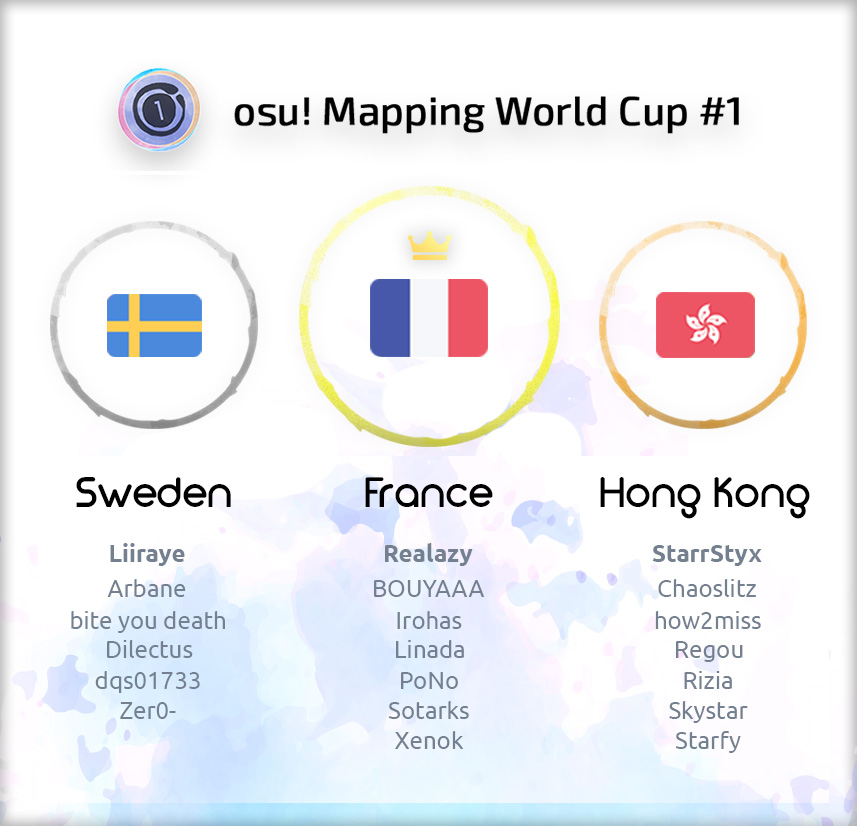

---
tags:
  - o!MWC
  - oMWC
---

# osu! Mapping World Cup #1

The **osu! Mapping World Cup #1** (***oMWC #1***) is a country-based osu! mapping contest hosted by ::{ flag=CA }:: ::Gabe::{ user-id=654108 }, ::{ flag=FR }:: ::Imakuri::{ user-id=6100837 } and ::{ flag=FR }:: ::Pachiru::{ user-id=2850983 }.

## Contest schedule

| Event | Timestamp |
| --: | :-- |
| Team ambassadors applications | 2018-12-11/2018-12-27 |
| Team pick-ups | 2018-12-27/2019-01-11 |
| Mapping phase | 2019-01-12/2019-02-09 |
| Judging phase | 2019-02-09/2019-03-09 |
| Final results | 2019-03-16 (21:00 UTC+0) |

## Prizes

| Placing | Prize(s) |
| :-: | :-- |
|  | 6 months of osu!supporter for each team member, profile badge |
|  | 4 months of osu!supporter for each team member |
|  | 2 months of osu! supporter for each team member |

## Organisation

The osu! Mapping World Cup is run by various community members.

| Position | Member(s) |
| :-- | :-- |
| Manager | ::{ flag=CA }:: ::Gabe::{ user-id=654108 }, ::{ flag=FR }:: ::Imakuri::{ user-id=6100837 }, ::{ flag=FR }:: ::Pachiru::{ user-id=2850983 } |
| Helper | ::{ flag=FR }:: ::-Arche::{ user-id=5352689 }, ::{ flag=US }:: ::hanfan::{ user-id=9886009 }, ::{ flag=FR }:: ::Jean-Michel Jr::{ user-id=4430948 }, ::{ flag=KR }:: ::Mitsunu::{ user-id=2970016 }, ::{ flag=FR }:: ::Nozhomi::{ user-id=2716981 }, ::{ flag=PH }:: ::Shizuku-::{ user-id=1125647 } |
| Caster | ::{ flag=CA }:: ::Azer::{ user-id=2155578 }, ::{ flag=US }:: ::BeasttrollMC::{ user-id=3171691 }, ::{ flag=US }:: ::Xexxar::{ user-id=2773526 } |
| Judge | ::{ flag=GB }:: ::-Mo-::{ user-id=2202163 }, ::{ flag=PK }:: ::DeRandom Otaku::{ user-id=5156153 }, ::{ flag=TH }:: ::Electoz::{ user-id=6485263 }, ::{ flag=CN }:: ::Hollow Wings::{ user-id=416662 }, ::{ flag=CH }:: ::Irreversible::{ user-id=1287964 }, ::{ flag=CN }:: ::Regraz::{ user-id=3076909 } |
| Reserve Judge | ::{ flag=DE }:: ::Smokeman::{ user-id=2140676 }, ::{ flag=DE }:: ::Yauxo::{ user-id=898306 }, ::{ flag=US }:: ::Xexxar::{ user-id=2773526 } |
| Designer | ::{ flag=FI }:: ::Micro::{ user-id=4801080 } |

## Links

- [Discussion thread](https://osu.ppy.sh/community/forums/topics/843987)
- [Livestream](https://www.twitch.tv/osumwc)
- [Discord server](https://discord.gg/DybsJTr)

## Participants

|  | Country | Members |
| :-: | :-: | :-- |
| ::{ flag=AU }:: ::{ flag=NZ }:: | **Australia - New Zealand** | **::xLolicore-::{ user-id=4525153 }**, [Flower](https://osu.ppy.sh/users/1033017), ::GranDSenpai::{ user-id=3997580 }, [my angel yayoi](https://osu.ppy.sh/users/3878832), ::Pentori::{ user-id=7452237 }, [Rizen](https://osu.ppy.sh/users/3056732), ::sahuang::{ user-id=5318910 } |
| ::{ flag=BR }:: | **Brazil** | **::Kuron-kun::{ user-id=2697284 }**, [Ataraxia](https://osu.ppy.sh/users/4077912), ::Kalindraz::{ user-id=2313166 }, [Seto Kousuke](https://osu.ppy.sh/users/2857314), ::Tarrasky::{ user-id=4098393 }, [Trynna](https://osu.ppy.sh/users/2652951) |
| ::{ flag=CA }:: | **Canada** | **::Monstrata::{ user-id=2706438 }**, [Azer](https://osu.ppy.sh/users/2155578), ::cococolaco::{ user-id=9579526 }, [J1_](https://osu.ppy.sh/users/5918561), ::jonathanlfj::{ user-id=270377 }, [Kibbleru](https://osu.ppy.sh/users/3193504), ::Sing::{ user-id=3795679 } |
| ::{ flag=CL }:: | **Chile** | **::Cloudchaser::{ user-id=1576498 }**, [Cris-](https://osu.ppy.sh/users/6175280), ::Crissa::{ user-id=5405836 }, [Tatan](https://osu.ppy.sh/users/5646529), ::TheShadowOfDark::{ user-id=5795337 }, [Uberzolik](https://osu.ppy.sh/users/1314547), ::wolf3211::{ user-id=5741153 } |
| ::{ flag=CN }:: | **China** | **::Karen::{ user-id=3143784 }**, [ak74](https://osu.ppy.sh/users/1231762), ::Crystal::{ user-id=1646397 }, [fanzhen0019](https://osu.ppy.sh/users/418699), ::Ryuusei Aika::{ user-id=7777875 }, [Syameimaru-Aya](https://osu.ppy.sh/users/3153354), ::yf\1bmp::{ user-id=1243669 } |
| ::{ flag=DK }:: | **Denmark** | **::Fuccho::{ user-id=3053382 }**, [Pennek](https://osu.ppy.sh/users/3723742), ::Spork Lover::{ user-id=3417469 }, [-Tochi](https://osu.ppy.sh/users/3664366), ::Waefwerf::{ user-id=3868653 } |
| ::{ flag=EG }:: | **Egypt** | **::Mohab500::{ user-id=10520912 }**, [moh_magdy](https://osu.ppy.sh/users/9431445), ::Nanachii::{ user-id=6995506 }, [RugMunch](https://osu.ppy.sh/users/7516879) |
| ::{ flag=FI }:: ::{ flag=EE }:: | **Finland - Estonia** | **::DTM9 Nowa::{ user-id=5428909 }**, [Jukkii](https://osu.ppy.sh/users/7318423), ::lewski::{ user-id=4980738 }, [Maffe](https://osu.ppy.sh/users/4773855), ::Makeli::{ user-id=3411824 }, [Samoyed](https://osu.ppy.sh/users/6796557), ::Xayler::{ user-id=3649657 } |
| ::{ flag=FR }:: | **France** | **::Realazy::{ user-id=918297 }**, [BOUYAAA](https://osu.ppy.sh/users/405449), ::Irohas::{ user-id=4403937 }, [Linada](https://osu.ppy.sh/users/5239047), ::PoNo::{ user-id=4610047 }, [Sotarks](https://osu.ppy.sh/users/4452992), ::Xenok::{ user-id=3256600 } |
| ::{ flag=DE }:: | **Germany** | **::Mao::{ user-id=2204515 }**, [deep fried ice](https://osu.ppy.sh/users/5410645), ::Lasse::{ user-id=896613 }, [Myxomatosis](https://osu.ppy.sh/users/2202645), ::Okoratu::{ user-id=1623405 }, [Zetera](https://osu.ppy.sh/users/587737) |
| ::{ flag=GR }:: | **Greece** | **::lcfc::{ user-id=7322726 }**, [awesomemacD](https://osu.ppy.sh/users/5589933), ::Genjuro::{ user-id=3196091 }, [Nikakis](https://osu.ppy.sh/users/4351739), ::Nokashi::{ user-id=5431196 }, [Riven](https://osu.ppy.sh/users/3638005) |
| ::{ flag=HK }:: | **Hong Kong** | **::StarrStyx::{ user-id=4600383 }**, [Chaoslitz](https://osu.ppy.sh/users/3621552), ::how2miss::{ user-id=4477199 }, [Regou](https://osu.ppy.sh/users/419954), ::Rizia::{ user-id=1367570 }, [Skystar](https://osu.ppy.sh/users/873961), ::Starfy::{ user-id=2045914 } |
| ::{ flag=HU }:: | **Hungary** | **::emu1337::{ user-id=2185987 }**, [Alexy the Cat](https://osu.ppy.sh/users/6985079), ::csaba21123::{ user-id=7764237 }, [Nidasimno](https://osu.ppy.sh/users/6799223), ::RatinA0::{ user-id=3436625 }, [Riknoob](https://osu.ppy.sh/users/4624788), ::sleepymateo::{ user-id=8996148 } |
| ::{ flag=ID }:: ::{ flag=SG }:: | **Indonesia - Singapore** | **::ScubDomino::{ user-id=8972308 }**, [handsome](https://osu.ppy.sh/users/2123087), ::Haruto::{ user-id=3772301 }, [Hinsvar](https://osu.ppy.sh/users/1249323), ::Niva::{ user-id=197805 }, [Prinsep](https://osu.ppy.sh/users/5004986), ::Yohanes::{ user-id=4075595 } |
| ::{ flag=IT }:: | **Italy** | **::felys::{ user-id=1759427 }**, [Leader](https://osu.ppy.sh/users/631530), ::MrSergio::{ user-id=2581696 }, [Nemis](https://osu.ppy.sh/users/1635091) |
| ::{ flag=JP }:: | **Japan** | **::Kloyd::{ user-id=1574070 }**, [a_Blue](https://osu.ppy.sh/users/5645667), ::Asahina Momoko::{ user-id=3650145 }, [caren_sk](https://osu.ppy.sh/users/542498), ::Lortus::{ user-id=1008962 }, [rrtyui](https://osu.ppy.sh/users/352328), ::Scaltinof::{ user-id=4796949 } |
| ::{ flag=MY }:: | **Malaysia** | **::Matsubara Kanon::{ user-id=1475828 }**, [Agagak](https://osu.ppy.sh/users/3645490), ::ffstar::{ user-id=1163205 }, [Rumia-](https://osu.ppy.sh/users/1787171), ::\1 -Scarlet- \1::{ user-id=2427693 } |
| ::{ flag=MX }:: | **Mexico** | **::Atsuro::{ user-id=2279351 }**, [Azuren](https://osu.ppy.sh/users/2164627), ::Gens::{ user-id=23062 }, [Gero](https://osu.ppy.sh/users/1467715), ::Luna-::{ user-id=1703474 }, [Side](https://osu.ppy.sh/users/3442339) |
| ::{ flag=NL }:: | **Netherlands** | **::Kyshiro::{ user-id=640611 }**, [appleeaterx](https://osu.ppy.sh/users/2407160), ::Ayu::{ user-id=1267151 }, [GladiOol](https://osu.ppy.sh/users/23326), ::happy30::{ user-id=27767 }, [Voli](https://osu.ppy.sh/users/2522275) |
| ::{ flag=NO }:: | **Norway** | **::Keada::{ user-id=2785549 }**, [DuskYui](https://osu.ppy.sh/users/4422457), ::-PC::{ user-id=2916414 }, [UrbanBeat](https://osu.ppy.sh/users/5302657), ::YokesPai::{ user-id=6399568 } |
| ::{ flag=PL }:: | **Poland** | **::Venix::{ user-id=5999631 }**, [Kalibe](https://osu.ppy.sh/users/3376777), ::Peter::{ user-id=8623835 }, [ReFaller](https://osu.ppy.sh/users/4841608), ::Rolniczy::{ user-id=8331132 }, [wa_](https://osu.ppy.sh/users/1572001), ::Yudragen::{ user-id=8406396 } |
| ::{ flag=RU }:: | **Russian Federation** | **::NeilPerry::{ user-id=841391 }**, [Jounzan](https://osu.ppy.sh/users/1848318), ::Mirash::{ user-id=2841009 }, [PandaHero](https://osu.ppy.sh/users/1233255), ::SENSEABEL::{ user-id=6184386 }, [Testo](https://osu.ppy.sh/users/5200881), ::Tokiko::{ user-id=2836455 } |
| ::{ flag=RS }:: ::{ flag=HR }:: ::{ flag=AT }:: | **Serbia - Croatia - Austria** | **::MaridiuS::{ user-id=4496961 }**, [DuckRadio](https://osu.ppy.sh/users/7731111), ::Fixxis::{ user-id=4673089 }, [Mazziv](https://osu.ppy.sh/users/2919725), ::Seni::{ user-id=4830261 }, [Tomadoi](https://osu.ppy.sh/users/5712451) |
| ::{ flag=KR }:: | **South Korea** | **::Beomsan::{ user-id=3626063 }**, [[C u r i]](https://osu.ppy.sh/users/4746949), ::Cellina::{ user-id=2490770 }, [Dailycare](https://osu.ppy.sh/users/1634445), ::eINess::{ user-id=3789302 }, [Nakagawa-Kanon](https://osu.ppy.sh/users/87065), ::Rose Pacifica::{ user-id=1393255 } |
| ::{ flag=SE }:: | **Sweden** | **::Liiraye::{ user-id=1280641 }**, [Arbane](https://osu.ppy.sh/users/4150829), ::bite you death::{ user-id=6398464 }, [Dilectus](https://osu.ppy.sh/users/4287454), ::dqs01733::{ user-id=3372459 }, [Zer0-](https://osu.ppy.sh/users/4260033) |
| ::{ flag=TW }:: | **Taiwan** | **::bossandy::{ user-id=360437 }**, [Flask](https://osu.ppy.sh/users/959763), ::Hey lululu::{ user-id=4086497 }, [knowledgeking](https://osu.ppy.sh/users/8022517), ::Loneight::{ user-id=663131 }, [Nerova Riuz GX](https://osu.ppy.sh/users/1557955), ::Silent Rock::{ user-id=4657504 } |
| ::{ flag=TN }:: | **Tunisia** | **::Lilyanna::{ user-id=8144098 }**, [-Ken](https://osu.ppy.sh/users/4430811), ::LegendOfWario::{ user-id=12293309 }, [Starset](https://osu.ppy.sh/users/6383137) |
| ::{ flag=GB }:: | **United Kingdom** | **::hypercyte::{ user-id=9155377 }**, [Alphabet](https://osu.ppy.sh/users/4879380), ::Apo11o::{ user-id=9558549 }, [Log Off Know](https://osu.ppy.sh/users/4378277), ::Mikii::{ user-id=3107791 }, [Turquoise-](https://osu.ppy.sh/users/7524046) |
| ::{ flag=US }:: | **United States** | **::Hobbes2::{ user-id=8157492 }**, [Axarious](https://osu.ppy.sh/users/2614511), ::Byfar::{ user-id=4674054 }, [Melloe](https://osu.ppy.sh/users/2367616), ::Nathan::{ user-id=4785223 }, [Toybot](https://osu.ppy.sh/users/2848604), ::Winber1::{ user-id=270328 } |
| ::{ flag=UA }:: | **Ukraine** | **::Sulfur::{ user-id=5297447 }**, [Aka](https://osu.ppy.sh/users/1307553), ::den0saur::{ user-id=5385151 }, [InternalLight](https://osu.ppy.sh/users/6221637) |
| ::{ flag=VN }:: | **Vietnam** | **::LMT::{ user-id=7262798 }**, [Asaiga](https://osu.ppy.sh/users/2959560), ::Kirylln::{ user-id=7228554 }, [Liyuchi](https://osu.ppy.sh/users/3275495), ::Shortthu::{ user-id=7985423 }, [Stormiverse](https://osu.ppy.sh/users/8705545) |

---

## Ruleset

### Contest rules

1. **The [osu! Ranking Criteria](/wiki/Ranking_criteria/osu!) and [General Ranking Criteria](/wiki/Ranking_criteria) are in effect for this contest** - The winning prize of the contest includes ranking the winning teams entries, which will be the 3 songs submitted by the team of mappers, we cannot do that if you don't obey the Ranking Criteria. Any required difficulties to fulfill the requirements of the Ranking Criteria will be supplied by the Organizer Team.
2. **4-7 members per team required** - The main concept of the contest is to show off each countries mapping possibilities. This means that collaboration will be a necessary concept between the team members.
3. **At least 2 mappers will have to collaborate PER SONG & each mapper will have to map at least 10% of the TOTAL DRAIN TIME for all 3 songs combined** - The main objective of this contest is to test each country in their ability to map and collaborate by using a variety of different song genres. How you organise the drain time beyond the required threshold is completely up to you.
4. **Copying other people’s work is strictly prohibited** - The whole point of the contest is to test each countries ability as a whole, therefore by copying others peoples work you’re not truthfully showing off what your country is capable of. If we, or the judges, find out work has been copied, your entire team will be disqualified.
5. **Sharing or asking for external help for your mapset before the set deadline ends, is strictly prohibited** - Doing so will automatically disqualify your team.
6. **Submissions will not be accepted after the deadline** - Everybody will have the same time to map the set so it will ultimately become really unfair if somebody had more time than the others, therefore any maps submitted after the deadline will be disqualified.
7. **Custom hitsounds are allowed, but none will be provided** - You are allowed, and even encouraged, to use custom hitsounds. Make sure they don’t overlap with your other difficulties, though. How you will organise them will be up to you.
8. **Changing the provided .mp3 file or timing of the .osu file is prohibited** - We want to avoid any complications during the judging process since you will be submitting only the .osu files rather than the full .osz.
9. **Storyboards are allowed, however they will not be taken into account during the judging process** - This is not a storyboarding contest.

### Questions and answers

1. **How does this contest work?**

   You will be tasked to work on 3 different songs, each will be from 3 different musical genres. You and your team have to work on the three songs as a collaboration difficulty. Each of you will have to map at least 10% of the total drain time of all 3 songs combined. When your team is done mapping, your Team Ambassador will send the entry as a PM to Imakuri or Pachiru (osu!forum or Discord). Your entries will then be judged, and results will be announced on a Twitch livestream after the judging phase is done.

2. **What will be the songs?**

   The songs will be revealed on January 12th on the Discord Server.

3. **“At least 2 mappers will have to collaborate PER SONG & each mapper will have to map at least 10% of the TOTAL DRAIN TIME for all 3 songs combined” - Does this mean that I have to map all 3 songs?**

   No, you as a contestant are given the freedom of choice on which song you’d like to participate/map in the most. You are required to map at least the 10% of the TOTAL drain time over the 3 songs, which basically means that you have to map 10% of the total drain time of all 3 songs combined. For example if all 3 songs combined come to 10 minutes of drain time (not length time) you will have to map at least 60 seconds of drain time spread across 1 song or all 3 songs if you choose to. Also 2 mappers are required PER SONG at the bare minimum, this is to ensure that the collaboration part of the contest is still retained.

4. **What is a “Team Ambassador”?**

   The Team Ambassadors are “country captains” who will be handpicked by the staff team from the Team Ambassador Submissions. They will be picked based on their mapping experience and their involvement in the mapping community. They will represent their country alongside their team. To confirm their picks, the Team Ambassador must send a PM to Imakuri or Pachiru (osu!forum or Discord). If one of the team members can’t partake in the contest, the Ambassadors have until January 11th to change their picks should they need to.

5. **What if my country doesn’t have a Team Ambassador?**

   Ambassador applications will end on December 27th. If nobody applied to be Ambassador for your country by then, you won’t be able to participate in the contest. Make sure to let mappers in your country know of this beforehand! The country you will be allowed to participate with will be based on your profile's flag. However, for some countries like Belgium–Luxembourg–Netherlands, also known as Benelux, and Australia–New Zealand, a merge is possible to fix the lack of mappers. The merging countries have to talk the same language (besides English if it isn't their countries' official language), or have to be neighbours.

6. **Can I have my own team for my country even if it already has one?**

   No. Each country will only have one Team Ambassador to represent it.

7. **Do I have to join the Discord server to participate?**

   Only the Team Ambassador is required to join the Discord server. The team members however are free to join or not. Although not joining will result in you missing out on important announcements and a private country text channel which will be ONLY available on the discord server.

8. **Can I join the Discord server even if I don’t want to participate in the contest?**

   Yes. There is a public link at the top of the forum post. Upon joining, you’ll be in the #arrival channel, where you will have to post your osu! profile link, and then a member of the staff/moderator will accept you.

9. **I’m restricted, can I still participate?**

   No. For the legitimacy of this contest; we can not accept restricted users.

10. **I am from Singapore but I have the Russian flag, can I belong to Singapore team?**

    No. You can only join the team of the country that is displayed on your osu! profile.
