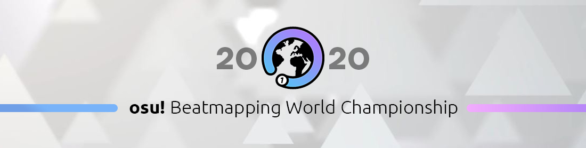

---
tags:
  - BWC
  - oBWC
  - o!BWC
---

# osu! Beatmapping World Championship 2020

The **osu! Beatmapping World Championship 2020** (***o!BWC 2020***) is a country-based osu! mapping contest hosted by ::{ flag=US }:: [Chaos](https://osu.ppy.sh/users/2628870), ::{ flag=FR }:: [Imakuri](https://osu.ppy.sh/users/6100837), ::{ flag=CN }:: [Mafumafu](https://osu.ppy.sh/users/3076909), ::{ flag=FR }:: [Nozhomi](https://osu.ppy.sh/users/2716981) and ::{ flag=FR }:: [Pachiru](https://osu.ppy.sh/users/2850983). Formerly referred to as *osu! Mapping World Cup*, the contest was renamed in order not to be confused with *[osu!mania World Cup](/wiki/Tournaments/MWC)* series due to their similarity in abbreviation.

## Contest schedule

| Event | Timestamp |
| --: | :-- |
| Announcements and Registration Phase | 2020-05-02/2020-05-15 |
| Voting Phase for Each Country's Team Captain | 2020-05-16/2020-05-22 |
| Team Building Phase | 2020-05-23/2020-05-29 |
| Qualifier Round - Mapping Phase | 2020-05-30/2020-06-12 |
| Qualifier Round - Judging Phase | 2020-06-14/2020-06-27 |
| Round of 16 - Mapping Phase | 2020-06-30/2020-07-12 |
| Round of 16 - Judging Phase | 2020-07-14/2020-07-21 |
| Quarterfinals - Mapping Phase | 2020-07-24/2020-08-07 |
| Quarterfinals - Judging Phase | 2020-08-09/2020-08-16 |
| Semifinals - Mapping Phase | 2020-08-19/2020-09-02 |
| Semifinals - Judging Phase | 2020-09-04/2020-09-12 |
| Finals and Grand Finals - Mapping Phase | 2020-09-15/2020-09-29 |
| Finals and Grand Finals - Judging Phase | 2020-10-01/2020-10-08 |
| Finals Livestream | 2020-10-17 (20:00 UTC+0) |

## Prizes

| Placing | Prize(s) |
| :-: | :-- |
|  | 8 months of osu!supporter for each team member, unique profile badge |
|  | 6 months of osu!supporter for each team member, unique profile badge |
|  | 4 months of osu! supporter for each team member, unique profile badge |

  

## Organisation

The osu! Beatmapping World Championship is run by various community members.

| Position | Member(s) |
| :-- | :-- |
| Manager | ::{ flag=US }:: [Chaos](https://osu.ppy.sh/users/2628870), ::{ flag=FR }:: [Imakuri](https://osu.ppy.sh/users/6100837), ::{ flag=CN }:: [Mafumafu](https://osu.ppy.sh/users/3076909), ::{ flag=FR }:: [Nozhomi](https://osu.ppy.sh/users/2716981), ::{ flag=FR }:: [Pachiru](https://osu.ppy.sh/users/2850983) |
| Web manager | ::{ flag=FR }:: [Imakuri](https://osu.ppy.sh/users/6100837), ::{ flag=CL }:: [Milan-](https://osu.ppy.sh/users/1052994) |
| Contributor | ::{ flag=TH }:: [Electoz](https://osu.ppy.sh/users/6485263), ::{ flag=AR }:: [juankristal](https://osu.ppy.sh/users/443656), ::{ flag=DE }:: [Smokeman](https://osu.ppy.sh/users/2140676), ::{ flag=DE }:: [Yauxo](https://osu.ppy.sh/users/898306) |
| Judge | ::{ flag=TH }:: [Electoz](https://osu.ppy.sh/users/6485263), ::{ flag=DE }:: [Myxo](https://osu.ppy.sh/users/2202645), ::{ flag=CN }:: [Ryuusei Aika](https://osu.ppy.sh/users/7777875), ::{ flag=BR }:: [Seto Kousuke](https://osu.ppy.sh/users/2857314), ::{ flag=BE }:: [Stack](https://osu.ppy.sh/users/6122935), ::{ flag=KR }:: [Sonnyc](https://osu.ppy.sh/users/11771), ::{ flag=BE }:: [yaspo](https://osu.ppy.sh/users/4945926) |
| Designer | ::{ flag=FR }:: [Imakuri](https://osu.ppy.sh/users/6100837), ::{ flag=CA }:: [Kaetwo](https://osu.ppy.sh/users/1997719), ::{ flag=ID }:: [Natsume Shiki](https://osu.ppy.sh/users/8972308) |
| Statistician | ::{ flag=CN }:: [Mafumafu](https://osu.ppy.sh/users/3076909), ::{ flag=FR }:: [Nozhomi](https://osu.ppy.sh/users/2716981) |
| Wiki editor | ::{ flag=TR }:: [Zeus-](https://osu.ppy.sh/users/5464437) |

## Links

- [Discussion thread](https://osu.ppy.sh/community/forums/topics/1060035)
- [Discord server](https://discord.gg/CZp4bNx)
- [Official website](https://obwc.net/)
- [Twitter](https://twitter.com/osubwc)
- [Pick'ems page](https://pickem.hwc.hr/tournaments/30) hosted by ::{ flag=DE }:: [hallowatcher](https://osu.ppy.sh/users/1874761)
- [Livestream](https://www.twitch.tv/osubwc)

## Participants

|  | Country | Members |
| :-: | :-: | :-- |
| ::{ flag=AR }:: | **Argentina** | **[MaestroSplinter](https://osu.ppy.sh/users/6707918)**, [chucentry](https://osu.ppy.sh/users/2498731), [Lince Cosmico](https://osu.ppy.sh/users/6070370), [Megafan](https://osu.ppy.sh/users/6632605) |
| ::{ flag=AU }:: | **Australia** | **[xLolicore-](https://osu.ppy.sh/users/4525153)**, [- Heatwave -](https://osu.ppy.sh/users/4166621), [Cubby](https://osu.ppy.sh/users/10914582), [Pentori](https://osu.ppy.sh/users/7452237), [Xayah](https://osu.ppy.sh/users/5174427), [YelloJello](https://osu.ppy.sh/users/9285180) |
| ::{ flag=BR }:: | **Brazil** | **[Net0](https://osu.ppy.sh/users/5099768)**, [Enerugi](https://osu.ppy.sh/users/4475985), [Faito](https://osu.ppy.sh/users/9706291), [Kowari](https://osu.ppy.sh/users/5404892), [Maot](https://osu.ppy.sh/users/3914271), [Sakura Airi](https://osu.ppy.sh/users/8682057), [Trynna](https://osu.ppy.sh/users/2652951) |
| ::{ flag=CA }:: | **Canada** | **[J1\_](https://osu.ppy.sh/users/5918561)**, [Agatsu](https://osu.ppy.sh/users/5579871), [coco](https://osu.ppy.sh/users/9579526), [nayarii](https://osu.ppy.sh/users/5286409), [Sing](https://osu.ppy.sh/users/3795679), [Sparhten](https://osu.ppy.sh/users/7601720), [Xen](https://osu.ppy.sh/users/4026817) |
| ::{ flag=CL }:: | **Chile** | **[Cris-](https://osu.ppy.sh/users/6175280)**, [Cayssa](https://osu.ppy.sh/users/8714413), [Crissa](https://osu.ppy.sh/users/5405836), [kanocchi](https://osu.ppy.sh/users/2321050), [Tatan](https://osu.ppy.sh/users/5646529) |
| ::{ flag=CN }:: | **China** | **[Moecho](https://osu.ppy.sh/users/5075660)**, [Bellicose](https://osu.ppy.sh/users/4298072), [buhei](https://osu.ppy.sh/users/1371514), [Firika](https://osu.ppy.sh/users/9590557), [Quantum Rosta](https://osu.ppy.sh/users/4814169), [Suiyu](https://osu.ppy.sh/users/3143784), [Yugu](https://osu.ppy.sh/users/3161834) |
| ::{ flag=DK }:: | **Denmark** | **[Striderin](https://osu.ppy.sh/users/10193902)**, [Akayume](https://osu.ppy.sh/users/10617530), [iamVill](https://osu.ppy.sh/users/6295380), [melon boy](https://osu.ppy.sh/users/3053382), [Morrighan](https://osu.ppy.sh/users/12042090), [waefwerf](https://osu.ppy.sh/users/3868653) |
| ::{ flag=EE }:: | **Estonia** | **[Xayler](https://osu.ppy.sh/users/3649657)**, [Fukada Eimi](https://osu.ppy.sh/users/6063342), [iljaaz](https://osu.ppy.sh/users/8501291), [Namki](https://osu.ppy.sh/users/5248582) |
| ::{ flag=FR }:: | **France** | **[Realazy](https://osu.ppy.sh/users/918297)**, [BOUYAAA](https://osu.ppy.sh/users/405449), [Halgoh](https://osu.ppy.sh/users/4109923), [PoNo](https://osu.ppy.sh/users/4610047), [Sharu](https://osu.ppy.sh/users/5597639), [Sotarks](https://osu.ppy.sh/users/4452992) |
| ::{ flag=DE }:: | **Germany** | **[Mao](https://osu.ppy.sh/users/2204515)**, [Icekalt](https://osu.ppy.sh/users/5410645), [Lasse](https://osu.ppy.sh/users/896613), [Okoratu](https://osu.ppy.sh/users/1623405), [Smokeman](https://osu.ppy.sh/users/2140676), [Zetera](https://osu.ppy.sh/users/587737) |
| ::{ flag=HK }:: | **Hong Kong** | **[GIDZ](https://osu.ppy.sh/users/2286528)**, [gary00737](https://osu.ppy.sh/users/6029467), [GodKei](https://osu.ppy.sh/users/2542623), [KwAIMSuckASFuk](https://osu.ppy.sh/users/9629457), [My Angel Jeremy](https://osu.ppy.sh/users/10038441), [Petal](https://osu.ppy.sh/users/7354729), [RVMathew](https://osu.ppy.sh/users/3718151) |
| ::{ flag=ID }:: | **Indonesia** | **[Ciyus Miapah](https://osu.ppy.sh/users/2805457)**, [Creamy Candy](https://osu.ppy.sh/users/9769199), [gokugohan12468](https://osu.ppy.sh/users/2013571), [William K](https://osu.ppy.sh/users/2261651) |
| ::{ flag=IT }:: | **Italy** | **[Nemis](https://osu.ppy.sh/users/1635091)**, [Bonzi](https://osu.ppy.sh/users/1313969), [Manu028](https://osu.ppy.sh/users/6192633), [Minion24](https://osu.ppy.sh/users/10021819), [Shiino](https://osu.ppy.sh/users/9839375), [Shoenen](https://osu.ppy.sh/users/6404824), [Vereor Nox](https://osu.ppy.sh/users/9571064) |
| ::{ flag=JP }:: | **Japan** | **[Kloyd](https://osu.ppy.sh/users/1574070)**, [-Brethia](https://osu.ppy.sh/users/4698485), [KogumaX](https://osu.ppy.sh/users/525262), [Livia](https://osu.ppy.sh/users/1298844), [tukamoto7km](https://osu.ppy.sh/users/1441049) |
| ::{ flag=LV }:: | **Latvia** | **[SquareTude](https://osu.ppy.sh/users/6280862)**, [waywern2012](https://osu.ppy.sh/users/5870453), [Voxargenteae](https://osu.ppy.sh/users/10774235) |
| ::{ flag=MY }:: | **Malaysia** | **[HootOwlStar](https://osu.ppy.sh/users/4341302)**, [RyoKazuka](https://osu.ppy.sh/users/6258586), [ShinHemG](https://osu.ppy.sh/users/10994474) |
| ::{ flag=MX }:: | **Mexico** | **[Gero](https://osu.ppy.sh/users/1467715)**, [Atsuro](https://osu.ppy.sh/users/2279351), [Luna-](https://osu.ppy.sh/users/1703474), [Side](https://osu.ppy.sh/users/3442339), [Underforest](https://osu.ppy.sh/users/6753180) |
| ::{ flag=NO }:: | **Norway** | **[YokesPai](https://osu.ppy.sh/users/6399568)**, [-PC](https://osu.ppy.sh/users/2916414), [CXu](https://osu.ppy.sh/users/84841), [Fisky](https://osu.ppy.sh/users/8352623), [Sebu](https://osu.ppy.sh/users/3990173) |
| ::{ flag=PH }:: | **Philippines** | **[-Aqua](https://osu.ppy.sh/users/7150015)**, [\_xyliac](https://osu.ppy.sh/users/7989480), [Flake](https://osu.ppy.sh/users/7627157), [newton-](https://osu.ppy.sh/users/5875419), [samosita](https://osu.ppy.sh/users/6090289), [Shizuku-](https://osu.ppy.sh/users/1125647), [xidorn](https://osu.ppy.sh/users/7904667) |
| ::{ flag=PL }:: | **Poland** | **[Venix](https://osu.ppy.sh/users/5999631)**, [Kalibe](https://osu.ppy.sh/users/3376777), [Peter](https://osu.ppy.sh/users/8623835), [Rolniczy](https://osu.ppy.sh/users/8331132), [SaltyLucario](https://osu.ppy.sh/users/6571670), [Yudragen](https://osu.ppy.sh/users/8406396), [Zelq](https://osu.ppy.sh/users/8953955) |
| ::{ flag=RO }:: | **Romania** | **[Tony](https://osu.ppy.sh/users/404169)**, [entsetzen](https://osu.ppy.sh/users/10261883), [MaddaFakka-sama](https://osu.ppy.sh/users/6584266) |
| ::{ flag=RU }:: | **Russian Federation** | **[Senseabel](https://osu.ppy.sh/users/6184386)**, [Cappu](https://osu.ppy.sh/users/6754712), [Frakturehawkens](https://osu.ppy.sh/users/7458583), [Ksardas](https://osu.ppy.sh/users/6115007), [NeilPerry](https://osu.ppy.sh/users/841391), [PandaHero](https://osu.ppy.sh/users/1233255), [xbopost](https://osu.ppy.sh/users/6842421) |
| ::{ flag=SG }:: | **Singapore** | **[\_Meep\_](https://osu.ppy.sh/users/4315188)**, [Mocaotic](https://osu.ppy.sh/users/9487458), [neonat](https://osu.ppy.sh/users/1561995), [P4ndemonium](https://osu.ppy.sh/users/6639059), [Sinnoh](https://osu.ppy.sh/users/4236057), [sorciere](https://osu.ppy.sh/users/2500099) |
| ::{ flag=KR }:: | **South Korea** | **[Heilia](https://osu.ppy.sh/users/9823042)**, [Acyl](https://osu.ppy.sh/users/1943309), [Cellina](https://osu.ppy.sh/users/2490770), [Dailycare](https://osu.ppy.sh/users/1634445), [Down](https://osu.ppy.sh/users/4694602), [jieusieu](https://osu.ppy.sh/users/759439), [Luscent](https://osu.ppy.sh/users/2688581) |
| ::{ flag=SE }:: | **Sweden** | **[Liiraye](https://osu.ppy.sh/users/1280641)**, [\[ Couch \] Lite](https://osu.ppy.sh/users/4316633), [Arbane](https://osu.ppy.sh/users/4150829), [Dilectus](https://osu.ppy.sh/users/4287454), [dqs01733](https://osu.ppy.sh/users/3372459), [Melwoine](https://osu.ppy.sh/users/12091109), [Zer0-](https://osu.ppy.sh/users/4260033) |
| ::{ flag=CH }:: | **Switzerland** | **[Irreversible](https://osu.ppy.sh/users/1287964)**, [\[ryuu\]](https://osu.ppy.sh/users/5698467), [NoFC](https://osu.ppy.sh/users/9713839), [TicClick](https://osu.ppy.sh/users/672931) |
| ::{ flag=TW }:: | **Taiwan** | **[Hey lululu](https://osu.ppy.sh/users/4086497)**, [- AzRaeL -](https://osu.ppy.sh/users/10027577), [Flask](https://osu.ppy.sh/users/959763), [GfMRT](https://osu.ppy.sh/users/3163649), [knowledgeking](https://osu.ppy.sh/users/8022517), [Nerova Riuz GX](https://osu.ppy.sh/users/1557955), [Silent Rock](https://osu.ppy.sh/users/4657504) |
| ::{ flag=TR }:: | **Turkey** | **[skytuna](https://osu.ppy.sh/users/9079936)**, [bigbirb-](https://osu.ppy.sh/users/11285985), [Entry](https://osu.ppy.sh/users/10213311), [Fursum](https://osu.ppy.sh/users/4865030), [Lugu](https://osu.ppy.sh/users/12851847), [mezelyus](https://osu.ppy.sh/users/5938859), [Nymphe](https://osu.ppy.sh/users/10507407) |
| ::{ flag=UA }:: | **Ukraine** | **[Tsumugi-chan](https://osu.ppy.sh/users/7586512)**, [allein](https://osu.ppy.sh/users/6221637), [Ayla](https://osu.ppy.sh/users/4548264), [Dafiely](https://osu.ppy.sh/users/7197186), [den0saur](https://osu.ppy.sh/users/5385151), [Sulfur](https://osu.ppy.sh/users/5297447), [PantyDev](https://osu.ppy.sh/users/5420543) |
| ::{ flag=GB }:: | **United Kingdom** | **[hypercyte](https://osu.ppy.sh/users/9155377)**, [Aistre](https://osu.ppy.sh/users/4879380), [Altai](https://osu.ppy.sh/users/5745865), [Chugger](https://osu.ppy.sh/users/4491713), [DeviousPanda](https://osu.ppy.sh/users/4966334), [pocket-](https://osu.ppy.sh/users/6808091), [Yusomi](https://osu.ppy.sh/users/4174940) |
| ::{ flag=US }:: | **United States** | **[vikala](https://osu.ppy.sh/users/2848604)**, [Axarious](https://osu.ppy.sh/users/2614511), [byfar](https://osu.ppy.sh/users/4674054), [captin1](https://osu.ppy.sh/users/689997), [IOException](https://osu.ppy.sh/users/2688103), [melloe](https://osu.ppy.sh/users/2367616), [not very smart](https://osu.ppy.sh/users/3696423) |
| ::{ flag=VN }:: | **Vietnam** | **[LMT](https://osu.ppy.sh/users/7262798)**, [Asaiga](https://osu.ppy.sh/users/2959560), [Hikan](https://osu.ppy.sh/users/7968702), [Kirylln](https://osu.ppy.sh/users/7228554), [Liyuchi](https://osu.ppy.sh/users/3275495), [Pandano](https://osu.ppy.sh/users/7696558), [Smug Nanachi](https://osu.ppy.sh/users/10063190) |

## Podium

## Results

### Finals

Grand Final song: **[Zekk](https://osu.ppy.sh/beatmaps/artists/76) - Let Me Hear**

| Team 1 |  |  | Team 2 | Entries |
| --: | :-: | :-: | :-- | :-- |
| Argentina ::{ flag=AR }:: | 3 | **4** | ::{ flag=GB }:: **United Kingdom** | [#1](https://osu.ppy.sh/beatmapsets/1280480#osu/2659858), [#2](https://osu.ppy.sh/beatmapsets/1280467#osu/2659837) |

3rd Place Final song: **[Cranky](https://osu.ppy.sh/beatmaps/artists/23) - Flugel**

| Team 1 |  |  | Team 2 | Entries |
| --: | :-: | :-: | :-- | :-- |
| **Brazil** ::{ flag=BR }:: | **4** | 3 | ::{ flag=RU }:: Russian Federation | [#1](https://osu.ppy.sh/beatmapsets/1280436#osu/2659781), [#2](https://osu.ppy.sh/beatmapsets/1281199#osu/2661154) |

### Semifinals

**[Download all entries here! (31 MB)](https://obwc.net/api/results/downloadZip/4)**

Songs:

- **[LeaF](https://osu.ppy.sh/beatmaps/artists/73) - Kyouki Ranbu**
- **[Blankfield](https://osu.ppy.sh/beatmaps/artists/80) - Start From Zero**
- **[Rohi](https://osu.ppy.sh/beatmaps/artists/82) - Hitotsu no Chikai yo, Eien no Uta to Nare**

| Team 1 |  |  | Team 2 | Entries |
| --: | :-: | :-: | :-- | :-- |
| **Argentina** ::{ flag=AR }:: | **6** | 1 | ::{ flag=BR }:: Brazil | [#1](https://osu.ppy.sh/beatmapsets/1257585#osu/2613178), [#2](https://osu.ppy.sh/beatmapsets/1257559#osu/2613137) |
| **United Kingdom** ::{ flag=GB }:: | **5** | 2 | ::{ flag=RU }:: Russian Federation | [#1](https://osu.ppy.sh/beatmapsets/1257572#osu/2613160), [#2](https://osu.ppy.sh/beatmapsets/1283236#osu/2665037) |

### Quarterfinals

**[Download all entries here! (86 MB)](https://obwc.net/api/results/downloadZip/3)**

Songs:

- **[Teminite](https://osu.ppy.sh/beatmaps/artists/64) - Hot Fizz**
- **[False Noise](https://osu.ppy.sh/beatmaps/artists/52) - Space Angel**
- **[Venetian Snares](https://osu.ppy.sh/beatmaps/artists/71) - Shaky Sometimes**

| Team 1 |  |  | Team 2 | Entries |
| --: | :-: | :-: | :-- | :-- |
| France ::{ flag=FR }:: | 1 | **6** | ::{ flag=AR }:: **Argentina** | [#1](https://osu.ppy.sh/beatmapsets/1239841#osu/2577703), [#2](https://osu.ppy.sh/beatmapsets/1238432#osu/2574916) |
| Vietnam ::{ flag=VN }:: | 3 | **4** | ::{ flag=BR }:: **Brazil** | [#1](https://osu.ppy.sh/beatmapsets/1238414#osu/2574882), [#2](https://osu.ppy.sh/beatmapsets/1238421#osu/2574898) |
| **United Kingdom** ::{ flag=GB }:: | **7** | 0 | ::{ flag=AU }:: Australia | [#1](https://osu.ppy.sh/beatmapsets/1238417#osu/2574885), [#2](https://osu.ppy.sh/beatmapsets/1238448#osu/2574943) |
| South Korea ::{ flag=KR }:: | 3 | **4** | ::{ flag=RU }:: **Russian Federation** | [#1](https://osu.ppy.sh/beatmapsets/1238608#osu/2575217), [#2](https://osu.ppy.sh/beatmapsets/1238422#osu/2574902) |

### Round of 16

**[Download all entries here! (119 MB)](https://obwc.net/api/results/downloadZip/2)**

Songs:

- **[Dictate](https://osu.ppy.sh/beatmaps/artists/21) - Melodik (Short Ver.)**
- **[Thank You Scientist](https://osu.ppy.sh/beatmaps/artists/83) - Wrinkle**
- **[Nekrogoblikon](https://osu.ppy.sh/beatmaps/artists/53) - Killing Time (and Space)**

| Team 1 |  |  | Team 2 | Entries |
| --: | :-: | :-: | :-- | :-- |
| **France** ::{ flag=FR }:: | **5** | 0 | ::{ flag=IT }:: Italy | [#1](https://osu.ppy.sh/beatmapsets/1230014#osu/2557291), [#2](https://osu.ppy.sh/beatmapsets/1220485#osu/2538865) |
| China ::{ flag=CN }:: | 2 | **3** | ::{ flag=AR }:: **Argentina** | [#1](https://osu.ppy.sh/beatmapsets/1219829#osu/2537709), [#2](https://osu.ppy.sh/beatmapsets/1219826#osu/2537703) |
| **Vietnam** ::{ flag=VN }:: | **3** | 2 | ::{ flag=CA }:: Canada | [#1](https://osu.ppy.sh/beatmapsets/1219819#osu/2537685), [#2](https://osu.ppy.sh/beatmapsets/1219830#osu/2537710) |
| Sweden ::{ flag=SE }:: | 2 | **3** | ::{ flag=BR }:: **Brazil** | [#1](https://osu.ppy.sh/beatmapsets/1219814#osu/2537680), [#2](https://osu.ppy.sh/beatmapsets/1219789#osu/2537638) |
| **United Kingdom** ::{ flag=GB }:: | **4** | 1 | ::{ flag=US }:: United States | [#1](https://osu.ppy.sh/beatmapsets/1219797#osu/2537649), [#2](https://osu.ppy.sh/beatmapsets/1219828#osu/2537708) |
| **Australia** ::{ flag=AU }:: | **3** | 2 | ::{ flag=NO }:: Norway | [#1](https://osu.ppy.sh/beatmapsets/1219865#osu/2537757), [#2](https://osu.ppy.sh/beatmapsets/1219818#osu/2537684) |
| **South Korea** ::{ flag=KR }:: | **3** | 2 | ::{ flag=DK }:: Denmark | [#1](https://osu.ppy.sh/beatmapsets/1219841#osu/2537728), [#2](https://osu.ppy.sh/beatmapsets/1219803#osu/2537657) |
| Poland ::{ flag=PL }:: | 2 | **3** | ::{ flag=RU }:: **Russian Federation** | [#1](https://osu.ppy.sh/beatmapsets/1282826#osu/2664297), [#2](https://osu.ppy.sh/beatmapsets/1220263#osu/2538492) |

### Qualifiers

*For scoring details, see the [qualifiers leaderboard](https://obwc.net/results/qualifiers) on the contest website.*

**[Download all entries here! (219 MB)](https://obwc.net/api/results/downloadZip/1)**

Song: **[MDK](https://osu.ppy.sh/beatmaps/artists/61) - Press Start**

| Rank | Team | Score |
| :-- | :-- | :-- |
| 1 | ::{ flag=FR }:: **France** | 7.0913 |
| 2 | ::{ flag=GB }:: **United Kingdom** | 5.8987 |
| 3 | ::{ flag=KR }:: **South Korea** | 5.8584 |
| 4 | ::{ flag=VN }:: **Vietnam** | 4.8331 |
| 5 | ::{ flag=SE }:: **Sweden** | 4.2344 |
| 6 | ::{ flag=PL }:: **Poland** | 3.9045 |
| 7 | ::{ flag=AU }:: **Australia** | 3.3529 |
| 8 | ::{ flag=CN }:: **China** | 2.7021 |
| 9 | ::{ flag=AR }:: **Argentina** | 2.6037 |
| 10 | ::{ flag=NO }:: **Norway** | 2.1734 |
| 11 | ::{ flag=RU }:: **Russian Federation** | 2.1059 |
| 12 | ::{ flag=BR }:: **Brazil** | 1.7696 |
| 13 | ::{ flag=CA }:: **Canada** | 1.6234 |
| 14 | ::{ flag=DK }:: **Denmark** | 1.2943 |
| 15 | ::{ flag=US }:: **United States** | 1.2310 |
| 16 | ::{ flag=IT }:: **Italy** | 1.1722 |
| 17 | ::{ flag=MX }:: Mexico | 0.3136 |
| 18 | ::{ flag=CH }:: Switzerland | -0.1979 |
| 19 | ::{ flag=DE }:: Germany | -0.5379 |
| 20 | ::{ flag=PH }:: Philippines | -1.6944 |
| 21 | ::{ flag=SG }:: Singapore | -2.0565 |
| 22 | ::{ flag=EE }:: Estonia | -2.3241 |
| 23 | ::{ flag=TW }:: Taiwan | -2.7789 |
| 24 | ::{ flag=HK }:: Hong Kong | -2.7816 |
| 25 | ::{ flag=CL }:: Chile | -3.5997 |
| 26 | ::{ flag=TR }:: Turkey | -4.0674 |
| 27 | ::{ flag=ID }:: Indonesia | -4.1833 |
| 28 | ::{ flag=JP }:: Japan | -4.5266 |
| 29 | ::{ flag=RO }:: Romania | -5.0928 |
| 30 | ::{ flag=LV }:: Latvia | -8.5058 |
| 31 | ::{ flag=MY }:: Malaysia | -9.8156 |

## Ruleset

### Contest rules

1. **The [osu! Ranking Criteria](/wiki/Ranking_criteria/osu!) and [General Ranking Criteria](/wiki/Ranking_criteria) are in effect for this contest** - The winning prize of the contest includes ranking the winning teams' entries, which will be the 3 songs submitted by the team of mappers, which we cannot do if you don't obey the Ranking Criteria. Any required difficulties to fulfill the requirements of the Ranking Criteria will be supplied by the Organizer Team.
2. **3-7 members per team required** - The main concept of the contest is to show off each country's mapping capabilities. This means that a collaboration of at least 2 members on each song will be required from the team members. How you organise the map parts is completely up to you.
3. **Each mapper must contribute at least once during the contest** - We want each team to be fairly rewarded for their hard work, which means we don't want any winning teams to have one or more members that do not contribute during the contest.
4. **Copying other people's work is strictly prohibited** - The whole point of the contest is to test each country's ability as a whole, therefore by copying other people's work you're not truthfully showing off what your country is capable of. If we, or the judges, find out that work has been copied, your entire team will be disqualified.
5. **Sharing or asking for external help with your mapset before the set deadline ends, is strictly prohibited** - Doing so will automatically disqualify your team.
6. **Entries can only be submitted through the website** - This process is made to ease the management of the difficulties between the judges and the contestants. No entries will be accepted through any means other than the website.
7. **Submissions will not be accepted after the deadline** - Everybody will have the same time to map for each round so extending a deadline for any particular team would be unfair for other teams. Therefore any entries submitted after the deadline will be disqualified. The website will automatically close submissions once the deadline has passed.
8. **Custom hitsounds are allowed, but none will be provided** - You are allowed, and even encouraged, to use custom hitsounds. Make sure they don't overlap with your other difficulties, though. How you will organise them will be up to you.
9. **Changing the provided .mp3 file or timing of the .osu file is prohibited** - We want to avoid any complications during the judging process since you will be submitting only the .osu files rather than the full .osz.
10. **Do not include storyboards or beatmap backgrounds** - They will not be considered in the judging process and removed prior to entries being passed onto the judges.
11. **Restricted mappers can't take part in the contest** - For the legitimacy of this contest restricted users are not accepted. If it is found out that a restricted user took the place of someone's account for this contest, the entire team will be disqualified.
12. **Teams must consist of users from a single country only** - Merging or combining countries does not allow people to represent their individual country to the fullest. You can only join the team of the country that is displayed on your osu! profile.
13. **Only one team per country will be allowed** - While some countries are more active than others on osu! and in mapping, to keep everything fair between all of the participants of this contest, only one team will be made per country.
14. **Keep the organizers in touch with team updates past the preparation phase** - If a contestant has to drop out from the contest for any reasons, please let the staff know about it as soon as possible. No replacements will be allowed and no rewards will be attributed to the user if the team gets into the top 3.

### Questions and answers

1. **What is this contest?**

   The osu! Beatmapping World Championship is a standard mode contest where several countries compete against each other to show off their country's mapping ability. Each team member will be handpicked by a Team Captain, composed of 3 to 7 members, including the Team Captain.

2. **How does this contest work?**

   The contest will have 2 stages with a total of 5 rounds. The first round is a qualifier round where all eligible country teams will compete against each other in a typical mapping contest with one song to map. The top 16 placing teams will move onto the next stage of the contest. After the qualifier round, the remaining stages will follow a head to head bracket format, also called "Clash Rounds". For each matchup between a pair of two teams, each team will be allowed to ban one genre among the three available which will lead them to map the remaining song. Once the mapping phase is over, the judges will be tasked with voting for the best entries out of the two teams, and so until the final.

3. **What will be the songs?**

   The song genres will be revealed for all phases prior the qualifiers, while the song names for each stage will be announced as soon as the stage starts.

4. **What is a "Team Captain"?**

   The Team Captains (or just Captains) are chosen by the mappers of their country through a vote on the website. They will be the ones in charge of communicating with the organizers and their team in order to let us know about team-related things. The requirements to become Team Captain is to have at least one ranked guest difficulty, in order to show your mapping experience.

5. **What if my country doesn't have a Team Captain?**

   You're free to apply to become one through the website if you meet the criteria! Mappers of your country will vote for the people they want to have as their country's Team Captain. If nobody applied to be a Team Captain for your country once the deadline is over, contest staff will pick one for the team. The country you will be allowed to participate with will be based on your profile's flag. No country mergers will be allowed to avoid management complications.

6. **Can I have my own team for my country even if it already has one?**

   No. Each country will only have one Team Captain to represent it.

7. **How do we know who will face each other? Will it be randomised?**

   No, it won't be randomised. During the Qualifier round, only the best 16 teams will move to the clash rounds. The first team will face the sixteenth, the second will face the fifteenth, the third will face the fourteenth, etc… So make sure to give all your energy during the Qualifiers stage!

8. **Do I have to join the Discord server to participate?**

   Only the Team Ambassador is required to join the Discord server. The team members however are free to join or not. Although not joining will result in you missing out on important announcements and a private country text channel which will be ONLY available on the discord server.

9. **Can I join the Discord server even if I don't want to participate in the contest?**

   Yes. There is a public link at the top of the forum post. Upon joining, you'll be placed in the #arrival channel, where you will have to post your osu! profile link, and then a member of the staff or a moderator will accept you.

10. **"At least 2 mappers will have to collaborate on each song" - Are we able to work with my full team on each map?**

    Yes! We set this rule to make sure the main spirit of the contest about collaborations remains, while not restricting people with their team management. If you want to work on a full team on each stage, you're encouraged to do so!

11. **I want to vote, but I don't have any mapping experience, am I allowed to do so?**

    Sadly, no you can't. You must have at least one ranked guest difficulty in the osu! mode. If you meet these criteria, you'll be able to vote for the potential Team Captains based on your country flag, which means you can't vote for the Russian Team Captain if you're from the United Kingdom.

12. **Are we allowed to change our votes?**

    Votes can be changed as many times as you want before the deadline. Once the deadline is over, every vote will be locked and there will be no opportunity to change your vote.

13. **Do I have to join the Discord server to participate?**

    Only the Team Captain is required to join the Discord server. The team members however are free to join if they wish to do so. All important information will be shared on Discord and on our website, so you won't miss anything if you don't join the Discord server!

14. **Can I make an osu!mania, osu!taiko or osu!catch beatmap?**

    No. This instance of the contest is only for osu! game mode.

15. **Will this event be broadcasted on Twitch?**

    Yes, the finals and grand finals of the contest will be broadcasted on Twitch. During this stream, there will be a summary of all important moments of the contest.
