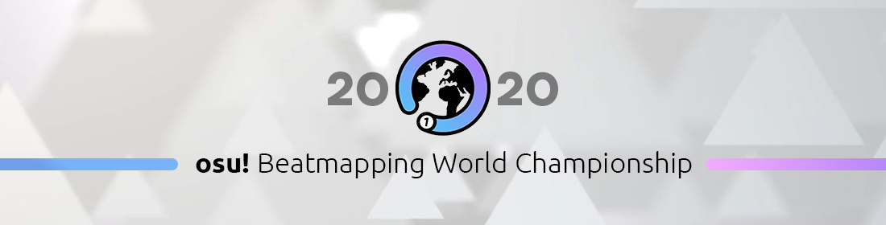
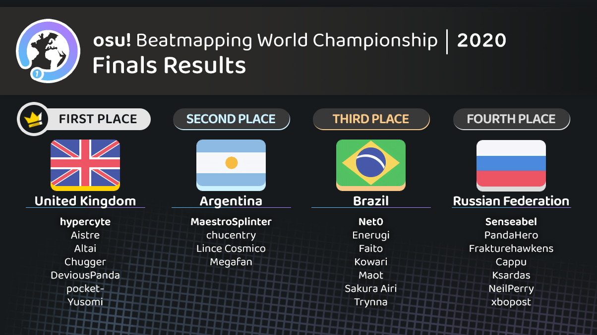

# osu! Beatmapping World Championship 2020

**L'osu! Beatmapping World Championship 2020** (***o!BWC 2020***) est un concours de mapping osu! par pays organisé par ::{ flag=US }:: [Chaos](https://osu.ppy.sh/users/2628870), ::{ flag=FR }:: [Imakuri](https://osu.ppy.sh/users/6100837), ::{ flag=CN }:: [Mafumafu](https://osu.ppy.sh/users/3076909), ::{ flag=FR }:: [Nozhomi](https://osu.ppy.sh/users/2716981) et ::{ flag=FR }:: [Pachiru](https://osu.ppy.sh/users/2850983). Anciennement appelé *osu! Mapping World Cup*, le concours a été renommé afin de ne pas être confondu avec la série *[osu!mania World Cup](/wiki/Tournaments/MWC)* en raison de leur similitude d'abréviation.

## Calendrier du concours

| Événement | Horodatage |
| --: | :-- |
| Annonces et phase d'inscription | 02/05/2020/15/05/2020 |
| Phase de vote pour le capitaine de l'équipe de chaque pays | 16/05/2020/22/05/2020 |
| Phase de constitution des équipes | 23/05/2020/29/05/2020 |
| Tour de qualification - Phase de mapping | 30/05/2020/12/06/2020 |
| Tour de qualification - Phase d'évaluation | 14/06/2020/27/06/2020 |
| Huitième de finale - Phase de mapping | 30/06/2020/12/07/2020 |
| Huitième de finale - Phase d'évaluation | 14/07/2020/21/07/2020 |
| Quarts de finale - Phase de mapping | 24/07/2020/07/08/2020 |
| Quarts de finale - Phase d'évaluation | 09/08/2020/16/08/2020 |
| Demi-finales - Phase de mapping | 19/08/2020/02/09/2020 |
| Demi-finales - Phase d'évaluation | 04/09/2020/12/09/2020 |
| Finales et grandes finales - Phase de mapping | 15/09/2020/29/09/2020 |
| Finales et grandes finales - Phase d'évaluation | 01/10/2020/08/10/2020 |
| Retransmission de la finale | 17/10/2020 (20:00 UTC+0) |

## Prix

| Placement | Prix |
| :-: | :-- |
|  | 8 mois d'osu!supporter pour chaque membre de l'équipe, badge de profil unique |
|  | 6 mois d'osu!supporter pour chaque membre de l'équipe, badge de profil unique |
|  | 4 mois d'osu!supporter pour chaque membre de l'équipe, badge de profil unique |

  

## Organisation

L'osu! Beatmapping World Championship est organisé par divers membres de la communauté.

| Position | Membre(s) |
| :-- | :-- |
| Gestionnaire | ::{ flag=US }:: [Chaos](https://osu.ppy.sh/users/2628870), ::{ flag=FR }:: [Imakuri](https://osu.ppy.sh/users/6100837), ::{ flag=CN }:: [Mafumafu](https://osu.ppy.sh/users/3076909), ::{ flag=FR }:: [Nozhomi](https://osu.ppy.sh/users/2716981), ::{ flag=FR }:: [Pachiru](https://osu.ppy.sh/users/2850983) |
| Gestionnaire web | ::{ flag=FR }:: [Imakuri](https://osu.ppy.sh/users/6100837), ::{ flag=CL }:: [Milan-](https://osu.ppy.sh/users/1052994) |
| Contributeur | ::{ flag=TH }:: [Electoz](https://osu.ppy.sh/users/6485263), ::{ flag=AR }:: [juankristal](https://osu.ppy.sh/users/443656), ::{ flag=DE }:: [Smokeman](https://osu.ppy.sh/users/2140676), ::{ flag=DE }:: [Yauxo](https://osu.ppy.sh/users/898306) |
| Juge | ::{ flag=TH }:: [Electoz](https://osu.ppy.sh/users/6485263), ::{ flag=DE }:: [Myxo](https://osu.ppy.sh/users/2202645), ::{ flag=CN }:: [Ryuusei Aika](https://osu.ppy.sh/users/7777875), ::{ flag=BR }:: [Seto Kousuke](https://osu.ppy.sh/users/2857314), ::{ flag=BE }:: [Stack](https://osu.ppy.sh/users/6122935), ::{ flag=KR }:: [Sonnyc](https://osu.ppy.sh/users/11771), ::{ flag=BE }:: [yaspo](https://osu.ppy.sh/users/4945926) |
| Designer | ::{ flag=FR }:: [Imakuri](https://osu.ppy.sh/users/6100837), ::{ flag=CA }:: [Kaetwo](https://osu.ppy.sh/users/1997719), ::{ flag=ID }:: [Natsume Shiki](https://osu.ppy.sh/users/8972308) |
| Statisticien | ::{ flag=CN }:: [Mafumafu](https://osu.ppy.sh/users/3076909), ::{ flag=FR }:: [Nozhomi](https://osu.ppy.sh/users/2716981) |
| Éditeur du wiki | ::{ flag=TR }:: [Zeus-](https://osu.ppy.sh/users/5464437) |

## Liens

- [Post de discussion](https://osu.ppy.sh/community/forums/topics/1060035)
- [Serveur Discord](https://discord.gg/CZp4bNx)
- [Site officiel](https://obwc.net/)
- [Twitter](https://twitter.com/osubwc)
- [Page Pick'ems](https://pickem.hwc.hr/tournaments/30) organisé par ::{ flag=DE }:: [hallowatcher](https://osu.ppy.sh/users/1874761)
- [Livestream](https://www.twitch.tv/osubwc)

## Participants

|  | Pays | Membres |
| :-: | :-: | :-- |
| ::{ flag=AR }:: | **Argentine** | **[MaestroSplinter](https://osu.ppy.sh/users/6707918)**, [chucentry](https://osu.ppy.sh/users/2498731), [Lince Cosmico](https://osu.ppy.sh/users/6070370), [Megafan](https://osu.ppy.sh/users/6632605) |
| ::{ flag=AU }:: | **Australie** | **[xLolicore-](https://osu.ppy.sh/users/4525153)**, [- Heatwave -](https://osu.ppy.sh/users/4166621), [Cubby](https://osu.ppy.sh/users/10914582), [Pentori](https://osu.ppy.sh/users/7452237), [Xayah](https://osu.ppy.sh/users/5174427), [YelloJello](https://osu.ppy.sh/users/9285180) |
| ::{ flag=BR }:: | **Brésil** | **[Net0](https://osu.ppy.sh/users/5099768)**, [Enerugi](https://osu.ppy.sh/users/4475985), [Faito](https://osu.ppy.sh/users/9706291), [Kowari](https://osu.ppy.sh/users/5404892), [Maot](https://osu.ppy.sh/users/3914271), [Sakura Airi](https://osu.ppy.sh/users/8682057), [Trynna](https://osu.ppy.sh/users/2652951) |
| ::{ flag=CA }:: | **Canada** | **[J1\_](https://osu.ppy.sh/users/5918561)**, [Agatsu](https://osu.ppy.sh/users/5579871), [coco](https://osu.ppy.sh/users/9579526), [nayarii](https://osu.ppy.sh/users/5286409), [Sing](https://osu.ppy.sh/users/3795679), [Sparhten](https://osu.ppy.sh/users/7601720), [Xen](https://osu.ppy.sh/users/4026817) |
| ::{ flag=CL }:: | **Chili** | **[Cris-](https://osu.ppy.sh/users/6175280)**, [Cayssa](https://osu.ppy.sh/users/8714413), [Crissa](https://osu.ppy.sh/users/5405836), [kanocchi](https://osu.ppy.sh/users/2321050), [Tatan](https://osu.ppy.sh/users/5646529) |
| ::{ flag=CN }:: | **Chine** | **[Moecho](https://osu.ppy.sh/users/5075660)**, [Bellicose](https://osu.ppy.sh/users/4298072), [buhei](https://osu.ppy.sh/users/1371514), [Firika](https://osu.ppy.sh/users/9590557), [Quantum Rosta](https://osu.ppy.sh/users/4814169), [Suiyu](https://osu.ppy.sh/users/3143784), [Yugu](https://osu.ppy.sh/users/3161834) |
| ::{ flag=DK }:: | **Danemark** | **[Striderin](https://osu.ppy.sh/users/10193902)**, [Akayume](https://osu.ppy.sh/users/10617530), [iamVill](https://osu.ppy.sh/users/6295380), [melon boy](https://osu.ppy.sh/users/3053382), [Morrighan](https://osu.ppy.sh/users/12042090), [waefwerf](https://osu.ppy.sh/users/3868653) |
| ::{ flag=EE }:: | **Estonie** | **[Xayler](https://osu.ppy.sh/users/3649657)**, [Fukada Eimi](https://osu.ppy.sh/users/6063342), [iljaaz](https://osu.ppy.sh/users/8501291), [Namki](https://osu.ppy.sh/users/5248582) |
| ::{ flag=FR }:: | **France** | **[Realazy](https://osu.ppy.sh/users/918297)**, [BOUYAAA](https://osu.ppy.sh/users/405449), [Halgoh](https://osu.ppy.sh/users/4109923), [PoNo](https://osu.ppy.sh/users/4610047), [Sharu](https://osu.ppy.sh/users/5597639), [Sotarks](https://osu.ppy.sh/users/4452992) |
| ::{ flag=DE }:: | **Allemagne** | **[Mao](https://osu.ppy.sh/users/2204515)**, [Icekalt](https://osu.ppy.sh/users/5410645), [Lasse](https://osu.ppy.sh/users/896613), [Okoratu](https://osu.ppy.sh/users/1623405), [Smokeman](https://osu.ppy.sh/users/2140676), [Zetera](https://osu.ppy.sh/users/587737) |
| ::{ flag=HK }:: | **Hong Kong** | **[GIDZ](https://osu.ppy.sh/users/2286528)**, [gary00737](https://osu.ppy.sh/users/6029467), [GodKei](https://osu.ppy.sh/users/2542623), [KwAIMSuckASFuk](https://osu.ppy.sh/users/9629457), [My Angel Jeremy](https://osu.ppy.sh/users/10038441), [Petal](https://osu.ppy.sh/users/7354729), [RVMathew](https://osu.ppy.sh/users/3718151) |
| ::{ flag=ID }:: | **Indonésie** | **[Ciyus Miapah](https://osu.ppy.sh/users/2805457)**, [Creamy Candy](https://osu.ppy.sh/users/9769199), [gokugohan12468](https://osu.ppy.sh/users/2013571), [William K](https://osu.ppy.sh/users/2261651) |
| ::{ flag=IT }:: | **Italie** | **[Nemis](https://osu.ppy.sh/users/1635091)**, [Bonzi](https://osu.ppy.sh/users/1313969), [Manu028](https://osu.ppy.sh/users/6192633), [Minion24](https://osu.ppy.sh/users/10021819), [Shiino](https://osu.ppy.sh/users/9839375), [Shoenen](https://osu.ppy.sh/users/6404824), [Vereor Nox](https://osu.ppy.sh/users/9571064) |
| ::{ flag=JP }:: | **Japon** | **[Kloyd](https://osu.ppy.sh/users/1574070)**, [-Brethia](https://osu.ppy.sh/users/4698485), [KogumaX](https://osu.ppy.sh/users/525262), [Livia](https://osu.ppy.sh/users/1298844), [tukamoto7km](https://osu.ppy.sh/users/1441049) |
| ::{ flag=LV }:: | **Lettonie** | **[SquareTude](https://osu.ppy.sh/users/6280862)**, [waywern2012](https://osu.ppy.sh/users/5870453), [Voxargenteae](https://osu.ppy.sh/users/10774235) |
| ::{ flag=MY }:: | **Malaisie** | **[HootOwlStar](https://osu.ppy.sh/users/4341302)**, [RyoKazuka](https://osu.ppy.sh/users/6258586), [ShinHemG](https://osu.ppy.sh/users/10994474) |
| ::{ flag=MX }:: | **Mexique** | **[Gero](https://osu.ppy.sh/users/1467715)**, [Atsuro](https://osu.ppy.sh/users/2279351), [Luna-](https://osu.ppy.sh/users/1703474), [Side](https://osu.ppy.sh/users/3442339), [Underforest](https://osu.ppy.sh/users/6753180) |
| ::{ flag=NO }:: | **Norvège** | **[YokesPai](https://osu.ppy.sh/users/6399568)**, [-PC](https://osu.ppy.sh/users/2916414), [CXu](https://osu.ppy.sh/users/84841), [Fisky](https://osu.ppy.sh/users/8352623), [Sebu](https://osu.ppy.sh/users/3990173) |
| ::{ flag=PH }:: | **Philippines** | **[-Aqua](https://osu.ppy.sh/users/7150015)**, [\_xyliac](https://osu.ppy.sh/users/7989480), [Flake](https://osu.ppy.sh/users/7627157), [newton-](https://osu.ppy.sh/users/5875419), [samosita](https://osu.ppy.sh/users/6090289), [Shizuku-](https://osu.ppy.sh/users/1125647), [xidorn](https://osu.ppy.sh/users/7904667) |
| ::{ flag=PL }:: | **Pologne** | **[Venix](https://osu.ppy.sh/users/5999631)**, [Kalibe](https://osu.ppy.sh/users/3376777), [Peter](https://osu.ppy.sh/users/8623835), [Rolniczy](https://osu.ppy.sh/users/8331132), [SaltyLucario](https://osu.ppy.sh/users/6571670), [Yudragen](https://osu.ppy.sh/users/8406396), [Zelq](https://osu.ppy.sh/users/8953955) |
| ::{ flag=RO }:: | **Roumanie** | **[Tony](https://osu.ppy.sh/users/404169)**, [entsetzen](https://osu.ppy.sh/users/10261883), [MaddaFakka-sama](https://osu.ppy.sh/users/6584266) |
| ::{ flag=RU }:: | **Fédération de Russie** | **[Senseabel](https://osu.ppy.sh/users/6184386)**, [Cappu](https://osu.ppy.sh/users/6754712), [Frakturehawkens](https://osu.ppy.sh/users/7458583), [Ksardas](https://osu.ppy.sh/users/6115007), [NeilPerry](https://osu.ppy.sh/users/841391), [PandaHero](https://osu.ppy.sh/users/1233255), [xbopost](https://osu.ppy.sh/users/6842421) |
| ::{ flag=SG }:: | **Singapour** | **[\_Meep\_](https://osu.ppy.sh/users/4315188)**, [Mocaotic](https://osu.ppy.sh/users/9487458), [neonat](https://osu.ppy.sh/users/1561995), [P4ndemonium](https://osu.ppy.sh/users/6639059), [Sinnoh](https://osu.ppy.sh/users/4236057), [sorciere](https://osu.ppy.sh/users/2500099) |
| ::{ flag=KR }:: | **Corée du Sud** | **[Heilia](https://osu.ppy.sh/users/9823042)**, [Acyl](https://osu.ppy.sh/users/1943309), [Cellina](https://osu.ppy.sh/users/2490770), [Dailycare](https://osu.ppy.sh/users/1634445), [Down](https://osu.ppy.sh/users/4694602), [jieusieu](https://osu.ppy.sh/users/759439), [Luscent](https://osu.ppy.sh/users/2688581) |
| ::{ flag=SE }:: | **Suède** | **[Liiraye](https://osu.ppy.sh/users/1280641)**, [\[ Couch \] Lite](https://osu.ppy.sh/users/4316633), [Arbane](https://osu.ppy.sh/users/4150829), [Dilectus](https://osu.ppy.sh/users/4287454), [dqs01733](https://osu.ppy.sh/users/3372459), [Melwoine](https://osu.ppy.sh/users/12091109), [Zer0-](https://osu.ppy.sh/users/4260033) |
| ::{ flag=CH }:: | **Suisse** | **[Irreversible](https://osu.ppy.sh/users/1287964)**, [\[ryuu\]](https://osu.ppy.sh/users/5698467), [NoFC](https://osu.ppy.sh/users/9713839), [TicClick](https://osu.ppy.sh/users/672931) |
| ::{ flag=TW }:: | **Taïwan** | **[Hey lululu](https://osu.ppy.sh/users/4086497)**, [- AzRaeL -](https://osu.ppy.sh/users/10027577), [Flask](https://osu.ppy.sh/users/959763), [GfMRT](https://osu.ppy.sh/users/3163649), [knowledgeking](https://osu.ppy.sh/users/8022517), [Nerova Riuz GX](https://osu.ppy.sh/users/1557955), [Silent Rock](https://osu.ppy.sh/users/4657504) |
| ::{ flag=TR }:: | **Turquie** | **[skytuna](https://osu.ppy.sh/users/9079936)**, [bigbirb-](https://osu.ppy.sh/users/11285985), [Entry](https://osu.ppy.sh/users/10213311), [Fursum](https://osu.ppy.sh/users/4865030), [Lugu](https://osu.ppy.sh/users/12851847), [mezelyus](https://osu.ppy.sh/users/5938859), [Nymphe](https://osu.ppy.sh/users/10507407) |
| ::{ flag=UA }:: | **Ukraine** | **[Tsumugi-chan](https://osu.ppy.sh/users/7586512)**, [allein](https://osu.ppy.sh/users/6221637), [Ayla](https://osu.ppy.sh/users/4548264), [Dafiely](https://osu.ppy.sh/users/7197186), [den0saur](https://osu.ppy.sh/users/5385151), [Sulfur](https://osu.ppy.sh/users/5297447), [PantyDev](https://osu.ppy.sh/users/5420543) |
| ::{ flag=GB }:: | **Royaume-Uni** | **[hypercyte](https://osu.ppy.sh/users/9155377)**, [Aistre](https://osu.ppy.sh/users/4879380), [Altai](https://osu.ppy.sh/users/5745865), [Chugger](https://osu.ppy.sh/users/4491713), [DeviousPanda](https://osu.ppy.sh/users/4966334), [pocket-](https://osu.ppy.sh/users/6808091), [Yusomi](https://osu.ppy.sh/users/4174940) |
| ::{ flag=US }:: | **États-Unis** | **[vikala](https://osu.ppy.sh/users/2848604)**, [Axarious](https://osu.ppy.sh/users/2614511), [byfar](https://osu.ppy.sh/users/4674054), [captin1](https://osu.ppy.sh/users/689997), [IOException](https://osu.ppy.sh/users/2688103), [melloe](https://osu.ppy.sh/users/2367616), [not very smart](https://osu.ppy.sh/users/3696423) |
| ::{ flag=VN }:: | **Vietnam** | **[LMT](https://osu.ppy.sh/users/7262798)**, [Asaiga](https://osu.ppy.sh/users/2959560), [Hikan](https://osu.ppy.sh/users/7968702), [Kirylln](https://osu.ppy.sh/users/7228554), [Liyuchi](https://osu.ppy.sh/users/3275495), [Pandano](https://osu.ppy.sh/users/7696558), [Smug Nanachi](https://osu.ppy.sh/users/10063190) |

## Podium

## Résultats

### Finales

La musique de la grande finale : **[Zekk](https://osu.ppy.sh/beatmaps/artists/76) - Let Me Hear**

| Équipe 1 |  |  | Équipe 2 | Entrées |
| --: | :-: | :-: | :-- | :-- |
| Argentine ::{ flag=AR }:: | 3 | **4** | ::{ flag=GB }:: **Royaume-Uni** | [#1](https://osu.ppy.sh/beatmapsets/1280480#osu/2659858), [#2](https://osu.ppy.sh/beatmapsets/1280467#osu/2659837) |

3ème place musique finale : **[Cranky](https://osu.ppy.sh/beatmaps/artists/23) - Flugel**

| Équipe 1 |  |  | Équipe 2 | Entrées |
| --: | :-: | :-: | :-- | :-- |
| **Brésil** ::{ flag=BR }:: | **4** | 3 | ::{ flag=RU }:: Fédération de Russie | [#1](https://osu.ppy.sh/beatmapsets/1280436#osu/2659781), [#2](https://osu.ppy.sh/beatmapsets/1281199#osu/2661154) |

### Demi-finales

**[Téléchargez toutes les contributions ici ! (31 MB)](https://obwc.net/api/results/downloadZip/4)**

Musiques :

- **[LeaF](https://osu.ppy.sh/beatmaps/artists/73) - Kyouki Ranbu**
- **[Blankfield](https://osu.ppy.sh/beatmaps/artists/80) - Start From Zero**
- **[Rohi](https://osu.ppy.sh/beatmaps/artists/82) - Hitotsu no Chikai yo, Eien no Uta to Nare**

| Équipe 1 |  |  | Équipe 2 | Entrées |
| --: | :-: | :-: | :-- | :-- |
| **Argentine** ::{ flag=AR }:: | **6** | 1 | ::{ flag=BR }:: Brésil | [#1](https://osu.ppy.sh/beatmapsets/1257585#osu/2613178), [#2](https://osu.ppy.sh/beatmapsets/1257559#osu/2613137) |
| **Royaume-Uni** ::{ flag=GB }:: | **5** | 2 | ::{ flag=RU }:: Fédération de Russie | [#1](https://osu.ppy.sh/beatmapsets/1257572#osu/2613160), [#2](https://osu.ppy.sh/beatmapsets/1283236#osu/2665037) |

### Quarts de finale

**[Téléchargez toutes les contributions ici ! (86 MB)](https://obwc.net/api/results/downloadZip/3)**

Musiques :

- **[Teminite](https://osu.ppy.sh/beatmaps/artists/64) - Hot Fizz**
- **[False Noise](https://osu.ppy.sh/beatmaps/artists/52) - Space Angel**
- **[Venetian Snares](https://osu.ppy.sh/beatmaps/artists/71) - Shaky Sometimes**

| Équipe 1 |  |  | Équipe 2 | Entrées |
| --: | :-: | :-: | :-- | :-- |
| France ::{ flag=FR }:: | 1 | **6** | ::{ flag=AR }:: **Argentine** | [#1](https://osu.ppy.sh/beatmapsets/1239841#osu/2577703), [#2](https://osu.ppy.sh/beatmapsets/1238432#osu/2574916) |
| Vietnam ::{ flag=VN }:: | 3 | **4** | ::{ flag=BR }:: **Brésil** | [#1](https://osu.ppy.sh/beatmapsets/1238414#osu/2574882), [#2](https://osu.ppy.sh/beatmapsets/1238421#osu/2574898) |
| **Royaume-Uni** ::{ flag=GB }:: | **7** | 0 | ::{ flag=AU }:: Australie | [#1](https://osu.ppy.sh/beatmapsets/1238417#osu/2574885), [#2](https://osu.ppy.sh/beatmapsets/1238448#osu/2574943) |
| Corée du Sud ::{ flag=KR }:: | 3 | **4** | ::{ flag=RU }:: **Fédération de Russie** | [#1](https://osu.ppy.sh/beatmapsets/1238608#osu/2575217), [#2](https://osu.ppy.sh/beatmapsets/1238422#osu/2574902) |

### Huitième de finale

**[Téléchargez toutes les contributions ici ! (119 MB)](https://obwc.net/api/results/downloadZip/2)**

Musiques :

- **[Dictate](https://osu.ppy.sh/beatmaps/artists/21) - Melodik (Short Ver.)**
- **[Thank You Scientist](https://osu.ppy.sh/beatmaps/artists/83) - Wrinkle**
- **[Nekrogoblikon](https://osu.ppy.sh/beatmaps/artists/53) - Killing Time (and Space)**

| Équipe 1 |  |  | Équipe 2 | Entrées |
| --: | :-: | :-: | :-- | :-- |
| **France** ::{ flag=FR }:: | **5** | 0 | ::{ flag=IT }:: Italie | [#1](https://osu.ppy.sh/beatmapsets/1230014#osu/2557291), [#2](https://osu.ppy.sh/beatmapsets/1220485#osu/2538865) |
| Chine ::{ flag=CN }:: | 2 | **3** | ::{ flag=AR }:: **Argentine** | [#1](https://osu.ppy.sh/beatmapsets/1219829#osu/2537709), [#2](https://osu.ppy.sh/beatmapsets/1219826#osu/2537703) |
| **Vietnam** ::{ flag=VN }:: | **3** | 2 | ::{ flag=CA }:: Canada | [#1](https://osu.ppy.sh/beatmapsets/1219819#osu/2537685), [#2](https://osu.ppy.sh/beatmapsets/1219830#osu/2537710) |
| Suède ::{ flag=SE }:: | 2 | **3** | ::{ flag=BR }:: **Brésil** | [#1](https://osu.ppy.sh/beatmapsets/1219814#osu/2537680), [#2](https://osu.ppy.sh/beatmapsets/1219789#osu/2537638) |
| **Royaume-Uni** ::{ flag=GB }:: | **4** | 1 | ::{ flag=US }:: États-Unis | [#1](https://osu.ppy.sh/beatmapsets/1219797#osu/2537649), [#2](https://osu.ppy.sh/beatmapsets/1219828#osu/2537708) |
| **Australie** ::{ flag=AU }:: | **3** | 2 | ::{ flag=NO }:: Norvège | [#1](https://osu.ppy.sh/beatmapsets/1219865#osu/2537757), [#2](https://osu.ppy.sh/beatmapsets/1219818#osu/2537684) |
| **Corée du Sud** ::{ flag=KR }:: | **3** | 2 | ::{ flag=DK }:: Danemark | [#1](https://osu.ppy.sh/beatmapsets/1219841#osu/2537728), [#2](https://osu.ppy.sh/beatmapsets/1219803#osu/2537657) |
| Pologne ::{ flag=PL }:: | 2 | **3** | ::{ flag=RU }:: **Fédération de Russie** | [#1](https://osu.ppy.sh/beatmapsets/1282826#osu/2664297), [#2](https://osu.ppy.sh/beatmapsets/1220263#osu/2538492) |

### Qualifications

*Pour plus de détails sur les scores, voir le [tableau des qualifications](https://obwc.net/results/qualifiers) sur le site web du concours.*

**[Téléchargez toutes les contributions ici ! (219 MB)](https://obwc.net/api/results/downloadZip/1)**

Musique : **[MDK](https://osu.ppy.sh/beatmaps/artists/61) - Press Start**

| Rang | Équipe | Score |
| :-- | :-- | :-- |
| 1 | ::{ flag=FR }:: **France** | 7.0913 |
| 2 | ::{ flag=GB }:: **Royaume-Uni** | 5.8987 |
| 3 | ::{ flag=KR }:: **Corée du Sud** | 5.8584 |
| 4 | ::{ flag=VN }:: **Vietnam** | 4.8331 |
| 5 | ::{ flag=SE }:: **Suède** | 4.2344 |
| 6 | ::{ flag=PL }:: **Pologne** | 3.9045 |
| 7 | ::{ flag=AU }:: **Australie** | 3.3529 |
| 8 | ::{ flag=CN }:: **Chine** | 2.7021 |
| 9 | ::{ flag=AR }:: **Argentine** | 2.6037 |
| 10 | ::{ flag=NO }:: **Norvège** | 2.1734 |
| 11 | ::{ flag=RU }:: **Fédération de Russie** | 2.1059 |
| 12 | ::{ flag=BR }:: **Brésil** | 1.7696 |
| 13 | ::{ flag=CA }:: **Canada** | 1.6234 |
| 14 | ::{ flag=DK }:: **Danemark** | 1.2943 |
| 15 | ::{ flag=US }:: **États-Unis** | 1.2310 |
| 16 | ::{ flag=IT }:: **Italie** | 1.1722 |
| 17 | ::{ flag=MX }:: Mexique | 0.3136 |
| 18 | ::{ flag=CH }:: Suisse | -0.1979 |
| 19 | ::{ flag=DE }:: Allemagne | -0.5379 |
| 20 | ::{ flag=PH }:: Philippines | -1.6944 |
| 21 | ::{ flag=SG }:: Singapour | -2.0565 |
| 22 | ::{ flag=EE }:: Estonie | -2.3241 |
| 23 | ::{ flag=TW }:: Taïwan | -2.7789 |
| 24 | ::{ flag=HK }:: Hong Kong | -2.7816 |
| 25 | ::{ flag=CL }:: Chili | -3.5997 |
| 26 | ::{ flag=TR }:: Turquie | -4.0674 |
| 27 | ::{ flag=ID }:: Indonésie | -4.1833 |
| 28 | ::{ flag=JP }:: Japon | -4.5266 |
| 29 | ::{ flag=RO }:: Roumanie | -5.0928 |
| 30 | ::{ flag=LV }:: Lettonie | -8.5058 |
| 31 | ::{ flag=MY }:: Malaisie | -9.8156 |

## Règlement

### Règlement du concours

1. **Les [critères de classement d'osu!](/wiki/Ranking_criteria/osu!) et les [critères de classement généraux](/wiki/Ranking_criteria) sont en vigueur pour ce concours.** - Le prix du concours comprend le classement des entrées des équipes gagnantes, qui seront les 3 musiques soumises par l'équipe de mappeurs, ce que nous ne pouvons pas faire si vous n'obéissez pas aux Critères de classement. Toutes les difficultés requises pour satisfaire aux exigences des critères de classement seront fournies par l'équipe organisatrice.
2. **3-7 membres par équipe requis** - Le concept principal du concours est de montrer les capacités de chaque pays en matière de mapping. Cela signifie qu'une collaboration d'au moins 2 membres sur chaque musique sera demandée aux membres de l'équipe. La façon dont vous organisez les parties de la map est entièrement à votre charge.
3. **Chaque mappeur doit contribuer au moins une fois au concours.** - Nous voulons que chaque équipe soit équitablement récompensée pour son travail, ce qui signifie que nous ne voulons pas que les équipes gagnantes aient un ou plusieurs membres qui ne contribuent pas au concours.
4. **Il est strictement interdit de copier le travail d'autrui.** - L'objectif du concours est de tester les capacités de chaque pays dans son ensemble. Par conséquent, en copiant le travail d'autres personnes, vous ne montrez pas fidèlement ce dont votre pays est capable. Si nous, ou les juges, découvrons que des travaux ont été copiés, toute votre équipe sera disqualifiée.
5. **Il est strictement interdit de partager ou de demander une aide extérieure pour votre mapset avant la fin du délai fixé.** - Cela entraînera automatiquement la disqualification de votre équipe.
6. **Les candidatures ne peuvent être soumises que par l'intermédiaire du site web** - Ce processus a pour but de faciliter la gestion des difficultés entre les juges et les participants. Aucune participation ne sera acceptée par d'autres moyens que le site web.
7. **Les candidatures ne seront pas acceptées après la date limite.** - Tout le monde disposera du même temps pour établir la map pour chaque tour, de sorte qu'il serait injuste pour les autres équipes de prolonger le délai pour une équipe en particulier. Par conséquent, toute inscription soumise après la date limite sera disqualifiée. Le site web fermera automatiquement les soumissions une fois la date limite dépassée.
8. **Les hitsounds personnalisés sont autorisés, mais aucun n'est fourni.** - Vous êtes autorisé, et même encouragé, à utiliser des hitsounds personnalisés. Veillez toutefois à ce qu'ils n'empiètent pas sur vos autres difficultés. La façon dont vous les organiserez dépendra de vous.
9. **Il est interdit de modifier le fichier .mp3 fourni ou le timing du fichier .osu.** - Nous voulons éviter toute complication au cours du processus de jugement puisque vous ne soumettrez que les fichiers .osu au lieu des fichiers .osz complets.
10. **Ne pas inclure de storyboards ou d'arrière-plans.** - Ils ne seront pas pris en compte dans le processus de jugement et seront retirés avant que les inscriptions ne soient transmises aux juges.
11. **Les mappeurs soumis à des restrictions ne peuvent pas participer au concours.** - Pour la légitimité de ce concours, les utilisateurs ayant des droits restreints ne sont pas acceptés. S'il s'avère qu'un utilisateur restreint a pris la place du compte d'une personne pour ce concours, l'équipe entière sera disqualifiée.
12. **Les équipes doivent être composées d'utilisateurs d'un seul pays.** - La fusion ou le regroupement de pays ne permet pas aux joueurs de représenter pleinement leur pays. Vous ne pouvez rejoindre que l'équipe du pays qui figure sur votre profil osu!.
13. **Une seule équipe par pays est autorisée** - Bien que certains pays soient plus actifs que d'autres sur osu! et dans le mapping, pour que tout soit équitable entre tous les participants à ce concours, une seule équipe sera constituée par pays.
14. **Tenir les organisateurs au courant de l'évolution de l'équipe après la phase de préparation.** - Si un participant doit abandonner le concours pour quelque raison que ce soit, il est prié d'en informer l'équipe le plus rapidement possible. Aucun remplacement ne sera autorisé et aucune récompense ne sera attribuée à l'utilisateur si l'équipe arrive dans le top 3.

### Questions et réponses

1. **Quel est ce concours ?**

   L'osu! Beatmapping World Championship est un concours en mode standard au cours duquel plusieurs pays s'affrontent pour montrer les capacités de leur pays en matière de mapping. Chaque membre de l'équipe sera choisi par un capitaine d'équipe, composé de 3 à 7 membres, y compris le capitaine d'équipe.

2. **Comment fonctionne ce concours ?**

   Le concours se déroulera en deux étapes avec un total de 5 tours. Le premier tour est un tour de qualification où toutes les équipes des pays éligibles s'affronteront dans le cadre d'un concours de mapping typique avec une seule musique à mapper. Les 16 meilleures équipes passeront à l'étape suivante du concours. Après le tour de qualification, les étapes restantes se dérouleront sous la forme d'un affrontement entre deux équipes, également appelé "Clash Rounds". Pour chaque affrontement entre deux équipes, chaque équipe sera autorisée à bannir un genre parmi les trois disponibles, ce qui l'amènera à établir le mapping de la chanson restante. Une fois la phase de mapping terminée, les juges seront chargés de voter pour les meilleures entrées des deux équipes, et ainsi de suite jusqu'à la finale.

3. **Quelles seront les musiques ?**

   Les genres de musique seront révélés pour toutes les phases avant les qualifications, tandis que les noms de musique pour chaque étape seront annoncés dès le début de l'étape.

4. **Qu'est-ce qu'un "capitaine d'équipe" ?**

   Les capitaines d'équipe (ou simplement les capitaines) sont choisis par les mappeurs de leur pays par le biais d'un vote sur le site web. Ils seront chargés de communiquer avec les organisateurs et leur équipe afin de nous informer de tout ce qui concerne l'équipe. Les conditions pour devenir capitaine d'équipe sont d'avoir au moins une difficulté classée en tant qu'invité, afin de montrer votre expérience en matière de mapping.

5. **Que se passe-t-il si mon pays n'a pas de capitaine d'équipe ?**

   Vous pouvez poser votre candidature sur le site web si vous répondez aux critères ! Les mappeurs de votre pays voteront pour les personnes qu'ils souhaitent voir devenir capitaine d'équipe pour leur pays. Si personne ne s'est porté candidat au poste de capitaine d'équipe pour votre pays à l'issue de la date limite, l'équipe du concours en choisira un pour l'équipe. Le pays avec lequel vous serez autorisé à participer sera déterminé en fonction du drapeau de votre profil. Aucune fusion de pays ne sera autorisée afin d'éviter toute complication de gestion.

6. **Puis-je avoir ma propre équipe pour mon pays, même s'il en a déjà une ?**

   Non. Chaque pays n'aura qu'un seul capitaine d'équipe pour le représenter.

7. **Comment savoir qui s'affrontera ? Le choix sera-t-il aléatoire ?**

   Non, il n'y aura pas de tirage au sort. Lors du tour de qualification, seules les 16 meilleures équipes accèderont aux tours d'affrontement. La première équipe affrontera la seizième, la deuxième la quinzième, la troisième la quatorzième, etc... Veillez donc à donner toute votre énergie lors de la phase de qualification !

8. **Dois-je rejoindre le serveur Discord pour participer ?**

   Seul l'ambassadeur de l'équipe est tenu de rejoindre le serveur Discord. Les membres de l'équipe sont toutefois libres de s'inscrire ou non. Cependant, si vous ne vous joignez pas à l'équipe, vous manquerez les annonces importantes et un channel privé national qui sera SEULEMENT disponible sur le serveur Discord.

9. **Puis-je m'inscrire sur le serveur Discord même si je ne souhaite pas participer au concours ?**

   Oui, il y a un lien public en haut du message du forum. Lors de votre inscription, vous serez placé dans le channel #arrival, où vous devrez poster votre lien de profil osu!, puis un membre du staff ou un modérateur vous acceptera.

10. **"Au moins 2 mappeurs devront collaborer sur chaque musique" - Pouvons-nous travailler avec toute mon équipe sur chaque map ?**

    Oui ! Nous avons établi cette règle pour nous assurer que l'esprit principal du concours, à savoir les collaborations, soit préservé, sans pour autant restreindre la gestion de l'équipe. Si vous souhaitez travailler avec une équipe complète à chaque étape, vous êtes encouragés à le faire !

11. **Je souhaite voter, mais je n'ai pas d'expérience en matière de mapping. Suis-je autorisé à le faire ?**

    Malheureusement, non. Vous devez avoir au moins une difficulté d'invité classé dans le mode osu!. Si vous répondez à ces critères, vous pourrez voter pour les capitaines d'équipe potentiels en fonction du drapeau de votre pays, ce qui signifie que vous ne pourrez pas voter pour le capitaine d'équipe Russe si vous venez du Royaume-Uni.

12. **Sommes-nous autorisés à modifier nos votes ?**

    Les votes peuvent être modifiés autant de fois que vous le souhaitez avant le délai. Une fois le délai passé, chaque vote sera verrouillé et il ne sera plus possible de le modifier.

13. **Dois-je rejoindre le serveur Discord pour participer ?**

    Seul le capitaine de l'équipe est tenu de rejoindre le serveur Discord. Les membres de l'équipe sont toutefois libres de s'inscrire s'ils le souhaitent. Toutes les informations importantes seront communiquées sur Discord et sur notre site web, vous ne manquerez donc rien si vous ne rejoignez pas le serveur Discord !

14. **Puis-je faire une beatmap osu!mania, osu!taiko ou osu!catch ?**

    Non. Ce concours est réservé au mode de jeu osu!.

15. **Cet événement sera-t-il diffusé sur Twitch ?**

    Oui, les finales et grandes finales du concours seront diffusées sur Twitch. Lors de ce stream, il y aura un résumé de tous les moments importants du concours.
