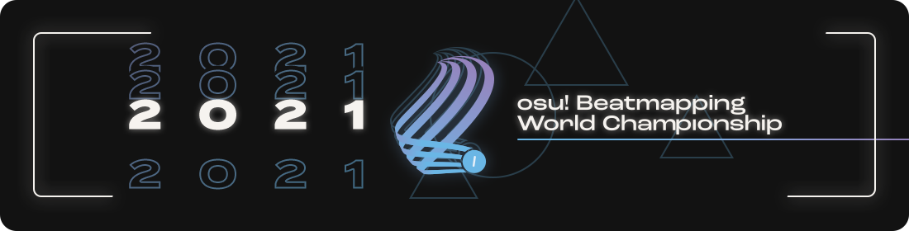

---
tags:
  - BWC
  - oBWC
  - o!BWC
---

# osu! Beatmapping World Championship 2021

The **osu! Beatmapping World Championship 2021** (***o!BWC 2021***) is a country-based osu! mapping contest hosted by ::{ flag=US }:: [Chaos](https://osu.ppy.sh/users/2628870), ::{ flag=FR }:: [Imakuri](https://osu.ppy.sh/users/6100837), ::{ flag=CN }:: [Mafumafu](https://osu.ppy.sh/users/3076909), ::{ flag=CL }:: [Milan-](https://osu.ppy.sh/users/1052994), ::{ flag=FR }:: [Nozhomi](https://osu.ppy.sh/users/2716981), ::{ flag=FR }:: [Pachiru](https://osu.ppy.sh/users/2850983), and ::{ flag=TR }:: [Zeus-](https://osu.ppy.sh/users/5464437). Formerly known as *osu! Mapping World Cup*, this is the third iteration of the **osu! Beatmapping World Championship** series.

## Contest schedule

All deadlines start at 00:00 UTC and end at 23:59 UTC.

| Event | Timestamp |
| --: | :-- |
| Registration Phase | 2021-05-02/2021-05-16 |
| First Round - Mapping phase | 2021-05-17/2021-05-31 |
| First Round - Judging phase | 2021-06-01/2021-06-22 |
| Second Round - Mapping phase | 2021-06-23/2021-07-07 |
| Second Round - Judging phase | 2021-07-08/2021-07-22 |
| Third Round - Mapping phase | 2021-07-23/2021-08-06 |
| Third Round - Judging phase | 2021-08-07/2021-08-21 |
| Fourth Round - Mapping phase | 2021-08-22/2021-09-05 |
| Fourth Round - Judging phase | 2021-09-06/2021-09-20 |
| Results Announcement & Livestream | 2021-09-21 |

## Prizes

*Note: Players' Pick and top 3 prizes can be added together if a team wins both prizes.*

| Placing | Prize(s) |
| :-: | :-- |
|  | 8 months of osu!supporter tag, unique profile badge, entries fast-tracked over to the qualified section |
|  | 6 months of osu!supporter tag, unique profile badge |
|  | 4 months of osu!supporter tag, unique profile badge |
| **Players' Pick Winner** | 2 months of osu!supporter tag, unique profile badge¹ |

   

¹ Profile badge is pending approval

## Organisation

The osu! Beatmapping World Championship is run by various community members.

| Position | Member(s) |
| :-- | :-- |
| Host | ::{ flag=US }:: [Chaos](https://osu.ppy.sh/users/2628870), ::{ flag=FR }:: [Imakuri](https://osu.ppy.sh/users/6100837), ::{ flag=CN }:: [Mafumafu](https://osu.ppy.sh/users/3076909), ::{ flag=CL }:: [Milan-](https://osu.ppy.sh/users/1052994), ::{ flag=FR }:: [Nozhomi](https://osu.ppy.sh/users/2716981), ::{ flag=FR }:: [Pachiru](https://osu.ppy.sh/users/2850983), ::{ flag=TR }:: [Zeus-](https://osu.ppy.sh/users/5464437) |
| Web manager | ::{ flag=CL }:: [Milan-](https://osu.ppy.sh/users/1052994), ::{ flag=FR }:: [Pachiru](https://osu.ppy.sh/users/2850983) |
| Mapper judge | ::{ flag=US }:: [Cheri](https://osu.ppy.sh/users/5226970), ::{ flag=TH }:: [Electoz](https://osu.ppy.sh/users/6485263), ::{ flag=RU }:: [fergas](https://osu.ppy.sh/users/3144542), ::{ flag=CL }:: [Krisom](https://osu.ppy.sh/users/99269), ::{ flag=US }:: [Mimari](https://osu.ppy.sh/users/14339830), ::{ flag=CN }:: [Ryuusei Aika](https://osu.ppy.sh/users/7777875), ::{ flag=DE }:: [sdafsf](https://osu.ppy.sh/users/3523418), ::{ flag=RS }:: [Seolv](https://osu.ppy.sh/users/8067876), ::{ flag=BR }:: [Seto Kousuke](https://osu.ppy.sh/users/2857314), ::{ flag=AR }:: [Yuii-](https://osu.ppy.sh/users/2935923) |
| Player judge | ::{ flag=GB }:: [AJT](https://osu.ppy.sh/users/3181083), ::{ flag=UA }:: [Ayla](https://osu.ppy.sh/users/4548264), ::{ flag=US }:: [ChillierPear](https://osu.ppy.sh/users/9501251), ::{ flag=SG }:: [megumic](https://osu.ppy.sh/users/7537133), ::{ flag=US }:: [saiyo](https://osu.ppy.sh/users/2709574) |
| Designer | ::{ flag=CA }:: [Kaetwo](https://osu.ppy.sh/users/1997719) |
| Statistician | ::{ flag=CN }:: [Mafumafu](https://osu.ppy.sh/users/3076909), ::{ flag=FR }:: [Nozhomi](https://osu.ppy.sh/users/2716981) |
| Wiki editor | ::{ flag=TR }:: [Zeus-](https://osu.ppy.sh/users/5464437) |

## Links

- [Discord server](https://discord.gg/CZp4bNx)
- [Twitter](https://twitter.com/osubwc)
- [Livestream](https://www.twitch.tv/osubwc)
- [Official website](https://obwc.net/)
- [Official documentation](https://gist.github.com/zeusminus/5b7cac0cbd6bcec422776dac5085f25f)

## Participants

|  | Country | Name | Members |
| :-: | :-: | :-: | :-- |
| ::{ flag=AR }:: | **Argentina** | **MaestroSplinter** | **[MaestroSplinter](https://osu.ppy.sh/users/6707918)**, [Birke](https://osu.ppy.sh/users/3265658), [Chaphe](https://osu.ppy.sh/users/8428983), [fusionnqn](https://osu.ppy.sh/users/11606403), [Lince Cosmico](https://osu.ppy.sh/users/6070370), [Megafan](https://osu.ppy.sh/users/6632605) |
| ::{ flag=AU }:: | **Australia** | **bunnings truck** | **[wetdog123](https://osu.ppy.sh/users/2164888)**, [ChigaMyMommy](https://osu.ppy.sh/users/12905443), [Coppertine](https://osu.ppy.sh/users/7279762) |
| ::{ flag=AU }:: | **Australia** | **DELIVEROO** | **[Pentori](https://osu.ppy.sh/users/7452237)**, [- Heatwave -](https://osu.ppy.sh/users/4166621), [Cubby](https://osu.ppy.sh/users/10914582), [elicz1](https://osu.ppy.sh/users/8039342) |
| ::{ flag=AU }:: | **Australia** | **Yeah The Boys** | **[Iceluin](https://osu.ppy.sh/users/3558897)**, [Kazuma](https://osu.ppy.sh/users/10642837), [LeQuack](https://osu.ppy.sh/users/7121588), [My Angel Watame](https://osu.ppy.sh/users/4525153), [sahuang](https://osu.ppy.sh/users/5318910) |
| ::{ flag=BR }:: | **Brazil** | **4Fun** | **[Net0](https://osu.ppy.sh/users/5099768)**, [Ataraxia](https://osu.ppy.sh/users/4077912), [Bariton](https://osu.ppy.sh/users/2026274) |
| ::{ flag=BR }:: | **Brazil** | **Baile Denied** | **[K4L1](https://osu.ppy.sh/users/11334594)**, [Akaeboshi](https://osu.ppy.sh/users/10466730), [Dada](https://osu.ppy.sh/users/9119507), [Edward](https://osu.ppy.sh/users/5618109), [xxluizxx47](https://osu.ppy.sh/users/4687701) |
| ::{ flag=BR }:: | **Brazil** | **edgard** | **[niii_san](https://osu.ppy.sh/users/5403374)**, [Coreanmaluco](https://osu.ppy.sh/users/3149577), [Foerster](https://osu.ppy.sh/users/9050766), [Mystia](https://osu.ppy.sh/users/4277702), [oTs-Joaka](https://osu.ppy.sh/users/11223044), [Yuuzinho](https://osu.ppy.sh/users/6267851) |
| ::{ flag=BR }:: | **Brazil** | **O TIME SUDESTE** | **[Maot](https://osu.ppy.sh/users/3914271)**, [Faito](https://osu.ppy.sh/users/9706291), [Moete](https://osu.ppy.sh/users/4824692), [NEURONIO](https://osu.ppy.sh/users/7198334), [Roberto](https://osu.ppy.sh/users/3453558), [Sakura Airi](https://osu.ppy.sh/users/8682057) |
| ::{ flag=BR }:: | **Brazil** | **Project Heiko** | **[Toofu](https://osu.ppy.sh/users/11004271)**, [AlexTroIIPsy](https://osu.ppy.sh/users/5176421), [Batatin](https://osu.ppy.sh/users/9138779), [Gaab](https://osu.ppy.sh/users/7710249), [Marianna](https://osu.ppy.sh/users/6701398), [Sharpay](https://osu.ppy.sh/users/11251594) |
| ::{ flag=BR }:: | **Brazil** | **unexpected** | **[maatdesu](https://osu.ppy.sh/users/15441176)**, [Labastie_pedro](https://osu.ppy.sh/users/17227807), [luizinho2581](https://osu.ppy.sh/users/12828037) |
| ::{ flag=CA }:: | **Canada** | **#YesChef** | **[Gordon](https://osu.ppy.sh/users/7856835)**, [BadGraph_](https://osu.ppy.sh/users/7967508), [dreamteamrox115](https://osu.ppy.sh/users/11962943), [P1Twist](https://osu.ppy.sh/users/12679616), [PotatoDew](https://osu.ppy.sh/users/10964252), [Shanipika](https://osu.ppy.sh/users/6336729) |
| ::{ flag=CA }:: | **Canada** | **Canada** | **[Kyumo](https://osu.ppy.sh/users/14689984)**, [alden](https://osu.ppy.sh/users/3545323), [Elayue](https://osu.ppy.sh/users/6400861), [Feiri](https://osu.ppy.sh/users/3214844), [Xen](https://osu.ppy.sh/users/4026817), [Zer0-G](https://osu.ppy.sh/users/12577911) |
| ::{ flag=CA }:: | **Canada** | **Sent to Quebec** | **[J1_](https://osu.ppy.sh/users/5918561)**, [Azer](https://osu.ppy.sh/users/2155578), [KKipalt](https://osu.ppy.sh/users/6889573), [Kyrian](https://osu.ppy.sh/users/13653298), [Monstrata](https://osu.ppy.sh/users/2706438) |
| ::{ flag=CL }:: | **Chile** | **Amber Mains** | **[Cris-](https://osu.ppy.sh/users/6175280)**, [Hazu-](https://osu.ppy.sh/users/4668230), [Tatan](https://osu.ppy.sh/users/5646529) |
| ::{ flag=CL }:: | **Chile** | **TEAM CHISTE** | **[kanocchi](https://osu.ppy.sh/users/2321050)**, [Arminator](https://osu.ppy.sh/users/7678119), [Barack](https://osu.ppy.sh/users/9402889), [bentrix](https://osu.ppy.sh/users/6030068), [Eunha](https://osu.ppy.sh/users/7701428) |
| ::{ flag=CL }:: | **Chile** | **Tortuga** | **[Pyo](https://osu.ppy.sh/users/6641784)**, [\[-Evil-\]](https://osu.ppy.sh/users/10234313), [Crissa](https://osu.ppy.sh/users/5405836), [KChronoZ](https://osu.ppy.sh/users/7918770), [Kyutei](https://osu.ppy.sh/users/13421842), [Sunazuka Akira](https://osu.ppy.sh/users/8846632) |
| ::{ flag=CN }:: | **China** | **SryNotInterested** | **[Yugu](https://osu.ppy.sh/users/3161834)**, [Bellicose](https://osu.ppy.sh/users/4298072), [Firika](https://osu.ppy.sh/users/9590557), [Garden](https://osu.ppy.sh/users/2849992), [Necho](https://osu.ppy.sh/users/4086593), [pw384](https://osu.ppy.sh/users/1343783) |
| ::{ flag=CY }:: | **Cyprus** | **osu! CY Pog** | **[def0ltt](https://osu.ppy.sh/users/12221151)**, [SassyRiolu](https://osu.ppy.sh/users/14014935), [vladdy_boi](https://osu.ppy.sh/users/14828149) |
| ::{ flag=CZ }:: | **Czech Republic** | **Smrding** | **[Alvieee](https://osu.ppy.sh/users/3579669)**, [CutoNaito](https://osu.ppy.sh/users/8064649), [NitroM_](https://osu.ppy.sh/users/3121234) |
| ::{ flag=DK }:: | **Denmark** | **The DK Crew** | **[melon boy](https://osu.ppy.sh/users/3053382)**, [Akayume](https://osu.ppy.sh/users/10617530), [Sagon](https://osu.ppy.sh/users/11775933), [Striderin](https://osu.ppy.sh/users/10193902), [vitalia](https://osu.ppy.sh/users/9450032), [waefwerf](https://osu.ppy.sh/users/3868653) |
| ::{ flag=EE }:: | **Estonia** | **Shikaku Kakumäe** | **[Keqing](https://osu.ppy.sh/users/8501291)**, [Lotragon](https://osu.ppy.sh/users/6063342), [Namki](https://osu.ppy.sh/users/5248582), [schoolboy](https://osu.ppy.sh/users/8722791), [Xayler](https://osu.ppy.sh/users/3649657) |
| ::{ flag=FR }:: | **France** | **Truands2LaGalere** | **[Realazy](https://osu.ppy.sh/users/918297)**, [BOUYAAA](https://osu.ppy.sh/users/405449), [Halgoh](https://osu.ppy.sh/users/4109923), [Kudosu](https://osu.ppy.sh/users/11038155), [Sharu](https://osu.ppy.sh/users/5597639), [Yuguiboy](https://osu.ppy.sh/users/5559243) |
| ::{ flag=GE }:: | **Georgia** | **Clown Fiesta** | **[Kyuunex](https://osu.ppy.sh/users/9236044)**, [Hopp](https://osu.ppy.sh/users/11716440), [NikaRuso](https://osu.ppy.sh/users/5391748) |
| ::{ flag=DE }:: | **Germany** | **AtLeastWeTriedXD** | **[DragoBruder](https://osu.ppy.sh/users/10944421)**, [Big Doc Bazuso](https://osu.ppy.sh/users/11726139), [Enterprise](https://osu.ppy.sh/users/11766551) |
| ::{ flag=DE }:: | **Germany** | **Dönerladen** | **[0ppInOsu](https://osu.ppy.sh/users/12551840)**, [Cacturne](https://osu.ppy.sh/users/13646997), [FuJu](https://osu.ppy.sh/users/10773882), [Lulu-](https://osu.ppy.sh/users/4201715), [PaRaDogi](https://osu.ppy.sh/users/2054596), [Ykybfz](https://osu.ppy.sh/users/9522967) |
| ::{ flag=DE }:: | **Germany** | **E-Hooligan e.V.** | **[jamesjan3](https://osu.ppy.sh/users/6260705)**, [Icekalt](https://osu.ppy.sh/users/5410645), [Mao](https://osu.ppy.sh/users/2204515), [Mir](https://osu.ppy.sh/users/8688812), [Okoratu](https://osu.ppy.sh/users/1623405), [Zetera](https://osu.ppy.sh/users/587737) |
| ::{ flag=DE }:: | **Germany** | **Notelock Mapping** | **[Krimek](https://osu.ppy.sh/users/2345078)**, [Bakugo-](https://osu.ppy.sh/users/4990127), [Famous](https://osu.ppy.sh/users/814328), [laura-](https://osu.ppy.sh/users/6491613), [Pho](https://osu.ppy.sh/users/3624692), [Shiguri](https://osu.ppy.sh/users/2665207) |
| ::{ flag=HK }:: | **Hong Kong** | **-1** | **[Petal](https://osu.ppy.sh/users/7354729)**, [-Atri-](https://osu.ppy.sh/users/2433720), [gary00737](https://osu.ppy.sh/users/6029467), [GIDZ](https://osu.ppy.sh/users/2286528), [KwAIMSuckASFuk](https://osu.ppy.sh/users/9629457), [Seros](https://osu.ppy.sh/users/10562853) |
| ::{ flag=HU }:: | **Hungary** | **indula727aludni** | **[Harupion](https://osu.ppy.sh/users/12939945)**, [HeyImJarvis](https://osu.ppy.sh/users/14227494), [Himada](https://osu.ppy.sh/users/10959366), [Nytrocide_](https://osu.ppy.sh/users/11327918) |
| ::{ flag=ID }:: | **Indonesia** | **komplek akira** | **[Celine](https://osu.ppy.sh/users/3545579)**, [\[Keqing\]](https://osu.ppy.sh/users/8972308), [Ameth Rianno](https://osu.ppy.sh/users/5219516), [AncuL](https://osu.ppy.sh/users/2449200), [araran](https://osu.ppy.sh/users/8937198), [Haruto](https://osu.ppy.sh/users/3772301) |
| ::{ flag=IT }:: | **Italy** | **Shinquot** | **[Shoenen](https://osu.ppy.sh/users/6404824)**, [_Zekken](https://osu.ppy.sh/users/9704802), [-Syncro](https://osu.ppy.sh/users/4338923), [Shiino](https://osu.ppy.sh/users/9839375) |
| ::{ flag=IT }:: | **Italy** | **VERA ITALIA** | **[Manu028](https://osu.ppy.sh/users/6192633)**, [Boc](https://osu.ppy.sh/users/8637017), [Daren](https://osu.ppy.sh/users/4704608), [DT-sama](https://osu.ppy.sh/users/3525018), [Entity_A](https://osu.ppy.sh/users/14142449), [GYGY](https://osu.ppy.sh/users/7201269) |
| ::{ flag=JP }:: | **Japan** | **Genshin Impact** | **[dectopia](https://osu.ppy.sh/users/2845904)**,  [a_Blue](https://osu.ppy.sh/users/5645667), [aramaking](https://osu.ppy.sh/users/4796949), [KogumaX](https://osu.ppy.sh/users/525262), [ponbot](https://osu.ppy.sh/users/8939857), [too](https://osu.ppy.sh/users/12196931) |
| ::{ flag=KZ }:: | **Kazakhstan** | **aspanga qaraymin** | **[tadahitotsu](https://osu.ppy.sh/users/11653544)**, [_Hornet](https://osu.ppy.sh/users/6862265), [Calideon](https://osu.ppy.sh/users/5175726), [Danik_LzZ](https://osu.ppy.sh/users/4756779) |
| ::{ flag=MY }:: | **Malaysia** | **good question** | **[t ony](https://osu.ppy.sh/users/9697624)**, [\[MY\]xArief](https://osu.ppy.sh/users/12694468), [Kardshark](https://osu.ppy.sh/users/4724315) |
| ::{ flag=MY }:: | **Malaysia** | **horny** | **[Monofly](https://osu.ppy.sh/users/11134301)**, [LavenderEclipse](https://osu.ppy.sh/users/13510754), [Stick2Glue](https://osu.ppy.sh/users/6928574), [squidstain](https://osu.ppy.sh/users/11073207) |
| ::{ flag=MY }:: | **Malaysia** | **MYsia** | **[Agagak](https://osu.ppy.sh/users/3645490)**, [\[ -Scarlet- \]](https://osu.ppy.sh/users/2427693), [KPMY](https://osu.ppy.sh/users/12464372), [Rumia-](https://osu.ppy.sh/users/1787171), [Sweets](https://osu.ppy.sh/users/10279996), [walaowey](https://osu.ppy.sh/users/1475828) |
| ::{ flag=NL }:: | **Netherlands** | **#modhelp enjoyer** | **[Waitrose](https://osu.ppy.sh/users/14918572)**, [CMeFly](https://osu.ppy.sh/users/12195391), [Jelljel](https://osu.ppy.sh/users/11939459), [yukic](https://osu.ppy.sh/users/6977273) |
| ::{ flag=NL }:: | **Netherlands** | **drop** | **[Castagne](https://osu.ppy.sh/users/12270596)**, [Chizuru](https://osu.ppy.sh/users/1026491), [Ermi](https://osu.ppy.sh/users/8468590), [taku](https://osu.ppy.sh/users/684433) |
| ::{ flag=NO }:: | **Norway** | **Shigeru Miyamoto** | **[Fisky](https://osu.ppy.sh/users/8352623)**, [-PC](https://osu.ppy.sh/users/2916414), [YokesPai](https://osu.ppy.sh/users/6399568) |
| ::{ flag=PH }:: | **Philippines** | **:mm:** | **[newton-](https://osu.ppy.sh/users/5875419)**, [0ugi](https://osu.ppy.sh/users/3812234), [Flake](https://osu.ppy.sh/users/7627157), [LeCandy](https://osu.ppy.sh/users/6626249), [Tsukinyuni](https://osu.ppy.sh/users/11545816) |
| ::{ flag=PH }:: | **Philippines** | **ang** | **[Sisig](https://osu.ppy.sh/users/12783631)**, [Arccanist](https://osu.ppy.sh/users/13596534), [PentagonGlxy](https://osu.ppy.sh/users/19753773), [Shhh453](https://osu.ppy.sh/users/19936043) |
| ::{ flag=PH }:: | **Philippines** | **i am team** | **[-Aqua](https://osu.ppy.sh/users/7150015)**, [Ajisai-](https://osu.ppy.sh/users/8636583), [AyameMyMommy](https://osu.ppy.sh/users/15822813), [Nagaraia](https://osu.ppy.sh/users/13673790) |
| ::{ flag=PH }:: | **Philippines** | **WEEB PH DELUXE** | **[_xyliac](https://osu.ppy.sh/users/7989480)**, [Asagi](https://osu.ppy.sh/users/2439246), [Dudamesh](https://osu.ppy.sh/users/10379135) |
| ::{ flag=PL }:: | **Poland** | **grappa ice_pl Xd** | **[browiec](https://osu.ppy.sh/users/9426712)**, [Kuki1537](https://osu.ppy.sh/users/6174349), [LosPedros](https://osu.ppy.sh/users/8337056), [Moko](https://osu.ppy.sh/users/6488658), [olsonn](https://osu.ppy.sh/users/8617799), [SaltyLucario](https://osu.ppy.sh/users/6571670) |
| ::{ flag=PL }:: | **Poland** | **Polska gurom** | **[Bass](https://osu.ppy.sh/users/63829)**, [-Sylvari](https://osu.ppy.sh/users/3493804), [Chalwa](https://osu.ppy.sh/users/4826159), [Skubi](https://osu.ppy.sh/users/3687666), [wiwit](https://osu.ppy.sh/users/10610309) |
| ::{ flag=PL }:: | **Poland** | **TwojaStara** | **[Yudragen](https://osu.ppy.sh/users/8406396)**, [Kalibe](https://osu.ppy.sh/users/3376777), [nhlx](https://osu.ppy.sh/users/3827077), [Peter](https://osu.ppy.sh/users/8623835), [Venix](https://osu.ppy.sh/users/5999631), [Zelq](https://osu.ppy.sh/users/8953955) |
| ::{ flag=RO }:: | **Romania** | **Echipa Pe Cimpoi** | **[MaddaFakka-sama](https://osu.ppy.sh/users/6584266)**, [entsetzen](https://osu.ppy.sh/users/10261883), [Prodii](https://osu.ppy.sh/users/15744737) |
| ::{ flag=RU }:: | **Russian Federation** | **Azamat Aytaliev** | **[3mplify](https://osu.ppy.sh/users/5688171)**, [Aphestra](https://osu.ppy.sh/users/11949191), [Daycore](https://osu.ppy.sh/users/5596337), [IntegerTempest](https://osu.ppy.sh/users/10301398), [Myahkey](https://osu.ppy.sh/users/6684556), [smozit](https://osu.ppy.sh/users/6983995) |
| ::{ flag=RU }:: | **Russian Federation** | **baltika7 fanclub** | **[piroshki](https://osu.ppy.sh/users/7645522)**, [Caspar](https://osu.ppy.sh/users/6084669), [FCL](https://osu.ppy.sh/users/4715762), [GazPriest](https://osu.ppy.sh/users/8874115) |
| ::{ flag=RU }:: | **Russian Federation** | **Djulus' Normal** | **[Shmiklak](https://osu.ppy.sh/users/5504231)**, [Cami](https://osu.ppy.sh/users/10286675), [Djulus](https://osu.ppy.sh/users/4960893), [kuyusu](https://osu.ppy.sh/users/11758667), [Lokidoki](https://osu.ppy.sh/users/6566632), [NeKroMan4ik](https://osu.ppy.sh/users/11387664) |
| ::{ flag=RU }:: | **Russian Federation** | **Nekroloh** | **[wenet](https://osu.ppy.sh/users/10261029)**, [-Light-](https://osu.ppy.sh/users/6017901), [2zz](https://osu.ppy.sh/users/8201267), [Delette](https://osu.ppy.sh/users/7835664) |
| ::{ flag=RU }:: | **Russian Federation** | **Seven Colors** | **[xbopost](https://osu.ppy.sh/users/6842421)**, [AYE1337](https://osu.ppy.sh/users/9131844), [Frakturehawkens](https://osu.ppy.sh/users/7458583), [h3ct1c](https://osu.ppy.sh/users/6885942), [NeilPerry](https://osu.ppy.sh/users/841391), [Senseabel](https://osu.ppy.sh/users/6184386) |
| ::{ flag=RU }:: | **Russian Federation** | **Team Gambia** | **[Natteke desu](https://osu.ppy.sh/users/1848318)**, [attendant](https://osu.ppy.sh/users/12416885), [Mirash](https://osu.ppy.sh/users/2841009), [PandaHero](https://osu.ppy.sh/users/1233255), [Rue](https://osu.ppy.sh/users/417551), [tokiko](https://osu.ppy.sh/users/2836455) |
| ::{ flag=SG }:: | **Singapore** | **circuit breaker** | **[Yuuki Noa](https://osu.ppy.sh/users/11016828)**,  [Mocaotic](https://osu.ppy.sh/users/9487458), [P4ndemonium](https://osu.ppy.sh/users/6639059), [Rtyzen](https://osu.ppy.sh/users/2439822), [sorciere](https://osu.ppy.sh/users/2500099) |
| ::{ flag=SG }:: | **Singapore** | **come sock** | **[apl-](https://osu.ppy.sh/users/2248413)**, [Demonical](https://osu.ppy.sh/users/5447609), [emilia](https://osu.ppy.sh/users/2003326) |
| ::{ flag=SG }:: | **Singapore** | **科技制图员** | **[eIis](https://osu.ppy.sh/users/9778431)**, [Flowziee](https://osu.ppy.sh/users/9205650), [Slyze-](https://osu.ppy.sh/users/9162649) |
| ::{ flag=KR }:: | **South Korea** | **JJin** | **[Kawashiro](https://osu.ppy.sh/users/1533796)**, [iLyne](https://osu.ppy.sh/users/13924533), [Skymin](https://osu.ppy.sh/users/3223044), [Toumei Dragon](https://osu.ppy.sh/users/6673830) |
| ::{ flag=KR }:: | **South Korea** | **wannagohome** | **[Enon](https://osu.ppy.sh/users/2043401)**, [239](https://osu.ppy.sh/users/3261991), [Kaguya_Sama](https://osu.ppy.sh/users/9326064), [Luscent](https://osu.ppy.sh/users/2688581), [mayle_5](https://osu.ppy.sh/users/10022756), [Woe](https://osu.ppy.sh/users/9858638) |
| ::{ flag=KR }:: | **South Korea** | **WatameBang** | **[Heilia](https://osu.ppy.sh/users/9823042)**, [Acylica](https://osu.ppy.sh/users/1943309), [Beomsan](https://osu.ppy.sh/users/3626063), [Dailycare](https://osu.ppy.sh/users/1634445), [Down](https://osu.ppy.sh/users/4694602), [jieusieu](https://osu.ppy.sh/users/759439) |
| ::{ flag=ES }:: | **Spain** | **Team Españita** | **[MrMenda](https://osu.ppy.sh/users/7567228)**, [B E R N A R D O](https://osu.ppy.sh/users/5109259), [CebollaVladimir](https://osu.ppy.sh/users/15308238), [GokuLook](https://osu.ppy.sh/users/7684497), [Hikomori](https://osu.ppy.sh/users/7375684), [quebrantahuesos](https://osu.ppy.sh/users/7400022) |
| ::{ flag=SE }:: | **Sweden** | **Sverige** | **[Zer0-](https://osu.ppy.sh/users/4260033)**, [bite you death](https://osu.ppy.sh/users/6398464), [melwoine](https://osu.ppy.sh/users/12091109), [Saika0k1](https://osu.ppy.sh/users/4316633), [Yooh](https://osu.ppy.sh/users/9828042) |
| ::{ flag=TW }:: | **Taiwan** | **超市無敵** | **[Hey lululu](https://osu.ppy.sh/users/4086497)**, [- AzRaeL -](https://osu.ppy.sh/users/10027577), [arronchu1207](https://osu.ppy.sh/users/2226083), [Flask](https://osu.ppy.sh/users/959763), [knowledgeking](https://osu.ppy.sh/users/8022517), [zyoi](https://osu.ppy.sh/users/4360287) |
| ::{ flag=TR }:: | **Turkey** | **Sheeeeeesh Kebab** | **[mezelyus](https://osu.ppy.sh/users/5938859)**, [Cyberia950](https://osu.ppy.sh/users/9143539), [EgzotikButters](https://osu.ppy.sh/users/9655150), [Entry](https://osu.ppy.sh/users/10213311), [Nymphe](https://osu.ppy.sh/users/10507407), [Skytuna](https://osu.ppy.sh/users/9079936) |
| ::{ flag=UA }:: | **Ukraine** | **NM ty** | **[Dafiely](https://osu.ppy.sh/users/7197186)**, [Esutarosa](https://osu.ppy.sh/users/12024753), [lexa on osu](https://osu.ppy.sh/users/4382562) |
| ::{ flag=GB }:: | **United Kingdom** | **otter** | **[Gelidium](https://osu.ppy.sh/users/14261540)**, [Blacken](https://osu.ppy.sh/users/10880277), [enryotoki](https://osu.ppy.sh/users/10639122), [Ishtiaq](https://osu.ppy.sh/users/6405262), [skylaa](https://osu.ppy.sh/users/9505704), [udder](https://osu.ppy.sh/users/9314914) |
| ::{ flag=GB }:: | **United Kingdom** | **Tesco Finest** | **[-jordan-](https://osu.ppy.sh/users/7288862)**, [CallieCube](https://osu.ppy.sh/users/7535045), [KnightC0re](https://osu.ppy.sh/users/7894340), [Shii](https://osu.ppy.sh/users/9186316), [Skidooskei](https://osu.ppy.sh/users/10079029) |
| ::{ flag=US }:: | **United States** | **chris** | **[Tekkito](https://osu.ppy.sh/users/7075211)**, [BoshyMan741](https://osu.ppy.sh/users/4830687), [fieryrage](https://osu.ppy.sh/users/3533958), [Innovation](https://osu.ppy.sh/users/6304412), [SWAGGYSWAGSTER](https://osu.ppy.sh/users/7813296) |
| ::{ flag=US }:: | **United States** | **comfy culture** | **[jasontime12345](https://osu.ppy.sh/users/12882468)**, [Kurashina Asuka](https://osu.ppy.sh/users/7476493), [Lunicia](https://osu.ppy.sh/users/4369309), [MugiMyMommy](https://osu.ppy.sh/users/6251591) |
| ::{ flag=US }:: | **United States** | **frustationan** | **[melloe](https://osu.ppy.sh/users/2367616)**, [Axarious](https://osu.ppy.sh/users/2614511), [semaphore](https://osu.ppy.sh/users/6313643) |
| ::{ flag=US }:: | **United States** | **guice blunder** | **[FrenZ396](https://osu.ppy.sh/users/9531903)**, [IOException](https://osu.ppy.sh/users/2688103), [JeZag](https://osu.ppy.sh/users/3087506), [over_loadcode](https://osu.ppy.sh/users/7081160), [Ralkinson](https://osu.ppy.sh/users/10646707), [wafer](https://osu.ppy.sh/users/9416836) |
| ::{ flag=US }:: | **United States** | **milk mug** | **[toybot](https://osu.ppy.sh/users/2848604)**, [amity](https://osu.ppy.sh/users/10676118), [captin1](https://osu.ppy.sh/users/689997), [Gillstar](https://osu.ppy.sh/users/7948210), [omphen](https://osu.ppy.sh/users/8816844), [synderes](https://osu.ppy.sh/users/5129592) |
| ::{ flag=US }:: | **United States** | **RUSSIA TEAM 1** | **[-Doodle](https://osu.ppy.sh/users/12337329)**, [Adam_S](https://osu.ppy.sh/users/11678065), [Carcinogenesis](https://osu.ppy.sh/users/11160462), [Sweet Tea](https://osu.ppy.sh/users/11529050) |
| ::{ flag=US }:: | **United States** | **sheesh** | **[Kron05](https://osu.ppy.sh/users/10505107)**, [-Mish-](https://osu.ppy.sh/users/13972931), [BlessRNG_](https://osu.ppy.sh/users/9265990), [ConsumerOfBean](https://osu.ppy.sh/users/6293158), [Suicune3](https://osu.ppy.sh/users/6895187), [suraimu](https://osu.ppy.sh/users/11776859) |
| ::{ flag=VN }:: | **Vietnam** | **iced brown** | **[LMT](https://osu.ppy.sh/users/7262798)**, [Asaiga](https://osu.ppy.sh/users/2959560), [Hikan](https://osu.ppy.sh/users/7968702), [Kirylln](https://osu.ppy.sh/users/7228554), [Liyuchi](https://osu.ppy.sh/users/3275495), [Smug Nanachi](https://osu.ppy.sh/users/10063190) |
| ::{ flag=VN }:: | **Vietnam** | **Unranked Viets** | **[- Mel -](https://osu.ppy.sh/users/9829680)**, [dPeace](https://osu.ppy.sh/users/14937109), [TrungSabito0159](https://osu.ppy.sh/users/14927934) |
| ::{ flag=VN }:: | **Vietnam** | **vietnam newbies** | **[Lottery61](https://osu.ppy.sh/users/13821222)**, [miyatohanasaki](https://osu.ppy.sh/users/13916687), [ThachAnhHoang](https://osu.ppy.sh/users/14175365) |

## Ruleset

1. **The [osu! Ranking Criteria](/wiki/Ranking_criteria/osu!) and [General Ranking Criteria](/wiki/Ranking_criteria) are in effect for this contest.** The winning prize of the contest includes ranking the 3 beatmaps submitted by the winning teams, which we cannot get it done if the beatmaps do not abide by the Ranking Criteria. Any required difficulties to fulfill the requirements of the Ranking Criteria will be supplied by the [Organisation Team](#organisation). Inapplicable cases such as spread requirements are excluded from this rule.
2. **3-6 members per team required.** The main concept of the contest is to exhibit the potential of each country, meaning that a collaboration of at least 2 members on each song will be required from the team members. How you organise the sections is completely up to you.
3. **All team members must contribute each round throughout the contest.** Since this is a country-based competition that requires teamwork, we would like to have each member of a team rewarded fairly for their diligence. Failing to help other teammates and letting them pull the strings is considered unsportsmanlike and may get you disqualified from the contest.
4. **A team must participate in at least 3 rounds in order to be eligible for prizes.** We don't want our competitors to burn out, but we still want to reward the ones who deserve it.
5. **Stealing or plagiarizing others' work is strictly prohibited.** Copying other users' intellectual properties is highly unethical and forbidden by the [Beatmap Submission Rules](/wiki/Rules#beatmap-submission-rules). If your submission is found to be plagiarised, your team will be disqualified from the contest immediately.
6. **Uploading your submission through [BSS](/wiki/Beatmapping/Beatmap_submission) or sharing it on any third-party websites before the deadline is strictly prohibited.** This includes asking for external help, sharing the beatmap with users outside of your team. Violation of this rule will result in disqualification. We strongly recommend not revealing any related materials as well, such as photos and screenshots of your submission.
7. **Entries can only be submitted through the official website.** This process is made to ease the management of the difficulties between the judges and the contestants. No entries will be accepted through any means other than the website. For any questions regarding using the website, please contact the hosts of the contest.
8. **Submissions will not be accepted after the deadline.** As everybody will share the same time period to map for each round, extending the deadline for any particular team would be unfair for others. Therefore, any entries submitted after the deadline will not be taken into account. The website will automatically close submissions once the deadline has passed.
9. **Custom hitsounds are allowed, but none will be provided.** You are allowed, and even encouraged, to use custom hitsounds. How you will organise them will be up to you.
10. **Changing the contents of the provided `.osz` file is prohibited.** This includes changing the timing of the `.osu` file, replacing or removing the `.mp3` file, altering the metadata of tags, titles and artists as well. We would like to avoid any complications during the judging process, thus submissions containing altered versions of mentioned values or contents will be considered invalid.
11. **Do not include storyboards or beatmap backgrounds.** They will not be considered in the judging process and will be removed prior to entries being passed onto the judges.
12. **Restricted users cannot take part in the contest.** For the legitimacy of this contest, restricted users are not allowed to participate. If a restricted user is identified to contribute to this contest in a team, the entire team will be disqualified.
13. **Teams must consist of users from a single country only.** Merging or combining countries does not allow people to represent their individual country to the fullest. You can only join the team that belongs to the country displayed on your osu! profile.
14. **Keep the organizers in touch with team updates past the preparation phase.** If a contestant has to drop out from the contest for any reason, please let the staff know about it as soon as possible. No replacements will be allowed and no rewards will be attributed to the user if the team achieves the top 3 or is nominated for the Players' Pick award. Users that quit the contest are not able to rejoin. If the number of participants drops below the required minimum, the team will be disqualified.

## Judging criteria

### Mapper panel

- **Cohesion (30%)**: This criterion will focus on how consistent the map is. All elements of the map has to remain coherent with the rhythm and the music. For instance, if the entry represents the music well and the sections from different members are integrated seamlessly without weird transitions and abrupt spikes, that entry deserves to be praised.
- **Expertise (30%)**: Our judges are also expected to focus on the advanced skills or expertise of mapping. A map with high expertise shows excellent management over note patterns, flows, movements, and even hitsounds. Those maps are outstanding compared with their peers in this contest and mark themselves as top-tier in the state-of-the-art mapping community.
- **Creativity (30%)**: As with everything, beatmaps and mapping techniques are subject to change over time. Moreover, the history of osu!mapping is always shaped by creative maps, showing an avant-garde or even ahead-of-time understanding of mapping. Creative yet solid maps are the art of osu! and thus definitely promoted in this contest.
- **Judge's Impression (10%)**: Judges can use this for extra scores or penalties for their specific comments or remarks on something in the entry.

### Player panel

- **Sophistication (30%)**: This criterion will focus on how comfortable it is to play the beatmap, according to its difficulty level. As much as they can be considered pieces of art, beatmaps are defined as in-game levels made for users to enjoy them. Therefore, for them to gain players' attraction, they need to be player-friendly first.
- **Profundity (30%)**: Players are supposed to rate the quality of the beatmap by looking at nothing but its structure. Playing a super-simple jump/stream map might be fun, but we are here to have a competition here after all! Establishing complex mapping structures can take vast amounts of time and effort. Thus players are supposed to take the profundities of the beatmaps into account during their evaluation.
- **Uniqueness (30%)**: Throughout the history of osu!, we can see that beatmaps displaying unique patterns usually be the centre of community attention and sometimes even become era-defining masterpieces. With that in mind, we would like to draw players' attention to the artistic aspects of mapping and see where their opinions revolve.
- **Player's Impression (10%)**: Players are asked to note down their personal thoughts and subjective opinions regarding the beatmap and rate it accordingly.

## FAQ

1. **What is this contest?**

The osu! Beatmapping World Championship is an osu! mode mapping contest where several countries compete against each other to show off their country's mapping ability. Each team member will be handpicked by a Team Captain, composed of 3 to 6 members, including the Team Captain.

2. **How does this contest work?**

During the Registration period, participants are expected to team up with users under the same country and decide on a team name. After the Registrations, all teams are supposed to enter the First Round. Users can form multiple teams under the same country; however, only the team with the highest score among them may proceed to the Second Round. From the Second Round onwards, there will be three more rounds. The results of these three rounds will remain confidential until the conclusion of the Fourth Round. Once the Fourth Round ends, combined results will be announced during the livestream. This is to encourage teams that passed the First Round to stay in this contest till the end and not get unexpectedly impacted by intermediate results.

3. **What will be the songs?**

The songs will be announced as soon as the stage starts. Keep in mind that all the songs used for this contest will be picked from the [Featured Artist](https://osu.ppy.sh/beatmaps/artists) library.

4. **What is a "Team Captain"?**

The Team Captains, also called Captains will be the ones in charge of communicating with the organizers and their team members in order to let us know about team-related things. No additional requirements are needed to become a Team Captain.

5. **What if my country doesn't have a Team Captain?**

You’re free to apply as one through the website if you wish to participate! The country you will be allowed to participate with will be based on your profile's flag. No country merge will be allowed to avoid management complications.

6. **Do I have to join the Discord server to participate?**

Only the Team Captain is required to join the Discord server. The team members however are very welcomed to join, as all the important information will be shared on Discord and on our website.

7. **Can I join the Discord server even if I don't want to participate in the contest?**

Yes, you can. Upon joining, you'll be placed in the `#arrival` channel, where you will have to post your osu! profile link, and then a member of the staff or a moderator will accept you.

8. **"All team members must contribute each round throughout the contest." - Do I have to work with my team as a whole on each map?**

Yes! We set this rule to make sure the main spirit of the contest about collaborations remains, while not restricting people with their team management. Aside from mapping a particular section of the entry, hitsounding, making sliderarts, combo-colouring, and modding can be considered as valid contributions. Organisation of these tasks is totally up to you!

9. **Can I make an osu!mania, osu!taiko or osu!catch beatmap?**

Unfortunately, this edition of the contest is for the osu! game mode only. However, we are planning to organise multi-mode editions in 2 months upon the start of this edition!

10. **Will this event be broadcasted on Twitch?**

Yes, many of the contest-related events will be broadcasted on our Twitch channel. During the livestreams, there will be a summary of all important moments of the contest.

11. **My team has been eliminated in the very first round of the contest, do I have a chance to win the Players' Pick award?**

Your entry will be taken into consideration by the Players' Pick judges even if your team was eliminated in the regular contest. Consider the Players' Pick as a sort of side category that has its own leaderboard.
