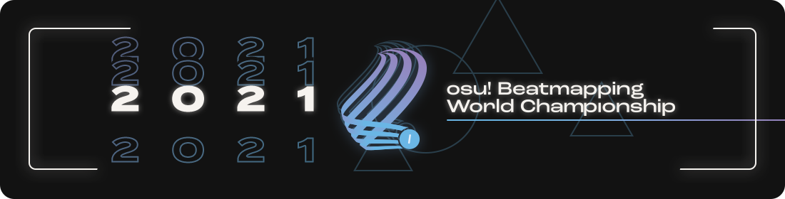

# osu! Beatmapping World Championship 2021

**L'osu! Beatmapping World Championship 2021** (***o!BWC 2021***) est un concours de mapping osu! par pays organisé par ::{ flag=US }:: ::Chaos::{ user-id=2628870 }, ::{ flag=FR }:: ::Imakuri::{ user-id=6100837 }, ::{ flag=CN }:: ::Mafumafu::{ user-id=3076909 }, ::{ flag=CL }:: ::Milan-::{ user-id=1052994 }, ::{ flag=FR }:: ::Nozhomi::{ user-id=2716981 }, ::{ flag=FR }:: ::Pachiru::{ user-id=2850983 }, et ::{ flag=TR }:: ::Zeus-::{ user-id=5464437 }. Anciennement connue sous le nom de *osu! Mapping World Cup*, il s'agit de la troisième itération de la série **osu! Beatmapping World Championship**.

## Calendrier du concours

Toutes les échéances commencent à 00:00 UTC et se terminent à 23:59 UTC.

| Événement | Horodatage |
| --: | :-- |
| Phase d'inscription | 02/05/2021/16/05/2021 |
| Premier tour - Phase de mapping | 17/05/2021/31/05/2021 |
| Premier tour - Phase d'évaluation | 01/06/2021/22/06/2021 |
| Deuxième tour - Phase de mapping | 23/06/2021/07/07/2021 |
| Deuxième tour - Phase d'évaluation | 08/07/2021/22/07/2021 |
| Troisième tour - Phase de mapping | 23/07/2021/06/08/2021 |
| Troisième tour - Phase d'évaluation | 07/08/2021/21/08/2021 |
| Quatrième tour - Phase de mapping | 22/08/2021/05/09/2021 |
| Quatrième tour - Phase d'évaluation | 06/09/2021/20/09/2021 |
| Annonce des résultats et diffusion en direct | 21/09/2021 |

## Prix

*Note : Les prix "Players' Pick" et "Top 3" peuvent être additionnés si une équipe remporte les deux prix.*

| Placing | Prize(s) |
| :-: | :-- |
|  | 8 mois d'osu!supporter, badge de profil unique, entrées accélérées vers la section qualifiée |
|  | 6 mois d'osu!supporter, badge de profil unique |
|  | 4 mois d'osu!supporter, badge de profil unique |
| **Players' Pick Winner** | 2 mois d'osu!supporter, badge de profil unique¹ |

   

¹ Le badge du profil est en attente d'approbation

## Organisation

L'osu! Beatmapping World Championship est organisé par divers membres de la communauté.

| Position | Membre(s) |
| :-- | :-- |
| Hôte | ::{ flag=US }:: ::Chaos::{ user-id=2628870 }, ::{ flag=FR }:: ::Imakuri::{ user-id=6100837 }, ::{ flag=CN }:: ::Mafumafu::{ user-id=3076909 }, ::{ flag=CL }:: ::Milan-::{ user-id=1052994 }, ::{ flag=FR }:: ::Nozhomi::{ user-id=2716981 }, ::{ flag=FR }:: ::Pachiru::{ user-id=2850983 }, ::{ flag=TR }:: ::Zeus-::{ user-id=5464437 } |
| Gestionnaire web | ::{ flag=CL }:: ::Milan-::{ user-id=1052994 }, ::{ flag=FR }:: ::Pachiru::{ user-id=2850983 } |
| Juge mappeur | ::{ flag=US }:: ::Cheri::{ user-id=5226970 }, ::{ flag=TH }:: ::Electoz::{ user-id=6485263 }, ::{ flag=RU }:: ::fergas::{ user-id=3144542 }, ::{ flag=CL }:: ::Krisom::{ user-id=99269 }, ::{ flag=US }:: ::Mimari::{ user-id=14339830 }, ::{ flag=CN }:: ::Ryuusei Aika::{ user-id=7777875 }, ::{ flag=DE }:: ::sdafsf::{ user-id=3523418 }, ::{ flag=RS }:: ::Seolv::{ user-id=8067876 }, ::{ flag=BR }:: ::Seto Kousuke::{ user-id=2857314 }, ::{ flag=AR }:: ::Yuii-::{ user-id=2935923 } |
| Juge joueur | ::{ flag=GB }:: ::AJT::{ user-id=3181083 }, ::{ flag=UA }:: ::Ayla::{ user-id=4548264 }, ::{ flag=US }:: ::ChillierPear::{ user-id=9501251 }, ::{ flag=SG }:: ::megumic::{ user-id=7537133 }, ::{ flag=US }:: ::saiyo::{ user-id=2709574 } |
| Designer | ::{ flag=CA }:: ::Kaetwo::{ user-id=1997719 } |
| Statisticien | ::{ flag=CN }:: ::Mafumafu::{ user-id=3076909 }, ::{ flag=FR }:: ::Nozhomi::{ user-id=2716981 } |
| Éditeur du wiki | ::{ flag=TR }:: ::Zeus-::{ user-id=5464437 } |

## Liens

- [Serveur Discord](https://discord.gg/CZp4bNx)
- [Twitter](https://twitter.com/osubwc)
- [Livestream](https://www.twitch.tv/osubwc)
- [Site officiel](https://obwc.net/)
- [Documentation officielle](https://gist.github.com/zeusminus/5b7cac0cbd6bcec422776dac5085f25f)

## Participants

|  | Pays | Nom | Membres |
| :-: | :-: | :-: | :-- |
| ::{ flag=AR }:: | **Argentine** | **MaestroSplinter** | **::MaestroSplinter::{ user-id=6707918 }**, [Birke](https://osu.ppy.sh/users/3265658), ::Chaphe::{ user-id=8428983 }, [fusionnqn](https://osu.ppy.sh/users/11606403), ::Lince Cosmico::{ user-id=6070370 }, [Megafan](https://osu.ppy.sh/users/6632605) |
| ::{ flag=AU }:: | **Australie** | **bunnings truck** | **::wetdog123::{ user-id=2164888 }**, [ChigaMyMommy](https://osu.ppy.sh/users/12905443), ::Coppertine::{ user-id=7279762 } |
| ::{ flag=AU }:: | **Australie** | **DELIVEROO** | **::Pentori::{ user-id=7452237 }**, [- Heatwave -](https://osu.ppy.sh/users/4166621), ::Cubby::{ user-id=10914582 }, [elicz1](https://osu.ppy.sh/users/8039342) |
| ::{ flag=AU }:: | **Australie** | **Yeah The Boys** | **::Iceluin::{ user-id=3558897 }**, [Kazuma](https://osu.ppy.sh/users/10642837), ::LeQuack::{ user-id=7121588 }, [My Angel Watame](https://osu.ppy.sh/users/4525153), ::sahuang::{ user-id=5318910 } |
| ::{ flag=BR }:: | **Brésil** | **4Fun** | **::Net0::{ user-id=5099768 }**, [Ataraxia](https://osu.ppy.sh/users/4077912), ::Bariton::{ user-id=2026274 } |
| ::{ flag=BR }:: | **Brésil** | **Baile Denied** | **::K4L1::{ user-id=11334594 }**, [Akaeboshi](https://osu.ppy.sh/users/10466730), ::Dada::{ user-id=9119507 }, [Edward](https://osu.ppy.sh/users/5618109), ::xxluizxx47::{ user-id=4687701 } |
| ::{ flag=BR }:: | **Brésil** | **edgard** | **::niii\1san::{ user-id=5403374 }**, [Coreanmaluco](https://osu.ppy.sh/users/3149577), ::Foerster::{ user-id=9050766 }, [Mystia](https://osu.ppy.sh/users/4277702), ::oTs-Joaka::{ user-id=11223044 }, [Yuuzinho](https://osu.ppy.sh/users/6267851) |
| ::{ flag=BR }:: | **Brésil** | **O TIME SUDESTE** | **::Maot::{ user-id=3914271 }**, [Faito](https://osu.ppy.sh/users/9706291), ::Moete::{ user-id=4824692 }, [NEURONIO](https://osu.ppy.sh/users/7198334), ::Roberto::{ user-id=3453558 }, [Sakura Airi](https://osu.ppy.sh/users/8682057) |
| ::{ flag=BR }:: | **Brésil** | **Project Heiko** | **::Toofu::{ user-id=11004271 }**, [AlexTroIIPsy](https://osu.ppy.sh/users/5176421), ::Batatin::{ user-id=9138779 }, [Gaab](https://osu.ppy.sh/users/7710249), ::Marianna::{ user-id=6701398 }, [Sharpay](https://osu.ppy.sh/users/11251594) |
| ::{ flag=BR }:: | **Brésil** | **unexpected** | **::maatdesu::{ user-id=15441176 }**, [Labastie_pedro](https://osu.ppy.sh/users/17227807), ::luizinho2581::{ user-id=12828037 } |
| ::{ flag=CA }:: | **Canada** | **#YesChef** | **::Gordon::{ user-id=7856835 }**, [BadGraph_](https://osu.ppy.sh/users/7967508), ::dreamteamrox115::{ user-id=11962943 }, [P1Twist](https://osu.ppy.sh/users/12679616), ::PotatoDew::{ user-id=10964252 }, [Shanipika](https://osu.ppy.sh/users/6336729) |
| ::{ flag=CA }:: | **Canada** | **Canada** | **::Kyumo::{ user-id=14689984 }**, [alden](https://osu.ppy.sh/users/3545323), ::Elayue::{ user-id=6400861 }, [Feiri](https://osu.ppy.sh/users/3214844), ::Xen::{ user-id=4026817 }, [Zer0-G](https://osu.ppy.sh/users/12577911) |
| ::{ flag=CA }:: | **Canada** | **Sent to Quebec** | **::J1\1::{ user-id=5918561 }**, [Azer](https://osu.ppy.sh/users/2155578), ::KKipalt::{ user-id=6889573 }, [Kyrian](https://osu.ppy.sh/users/13653298), ::Monstrata::{ user-id=2706438 } |
| ::{ flag=CL }:: | **Chili** | **Amber Mains** | **::Cris-::{ user-id=6175280 }**, [Hazu-](https://osu.ppy.sh/users/4668230), ::Tatan::{ user-id=5646529 } |
| ::{ flag=CL }:: | **Chili** | **TEAM CHISTE** | **::kanocchi::{ user-id=2321050 }**, [Arminator](https://osu.ppy.sh/users/7678119), ::Barack::{ user-id=9402889 }, [bentrix](https://osu.ppy.sh/users/6030068), ::Eunha::{ user-id=7701428 } |
| ::{ flag=CL }:: | **Chili** | **Tortuga** | **::Pyo::{ user-id=6641784 }**, [\[-Evil-\]](https://osu.ppy.sh/users/10234313), ::Crissa::{ user-id=5405836 }, [KChronoZ](https://osu.ppy.sh/users/7918770), ::Kyutei::{ user-id=13421842 }, [Sunazuka Akira](https://osu.ppy.sh/users/8846632) |
| ::{ flag=CN }:: | **Chine** | **SryNotInterested** | **::Yugu::{ user-id=3161834 }**, [Bellicose](https://osu.ppy.sh/users/4298072), ::Firika::{ user-id=9590557 }, [Garden](https://osu.ppy.sh/users/2849992), ::Necho::{ user-id=4086593 }, [pw384](https://osu.ppy.sh/users/1343783) |
| ::{ flag=CY }:: | **Chypre** | **osu! CY Pog** | **::def0ltt::{ user-id=12221151 }**, [SassyRiolu](https://osu.ppy.sh/users/14014935), ::vladdy\1boi::{ user-id=14828149 } |
| ::{ flag=CZ }:: | **République tchèque** | **Smrding** | **::Alvieee::{ user-id=3579669 }**, [CutoNaito](https://osu.ppy.sh/users/8064649), ::NitroM\1::{ user-id=3121234 } |
| ::{ flag=DK }:: | **Danemark** | **The DK Crew** | **::melon boy::{ user-id=3053382 }**, [Akayume](https://osu.ppy.sh/users/10617530), ::Sagon::{ user-id=11775933 }, [Striderin](https://osu.ppy.sh/users/10193902), ::vitalia::{ user-id=9450032 }, [waefwerf](https://osu.ppy.sh/users/3868653) |
| ::{ flag=EE }:: | **Estonie** | **Shikaku Kakumäe** | **::Keqing::{ user-id=8501291 }**, [Lotragon](https://osu.ppy.sh/users/6063342), ::Namki::{ user-id=5248582 }, [schoolboy](https://osu.ppy.sh/users/8722791), ::Xayler::{ user-id=3649657 } |
| ::{ flag=FR }:: | **France** | **Truands2LaGalere** | **::Realazy::{ user-id=918297 }**, [BOUYAAA](https://osu.ppy.sh/users/405449), ::Halgoh::{ user-id=4109923 }, [Kudosu](https://osu.ppy.sh/users/11038155), ::Sharu::{ user-id=5597639 }, [Yuguiboy](https://osu.ppy.sh/users/5559243) |
| ::{ flag=GE }:: | **Géorgie** | **Clown Fiesta** | **::Kyuunex::{ user-id=9236044 }**, [Hopp](https://osu.ppy.sh/users/11716440), ::NikaRuso::{ user-id=5391748 } |
| ::{ flag=DE }:: | **Allemagne** | **AtLeastWeTriedXD** | **::DragoBruder::{ user-id=10944421 }**, [Big Doc Bazuso](https://osu.ppy.sh/users/11726139), ::Enterprise::{ user-id=11766551 } |
| ::{ flag=DE }:: | **Allemagne** | **Dönerladen** | **::0ppInOsu::{ user-id=12551840 }**, [Cacturne](https://osu.ppy.sh/users/13646997), ::FuJu::{ user-id=10773882 }, [Lulu-](https://osu.ppy.sh/users/4201715), ::PaRaDogi::{ user-id=2054596 }, [Ykybfz](https://osu.ppy.sh/users/9522967) |
| ::{ flag=DE }:: | **Allemagne** | **E-Hooligan e.V.** | **::jamesjan3::{ user-id=6260705 }**, [Icekalt](https://osu.ppy.sh/users/5410645), ::Mao::{ user-id=2204515 }, [Mir](https://osu.ppy.sh/users/8688812), ::Okoratu::{ user-id=1623405 }, [Zetera](https://osu.ppy.sh/users/587737) |
| ::{ flag=DE }:: | **Allemagne** | **Notelock Mapping** | **::Krimek::{ user-id=2345078 }**, [Bakugo-](https://osu.ppy.sh/users/4990127), ::Famous::{ user-id=814328 }, [laura-](https://osu.ppy.sh/users/6491613), ::Pho::{ user-id=3624692 }, [Shiguri](https://osu.ppy.sh/users/2665207) |
| ::{ flag=HK }:: | **Hong Kong** | **-1** | **::Petal::{ user-id=7354729 }**, [-Atri-](https://osu.ppy.sh/users/2433720), ::gary00737::{ user-id=6029467 }, [GIDZ](https://osu.ppy.sh/users/2286528), ::KwAIMSuckASFuk::{ user-id=9629457 }, [Seros](https://osu.ppy.sh/users/10562853) |
| ::{ flag=HU }:: | **Hongrie** | **indula727aludni** | **::Harupion::{ user-id=12939945 }**, [HeyImJarvis](https://osu.ppy.sh/users/14227494), ::Himada::{ user-id=10959366 }, [Nytrocide_](https://osu.ppy.sh/users/11327918) |
| ::{ flag=ID }:: | **Indonésie** | **komplek akira** | **::Celine::{ user-id=3545579 }**, [\[Keqing\]](https://osu.ppy.sh/users/8972308), ::Ameth Rianno::{ user-id=5219516 }, [AncuL](https://osu.ppy.sh/users/2449200), ::araran::{ user-id=8937198 }, [Haruto](https://osu.ppy.sh/users/3772301) |
| ::{ flag=IT }:: | **Italie** | **Shinquot** | **::Shoenen::{ user-id=6404824 }**, [_Zekken](https://osu.ppy.sh/users/9704802), ::-Syncro::{ user-id=4338923 }, [Shiino](https://osu.ppy.sh/users/9839375) |
| ::{ flag=IT }:: | **Italie** | **VERA ITALIA** | **::Manu028::{ user-id=6192633 }**, [Boc](https://osu.ppy.sh/users/8637017), ::Daren::{ user-id=4704608 }, [DT-sama](https://osu.ppy.sh/users/3525018), ::Entity\1A::{ user-id=14142449 }, [GYGY](https://osu.ppy.sh/users/7201269) |
| ::{ flag=JP }:: | **Japon** | **Genshin Impact** | **::dectopia::{ user-id=2845904 }**,  [a_Blue](https://osu.ppy.sh/users/5645667), ::aramaking::{ user-id=4796949 }, [KogumaX](https://osu.ppy.sh/users/525262), ::ponbot::{ user-id=8939857 }, [too](https://osu.ppy.sh/users/12196931) |
| ::{ flag=KZ }:: | **Kazakhstan** | **aspanga qaraymin** | **::tadahitotsu::{ user-id=11653544 }**, [_Hornet](https://osu.ppy.sh/users/6862265), ::Calideon::{ user-id=5175726 }, [Danik_LzZ](https://osu.ppy.sh/users/4756779) |
| ::{ flag=MY }:: | **Malaisie** | **good question** | **::t ony::{ user-id=9697624 }**, [\[MY\]xArief](https://osu.ppy.sh/users/12694468), ::Kardshark::{ user-id=4724315 } |
| ::{ flag=MY }:: | **Malaisie** | **horny** | **::Monofly::{ user-id=11134301 }**, [LavenderEclipse](https://osu.ppy.sh/users/13510754), ::Stick2Glue::{ user-id=6928574 }, [squidstain](https://osu.ppy.sh/users/11073207) |
| ::{ flag=MY }:: | **Malaisie** | **MYsia** | **::Agagak::{ user-id=3645490 }**, [\[ -Scarlet- \]](https://osu.ppy.sh/users/2427693), ::KPMY::{ user-id=12464372 }, [Rumia-](https://osu.ppy.sh/users/1787171), ::Sweets::{ user-id=10279996 }, [walaowey](https://osu.ppy.sh/users/1475828) |
| ::{ flag=NL }:: | **Pays-Bas** | **#modhelp enjoyer** | **::Waitrose::{ user-id=14918572 }**, [CMeFly](https://osu.ppy.sh/users/12195391), ::Jelljel::{ user-id=11939459 }, [yukic](https://osu.ppy.sh/users/6977273) |
| ::{ flag=NL }:: | **Pays-Bas** | **drop** | **::Castagne::{ user-id=12270596 }**, [Chizuru](https://osu.ppy.sh/users/1026491), ::Ermi::{ user-id=8468590 }, [taku](https://osu.ppy.sh/users/684433) |
| ::{ flag=NO }:: | **Norvège** | **Shigeru Miyamoto** | **::Fisky::{ user-id=8352623 }**, [-PC](https://osu.ppy.sh/users/2916414), ::YokesPai::{ user-id=6399568 } |
| ::{ flag=PH }:: | **Philippines** | **:mm:** | **::newton-::{ user-id=5875419 }**, [0ugi](https://osu.ppy.sh/users/3812234), ::Flake::{ user-id=7627157 }, [LeCandy](https://osu.ppy.sh/users/6626249), ::Tsukinyuni::{ user-id=11545816 } |
| ::{ flag=PH }:: | **Philippines** | **ang** | **::Sisig::{ user-id=12783631 }**, [Arccanist](https://osu.ppy.sh/users/13596534), ::PentagonGlxy::{ user-id=19753773 }, [Shhh453](https://osu.ppy.sh/users/19936043) |
| ::{ flag=PH }:: | **Philippines** | **i am team** | **::-Aqua::{ user-id=7150015 }**, [Ajisai-](https://osu.ppy.sh/users/8636583), ::AyameMyMommy::{ user-id=15822813 }, [Nagaraia](https://osu.ppy.sh/users/13673790) |
| ::{ flag=PH }:: | **Philippines** | **WEEB PH DELUXE** | **::\1xyliac::{ user-id=7989480 }**, [Asagi](https://osu.ppy.sh/users/2439246), ::Dudamesh::{ user-id=10379135 } |
| ::{ flag=PL }:: | **Pologne** | **grappa ice_pl Xd** | **::browiec::{ user-id=9426712 }**, [Kuki1537](https://osu.ppy.sh/users/6174349), ::LosPedros::{ user-id=8337056 }, [Moko](https://osu.ppy.sh/users/6488658), ::olsonn::{ user-id=8617799 }, [SaltyLucario](https://osu.ppy.sh/users/6571670) |
| ::{ flag=PL }:: | **Pologne** | **Polska gurom** | **::Bass::{ user-id=63829 }**, [-Sylvari](https://osu.ppy.sh/users/3493804), ::Chalwa::{ user-id=4826159 }, [Skubi](https://osu.ppy.sh/users/3687666), ::wiwit::{ user-id=10610309 } |
| ::{ flag=PL }:: | **Pologne** | **TwojaStara** | **::Yudragen::{ user-id=8406396 }**, [Kalibe](https://osu.ppy.sh/users/3376777), ::nhlx::{ user-id=3827077 }, [Peter](https://osu.ppy.sh/users/8623835), ::Venix::{ user-id=5999631 }, [Zelq](https://osu.ppy.sh/users/8953955) |
| ::{ flag=RO }:: | **Roumanie** | **Echipa Pe Cimpoi** | **::MaddaFakka-sama::{ user-id=6584266 }**, [entsetzen](https://osu.ppy.sh/users/10261883), ::Prodii::{ user-id=15744737 } |
| ::{ flag=RU }:: | **Fédération de Russie** | **Azamat Aytaliev** | **::3mplify::{ user-id=5688171 }**, [Aphestra](https://osu.ppy.sh/users/11949191), ::Daycore::{ user-id=5596337 }, [IntegerTempest](https://osu.ppy.sh/users/10301398), ::Myahkey::{ user-id=6684556 }, [smozit](https://osu.ppy.sh/users/6983995) |
| ::{ flag=RU }:: | **Fédération de Russie** | **baltika7 fanclub** | **::piroshki::{ user-id=7645522 }**, [Caspar](https://osu.ppy.sh/users/6084669), ::FCL::{ user-id=4715762 }, [GazPriest](https://osu.ppy.sh/users/8874115) |
| ::{ flag=RU }:: | **Fédération de Russie** | **Djulus' Normal** | **::Shmiklak::{ user-id=5504231 }**, [Cami](https://osu.ppy.sh/users/10286675), ::Djulus::{ user-id=4960893 }, [kuyusu](https://osu.ppy.sh/users/11758667), ::Lokidoki::{ user-id=6566632 }, [NeKroMan4ik](https://osu.ppy.sh/users/11387664) |
| ::{ flag=RU }:: | **Fédération de Russie** | **Nekroloh** | **::wenet::{ user-id=10261029 }**, [-Light-](https://osu.ppy.sh/users/6017901), ::2zz::{ user-id=8201267 }, [Delette](https://osu.ppy.sh/users/7835664) |
| ::{ flag=RU }:: | **Fédération de Russie** | **Seven Colors** | **::xbopost::{ user-id=6842421 }**, [AYE1337](https://osu.ppy.sh/users/9131844), ::Frakturehawkens::{ user-id=7458583 }, [h3ct1c](https://osu.ppy.sh/users/6885942), ::NeilPerry::{ user-id=841391 }, [Senseabel](https://osu.ppy.sh/users/6184386) |
| ::{ flag=RU }:: | **Fédération de Russie** | **Team Gambia** | **::Natteke desu::{ user-id=1848318 }**, [attendant](https://osu.ppy.sh/users/12416885), ::Mirash::{ user-id=2841009 }, [PandaHero](https://osu.ppy.sh/users/1233255), ::Rue::{ user-id=417551 }, [tokiko](https://osu.ppy.sh/users/2836455) |
| ::{ flag=SG }:: | **Singapour** | **circuit breaker** | **::Yuuki Noa::{ user-id=11016828 }**,  [Mocaotic](https://osu.ppy.sh/users/9487458), ::P4ndemonium::{ user-id=6639059 }, [Rtyzen](https://osu.ppy.sh/users/2439822), ::sorciere::{ user-id=2500099 } |
| ::{ flag=SG }:: | **Singapour** | **come sock** | **::apl-::{ user-id=2248413 }**, [Demonical](https://osu.ppy.sh/users/5447609), ::emilia::{ user-id=2003326 } |
| ::{ flag=SG }:: | **Singapour** | **科技制图员** | **::eIis::{ user-id=9778431 }**, [Flowziee](https://osu.ppy.sh/users/9205650), ::Slyze-::{ user-id=9162649 } |
| ::{ flag=KR }:: | **Corée du Sud** | **JJin** | **::Kawashiro::{ user-id=1533796 }**, [iLyne](https://osu.ppy.sh/users/13924533), ::Skymin::{ user-id=3223044 }, [Toumei Dragon](https://osu.ppy.sh/users/6673830) |
| ::{ flag=KR }:: | **Corée du Sud** | **wannagohome** | **::Enon::{ user-id=2043401 }**, [239](https://osu.ppy.sh/users/3261991), ::Kaguya\1Sama::{ user-id=9326064 }, [Luscent](https://osu.ppy.sh/users/2688581), ::mayle\15::{ user-id=10022756 }, [Woe](https://osu.ppy.sh/users/9858638) |
| ::{ flag=KR }:: | **Corée du Sud** | **WatameBang** | **::Heilia::{ user-id=9823042 }**, [Acylica](https://osu.ppy.sh/users/1943309), ::Beomsan::{ user-id=3626063 }, [Dailycare](https://osu.ppy.sh/users/1634445), ::Down::{ user-id=4694602 }, [jieusieu](https://osu.ppy.sh/users/759439) |
| ::{ flag=ES }:: | **Espagne** | **Team Españita** | **::MrMenda::{ user-id=7567228 }**, [B E R N A R D O](https://osu.ppy.sh/users/5109259), ::CebollaVladimir::{ user-id=15308238 }, [GokuLook](https://osu.ppy.sh/users/7684497), ::Hikomori::{ user-id=7375684 }, [quebrantahuesos](https://osu.ppy.sh/users/7400022) |
| ::{ flag=SE }:: | **Suède** | **Sverige** | **::Zer0-::{ user-id=4260033 }**, [bite you death](https://osu.ppy.sh/users/6398464), ::melwoine::{ user-id=12091109 }, [Saika0k1](https://osu.ppy.sh/users/4316633), ::Yooh::{ user-id=9828042 } |
| ::{ flag=TW }:: | **Taïwan** | **超市無敵** | **::Hey lululu::{ user-id=4086497 }**, [- AzRaeL -](https://osu.ppy.sh/users/10027577), ::arronchu1207::{ user-id=2226083 }, [Flask](https://osu.ppy.sh/users/959763), ::knowledgeking::{ user-id=8022517 }, [zyoi](https://osu.ppy.sh/users/4360287) |
| ::{ flag=TR }:: | **Turquie** | **Sheeeeeesh Kebab** | **::mezelyus::{ user-id=5938859 }**, [Cyberia950](https://osu.ppy.sh/users/9143539), ::EgzotikButters::{ user-id=9655150 }, [Entry](https://osu.ppy.sh/users/10213311), ::Nymphe::{ user-id=10507407 }, [Skytuna](https://osu.ppy.sh/users/9079936) |
| ::{ flag=UA }:: | **Ukraine** | **NM ty** | **::Dafiely::{ user-id=7197186 }**, [Esutarosa](https://osu.ppy.sh/users/12024753), ::lexa on osu::{ user-id=4382562 } |
| ::{ flag=GB }:: | **Royaume-Uni** | **otter** | **::Gelidium::{ user-id=14261540 }**, [Blacken](https://osu.ppy.sh/users/10880277), ::enryotoki::{ user-id=10639122 }, [Ishtiaq](https://osu.ppy.sh/users/6405262), ::skylaa::{ user-id=9505704 }, [udder](https://osu.ppy.sh/users/9314914) |
| ::{ flag=GB }:: | **Royaume-Uni** | **Tesco Finest** | **::-jordan-::{ user-id=7288862 }**, [CallieCube](https://osu.ppy.sh/users/7535045), ::KnightC0re::{ user-id=7894340 }, [Shii](https://osu.ppy.sh/users/9186316), ::Skidooskei::{ user-id=10079029 } |
| ::{ flag=US }:: | **États-Unis** | **chris** | **::Tekkito::{ user-id=7075211 }**, [BoshyMan741](https://osu.ppy.sh/users/4830687), ::fieryrage::{ user-id=3533958 }, [Innovation](https://osu.ppy.sh/users/6304412), ::SWAGGYSWAGSTER::{ user-id=7813296 } |
| ::{ flag=US }:: | **États-Unis** | **comfy culture** | **::jasontime12345::{ user-id=12882468 }**, [Kurashina Asuka](https://osu.ppy.sh/users/7476493), ::Lunicia::{ user-id=4369309 }, [MugiMyMommy](https://osu.ppy.sh/users/6251591) |
| ::{ flag=US }:: | **États-Unis** | **frustationan** | **::melloe::{ user-id=2367616 }**, [Axarious](https://osu.ppy.sh/users/2614511), ::semaphore::{ user-id=6313643 } |
| ::{ flag=US }:: | **États-Unis** | **guice blunder** | **::FrenZ396::{ user-id=9531903 }**, [IOException](https://osu.ppy.sh/users/2688103), ::JeZag::{ user-id=3087506 }, [over_loadcode](https://osu.ppy.sh/users/7081160), ::Ralkinson::{ user-id=10646707 }, [wafer](https://osu.ppy.sh/users/9416836) |
| ::{ flag=US }:: | **États-Unis** | **milk mug** | **::toybot::{ user-id=2848604 }**, [amity](https://osu.ppy.sh/users/10676118), ::captin1::{ user-id=689997 }, [Gillstar](https://osu.ppy.sh/users/7948210), ::omphen::{ user-id=8816844 }, [synderes](https://osu.ppy.sh/users/5129592) |
| ::{ flag=US }:: | **États-Unis** | **RUSSIA TEAM 1** | **::-Doodle::{ user-id=12337329 }**, [Adam_S](https://osu.ppy.sh/users/11678065), ::Carcinogenesis::{ user-id=11160462 }, [Sweet Tea](https://osu.ppy.sh/users/11529050) |
| ::{ flag=US }:: | **États-Unis** | **sheesh** | **::Kron05::{ user-id=10505107 }**, [-Mish-](https://osu.ppy.sh/users/13972931), ::BlessRNG\1::{ user-id=9265990 }, [ConsumerOfBean](https://osu.ppy.sh/users/6293158), ::Suicune3::{ user-id=6895187 }, [suraimu](https://osu.ppy.sh/users/11776859) |
| ::{ flag=VN }:: | **Vietnam** | **iced brown** | **::LMT::{ user-id=7262798 }**, [Asaiga](https://osu.ppy.sh/users/2959560), ::Hikan::{ user-id=7968702 }, [Kirylln](https://osu.ppy.sh/users/7228554), ::Liyuchi::{ user-id=3275495 }, [Smug Nanachi](https://osu.ppy.sh/users/10063190) |
| ::{ flag=VN }:: | **Vietnam** | **Unranked Viets** | **::- Mel -::{ user-id=9829680 }**, [dPeace](https://osu.ppy.sh/users/14937109), ::TrungSabito0159::{ user-id=14927934 } |
| ::{ flag=VN }:: | **Vietnam** | **vietnam newbies** | **::Lottery61::{ user-id=13821222 }**, [miyatohanasaki](https://osu.ppy.sh/users/13916687), ::ThachAnhHoang::{ user-id=14175365 } |

## Règlement

1. **Les [critères de classement d'osu!](/wiki/Ranking_criteria/osu!) et les [critères de classement généraux](/wiki/Ranking_criteria) sont en vigueur pour ce concours.** Le prix du concours comprend le classement des 3 beatmaps soumis par les équipes gagnantes, ce qui ne peut se faire si les beatmaps ne respectent pas les critères de classement. Toutes les difficultés requises pour satisfaire aux exigences des critères de classement seront fournies par [l'équipe d'organisation](#organisation). Les cas inapplicables tels que les exigences de répartition sont exclus de cette règle.
2. **L'équipe doit être composée de 3 à 6 personnes.** Le concept principal du concours est d'exposer le potentiel de chaque pays, ce qui signifie qu'une collaboration d'au moins 2 membres sur chaque musique sera demandée aux membres de l'équipe. L'organisation des sections est entièrement à votre charge.
3. **Tous les membres de l'équipe doivent contribuer à chaque tour du concours.** Étant donné qu'il s'agit d'un concours national qui exige un travail d'équipe, nous aimerions que chaque membre d'une équipe soit récompensé équitablement pour sa diligence. Ne pas aider les autres coéquipiers et les laisser tirer les ficelles est considéré comme antisportif et peut entraîner la disqualification de l'équipe.
4. **Une équipe doit participer à au moins 3 tours pour être éligible aux prix.** Nous ne voulons pas que nos concurrents s'épuisent, mais nous tenons à récompenser ceux qui le méritent.
5. **Il est strictement interdit de voler ou de plagier le travail d'autrui.** Copier les propriétés intellectuelles d'autres utilisateurs est hautement contraire à l'éthique et interdit par le [Beatmap Submission Rules](/wiki/Rules#règles-de-mise-en-ligne-des-beatmaps). S'il s'avère que votre contribution est plagiée, votre équipe sera immédiatement disqualifiée du concours.
6. **Il est strictement interdit de télécharger votre soumission via [BSS](/wiki/Beatmapping/Beatmap_submission) ou de la partager sur des sites web tiers avant la date limite.** Il s'agit notamment de demander une aide extérieure, de partager la beatmap avec des utilisateurs extérieurs à votre équipe. La violation de cette règle entraînera la disqualification. Nous vous recommandons vivement de ne pas divulguer les documents associés, tels que les photos et les captures d'écran de votre projet.
7. **Les candidatures ne peuvent être soumises que par l'intermédiaire du site web officiel.** Ce processus a pour but de faciliter la gestion des difficultés entre les juges et les participants. Aucune participation ne sera acceptée par d'autres moyens que le site web. Pour toute question concernant l'utilisation du site web, veuillez contacter les organisateurs du concours.
8. **Les candidatures ne seront pas acceptées après la date limite.** Étant donné que tout le monde disposera de la même période pour établir le mapping de chaque tour, prolonger le délai pour une équipe en particulier serait injuste pour les autres. Par conséquent, toute inscription soumise après la date limite ne sera pas prise en compte. Le site web fermera automatiquement les inscriptions une fois la date limite dépassée.
9. **Les hitsounds personnalisés sont autorisés, mais aucun n'est fourni.** Vous êtes autorisé, et même encouragé, à utiliser des hitsounds personnalisés. La manière dont vous les organiserez dépendra de vous.
10. **Il est interdit de modifier le contenu du fichier `.osz` fourni.** Cela inclut le changement du timing du fichier `.osu`, le remplacement ou la suppression du fichier `.mp3`, la modification des métadonnées, des tags, des titres et des artistes. Nous souhaitons éviter toute complication au cours du processus d'évaluation, c'est pourquoi les candidatures contenant des versions modifiées des valeurs ou des contenus mentionnés seront considérées comme non valables.
11. **Ne pas inclure de storyboards ou d'arrière-plans.** Ils ne seront pas pris en compte dans le processus de jugement et seront retirés avant que les inscriptions ne soient transmises aux juges.
12. **Les utilisateurs restreints ne peuvent pas participer au concours.** Pour la légitimité de ce concours, les utilisateurs soumis à des restrictions ne sont pas autorisés à participer. Si un utilisateur soumis à des restrictions est identifié pour contribuer à ce concours au sein d'une équipe, l'équipe entière sera disqualifiée.
13. **Les équipes doivent être composées d'utilisateurs d'un seul pays.** La fusion ou le regroupement de pays ne permet pas aux joueurs de représenter pleinement leur pays. Vous ne pouvez rejoindre que l'équipe qui appartient au pays affiché sur votre profil osu!.
14. **Tenir les organisateurs au courant de l'évolution de l'équipe après la phase de préparation.** Si un participant doit abandonner le concours pour quelque raison que ce soit, il est prié d'en informer l'équipe dès que possible. Aucun remplacement ne sera autorisé et aucune récompense ne sera attribuée à l'utilisateur si l'équipe atteint le top 3 ou est nominée pour le prix Players' Pick. Les utilisateurs qui quittent le concours ne peuvent pas le rejoindre. Si le nombre de participants est inférieur au minimum requis, l'équipe sera disqualifiée.

## Critères d'évaluation

### Panneau de mapping

- **Cohésion (30%)** : Ce critère se concentre sur la cohérence du mapping. Tous les éléments de la map doivent rester cohérents avec le rythme et la musique. Par exemple, si l'entrée représente bien la musique et que les sections des différents membres sont intégrées de manière transparente, sans transitions bizarres ni pics brusques, cette entrée mérite d'être saluée.
- **Expertise (30%)** : Nos juges doivent également se concentrer sur les compétences avancées ou l'expertise en matière de mapping. Une map avec un haut niveau d'expertise montre une excellente gestion des patterns de notes, des streams, des mouvements, et même des hitsounds. Ces maps sont exceptionnelles par rapport à leurs pairs dans ce concours et se placent au sommet de la communauté de mapping à l'état de l'art.
- **Créativité (30%)** : Comme pour toute chose, les beatmaps et les techniques de mapping sont susceptibles d'évoluer au fil du temps. De plus, l'histoire du timing d'osu! est toujours marquée par des maps créatives, qui témoignent d'une compréhension avant-gardiste, voire précurseur du mapping. Des maps créatives mais solides sont l'art d'osu! et sont donc définitivement promues dans ce concours.
- **Impression du juge (10%)** : Les juges peuvent l'utiliser pour obtenir des notes supplémentaires ou des pénalités pour leurs commentaires spécifiques ou leurs remarques sur un élément de l'inscription.

### Panneau des joueurs

- **Sophistication (30%)** : Ce critère se concentrera sur le confort de jeu de la beatmap, en fonction de son niveau de difficulté. Bien qu'ils puissent être considérés comme des œuvres d'art, les beatmaps sont définis comme des niveaux de jeu conçus pour que les utilisateurs puissent en profiter. Par conséquent, pour attirer les joueurs, ils doivent d'abord être conviviaux.
- **Profondeur (30%)** : Les joueurs sont censés évaluer la qualité de la beatmap en ne regardant rien d'autre que sa structure. Jouer un map super simple de type jump/stream peut être amusant, mais nous sommes ici pour faire une compétition après tout ! L'établissement de structures de mapping complexes peut prendre beaucoup de temps et d'efforts. Les joueurs sont donc censés tenir compte de la profondeur des beatmaps lors de leur évaluation.
- **Unicité (30%)** : Tout au long de l'histoire d'osu!, nous pouvons constater que les beatmaps affichant des patterns uniques sont généralement au centre de l'attention de la communauté et deviennent parfois même des chefs-d'œuvre définissant une ère. Dans cette optique, nous aimerions attirer l'attention des joueurs sur les aspects artistiques du mapping et voir où tournent leurs opinions.
- **Impression du joueur (10%)** : Les joueurs sont invités à noter leurs pensées personnelles et leurs opinions subjectives concernant la beatmap et à l'évaluer en conséquence.

## FAQ

1. **Quel est ce concours ?**

L'osu! Beatmapping World Championship est un concours de mapping en mode osu! au cours duquel plusieurs pays s'affrontent pour montrer leur capacité de mapping. Chaque membre de l'équipe sera choisi par un capitaine d'équipe, composé de 3 à 6 membres, y compris le capitaine d'équipe.

2. **Comment fonctionne ce concours ?**

Pendant la période d'inscription, les participants sont censés faire équipe avec des utilisateurs du même pays et décider d'un nom d'équipe. Après les inscriptions, toutes les équipes sont censées participer au premier tour. Les utilisateurs peuvent former plusieurs équipes dans le même pays, mais seule l'équipe qui obtient le meilleur score peut passer au second tour. À partir du deuxième tour, il y aura trois autres tours. Les résultats de ces trois tours resteront confidentiels jusqu'à la conclusion du quatrième tour. Une fois le quatrième tour terminé, les résultats combinés seront annoncés lors du livestream. Cette mesure vise à encourager les équipes qui ont passé le premier tour à rester dans le concours jusqu'à la fin et à ne pas être affectées de manière inattendue par des résultats intermédiaires.

3. **Quelles seront les musiques ?**

Les musiques seront annoncées dès le début du tour. N'oubliez pas que toutes les musiques utilisées pour ce concours seront tirées de la bibliothèque [Featured Artists](https://osu.ppy.sh/beatmaps/artists).

4. **Qu'est-ce qu'un "capitaine d'équipe" ?**

Les chefs d'équipe, également appelés capitaines, seront chargés de communiquer avec les organisateurs et les membres de leur équipe afin de nous informer des questions relatives à l'équipe. Aucune condition supplémentaire n'est requise pour devenir capitaine d'équipe.

5. **Que se passe-t-il si mon pays n'a pas de capitaine d'équipe ?**

Vous êtes libre de poser votre candidature sur le site web si vous souhaitez participer ! Le pays avec lequel vous serez autorisé à participer sera basé sur le drapeau de votre profil. Aucune fusion de pays ne sera autorisée afin d'éviter les complications de gestion.

6. **Dois-je rejoindre le serveur Discord pour participer ?**

Seul le capitaine de l'équipe est tenu de rejoindre le serveur Discord. Les membres de l'équipe sont toutefois les bienvenus, car toutes les informations importantes seront communiquées sur Discord et sur notre site web.

7. **Puis-je m'inscrire sur le serveur Discord même si je ne souhaite pas participer au concours ?**

Oui, c'est possible. Lors de votre inscription, vous serez placé dans le channel `#arrival`, où vous devrez poster votre lien de profil osu!, puis un membre de l'équipe ou un modérateur vous acceptera.

8. **"Tous les membres de l'équipe doivent contribuer à chaque tour pendant toute la durée du concours. - Dois-je travailler avec l'ensemble de mon équipe sur chaque map ?**

Oui ! Nous avons établi cette règle pour nous assurer que l'esprit principal du concours, à savoir les collaborations, demeure, sans pour autant restreindre la gestion de l'équipe. En dehors du mapping d'une section particulière de l'entrée, le hitsounding, la réalisation de sliderarts, le combo-coloring et le modding peuvent être considérés comme des contributions valables. L'organisation de ces tâches est entièrement à votre charge !

9. **Puis-je faire une beatmap osu!mania, osu!taiko ou osu!catch ?**

Malheureusement, cette édition du concours ne concerne que le mode de jeu osu!. Cependant, nous prévoyons d'organiser des éditions multi-modes dans 2 mois après le début de cette édition !

10. **Cet événement sera-t-il diffusé sur Twitch ?**

Oui, de nombreux événements liés au concours seront diffusés sur notre chaîne Twitch. Pendant les livestreams, il y aura un résumé de tous les moments importants du concours.

11. **Mon équipe a été éliminée dès le premier tour du concours. Ai-je une chance de remporter le prix Players' Pick ?**

Votre participation sera prise en considération par les juges du Players' Pick même si votre équipe a été éliminée lors du concours normal. Considérez le Players' Pick comme une sorte de catégorie annexe qui possède son propre classement.
