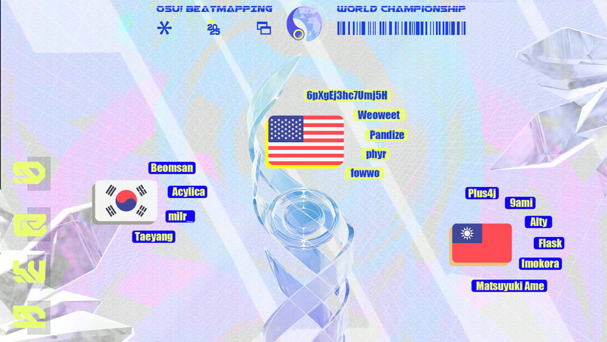

---
tags:
  - o!bwc
  - bwc
---

# osu! Beatmapping World Championship 2025

[o!bwc](/wiki/Contests/oBWC) was an international beatmapping contest that gathers beatmappers worldwide to showcase their creativity, expertise, and passion for mapping. Participants form teams representing their home country and compete to advance through the qualifiers and intense clash rounds.

## Schedule

| Event | Dates |
| --: | :-- |
| Announcement | April 7 |
| Registration | April 7 – May 11 |
| **Qualifier Round** |  |
| Beatmapping | May 12 – May 26 |
| Judging | May 26 – June 16 |
| **Round of 16** |  |
| Beatmapping | June 16 – June 30 |
| Judging | June 30 – July 14 |
| **Quarterfinals** |  |
| Beatmapping | July 14 – July 28 |
| Judging | July 28 – August 4 |
| **Semifinals** |  |
| Beatmapping | August 4 – August 18 |
| Judging | August 18 – August 25 |
| **Finals** |  |
| Beatmapping | August 25 – September 8 |
| Judging | September 8 – September 15 |

## Prizes

| Placement | Team | Prizes |
| :-: | :-- | :-- |
| [1st](/wiki/shared/crown-gold.png "1st place") | ::{ flag=US }:: United States | **$400 USD**, profile badge, 3 [contest points](/wiki/Contests/Contest_points) |
| [2nd](/wiki/shared/crown-silver.png "2nd place") | ::{ flag=KR }:: South Korea | **$300 USD**, profile badge, 2 [contest points](/wiki/Contests/Contest_points) |
| [3rd](/wiki/shared/crown-bronze.png "3rd place") | ::{ flag=TW }:: Taiwan | **$200 USD**, profile badge, 1 [contest point](/wiki/Contests/Contest_points) |
| 4th | ::{ flag=FR }:: France | **$100 USD** |

## Organisation

| Position | Member(s) |
| :-- | :-- |
| Hosts | ::{ flag=KR }:: ::momoyo::{ user-id=12469536 }, ::{ flag=HK }:: ::Chaoslitz::{ user-id=3621552 }, ::{ flag=AR }:: ::Lince Cosmico::{ user-id=6070370 }, ::{ flag=CN }:: ::Mafumafu::{ user-id=3076909 }, ::{ flag=HK }:: ::seros::{ user-id=10562853 } |
| Commentators | ::{ flag=US }:: ::Noffy::{ user-id=1541323 }, ::{ flag=US }:: ::fieryrage::{ user-id=3533958 }, ::{ flag=US }:: ::Halfslashed::{ user-id=4598899 }, ::{ flag=US }:: ::-White::{ user-id=16276548 } |
| Judges (qualifier round) | ::{ flag=ZA }:: ::Mattay::{ user-id=9748303 }, ::{ flag=CL }:: ::Uberzolik::{ user-id=1314547 }, ::{ flag=RU }:: ::Mirash::{ user-id=2841009 }, ::{ flag=AR }:: ::Lince Cosmico::{ user-id=6070370 }, ::{ flag=HK }:: ::seros::{ user-id=10562853 } |
| Judges (clash rounds) | ::{ flag=PL }:: ::Kalibe::{ user-id=3376777 }, ::{ flag=KR }:: ::Luscent::{ user-id=2688581 }, ::{ flag=BR }:: ::Froslass::{ user-id=19048 }, ::{ flag=EE }:: ::iljaaz::{ user-id=8501291 }, ::{ flag=GB }:: ::AJT::{ user-id=3181083 }, ::{ flag=BY }:: ::Flins::{ user-id=11119539 }, ::{ flag=CN }:: ::pw384::{ user-id=1343783 } |
| Sponsors | ::{ flag=US }:: ::Nightcor3::{ user-id=19173340 }, ::{ flag=KR }:: ::Enon::{ user-id=2043401 }, ::{ flag=CN }:: ::FcEazy::{ user-id=7825227 }, ::{ flag=HK }:: ::RVMathew::{ user-id=3718151 }, ::{ flag=CN }:: ::Mafumafu::{ user-id=3076909 }, ::{ flag=HK }:: ::seros::{ user-id=10562853 }, ::{ flag=HK }:: ::Regou::{ user-id=419954 } |
| GFX | ::{ flag=CN }:: ::Ttmnzk::{ user-id=2495509 } |

## Links

- [Announcement news post](https://osu.ppy.sh/home/news/2025-04-07-osu-beatmapping-world-championship-2025)
- [Results news post](https://osu.ppy.sh/home/news/2025-11-25-osu-beatmapping-world-championship-2025-results)
- Results spreadsheets
  - [Qualifier](https://docs.google.com/spreadsheets/d/1rsBA0XwoVgrKUpIGMADFjgOuxDoeSxBfK-6mQTxRv5U/edit)
  - [Round of 16](https://docs.google.com/spreadsheets/d/1YjrrDPH__VGJ16jA8248IgaBI-RJGw5CZgNboRCWR2o/edit)
  - [Quarterfinals](https://docs.google.com/spreadsheets/d/171H7Xb3KoEGas2bJymNIPHC07BDjmm7-vQQDuse4vXA/edit)
  - [Semifinals](https://docs.google.com/spreadsheets/d/1LZ8SLOp-wgmAMt16CcebnwEpyGyD_mwlGN7soG0I7sk/edit)
  - [Finals](https://docs.google.com/spreadsheets/d/1x-e4k2fyf9briF2hC6JLnzuw4zDS2cOuBH_tf71Qwzg/edit)
- [Discussion thread](https://osu.ppy.sh/community/forums/topics/2060957?n=1)
- [Contest listing](https://osu.ppy.sh/community/contests/243)
- [Discord server](https://discord.com/invite/QGzz3n655u)
- [Twitch livestream](https://www.twitch.tv/osubwc/)
- [Twitter account](https://twitter.com/osubwc)

## Participants

|  | Team | Members |
| :-: | :-: | :-- |
| ::{ flag=AR }:: | **Argentina** | **::jaski03::{ user-id=28579947 }**, [Benisuzume](https://osu.ppy.sh/users/12207972), ::Agusacco::{ user-id=12206089 }, [xBerzox](https://osu.ppy.sh/users/5359972), ::Umi Sonoda::{ user-id=7755084 }, [fusionnqn](https://osu.ppy.sh/users/11606403) |
| ::{ flag=AR }:: | **Argentina** | **::Megafan::{ user-id=6632605 }**, [MaestroSplinter](https://osu.ppy.sh/users/6707918), ::-Links::{ user-id=10804237 }, [azphyx](https://osu.ppy.sh/users/15137544), ::slynna::{ user-id=10099005 } |
| ::{ flag=AU }:: | **Australia** | **::Iceluin::{ user-id=3558897 }**, [-paper](https://osu.ppy.sh/users/12956073), ::Gibune::{ user-id=5778687 }, [yours-](https://osu.ppy.sh/users/21345722), ::Whl::{ user-id=16158336 } |
| ::{ flag=AU }:: | **Australia** | **::tity::{ user-id=12318332 }**, [Kyairie](https://osu.ppy.sh/users/10910405), ::Cubby::{ user-id=10914582 }, [awawa](https://osu.ppy.sh/users/4166621), ::bobbybaseball06::{ user-id=4967662 }, [xLolicore-](https://osu.ppy.sh/users/4525153) |
| ::{ flag=AU }:: | **Australia** | **::Karai::{ user-id=17493476 }**, [oslash](https://osu.ppy.sh/users/13228917), ::nominomu::{ user-id=30485380 }, [ramuu](https://osu.ppy.sh/users/9447753), ::Malky::{ user-id=13906869 } |
| ::{ flag=AT }:: | **Austria** | **::hakashii::{ user-id=11688893 }**, [tomadoi](https://osu.ppy.sh/users/5712451), ::whalermelon::{ user-id=11904298 }, [Poggers](https://osu.ppy.sh/users/14142110), ::Maarvin::{ user-id=6411631 } |
| ::{ flag=BY }:: | **Belarus** | **::Eterdesp::{ user-id=11436348 }**, [Satte](https://osu.ppy.sh/users/9390208), ::Time Freeze::{ user-id=8092686 }, [foreyn](https://osu.ppy.sh/users/26215857), ::Route 174::{ user-id=7723213 } |
| ::{ flag=BR }:: | **Brazil** | **::Kauan::{ user-id=6816366 }**, [bielsuu](https://osu.ppy.sh/users/11422420), ::Shykes::{ user-id=13364737 }, [kagiura](https://osu.ppy.sh/users/11461810), ::RafaelXDP::{ user-id=11984937 }, [oddless](https://osu.ppy.sh/users/29968941) |
| ::{ flag=BR }:: | **Brazil** | **::Roberto::{ user-id=3453558 }**, [maot](https://osu.ppy.sh/users/3914271), ::munchow::{ user-id=8977763 }, [vetoed](https://osu.ppy.sh/users/10909373) |
| ::{ flag=CA }:: | **Canada** | **::1nwyr::{ user-id=36884780 }**, [JoshywaBoo](https://osu.ppy.sh/users/19656568), ::AruOtta::{ user-id=1587976 }, [bran cereal](https://osu.ppy.sh/users/12362447), ::Creepattack::{ user-id=12626424 } |
| ::{ flag=CA }:: | **Canada** | **::arkisol::{ user-id=9331411 }**, [LynVA](https://osu.ppy.sh/users/9350560), ::J1\1::{ user-id=5918561 }, [Vacuous](https://osu.ppy.sh/users/8710622) |
| ::{ flag=CA }:: | **Canada** | **::honne::{ user-id=3988240 }**, [Sparhten](https://osu.ppy.sh/users/7601720), ::Orchid\1Rei::{ user-id=14890490 }, [bao](https://osu.ppy.sh/users/8926853), ::uby::{ user-id=5215955 } |
| ::{ flag=CA }:: | **Canada** | **::v0x::{ user-id=18128385 }**, [Feiri](https://osu.ppy.sh/users/3214844), ::alstroemeria-::{ user-id=20137080 }, [Nijika Ichiji](https://osu.ppy.sh/users/) |
| ::{ flag=CL }:: | **Chile** | **::SUISEI69::{ user-id=22406733 }**, [Cris-](https://osu.ppy.sh/users/6175280), ::Ldnz::{ user-id=18505692 }, [Evil-](https://osu.ppy.sh/users/10234313), ::TheShadowOfDark::{ user-id=5795337 }, [melleganol](https://osu.ppy.sh/users/16452371) |
| ::{ flag=CL }:: | **Chile** | **::Sunazuka Akira::{ user-id=8846632 }**, [Syodou](https://osu.ppy.sh/users/11333236), ::KChronoZ::{ user-id=7918770 }, [Vyassel](https://osu.ppy.sh/users/14450486) |
| ::{ flag=CN }:: | **China** | **::astralcynsm::{ user-id=16022233 }**, [SuperBox](https://osu.ppy.sh/users/4783121), ::X Light::{ user-id=1814662 }, [MarioKartya](https://osu.ppy.sh/users/16833061), ::SouJuku::{ user-id=20403654 }, [PEALEERD_TAK](https://osu.ppy.sh/users/6214002) |
| ::{ flag=CN }:: | **China** | **::Liyuu\10109::{ user-id=21573458 }**, [[W]hiteRBQ 033](https://osu.ppy.sh/users/8678443), ::-YeLing-::{ user-id=14726718 }, [Mimosa M](https://osu.ppy.sh/users/24010320), ::jj986544591::{ user-id=2917990 }, [Robinia](https://osu.ppy.sh/users/16081750) |
| ::{ flag=CO }:: | **Colombia** | **::ErunamoJAZZ::{ user-id=1869764 }**, [Yoari](https://osu.ppy.sh/users/4160699), ::HappyRocket88::{ user-id=4442006 }, [LaurKappita](https://osu.ppy.sh/users/23040683) |
| ::{ flag=CY }:: | **Cyprus** | **::Magitska::{ user-id=19368737 }**, [ravensong](https://osu.ppy.sh/users/10772580), ::Def0ltt::{ user-id=12221151 }, [NotCatGirlSimp](https://osu.ppy.sh/users/14828149) |
| ::{ flag=DK }:: | **Denmark** | **::melonboy::{ user-id=3053382 }**, [Akayume](https://osu.ppy.sh/users/10617530), ::huh hmm blehh::{ user-id=9450032 }, [bongo](https://osu.ppy.sh/users/5312202), ::Pennek::{ user-id=3723742 } |
| ::{ flag=FI }:: | **Finland** | **::fllecc::{ user-id=14060327 }**, [kuuti](https://osu.ppy.sh/users/11756000), ::oatmilk::{ user-id=16516525 }, [-Zel](https://osu.ppy.sh/users/7042978) |
| ::{ flag=FR }:: | **France** | **::Blacky Design::{ user-id=11540165 }**, [Timevid](https://osu.ppy.sh/users/9125335), ::Pisapou::{ user-id=16640021 }, [Yumerios](https://osu.ppy.sh/users/11681430), ::Nozuchi::{ user-id=5858447 }, [Lyvai](https://osu.ppy.sh/users/17081761) |
| ::{ flag=FR }:: | **France** | **::Xahlt::{ user-id=13466351 }**, [Ferdeza](https://osu.ppy.sh/users/5880949), ::AsuKow::{ user-id=11270361 }, [Fuxi66](https://osu.ppy.sh/users/24230576) |
| ::{ flag=FR }:: | **France** | **::Zekao::{ user-id=7630462 }**, [NEVlR](https://osu.ppy.sh/users/8339126), ::Kin::{ user-id=480689 }, [Kyuukai](https://osu.ppy.sh/users/5337374), ::Linada::{ user-id=5239047 }, [Hirosheap](https://osu.ppy.sh/users/22172595) |
| ::{ flag=DE }:: | **Germany** | **::Icekalt::{ user-id=5410645 }**, [Okoayu](https://osu.ppy.sh/users/1623405), ::Pho::{ user-id=3624692 }, [Vell](https://osu.ppy.sh/users/3414541), ::Phynta::{ user-id=9070739 }, [an3](https://osu.ppy.sh/users/11954090) |
| ::{ flag=DE }:: | **Germany** | **::Lulu-::{ user-id=4201715 }**, [0ppInOsu](https://osu.ppy.sh/users/12551840), ::Kojio::{ user-id=2054596 }, [Slifer](https://osu.ppy.sh/users/15084122), ::inslider::{ user-id=11462830 }, [Bazuso](https://osu.ppy.sh/users/11726139) |
| ::{ flag=HU }:: | **Hungary** | **::Nidasimno::{ user-id=6799223 }**, [Magor](https://osu.ppy.sh/users/13214099), ::raven\1waffles::{ user-id=18690280 }, [mqno](https://osu.ppy.sh/users/10021506), ::ffelix\1::{ user-id=12452243 }, [beans mcCheese](https://osu.ppy.sh/users/13201170) |
| ::{ flag=ID }:: | **Indonesia** | **::Azrulk::{ user-id=12046612 }**, [NBA YOUNGBOY](https://osu.ppy.sh/users/3545579), ::fedora::{ user-id=11016828 }, [Arial](https://osu.ppy.sh/users/29518158), ::araran::{ user-id=8937198 }, [soncak](https://osu.ppy.sh/users/3866821) |
| ::{ flag=IT }:: | **Italy** | **::-kevincela-::{ user-id=266596 }**, [gygy](https://osu.ppy.sh/users/7201269), ::bgm16::{ user-id=11476143 }, [Nemis](https://osu.ppy.sh/users/1635091), ::zekk::{ user-id=9704802 }, [Sonnenblume](https://osu.ppy.sh/users/14596595) |
| ::{ flag=IT }:: | **Italy** | **::Shiraya Sayuki::{ user-id=19077461 }**, [Shiino](https://osu.ppy.sh/users/9839375), ::Kuroise::{ user-id=14547127 }, [Klevsify](https://osu.ppy.sh/users/30556250) |
| ::{ flag=JP }:: | **Japan** | **::o074::{ user-id=32559982 }**, [KogumaX](https://osu.ppy.sh/users/525262), ::Lavila::{ user-id=9392548 }, [wring](https://osu.ppy.sh/users/275300), ::dectopia::{ user-id=2845904 }, [rrtyui](https://osu.ppy.sh/users/352328) |
| ::{ flag=JP }:: | **Japan** | **::Sagu::{ user-id=4556542 }**, [rollpan](https://osu.ppy.sh/users/3062998), ::YaMaDarknesss::{ user-id=5645667 }, [hifu](https://osu.ppy.sh/users/11843685), ::arthRo::{ user-id=21663721 }, [eringiRa](https://osu.ppy.sh/users/16383529) |
| ::{ flag=KZ }:: | **Kazakhstan** | **::Lightin::{ user-id=7595619 }**, [colicen](https://osu.ppy.sh/users/8657379), ::-Hitomi::{ user-id=15583987 }, [tadahitotsu](https://osu.ppy.sh/users/11653544), ::semfi::{ user-id=7746157 }, [Danik_LzZ](https://osu.ppy.sh/users/4756779) |
| ::{ flag=MY }:: | **Malaysia** | **::KPMY::{ user-id=12464372 }**, [Banner](https://osu.ppy.sh/users/14290988), ::Mahiru Shiina::{ user-id=13866023 }, [Rumia-](https://osu.ppy.sh/users/1787171), ::MrBigOctupus::{ user-id=15502308 }, [Agagak](https://osu.ppy.sh/users/3645490) |
| ::{ flag=MX }:: | **Mexico** | **::-Karu::{ user-id= }**, [Shiny Braixen](https://osu.ppy.sh/users/6346081), ::Kaly::{ user-id=19505653 }, [zfg](https://osu.ppy.sh/users/8585375), ::Melair::{ user-id=11131719 }, [LazcanoVZQ](https://osu.ppy.sh/users/16501590) |
| ::{ flag=NZ }:: | **New Zealand** | **::THAT\1otaku::{ user-id=11798717 }**, [Moph](https://osu.ppy.sh/users/2233878), ::kwk::{ user-id=365586 }, [subokuu](https://osu.ppy.sh/users/13465564), ::OneShotFox::{ user-id=8840398 } |
| ::{ flag=NZ }:: | **New Zealand** | **::TotallyWaffles::{ user-id=14595209 }**, [Ben Breeze](https://osu.ppy.sh/users/25481349), ::Ozzy265::{ user-id=23179637 }, [pearls](https://osu.ppy.sh/users/27298515), ::piiid::{ user-id=37091194 } |
| ::{ flag=PE }:: | **Peru** | **::astronickad::{ user-id=17474599 }**, [dakiwii](https://osu.ppy.sh/users/10447058), ::ganyu lover::{ user-id=9042918 }, [Logadex](https://osu.ppy.sh/users/7393316), ::- Koshiin -::{ user-id=19135423 } |
| ::{ flag=PH }:: | **Philippines** | **::acnozei::{ user-id=10141268 }**, [flake](https://osu.ppy.sh/users/7627157), ::Onegai::{ user-id=11849100 }, [iFinixe](https://osu.ppy.sh/users/10501608), ::HaruTachi-::{ user-id=6244066 }, [LeCandy](https://osu.ppy.sh/users/6626249) |
| ::{ flag=PL }:: | **Poland** | **::App::{ user-id=13650508 }**, [Venix](https://osu.ppy.sh/users/5999631), ::Inae::{ user-id=15545596 }, [sainoo](https://osu.ppy.sh/users/8715734), ::EnuHQ::{ user-id=5281072 }, [Gresiu](https://osu.ppy.sh/users/3930357) |
| ::{ flag=PL }:: | **Poland** | **::olsonn::{ user-id=8617799 }**, [MrTerror](https://osu.ppy.sh/users/8828420), ::Kuki1537::{ user-id=6174349 }, [PAJWOJ](https://osu.ppy.sh/users/4899393), ::wiwit::{ user-id=10610309 } |
| ::{ flag=PL }:: | **Poland** | **::procq::{ user-id=3054130 }**, [LosPedros](https://osu.ppy.sh/users/8337056), ::Bluenation::{ user-id=10903500 }, [Antares-](https://osu.ppy.sh/users/2194763), ::Skubi::{ user-id=3687666 }, [trancemegamix](https://osu.ppy.sh/users/2246417) |
| ::{ flag=PL }:: | **Poland** | **::subahibi::{ user-id=10627594 }**, [NcFix](https://osu.ppy.sh/users/19229141), ::nhlx::{ user-id=3827077 }, [-koreangod1111](https://osu.ppy.sh/users/18750002), ::John Amazon::{ user-id=16740086 } |
| ::{ flag=RU }:: | **Russian Federation** | **::f e e l::{ user-id=20044444 }**, [deadnya](https://osu.ppy.sh/users/22356454), ::1066::{ user-id=13733804 }, [Wavewy](https://osu.ppy.sh/users/17352850), ::Ziny::{ user-id=20098206 }, [nemidnight](https://osu.ppy.sh/users/14204590) |
| ::{ flag=RU }:: | **Russian Federation** | **::aiyoko::{ user-id=12357714 }**, [fyuu](https://osu.ppy.sh/users/11558207), ::kolman::{ user-id=19334055 }, [Parad0xa](https://osu.ppy.sh/users/12187937), ::yousick::{ user-id=13883978 } |
| ::{ flag=RU }:: | **Russian Federation** | **::aukina::{ user-id=15550102 }**, [Nikilodka](https://osu.ppy.sh/users/13632688), ::zadknus::{ user-id=12101917 }, [871](https://osu.ppy.sh/users/1038339), ::ADR1Ft::{ user-id=15698567 }, [add222](https://osu.ppy.sh/users/14261013) |
| ::{ flag=RU }:: | **Russian Federation** | **::kurumilove::{ user-id=10515166 }**, [-Apache](https://osu.ppy.sh/users/11290347), ::NaoKanade::{ user-id=7603404 }, [sljm](https://osu.ppy.sh/users/10281083) |
| ::{ flag=RU }:: | **Russian Federation** | **::Sanch-KK::{ user-id=9131844 }**, [NeKroMan4ik](https://osu.ppy.sh/users/11387664), ::neko ds::{ user-id=4688735 }, [Djulus](https://osu.ppy.sh/users/4960893), ::tokiko::{ user-id=2836455 }, [netnesanya](https://osu.ppy.sh/users/6017901) |
| ::{ flag=SG }:: | **Singapore** | **::Slyze-::{ user-id=9162649 }**, [Flowziee](https://osu.ppy.sh/users/9205650), ::P4ndemonium::{ user-id=6639059 }, [Rtyzen](https://osu.ppy.sh/users/2439822), ::Ixcors::{ user-id=11194087 }, [hehe](https://osu.ppy.sh/users/2123087) |
| ::{ flag=KR }:: | **South Korea** | **::Enon::{ user-id=2043401 }**, [Atipir](https://osu.ppy.sh/users/8991722), ::ddm::{ user-id=7910282 }, [teaminhtg](https://osu.ppy.sh/users/19146698) |
| ::{ flag=KR }:: | **South Korea** | **::Beomsan::{ user-id=3626063 }**, [Acylica](https://osu.ppy.sh/users/1943309), ::milr\1::{ user-id=4485933 }, [Taeyang](https://osu.ppy.sh/users/2732340) |
| ::{ flag=KR }:: | **South Korea** | **::Heilia::{ user-id=9823042 }**, [jieusieu](https://osu.ppy.sh/users/759439), ::239hachiman::{ user-id=3261991 }, [Dailycare](https://osu.ppy.sh/users/1634445), ::Skymin::{ user-id=3223044 } |
| ::{ flag=ES }:: | **Spain** | **::Sakorii::{ user-id=14590106 }**, [Hide in room](https://osu.ppy.sh/users/14272234), ::Jurumas::{ user-id=14915346 }, [Radiownd](https://osu.ppy.sh/users/6792694) |
| ::{ flag=ES }:: | **Spain** | **::Tsukioka Kogane::{ user-id=7567228 }**, [CebollaVladimir](https://osu.ppy.sh/users/15308238), ::bucky::{ user-id=6750761 }, [Nachmark](https://osu.ppy.sh/users/17584310) |
| ::{ flag=SE }:: | **Sweden** | **::melwoine::{ user-id=12091109 }**, [Meteo L-Drago](https://osu.ppy.sh/users/5087744), ::Zer0-::{ user-id=4260033 }, [Saika0k1](https://osu.ppy.sh/users/4316633), ::nautzz::{ user-id=2012039 }, [melwem](https://osu.ppy.sh/users/10349559) |
| ::{ flag=SE }:: | **Sweden** | **::HFIG::{ user-id=11389321 }**, [scylla](https://osu.ppy.sh/users/9405745), ::play melty::{ user-id=10079138 }, [ieir](https://osu.ppy.sh/users/14218988) |
| ::{ flag=CH }:: | **Switzerland** | **::Irreversible::{ user-id=1287964 }**, [Kayamori Ruka](https://osu.ppy.sh/users/14227494), ::Schoki::{ user-id=13260523 }, [artcore](https://osu.ppy.sh/users/9713839), ::Evangelion\1MAN::{ user-id=16818096 } |
| ::{ flag=TW }:: | **Taiwan** | **::Plus4j::{ user-id=4086497 }**, [Matsuyuki Ame](https://osu.ppy.sh/users/12763959), ::Flask::{ user-id=959763 }, [Imokora](https://osu.ppy.sh/users/2472609), ::9ami::{ user-id=1499997 }, [Alty](https://osu.ppy.sh/users/16407988) |
| ::{ flag=TH }:: | **Thailand** | **::Typ4::{ user-id=6902361 }**, [bonrai](https://osu.ppy.sh/users/13746903), ::chests::{ user-id=14806365 }, [ohm002](https://osu.ppy.sh/users/4468239), ::Ryebyrinth::{ user-id=7777765 }, [quantumvortex](https://osu.ppy.sh/users/10660777) |
| ::{ flag=UA }:: | **Ukraine** | **::aishiteiru-::{ user-id=10566388 }**, [announcerf](https://osu.ppy.sh/users/13245261), ::FackeL::{ user-id=15899606 }, [Rorupan L9](https://osu.ppy.sh/users/9471638), ::Mamiya Takuji::{ user-id=7586512 }, [TheOneForce](https://osu.ppy.sh/users/10747096) |
| ::{ flag=GB }:: | **United Kingdom** | **::7VII::{ user-id=10880277 }**, [DeviousPanda](https://osu.ppy.sh/users/4966334), ::Yusomi::{ user-id=4174940 }, [Ishtiaq](https://osu.ppy.sh/users/6405262), ::Pseudonymous::{ user-id=15587166 }, [The Cube](https://osu.ppy.sh/users/7535045) |
| ::{ flag=GB }:: | **United Kingdom** | **::touka-::{ user-id=13406179 }**, [enryotoki](https://osu.ppy.sh/users/10639122), ::-jordan-::{ user-id=7288862 }, [demapping](https://osu.ppy.sh/users/30309457), ::synoxa::{ user-id=10333154 } |
| ::{ flag=US }:: | **United States** | **::-Doodle::{ user-id=12337329 }**, [Carcinogenesis](https://osu.ppy.sh/users/11160462), ::nooj::{ user-id=8271086 }, [Napoca](https://osu.ppy.sh/users/13066691), ::Lunicia::{ user-id=4369309 }, [espol](https://osu.ppy.sh/users/34200480) |
| ::{ flag=US }:: | **United States** | **::6pXgEj3hc7Umj5H::{ user-id=18130046 }**, [fowwo](https://osu.ppy.sh/users/4547551), ::Pandize::{ user-id=5490937 }, [phyr](https://osu.ppy.sh/users/13181574), ::Weoweet::{ user-id=16861790 } |
| ::{ flag=US }:: | **United States** | **::Local Hero::{ user-id=16134122 }**, [captin1](https://osu.ppy.sh/users/689997), ::Aeril::{ user-id=4334976 }, [wispy](https://osu.ppy.sh/users/11106929), ::jas::{ user-id=8920907 }, [ajmosca](https://osu.ppy.sh/users/19884809) |
| ::{ flag=US }:: | **United States** | **::melloe::{ user-id=2367616 }**, [Axarious](https://osu.ppy.sh/users/2614511), ::semaphore::{ user-id=6313643 }, [mithew](https://osu.ppy.sh/users/2571893), ::toybot::{ user-id=2848604 }, [pumice](https://osu.ppy.sh/users/3744100) |
| ::{ flag=US }:: | **United States** | **::Ralkinson::{ user-id=10646707 }**, [wafer](https://osu.ppy.sh/users/9416836), ::kataryn::{ user-id=19044162 }, [losing my edge](https://osu.ppy.sh/users/), ::Heroine::{ user-id=12727076 } |
| ::{ flag=US }:: | **United States** | **::Melter::{ user-id=5129592 }**, [promised](https://osu.ppy.sh/users/10676118), ::lia-979979019 7::{ user-id=9902253 }, [Surgis](https://osu.ppy.sh/users/16847674), ::Hanakumo Rin::{ user-id=12895865 }, [pip](https://osu.ppy.sh/users/8446047) |
| ::{ flag=US }:: | **United States** | **::EnderCraft::{ user-id=19950570 }**, [_ethan](https://osu.ppy.sh/users/16345483), ::Xiangli Yao::{ user-id=4543414 }, [mintIceCream_](https://osu.ppy.sh/users/13221589), ::Rentai::{ user-id=11033243 }, [bakery](https://osu.ppy.sh/users/9665030) |
| ::{ flag=US }:: | **United States** | **::Mejiro McQueen::{ user-id=11555612 }**, [Firiiu](https://osu.ppy.sh/users/7825971), ::zblader6::{ user-id=21367988 }, [-Tynamo](https://osu.ppy.sh/users/3638962) |
| ::{ flag=UY }:: | **Uruguay** | **::Lucho::{ user-id=16845442 }**, [Rebo](https://osu.ppy.sh/users/6942259), ::FDX::{ user-id=8987016 }, [Raby](https://osu.ppy.sh/users/5218320) |
| ::{ flag=VE }:: | **Venezuela** | **::Mithia::{ user-id=9748438 }**, [CSLM](https://osu.ppy.sh/users/2675027), ::-Lian-::{ user-id=9048124 }, [Kirei-](https://osu.ppy.sh/users/10129335), ::4rou::{ user-id=10318021 } |
| ::{ flag=VN }:: | **Vietnam** | **::xiaomao::{ user-id=9829680 }**, [Lott](https://osu.ppy.sh/users/13821222), ::Nagabi::{ user-id=10352099 }, [Zawajiro](https://osu.ppy.sh/users/15082028) |

## Podium

This contest has come to an end and resulted in the following podium:

## Ruleset

### Contest format

- **o!bwc** follows a round-based format, consisting of a **qualifier round** and multiple **clash rounds**.
- **Qualifier round:**
  - The qualifier round is ranking-based.
  - If there are multiple teams from one country registered, only the team that ranks the highest will pass the qualifier round.
  - The seeding of the Round of 16 matches will be decided according to the ranking of each team in the qualifying round.
- **Clash rounds:**
  - Clash rounds consist of tight time head-to-head matches between two teams. The winners will proceed into the next round.
  - Clash rounds run on a single-elimination bracket.

### Teams and registration

- o!bwc is a team-based beatmapping contest. Mappers should [register through this form](https://form-auth.ppy.sh/form/2025-bwc-registrations).
- Each team consists of 4–6 members, with one member being their captain.
- The captain is responsible for organising and managing their team, submitting their entries, as well as communicating with the hosts.
- All team members must share the same country flag.
- At minimum, the captain should join the [Discord server](https://discord.com/invite/QGzz3n655u) and keep up with updates to the contest. Other team members and spectators are encouraged to do the same.

### Beatmapping and submission

- This contest is for the osu! mode only.
- Captain is responsible for submission on behalf their team.
- The contributions of team members must be declared, for example, a list of sections mapped by each individual mapper.
  - Members that lack sufficient contribution may be ineligible to receive awards, or disqualified from the contest.
- Submission must be an `.osz` file exported from the osu! in-game editor.
- Submission must be at the designated submission site (available once submissions are open).
- Submission should comply with the [ranking criteria](/wiki/Ranking_criteria) when applicable.
- Submission should not contain information that reveals the identity of your team.
- Do not upload or share your submission with others beyond your team before the results announcement.
- Custom hitsounds and custom combo colours are allowed. However, backgrounds, videos, or storyboards are not allowed.
- Do not modify metadata such as Artist, Title, and Tags in the provided template.

### Judging criteria

- It is mandatory for judges to give comments and reasons behind their scores.
- Submissions are anonymous to judges.
- There will be two panels of judges, one for the *qualifier round*, and the other for the *clash rounds*.

#### Qualifier round

- **Expertise (45%)** – How well the map reflects the music elements, with an emphasis on music reflection, pattern/rhythm consistency, coherence, and playability.
- **Creativity (45%)** – How the map stands out compared to current mapping trends and other submissions. Generic maps or copy-paste concepts are discouraged. Creativity built on top of solid expertise is more than important as well.
- **Judge's Impression (10%)** – Judges can award or deduct points based on specific noteworthy aspects as they deem appropriate, such as outstanding sections and hitsounds or vice versa.
- Judging results will be calculated using standardised scoring.

#### Clash rounds

- Clash rounds are based on a voting system. Each round consists of head-to-head matchups between two teams.
- Each judge has one vote for each matchup and they must vote for one team out of the two. The team with the highest number of votes will pass this round and the other will be eliminated.

### Song selection

- The songs and templates to map will be announced at the beginning of each round through the [Discord server](https://discord.com/invite/QGzz3n655u).
