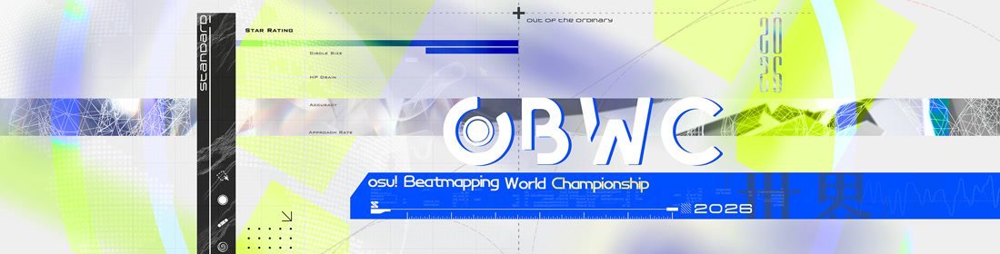

---
tags:
  - o!bwc
  - bwc
---

# osu! Beatmapping World Championship 2026

[o!bwc](/wiki/Contests/oBWC) is an international beatmapping contest that gathers beatmappers worldwide to showcase their creativity, expertise, and passion for mapping. Participants form teams representing their home country and compete to advance through the qualifiers and intense clash rounds.

## Schedule

| Event | Dates |
| --: | :-- |
| Registration | April 18 – May 2 |
| Screening | May 2 – May 12 |
| Qualifier round | May 12 – June 13 |
| Round of 16 |  June 13 – July 11 |
| Quarterfinals | July 11 – August 1 |
| Semifinals | August 1 – August 22 |
| Finals | August 22 – September 12 |

## Prizes

Top teams may receive [contest points](https://osu.ppy.sh/wiki/en/Contests/Contest_points), profile badges and osu!supporter or cash prizes after the contest concludes, depending on sponsorship and approval.

## Organisation

| Position | Member(s) |
| :-- | :-- |
| Hosts | ::{ flag=US }:: [-White](https://osu.ppy.sh/users/16276548), ::{ flag=HK }:: [Chaoslitz](https://osu.ppy.sh/users/3621552), ::{ flag=CN }:: [Mafumafu](https://osu.ppy.sh/users/3076909), ::{ flag=KR }:: [momoyo](https://osu.ppy.sh/users/12469536) |
| Helpers | ::{ flag=CN }:: [TtmnZk](https://osu.ppy.sh/users/2495509) (GFX) |
| Judges (Qualifier) | ::{ flag=US }:: [Ascended](https://osu.ppy.sh/users/4564285), ::{ flag=BE }:: [yaspo](https://osu.ppy.sh/users/4945926), ::{ flag=CA }:: [ktgster](https://osu.ppy.sh/users/53378), ::{ flag=RU }:: [NeKroMan4ik](https://osu.ppy.sh/users/11387664), ::{ flag=CL }:: [Mysty](https://osu.ppy.sh/users/10210657) |
| Judges (Clash Rounds) | ::{ flag=IT }:: [-kevincela-](https://osu.ppy.sh/users/266596), ::{ flag=AR }:: [Lince Cosmico](https://osu.ppy.sh/users/6070370), ::{ flag=EE }:: [iljaaz](https://osu.ppy.sh/users/8501291), ::{ flag=BY }:: [Flins](https://osu.ppy.sh/users/11119539), ::{ flag=US }:: [Mun](https://osu.ppy.sh/users/6699165), ::{ flag=US }:: [fowwo](https://osu.ppy.sh/users/4547551), ::{ flag=RU }:: [Osu Mapman](https://osu.ppy.sh/users/1848318) |

## Links

- [Announcement news post](https://osu.ppy.sh/home/news/2026-04-18-osu-beatmapping-world-championship-2026)
- [Discussion thread](https://osu.ppy.sh/community/forums/topics/2060957?n=1)
- [Contest listing](https://osu.ppy.sh/community/contests/284)
- [Discord server](https://discord.com/invite/QGzz3n655u)
- [Twitch livestream](https://www.twitch.tv/osubwc/)
- [Twitter account](https://twitter.com/osubwc)

## Participants

| Team | Members |
| :-: | :-- |
| **Almendra** | ::{ flag=AR }:: **[azphyx](https://osu.ppy.sh/users/15137544)**, ::{ flag=AR }:: [slynna](https://osu.ppy.sh/users/10099005), ::{ flag=AR }:: [MaestroSplinter](https://osu.ppy.sh/users/6707918), ::{ flag=AR }:: [Benisuzume](https://osu.ppy.sh/users/12207972) |
| **Napping team** | ::{ flag=AR }:: **[jaski03](https://osu.ppy.sh/users/28579947)**, ::{ flag=AR }:: [fusionnqn](https://osu.ppy.sh/users/11606403), ::{ flag=AR }:: [Pepekcz](https://osu.ppy.sh/users/7784933), ::{ flag=AR }:: [Stupid Femboy](https://osu.ppy.sh/users/13714351) |
| **Lemon Lime Bitters** | ::{ flag=AU }:: **[ralsricat](https://osu.ppy.sh/users/12318332)**, ::{ flag=AU }:: [Kyairie](https://osu.ppy.sh/users/10910405), ::{ flag=AU }:: [Cubby](https://osu.ppy.sh/users/10914582), ::{ flag=AU }:: [Ouijaa](https://osu.ppy.sh/users/11512824), ::{ flag=AU }:: [xLolicore-](https://osu.ppy.sh/users/4525153) |
| **WaffleMapping** | ::{ flag=BE }:: **[gay nerd](https://osu.ppy.sh/users/14185739)**, ::{ flag=BE }:: [R3m](https://osu.ppy.sh/users/6990066), ::{ flag=BE }:: [Sylas](https://osu.ppy.sh/users/3906405), ::{ flag=BE }:: [KyZzo](https://osu.ppy.sh/users/9014203), ::{ flag=BE }:: [lychee boba](https://osu.ppy.sh/users/7078544), ::{ flag=BE }:: [Neya](https://osu.ppy.sh/users/10959501) |
| **blame brett** | ::{ flag=BR }:: **[Trynna](https://osu.ppy.sh/users/2652951)**, ::{ flag=BR }:: [Moete](https://osu.ppy.sh/users/4824692), ::{ flag=BR }:: [neuronio](https://osu.ppy.sh/users/7198334), ::{ flag=BR }:: [Kalindraz](https://osu.ppy.sh/users/2313166), ::{ flag=BR }:: [maot](https://osu.ppy.sh/users/3914271) |
| **&\\N1D!q8s9X8** | ::{ flag=CA }:: **[1nwyr](https://osu.ppy.sh/users/36884780)**, ::{ flag=CA }:: [93RF](https://osu.ppy.sh/users/12535675), ::{ flag=CA }:: [gnarlywaves](https://osu.ppy.sh/users/39037815), ::{ flag=CA }:: [rotten girl](https://osu.ppy.sh/users/14542373) |
| **Osu Larpors 2** | ::{ flag=CA }:: **[Orchid_Rei](https://osu.ppy.sh/users/14890490)**, ::{ flag=CA }:: [uby](https://osu.ppy.sh/users/5215955), ::{ flag=CA }:: [joshywa](https://osu.ppy.sh/users/19656568), ::{ flag=CA }:: [Sparhten](https://osu.ppy.sh/users/7601720), ::{ flag=CA }:: [Gordon](https://osu.ppy.sh/users/7856835) |
| **Owc grand finals tb** | ::{ flag=CA }:: **[chiv](https://osu.ppy.sh/users/6701656)**, ::{ flag=CA }:: [Azer](https://osu.ppy.sh/users/2155578), ::{ flag=CA }:: [alden](https://osu.ppy.sh/users/3545323), ::{ flag=CA }:: [El Condor Pasa](https://osu.ppy.sh/users/4415285), ::{ flag=CA }:: [trevrasher](https://osu.ppy.sh/users/3893420), ::{ flag=CA }:: [VineOpoly](https://osu.ppy.sh/users/11684952) |
| **Waterloo** | ::{ flag=CA }:: **[v0x](https://osu.ppy.sh/users/18128385)**, ::{ flag=CA }:: [arkisol](https://osu.ppy.sh/users/9331411), ::{ flag=CA }:: [xytoper](https://osu.ppy.sh/users/13653298), ::{ flag=CA }:: [Feiri](https://osu.ppy.sh/users/3214844), ::{ flag=CA }:: [alstroemeria-](https://osu.ppy.sh/users/20137080) |
| **Röstigraben** | ::{ flag=CH }:: **[Kayamori Ruka](https://osu.ppy.sh/users/14227494)**, ::{ flag=CH }:: [Irreversible](https://osu.ppy.sh/users/1287964), ::{ flag=CH }:: [artcore](https://osu.ppy.sh/users/9713839), ::{ flag=CH }:: [Schoki](https://osu.ppy.sh/users/13260523) |
| **Club Betano** | ::{ flag=CL }:: **[chischise](https://osu.ppy.sh/users/8846632)**, ::{ flag=CL }:: [Syzenai](https://osu.ppy.sh/users/11333236), ::{ flag=CL }:: [KChronoZ](https://osu.ppy.sh/users/7918770), ::{ flag=CL }:: [Vyassel](https://osu.ppy.sh/users/14450486) |
| **Team Mekano** | ::{ flag=CL }:: **[SUISEI69](https://osu.ppy.sh/users/22406733)**, ::{ flag=CL }:: [Cris-](https://osu.ppy.sh/users/6175280), ::{ flag=CL }:: [TheShadowOfDark](https://osu.ppy.sh/users/5795337), ::{ flag=CL }:: [Evil-](https://osu.ppy.sh/users/10234313), ::{ flag=CL }:: [Ldnz](https://osu.ppy.sh/users/18505692), ::{ flag=CL }:: [kanocchi](https://osu.ppy.sh/users/2321050) |
| **Endministrator** | ::{ flag=CN }:: **[AstralXynsm](https://osu.ppy.sh/users/16022233)**, ::{ flag=CN }:: [Decay Limerence](https://osu.ppy.sh/users/4814169), ::{ flag=CN }:: [YeLing](https://osu.ppy.sh/users/14726718), ::{ flag=CN }:: [iBell](https://osu.ppy.sh/users/4298072), ::{ flag=CN }:: [Mariner](https://osu.ppy.sh/users/1814662) |
| **genshin nb** | ::{ flag=CN }:: **[SouJuku](https://osu.ppy.sh/users/20403654)**, ::{ flag=CN }:: [Mimosa M](https://osu.ppy.sh/users/24010320), ::{ flag=CN }:: [[W]hiteRBQ 033](https://osu.ppy.sh/users/8678443), ::{ flag=CN }:: [PEALEERD_TAK](https://osu.ppy.sh/users/6214002), ::{ flag=CN }:: [Robinia](https://osu.ppy.sh/users/16081750), ::{ flag=CN }:: [Uruha Migaki](https://osu.ppy.sh/users/21573458) |
| **Haters de la Changüa** | ::{ flag=CO }:: **[ErunamoJAZZ](https://osu.ppy.sh/users/1869764)**, ::{ flag=CO }:: [Yoari](https://osu.ppy.sh/users/4160699), ::{ flag=CO }:: [gato hongo](https://osu.ppy.sh/users/11068425), ::{ flag=CO }:: [_Chris](https://osu.ppy.sh/users/14847266), ::{ flag=CO }:: [Alexistain](https://osu.ppy.sh/users/32286400) |
| **Team Mozambique** | ::{ flag=CY }:: **[Magitska](https://osu.ppy.sh/users/19368737)**, ::{ flag=CY }:: [NotCatgirlSimp](https://osu.ppy.sh/users/14828149), ::{ flag=CY }:: [ravensong](https://osu.ppy.sh/users/10772580), ::{ flag=CY }:: [Def0ltt](https://osu.ppy.sh/users/12221151) |
| **Schwabbelbauch GmbH** | ::{ flag=DE }:: **[an3](https://osu.ppy.sh/users/11954090)**, ::{ flag=DE }:: [Chris Jasorka](https://osu.ppy.sh/users/2355080), ::{ flag=DE }:: [Boden](https://osu.ppy.sh/users/10345531), ::{ flag=DE }:: [Zetera](https://osu.ppy.sh/users/587737), ::{ flag=DE }:: [as i lay dying](https://osu.ppy.sh/users/34232488) |
| **spritpreisbremse** | ::{ flag=DE }:: **[0ppInOsu](https://osu.ppy.sh/users/12551840)**, ::{ flag=DE }:: [Lulu-](https://osu.ppy.sh/users/4201715), ::{ flag=DE }:: [Slifer](https://osu.ppy.sh/users/15084122), ::{ flag=DE }:: [Bazuso](https://osu.ppy.sh/users/11726139), ::{ flag=DE }:: [Herazu](https://osu.ppy.sh/users/19857248), ::{ flag=DE }:: [Pho](https://osu.ppy.sh/users/3624692) |
| **pantumaca** | ::{ flag=ES }:: **[CebollaVladimir](https://osu.ppy.sh/users/15308238)**, ::{ flag=ES }:: [Jurumas](https://osu.ppy.sh/users/14915346), ::{ flag=ES }:: [MarcoBrolo](https://osu.ppy.sh/users/8343308), ::{ flag=ES }:: [Radiownd](https://osu.ppy.sh/users/6792694), ::{ flag=ES }:: [Sakorii](https://osu.ppy.sh/users/14590106), ::{ flag=ES }:: [straweeeeee](https://osu.ppy.sh/users/35492230) |
| **Pomelo** | ::{ flag=ES }:: **[Nachmark](https://osu.ppy.sh/users/17584310)**, ::{ flag=ES }:: [flouah](https://osu.ppy.sh/users/8030129), ::{ flag=ES }:: [PikAqours](https://osu.ppy.sh/users/9180442), ::{ flag=ES }:: [suraimu-](https://osu.ppy.sh/users/7400022), ::{ flag=ES }:: [bucky](https://osu.ppy.sh/users/6750761) |
| **-4°** | ::{ flag=FR }:: **[Timevid](https://osu.ppy.sh/users/9125335)**, ::{ flag=FR }:: [Yumerios](https://osu.ppy.sh/users/11681430), ::{ flag=FR }:: [Blacky Design](https://osu.ppy.sh/users/11540165), ::{ flag=FR }:: [Lyvai](https://osu.ppy.sh/users/17081761) |
| **The better -4°** | ::{ flag=FR }:: **[Mimil](https://osu.ppy.sh/users/16420104)**, ::{ flag=FR }:: [Egida](https://osu.ppy.sh/users/10522620), ::{ flag=FR }:: [In Rainbows](https://osu.ppy.sh/users/12981253), ::{ flag=FR }:: [Enc4rta](https://osu.ppy.sh/users/15244156) |
| **Big Bozos** | ::{ flag=GB }:: **[czarrify](https://osu.ppy.sh/users/12129412)**, ::{ flag=GB }:: [chinchiIla](https://osu.ppy.sh/users/13317401), ::{ flag=GB }:: [drainfan](https://osu.ppy.sh/users/23918601), ::{ flag=GB }:: [doops](https://osu.ppy.sh/users/22748140), ::{ flag=GB }:: [mapping](https://osu.ppy.sh/users/30730829), ::{ flag=GB }:: [Shii](https://osu.ppy.sh/users/9186316) |
| **Team Udder** | ::{ flag=GB }:: **[7VII](https://osu.ppy.sh/users/10880277)**, ::{ flag=GB }:: [mnyui](https://osu.ppy.sh/users/14261540), ::{ flag=GB }:: [Ishtiaq](https://osu.ppy.sh/users/6405262), ::{ flag=GB }:: [enryotoki](https://osu.ppy.sh/users/10639122), ::{ flag=GB }:: [MyAngelAnge](https://osu.ppy.sh/users/15587166) |
| **Reborn As Skystar** | ::{ flag=HK }:: **[Arushii](https://osu.ppy.sh/users/15664628)**, ::{ flag=HK }:: [[ Drop ]](https://osu.ppy.sh/users/2391299), ::{ flag=HK }:: [Cocoyu](https://osu.ppy.sh/users/20101640), ::{ flag=HK }:: [Regou](https://osu.ppy.sh/users/419954) |
| **arifnation** | ::{ flag=ID }:: **[Azrulk](https://osu.ppy.sh/users/12046612)**, ::{ flag=ID }:: [eclessia](https://osu.ppy.sh/users/3545579), ::{ flag=ID }:: [Scub](https://osu.ppy.sh/users/8972308), ::{ flag=ID }:: [soncak](https://osu.ppy.sh/users/3866821), ::{ flag=ID }:: [aqila](https://osu.ppy.sh/users/11016828), ::{ flag=ID }:: [Pixelbee](https://osu.ppy.sh/users/37331441) |
| **Capitan Findus** | ::{ flag=IT }:: **[Klevsify](https://osu.ppy.sh/users/30556250)**, ::{ flag=IT }:: [Shiraya Sayuki](https://osu.ppy.sh/users/19077461), ::{ flag=GB }:: [Shii](https://osu.ppy.sh/users/9186316)no, ::{ flag=IT }:: [Leomine](https://osu.ppy.sh/users/13277919) |
| **Daisuke** | ::{ flag=IT }:: **[gansijiye](https://osu.ppy.sh/users/9704802)**, ::{ flag=IT }:: [bgm16](https://osu.ppy.sh/users/11476143), ::{ flag=IT }:: [TOMMASO](https://osu.ppy.sh/users/13153873), ::{ flag=IT }:: [Nemis](https://osu.ppy.sh/users/1635091), ::{ flag=IT }:: [61mgb](https://osu.ppy.sh/users/14596595), ::{ flag=IT }:: [Markden](https://osu.ppy.sh/users/4188624) |
| **rrtyui fanboys** | ::{ flag=JP }:: **[daifuku9](https://osu.ppy.sh/users/15241257)**, ::{ flag=JP }:: [arthRo](https://osu.ppy.sh/users/21663721), ::{ flag=JP }:: [eringiRa](https://osu.ppy.sh/users/16383529), ::{ flag=JP }:: [Phten02](https://osu.ppy.sh/users/16678364), ::{ flag=JP }:: [teaminhtg](https://osu.ppy.sh/users/19146698) |
| **GuGuGaGa** | ::{ flag=KR }:: **[Natori Sana](https://osu.ppy.sh/users/8991722)**, ::{ flag=KR }:: [Orangeholic](https://osu.ppy.sh/users/808976), ::{ flag=KR }:: [Sutherland](https://osu.ppy.sh/users/2032353), Por::{ flag=CA }:: [uby](https://osu.ppy.sh/users/5215955), ::{ flag=KR }:: [Allegrissimo](https://osu.ppy.sh/users/9052194), ::{ flag=KR }:: [Motomiya Chiaki](https://osu.ppy.sh/users/15758568) |
| **haepari** | ::{ flag=KR }:: **[Heilia](https://osu.ppy.sh/users/9823042)**, ::{ flag=KR }:: [Beomsan](https://osu.ppy.sh/users/3626063), ::{ flag=KR }:: [Down](https://osu.ppy.sh/users/4694602), ::{ flag=KR }:: [Enon](https://osu.ppy.sh/users/2043401), ::{ flag=KR }:: [jieusieu](https://osu.ppy.sh/users/759439), ::{ flag=KR }:: [milr_](https://osu.ppy.sh/users/4485933) |
| **Beshbarmak** | ::{ flag=KZ }:: **[Lightin](https://osu.ppy.sh/users/7595619)**, ::{ flag=KZ }:: [colicen](https://osu.ppy.sh/users/8657379), ::{ flag=KZ }:: [Danik_LzZ](https://osu.ppy.sh/users/4756779), ::{ flag=KZ }:: [Ternafis](https://osu.ppy.sh/users/9921139) |
| **Taco De Carnitas** | ::{ flag=MX }:: **[Kaly](https://osu.ppy.sh/users/19505653)**, ::{ flag=MX }:: [Gero](https://osu.ppy.sh/users/1467715), ::{ flag=MX }:: [Riot](https://osu.ppy.sh/users/4256461), ::{ flag=MX }:: [FerRMZ](https://osu.ppy.sh/users/11086032) |
| **bege ramly** | ::{ flag=MY }:: **[Agagak](https://osu.ppy.sh/users/3645490)**, ::{ flag=MY }:: [KPMY](https://osu.ppy.sh/users/12464372), ::{ flag=MY }:: [Noi Komazawa](https://osu.ppy.sh/users/13893348), ::{ flag=MY }:: [MrBigOctupus](https://osu.ppy.sh/users/15502308), ::{ flag=MY }:: [smolship](https://osu.ppy.sh/users/23964758), ::{ flag=MY }:: [faxaxaxa](https://osu.ppy.sh/users/11076738) |
| **Kolonisatoren** | ::{ flag=NL }:: **[oxxgotbetter](https://osu.ppy.sh/users/23471878)**, ::{ flag=NL }:: [Zai Chenyao](https://osu.ppy.sh/users/21574224), ::{ flag=NL }:: [lazysloth900](https://osu.ppy.sh/users/4502522), ::{ flag=NL }:: [niles](https://osu.ppy.sh/users/11267587), ::{ flag=NL }:: [Rippuru](https://osu.ppy.sh/users/11629649), ::{ flag=NL }:: [Azukimi](https://osu.ppy.sh/users/13147775) |
| **Team Norway** | ::{ flag=NO }:: **[Aspheria](https://osu.ppy.sh/users/14781224)**, ::{ flag=NO }:: [Nimagan](https://osu.ppy.sh/users/2375048), ::{ flag=NO }:: [BarkingMadDog](https://osu.ppy.sh/users/3475189), ::{ flag=NO }:: [Dr Manhattan](https://osu.ppy.sh/users/18227942) |
| **🥀🥀🥀** | ::{ flag=NZ }:: **[maxb](https://osu.ppy.sh/users/14595209)**, ::{ flag=NZ }:: [bennys](https://osu.ppy.sh/users/25481349), ::{ flag=NZ }:: [piiid](https://osu.ppy.sh/users/37091194), ::{ flag=NZ }:: [\[\[\[\[\[\ |
| **Balling** | ::{ flag=NZ }:: **[Pass_ing](https://osu.ppy.sh/users/11798717)**, ::{ flag=NZ }:: [moph](https://osu.ppy.sh/users/2233878), ::{ flag=NZ }:: [OneShotFox](https://osu.ppy.sh/users/8840398), ::{ flag=NZ }:: [Subokuu](https://osu.ppy.sh/users/13465564), ::{ flag=NZ }:: [nika mika](https://osu.ppy.sh/users/3878832) |
| **Juntos por el Perú** | ::{ flag=PE }:: **[ganyu lover](https://osu.ppy.sh/users/9042918)**, ::{ flag=PE }:: [dakiwii](https://osu.ppy.sh/users/10447058), ::{ flag=PE }:: [- Koshiin -](https://osu.ppy.sh/users/19135423), ::{ flag=PE }:: [taikeea](https://osu.ppy.sh/users/22128227), ::{ flag=PE }:: [Jugito](https://osu.ppy.sh/users/18611203) |
| **circle_man49** | ::{ flag=PH }:: **[xidorn](https://osu.ppy.sh/users/7904667)**, ::{ flag=PH }:: [enri](https://osu.ppy.sh/users/8640970), ::{ flag=PH }:: [tsunyun](https://osu.ppy.sh/users/11545816), ::{ flag=PH }:: [HaruTachi-](https://osu.ppy.sh/users/6244066), ::{ flag=PH }:: [Buster](https://osu.ppy.sh/users/8208277), ::{ flag=PH }:: [Onegai](https://osu.ppy.sh/users/11849100) |
| **————————Collab** | ::{ flag=PL }:: **[App](https://osu.ppy.sh/users/13650508)**, ::{ flag=PL }:: [Gresiu](https://osu.ppy.sh/users/3930357), ::{ flag=PL }:: [liliel](https://osu.ppy.sh/users/13108233), ::{ flag=PL }:: [Inae](https://osu.ppy.sh/users/15545596) |
| **cCzterej pancerni i goy** | ::{ flag=PL }:: **[-koreangod1111](https://osu.ppy.sh/users/18750002)**, ::{ flag=PL }:: [smoczyy](https://osu.ppy.sh/users/16665542), ::{ flag=PL }:: [NcFix](https://osu.ppy.sh/users/19229141), ::{ flag=PL }:: [CzystyWegiel](https://osu.ppy.sh/users/11819882), ::{ flag=PL }:: [Tian Ling](https://osu.ppy.sh/users/8528985) |
| **bloom** | ::{ flag=RU }:: **[CLICUS](https://osu.ppy.sh/users/12338810)**, ::{ flag=RU }:: [artem2007](https://osu.ppy.sh/users/5209873), ::{ flag=RU }:: [ADR1Ft](https://osu.ppy.sh/users/15698567), ::{ flag=RU }:: [DixAway](https://osu.ppy.sh/users/8172901), ::{ flag=RU }:: [Squareskver](https://osu.ppy.sh/users/10760654) |
| **KRUGOEDI** | ::{ flag=RU }:: **[Murlok322](https://osu.ppy.sh/users/9752561)**, ::{ flag=RU }:: [Caspar](https://osu.ppy.sh/users/6084669), ::{ flag=RU }:: [Witow08](https://osu.ppy.sh/users/14906055), ::{ flag=RU }:: [beethow](https://osu.ppy.sh/users/11061359) |
| **mapping** | ::{ flag=RU }:: **[neko ds](https://osu.ppy.sh/users/4688735)**, ::{ flag=RU }:: [kuyusu](https://osu.ppy.sh/users/11758667), ::{ flag=RU }:: [Sanch-KK](https://osu.ppy.sh/users/9131844), ::{ flag=RU }:: [KomachiBaka](https://osu.ppy.sh/users/6155320) |
| **pelmeni** | ::{ flag=RU }:: **[Mulciber](https://osu.ppy.sh/users/8062785)**, ::{ flag=RU }:: [Froskya](https://osu.ppy.sh/users/4230454), ::{ flag=RU }:: [Nattu](https://osu.ppy.sh/users/1886722), ::{ flag=RU }:: [karta](https://osu.ppy.sh/users/17958775), ::{ flag=RU }:: [[ VII ]](https://osu.ppy.sh/users/15423082), ::{ flag=RU }:: [Chogori](https://osu.ppy.sh/users/8874115) |
| **rap woyska** | ::{ flag=RU }:: **[piroshki](https://osu.ppy.sh/users/7645522)**, ::{ flag=RU }:: [Daycore](https://osu.ppy.sh/users/5596337), ::{ flag=RU }:: [ellia-](https://osu.ppy.sh/users/6248691), ::{ flag=RU }:: [Wavewy](https://osu.ppy.sh/users/17352850), ::{ flag=RU }:: [Delette](https://osu.ppy.sh/users/7835664), ::{ flag=RU }:: [Ziny](https://osu.ppy.sh/users/20098206) |
| **team** | ::{ flag=RU }:: **[feelthepain](https://osu.ppy.sh/users/20044444)**, ::{ flag=RU }:: [deadnya](https://osu.ppy.sh/users/22356454), ::{ flag=RU }:: [gamer228666](https://osu.ppy.sh/users/5981005), ::{ flag=RU }:: [garab1k](https://osu.ppy.sh/users/9984244) |
| **4J(世界)盃** | ::{ flag=TW }:: **[Plus4j](https://osu.ppy.sh/users/4086497)**, ::{ flag=TW }:: [ameponzu](https://osu.ppy.sh/users/12763959), ::{ flag=TW }:: [- AzRaeL -](https://osu.ppy.sh/users/10027577), ::{ flag=TW }:: [9ami](https://osu.ppy.sh/users/1499997), ::{ flag=TW }:: [Alty](https://osu.ppy.sh/users/16407988), ::{ flag=TW }:: [toroosics290304](https://osu.ppy.sh/users/27010357) |
| **TheOneForce** | ::{ flag=UA }:: **[Mamiya Takuji](https://osu.ppy.sh/users/7586512)**, ::{ flag=UA }:: [Rorupan L9](https://osu.ppy.sh/users/9471638), ::{ flag=UA }:: [FackeL](https://osu.ppy.sh/users/15899606), ::{ flag=UA }:: [announcerf](https://osu.ppy.sh/users/13245261), ::{ flag=UA }:: [Judge1st](https://osu.ppy.sh/users/10610737), ::{ flag=UA }:: [Vector](https://osu.ppy.sh/users/11308778) |
| **600 average bws** | ::{ flag=US }:: **[BATBALL](https://osu.ppy.sh/users/15173952)**, ::{ flag=US }:: [EthantrixV3](https://osu.ppy.sh/users/10634348), ::{ flag=US }:: [BoshyMan741](https://osu.ppy.sh/users/4830687), ::{ flag=US }:: [Woey](https://osu.ppy.sh/users/3792472), ::{ flag=US }:: [Wispy](https://osu.ppy.sh/users/11106929) |
| **single furries** | ::{ flag=US }:: **[Chromasia](https://osu.ppy.sh/users/7306251)**, ::{ flag=US }:: [kettoph](https://osu.ppy.sh/users/10783597), ::{ flag=US }:: [Asiansoul](https://osu.ppy.sh/users/20168712), ::{ flag=US }:: [fishing license](https://osu.ppy.sh/users/9531007) |
| **take2** | ::{ flag=US }:: **[s-01](https://osu.ppy.sh/users/16847674)**, ::{ flag=US }:: [Melter](https://osu.ppy.sh/users/5129592), ::{ flag=US }:: [pip](https://osu.ppy.sh/users/8446047), ::{ flag=US }:: [Hanakumo Rin](https://osu.ppy.sh/users/12895865), ::{ flag=US }:: [chenLia](https://osu.ppy.sh/users/9902253), ::{ flag=US }:: [promised](https://osu.ppy.sh/users/10676118) |
| **usa backup team** | ::{ flag=US }:: **[downpour](https://osu.ppy.sh/users/4543414)**, ::{ flag=US }:: [Hoshizora Rin](https://osu.ppy.sh/users/10743435), ::{ flag=US }:: [Whithard](https://osu.ppy.sh/users/24552396), ::{ flag=US }:: [EnderCraft](https://osu.ppy.sh/users/19950570), ::{ flag=US }:: [Boombox](https://osu.ppy.sh/users/11844203), ::{ flag=US }:: [Pandize](https://osu.ppy.sh/users/5490937) |
| **WFART** | ::{ flag=US }:: **[revoh](https://osu.ppy.sh/users/8165181)**, ::{ flag=US }:: [-Arko](https://osu.ppy.sh/users/8802914), ::{ flag=US }:: [fooders](https://osu.ppy.sh/users/7545218), ::{ flag=US }:: [1103](https://osu.ppy.sh/users/7306698), ::{ flag=US }:: [Weoweet](https://osu.ppy.sh/users/16861790) |
| **la mamu ft gastongl** | ::{ flag=UY }:: **[Lucho](https://osu.ppy.sh/users/16845442)**, ::{ flag=UY }:: [Rebo](https://osu.ppy.sh/users/6942259), ::{ flag=UY }:: [FDX](https://osu.ppy.sh/users/8987016), ::{ flag=UY }:: [Raby](https://osu.ppy.sh/users/5218320) |
| **anh do mixi phung** | ::{ flag=VN }:: **[xiaomao](https://osu.ppy.sh/users/9829680)**, ::{ flag=VN }:: [el regardo](https://osu.ppy.sh/users/26071545), ::{ flag=VN }:: [Zawajiro](https://osu.ppy.sh/users/15082028), ::{ flag=VN }:: [t4hN](https://osu.ppy.sh/users/18948749) |
| **osu!36vn** | ::{ flag=VN }:: **[Ducky-](https://osu.ppy.sh/users/9351565)**, ::{ flag=VN }:: [S_ounds](https://osu.ppy.sh/users/18230278), ::{ flag=VN }:: [mykeek](https://osu.ppy.sh/users/13041984), ::{ flag=VN }:: [Asaiga](https://osu.ppy.sh/users/2959560) |

## Ruleset

### Contest format

- **o!bwc** follows a round-based format, consisting of a **qualifier round** and multiple **clash rounds**.
- **Qualifier round:**
  - The qualifier round is ranking-based.
  - If there are multiple teams from one country registered, only the team that ranks the highest will pass the qualifier round even if they are ranked within the first 16 places. In this case, the qualification will be passed to lower-ranked teams of countries that have not seen a qualified team above.
  - After the Qualifier round, the seeding of Round of 16 matches will be decided according to the ranking of each team in the qualifying round.
- **Clash rounds:**
  - Clash rounds consist of tight-time head-to-head matches between two teams, and only one of the teams will proceed into the next round.
  - Clash rounds are run on a single-elimination bracket.

### Teams and registration

- o!bwc is a team-based beatmapping contest. Mappers should [register through this form](https://form-auth.ppy.sh/form/2026-bwc-registrations).
- Each team consists of 4–6 members, with one member being their captain.
- Captain is responsible for organising and managing their team and progress, submitting their beatmap, as well as communicating with the hosts.
- All team members must share the same country flag.
- At minimum, the captain should join the [Discord server](https://discord.com/invite/QGzz3n655u) and keep up with updates to the contest. Other team members and spectators are encouraged to do the same.

### Beatmapping and submission

- This contest is for the osu! mode only.
- The captain is responsible for submissions on behalf their team.
- The contributions of team members must be declared, for example, a list of sections mapped by each individual mapper. Members that lack sufficient contribution may be ineligible to receive awards, or disqualified from the contest.
  1. Everyone must participate in the Qualifier round. During the Clash rounds, only one absent for each round is allowed. Each member can be absent for at most one round throughout the contest.
  2. Contibution from members should be reasonably distributed. For example, there should not be one member that contributes significantly less/more than others in the team.
- Submission must be an `.osz` file exported from the osu! in-game editor.
- Submission must be at the designated submission site.
- Submission should comply with the [ranking criteria](/wiki/Ranking_criteria) when applicable.
- Submission should not contain information that reveals the identity of your team.
- Do not upload or share your submission with others beyond your team before the results announcement.
- Custom hitsounds and custom combo colours are allowed. However, backgrounds, videos, or storyboards are not allowed.
- Do not modify metadata such as Artist, Title, and Tags in the provided template.

### Judging criteria

- It is mandatory for judges to give comments and reasons behind their judging.
- Submissions are anonymous to judges.
- There will be two panels of judges: one for the *qualifier round* and the other for the *clash rounds*.

#### Qualifier round

- **Expertise (45%)** – How well the map reflects the music elements, with an emphasis on music reflection, pattern/rhythm consistency, coherence, and playability.
- **Creativity (45%)** – How the map stands out compared to current mapping trends and other submissions. Generic maps or copy-paste concepts are discouraged. Creativity built on top of solid expertise is more than important as well.
- **Judge's Impression (10%)** – Judges can award or deduct points based on specific noteworthy aspects as they deem appropriate, such as outstanding sections and hitsounds or vice versa.
- Judging results will be calculated using standardised scoring.

#### Clash rounds

- Clash rounds are based on a voting system. Each round consists of head-to-head matchups between two teams.
- Each judge has one vote for each matchup and they must vote for one team out of the two. The team with the highest number of votes will pass this round and the other will be eliminated.

### Song selection

- The songs and templates to map will be announced at the beginning of each round through the [Discord server](https://discord.com/invite/QGzz3n655u).
