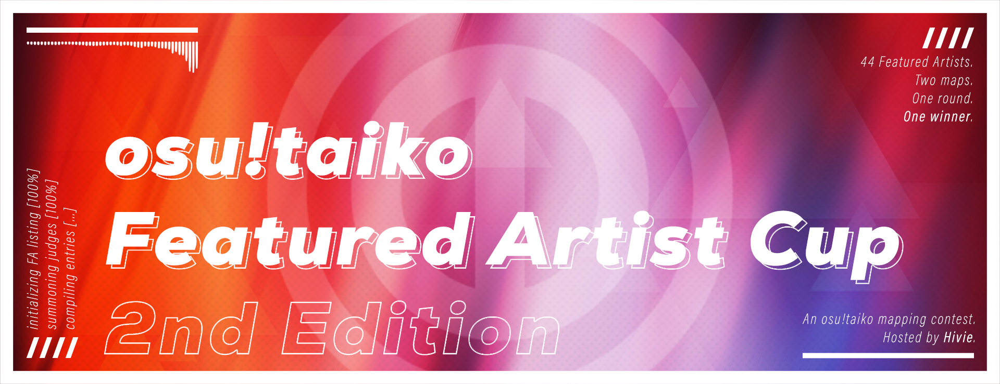

---
tags:
  - o!tfac
  - o!tfac2
  - o!tfac 2
  - o!tfac#2
  - tfac
  - tfac2
  - tfac 2
  - tfac#2
---

# osu!taiko Featured Artist Cup: 2nd Edition

The **osu!taiko Featured Artist Cup: 2nd Edition** (***o!tfac #2***) was an osu!taiko mapping contest where contestants were simply asked to map a song from a specific list of **44** osu! [Featured Artists](https://osu.ppy.sh/beatmaps/artists).

## Special limitation

Contestants had to submit 2 difficulties, the main difficulty that would be judged + a Muzukashii difficulty.

## Contest schedule

| Event | Timestamp (UTC) |
| --: | :-- |
| Beatmapping phase | 2022-06-05/2022-06-26 00:00 |
| Judging phase | 2022-06-26/2022-07-23 |
| Results announcement | 2022-07-24 |

## Organisation

The osu!taiko Featured Artist Cup: 2nd Edition was run by various community members.

| Position | Member(s) |
| :-- | :-- |
| Host | ::{ flag=TN }:: [Hivie](https://osu.ppy.sh/users/14102976) |
| Designer | ::{ flag=MY }:: [\[Zeth\]](https://osu.ppy.sh/users/9912966) |
| Judge | ::{ flag=AR }:: [Axer](https://osu.ppy.sh/users/7299864), ::{ flag=NL }:: [Boaz](https://osu.ppy.sh/users/13302996), ::{ flag=DE }:: [Greenshell](https://osu.ppy.sh/users/8693851), ::{ flag=US }:: [Nifty](https://osu.ppy.sh/users/4956097) |

## Prizes

| Placing | Prize(s) |
| :-: | :-- |
|  | 4 months of osu!supporter, Ranked status[^prizes-ranked], unique profile badge |
|  | 3 months of osu!supporter, Ranked status[^prizes-ranked] |
|  | 1 month of osu!supporter, Ranked status[^prizes-ranked] |

## Links

- [Discussion thread](https://osu.ppy.sh/community/forums/topics/1588200)
- [Discord server](https://discord.gg/jMsVqwPVrD)
- [Mappers' Guild contest listing](https://mappersguild.com/contests/listing?contest=6297b03e101a99029ea1b06b)
- [Results sheet](https://docs.google.com/spreadsheets/d/17dZZLLRAhqhEd40DqIAdHDOBxFB1DM3fGzFhTI87oBg/edit?usp=sharing)
- [Results stream VOD](https://youtu.be/KyFif4cJMB4)

## Podium

This competition has come to an end and resulted in the following podium:

| Rank | Beatmap | Judging | Judge's Impression (20) | Ranking Criteria (20) | Structure (40) | Relevance (40) | Creativity (40) | Muzukashii Score (40) | Total (standardized/raw) |
| :-- | :-- | :-- | :-- | :-- | :-- | :-- | :-- | :-- | :-- |
|  | [Raimukun - Cthulhu](https://osu.ppy.sh/beatmapsets/1814085) by ::{ flag=AR }:: [KyeX](https://osu.ppy.sh/users/15118934) | [Details](https://mappersguild.com/contests/results?submission=62b79898ecf25121cfe7b670) | 19 | 20 | 37 | 37 | 29 | 36 | **5.44** (178) |
|  | [Riya - Laboratory-18](https://osu.ppy.sh/beatmapsets/1814106) by ::{ flag=KR }:: [woosungko](https://osu.ppy.sh/users/14184157) | [Details](https://mappersguild.com/contests/results?submission=629d98f4ecf25121cfe5c787) | 18 | 19 | 34 | 34 | 35 | 34 | **5.39** (174) |
|  | [Raimukun - Firmament Star](https://osu.ppy.sh/beatmapsets/1814107) by ::{ flag=FI }:: [duski](https://osu.ppy.sh/users/6506484) | [Details](https://mappersguild.com/contests/results?submission=62b7649fecf25121cfe7b173) | 17 | 19 | 35 | 34 | 32 | 34 | **4.34** (171) |

## Ruleset

### Contest rules

- **Contestants will submit a mapset of any licensed song they choose from [this list](https://bns.are-la.me/2XSGmvB.txt) of osu!'s [Featured Artists](https://osu.ppy.sh/beatmaps/artists).**
- **Songs must not exceed a length of 4:30.** There will a bit of leeway in cases where the song is really close to the 4:30 mark.
- **The map must be an osu!taiko map.**
- **The mapset must include TWO difficulties: the top difficulty + a Muzukashii difficulty.** Any entry that is missing a difficulty will be disqualified.
- **All submissions must be rankable.** No beatmap submitted must be intentionally unrankable. Mistakes happen and points will be deducted for them, but this is a regular mapping contest, not Aspire. (You are allowed to ignore spread rules for the sake of this contest.)
- **Maps must NOT be uploaded/shared with others before judging and results are announced.** Sharing your entry publicly by any means before the results are announced will get your entry disqualified, no questions asked.
- **Submissions will not be accepted after the deadlines.** No exceptions.

### Judging criteria

- **Judge's Impression (5 Points):** Points will be assigned based on what the judge thinks about your entry.
- **Ranking Criteria (5 Points):** Points will be assigned based on how well the map abides by the ranking criteria (this includes both difficulties).
- **Structure (10 Points):** Points will be assigned based on how well the map is internally designed (consistency, concept introduction, etc.).
- **Relevance (10 Points):** Points will be assigned based on how well the map represents the song and how well it plays.
- **Creativity (10 Points):** Points will be assigned based on how the submission uses creative and fitting elements to make itself stand out.
- **Muzukashii Score (10 Points):** Points will be assigned based on how well the Muzukashii difficulty is mapped based on structure, relevance, and creativity.

## Notes

[^prizes-ranked]: 2 Beatmap Nominators from the contest's organisation team (either ::{ flag=AR }:: [Axer](https://osu.ppy.sh/users/7299864), ::{ flag=DE }:: [Greenshell](https://osu.ppy.sh/users/8693851), ::{ flag=TN }:: [Hivie](https://osu.ppy.sh/users/14102976), or ::{ flag=US }:: [Nifty](https://osu.ppy.sh/users/4956097)) will mod and push the map to Ranked if the mapper wants to, and **if they get the necessary difficulties to form a rankable spread when needed.**
