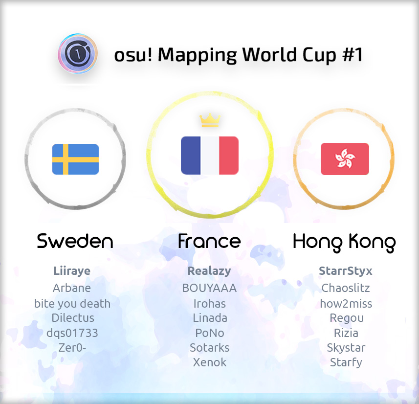

# osu! Mapping World Cup #1

Le **osu! Mapping World Cup #1** (***oMWC #1***) est un concours national de mappers osu! organisé par ![][flag_CA] [Gabe](https://osu.ppy.sh/users/654108), ![][flag_FR] [Imakuri](https://osu.ppy.sh/users/6100837) et ![][flag_FR] [Pachiru](https://osu.ppy.sh/users/2850983).

## Calendrier du concours

| Événement | Horodatage |
| --: | :-- |
| Candidatures des ambassadeurs d'équipe | 2018-12-11/2018-12-27 |
| Ramassage de l'équipe | 2018-12-27/2019-01-11 |
| Phase de cartographie | 2019-01-12/2019-02-09 |
| Phase de jugement | 2019-02-09/2019-03-09 |
| Résultats finaux | 2019-03-16 (21:00 UTC+0) |

## Prix

| Placement | Prix(s) |
| :-: | :-- |
|  | 6 mois de  osu!supporter pour chaque membre de l'équipe, badge de profil |
|  | 4 mois  de osu!supporter pour chaque membre de l'équipe |
|  | 2 mois de osu!supporter pour chaque membre de l'équipe |

## Organisation

L'osu ! Mapping World Cup est géré par différents membres de la communauté en répartissant la multitude de tâches dans différents domaines de responsabilité.

| Poste | Membre(s) |
| :-- | :-- |
| Directeur | ![][flag_CA] [Gabe](https://osu.ppy.sh/users/654108), ![][flag_FR] [Imakuri](https://osu.ppy.sh/users/6100837), ![][flag_FR] [Pachiru](https://osu.ppy.sh/users/2850983) |
| Assistant | ![][flag_FR] [-Arche](https://osu.ppy.sh/users/5352689), ![][flag_US] [hanfan](https://osu.ppy.sh/users/9886009), ![][flag_FR] [Jean-Michel Jr](https://osu.ppy.sh/users/4430948), ![][flag_KR] [Mitsunu](https://osu.ppy.sh/users/2970016), ![][flag_FR] [Nozhomi](https://osu.ppy.sh/users/2716981), ![][flag_PH] [Shizuku-](https://osu.ppy.sh/users/1125647) |
| Routier | ![][flag_CA] [Azer](https://osu.ppy.sh/users/2155578), ![][flag_US] [BeasttrollMC](https://osu.ppy.sh/users/3171691), ![][flag_US] [Xexxar](https://osu.ppy.sh/users/2773526) |
| Juge | ![][flag_GB] [-Mo-](https://osu.ppy.sh/users/2202163), ![][flag_PK] [DeRandom Otaku](https://osu.ppy.sh/users/5156153), ![][flag_TH] [Electoz](https://osu.ppy.sh/users/6485263), ![][flag_CN] [Hollow Wings](https://osu.ppy.sh/users/416662), ![][flag_CH] [Irreversible](https://osu.ppy.sh/users/1287964), ![][flag_CN] [Regraz](https://osu.ppy.sh/users/3076909) |
| Juge de réserve | ![][flag_DE] [Smokeman](https://osu.ppy.sh/users/2140676), ![][flag_DE] [Yauxo](https://osu.ppy.sh/users/898306), ![][flag_US] [Xexxar](https://osu.ppy.sh/users/2773526) |
| Designer | ![][flag_FI] [Micro](https://osu.ppy.sh/users/4801080) |

## Liens

- [Fil de discussion](https://osu.ppy.sh/community/forums/topics/843987)
- [Livestream](https://www.twitch.tv/osumwc)
- [Discord server](https://discord.gg/DybsJTr)

## Participants

|  | Pays | Membres |
| :-: | :-: | :-- |
| ![][flag_AU] ![][flag_NZ] | **Australia - New Zealand** | **[xLolicore-](https://osu.ppy.sh/users/4525153)**, [Flower](https://osu.ppy.sh/users/1033017), [GranDSenpai](https://osu.ppy.sh/users/3997580), [my angel yayoi](https://osu.ppy.sh/users/3878832), [Pentori](https://osu.ppy.sh/users/7452237), [Rizen](https://osu.ppy.sh/users/3056732), [sahuang](https://osu.ppy.sh/users/5318910) |
| ![][flag_BR] | **Brazil** | **[Kuron-kun](https://osu.ppy.sh/users/2697284)**, [Ataraxia](https://osu.ppy.sh/users/4077912), [Kalindraz](https://osu.ppy.sh/users/2313166), [Seto Kousuke](https://osu.ppy.sh/users/2857314), [Tarrasky](https://osu.ppy.sh/users/4098393), [Trynna](https://osu.ppy.sh/users/2652951) |
| ![][flag_CA] | **Canada** | **[Monstrata](https://osu.ppy.sh/users/2706438)**, [Azer](https://osu.ppy.sh/users/2155578), [cococolaco](https://osu.ppy.sh/users/9579526), [J1_](https://osu.ppy.sh/users/5918561), [jonathanlfj](https://osu.ppy.sh/users/270377), [Kibbleru](https://osu.ppy.sh/users/3193504), [Sing](https://osu.ppy.sh/users/3795679) |
| ![][flag_CL] | **Chile** | **[Cloudchaser](https://osu.ppy.sh/users/1576498)**, [Cris-](https://osu.ppy.sh/users/6175280), [Crissa](https://osu.ppy.sh/users/5405836), [Tatan](https://osu.ppy.sh/users/5646529), [TheShadowOfDark](https://osu.ppy.sh/users/5795337), [Uberzolik](https://osu.ppy.sh/users/1314547), [wolf3211](https://osu.ppy.sh/users/5741153) |
| ![][flag_CN] | **China** | **[Karen](https://osu.ppy.sh/users/3143784)**, [ak74](https://osu.ppy.sh/users/1231762), [Crystal](https://osu.ppy.sh/users/1646397), [fanzhen0019](https://osu.ppy.sh/users/418699), [Ryuusei Aika](https://osu.ppy.sh/users/7777875), [Syameimaru-Aya](https://osu.ppy.sh/users/3153354), [yf_bmp](https://osu.ppy.sh/users/1243669) |
| ![][flag_DK] | **Denmark** | **[Fuccho](https://osu.ppy.sh/users/3053382)**, [Pennek](https://osu.ppy.sh/users/3723742), [Spork Lover](https://osu.ppy.sh/users/3417469), [-Tochi](https://osu.ppy.sh/users/3664366), [Waefwerf](https://osu.ppy.sh/users/3868653) |
| ![][flag_EG] | **Egypt** | **[Mohab500](https://osu.ppy.sh/users/10520912)**, [moh_magdy](https://osu.ppy.sh/users/9431445), [Nanachii](https://osu.ppy.sh/users/6995506), [RugMunch](https://osu.ppy.sh/users/7516879) |
| ![][flag_FI] ![][flag_EE] | **Finland - Estonia** | **[DTM9 Nowa](https://osu.ppy.sh/users/5428909)**, [Jukkii](https://osu.ppy.sh/users/7318423), [lewski](https://osu.ppy.sh/users/4980738), [Maffe](https://osu.ppy.sh/users/4773855), [Makeli](https://osu.ppy.sh/users/3411824), [Samoyed](https://osu.ppy.sh/users/6796557), [Xayler](https://osu.ppy.sh/users/3649657) |
| ![][flag_FR] | **France** | **[Realazy](https://osu.ppy.sh/users/918297)**, [BOUYAAA](https://osu.ppy.sh/users/405449), [Irohas](https://osu.ppy.sh/users/4403937), [Linada](https://osu.ppy.sh/users/5239047), [PoNo](https://osu.ppy.sh/users/4610047), [Sotarks](https://osu.ppy.sh/users/4452992), [Xenok](https://osu.ppy.sh/users/3256600) |
| ![][flag_DE] | **Germany** | **[Mao](https://osu.ppy.sh/users/2204515)**, [deep fried ice](https://osu.ppy.sh/users/5410645), [Lasse](https://osu.ppy.sh/users/896613), [Myxomatosis](https://osu.ppy.sh/users/2202645), [Okoratu](https://osu.ppy.sh/users/1623405), [Zetera](https://osu.ppy.sh/users/587737) |
| ![][flag_GR] | **Greece** | **[lcfc](https://osu.ppy.sh/users/7322726)**, [awesomemacD](https://osu.ppy.sh/users/5589933), [Genjuro](https://osu.ppy.sh/users/3196091), [Nikakis](https://osu.ppy.sh/users/4351739), [Nokashi](https://osu.ppy.sh/users/5431196), [Riven](https://osu.ppy.sh/users/3638005) |
| ![][flag_HK] | **Hong Kong** | **[StarrStyx](https://osu.ppy.sh/users/4600383)**, [Chaoslitz](https://osu.ppy.sh/users/3621552), [how2miss](https://osu.ppy.sh/users/4477199), [Regou](https://osu.ppy.sh/users/419954), [Rizia](https://osu.ppy.sh/users/1367570), [Skystar](https://osu.ppy.sh/users/873961), [Starfy](https://osu.ppy.sh/users/2045914) |
| ![][flag_HU] | **Hungary** | **[emu1337](https://osu.ppy.sh/users/2185987)**, [Alexy the Cat](https://osu.ppy.sh/users/6985079), [csaba21123](https://osu.ppy.sh/users/7764237), [Nidasimno](https://osu.ppy.sh/users/6799223), [RatinA0](https://osu.ppy.sh/users/3436625), [Riknoob](https://osu.ppy.sh/users/4624788), [sleepymateo](https://osu.ppy.sh/users/8996148) |
| ![][flag_ID] ![][flag_SG] | **Indonesia - Singapore** | **[ScubDomino](https://osu.ppy.sh/users/8972308)**, [handsome](https://osu.ppy.sh/users/2123087), [Haruto](https://osu.ppy.sh/users/3772301), [Hinsvar](https://osu.ppy.sh/users/1249323), [Niva](https://osu.ppy.sh/users/197805), [Prinsep](https://osu.ppy.sh/users/5004986), [Yohanes](https://osu.ppy.sh/users/4075595) |
| ![][flag_IT] | **Italy** | **[felys](https://osu.ppy.sh/users/1759427)**, [Leader](https://osu.ppy.sh/users/631530), [MrSergio](https://osu.ppy.sh/users/2581696), [Nemis](https://osu.ppy.sh/users/1635091) |
| ![][flag_JP] | **Japan** | **[Kloyd](https://osu.ppy.sh/users/1574070)**, [a_Blue](https://osu.ppy.sh/users/5645667), [Asahina Momoko](https://osu.ppy.sh/users/3650145), [caren_sk](https://osu.ppy.sh/users/542498), [Lortus](https://osu.ppy.sh/users/1008962), [rrtyui](https://osu.ppy.sh/users/352328), [Scaltinof](https://osu.ppy.sh/users/4796949) |
| ![][flag_MY] | **Malaysia** | **[Matsubara Kanon](https://osu.ppy.sh/users/1475828)**, [Agagak](https://osu.ppy.sh/users/3645490), [ffstar](https://osu.ppy.sh/users/1163205), [Rumia-](https://osu.ppy.sh/users/1787171), [[ -Scarlet- ]](https://osu.ppy.sh/users/2427693) |
| ![][flag_MX] | **Mexico** | **[Atsuro](https://osu.ppy.sh/users/2279351)**, [Azuren](https://osu.ppy.sh/users/2164627), [Gens](https://osu.ppy.sh/users/23062), [Gero](https://osu.ppy.sh/users/1467715), [Luna-](https://osu.ppy.sh/users/1703474), [Side](https://osu.ppy.sh/users/3442339) |
| ![][flag_NL] | **Netherlands** | **[Kyshiro](https://osu.ppy.sh/users/640611)**, [appleeaterx](https://osu.ppy.sh/users/2407160), [Ayu](https://osu.ppy.sh/users/1267151), [GladiOol](https://osu.ppy.sh/users/23326), [happy30](https://osu.ppy.sh/users/27767), [Voli](https://osu.ppy.sh/users/2522275) |
| ![][flag_NO] | **Norway** | **[Keada](https://osu.ppy.sh/users/2785549)**, [DuskYui](https://osu.ppy.sh/users/4422457), [-PC](https://osu.ppy.sh/users/2916414), [UrbanBeat](https://osu.ppy.sh/users/5302657), [YokesPai](https://osu.ppy.sh/users/6399568) |
| ![][flag_PL] | **Poland** | **[Venix](https://osu.ppy.sh/users/5999631)**, [Kalibe](https://osu.ppy.sh/users/3376777), [Peter](https://osu.ppy.sh/users/8623835), [ReFaller](https://osu.ppy.sh/users/4841608), [Rolniczy](https://osu.ppy.sh/users/8331132), [wa_](https://osu.ppy.sh/users/1572001), [Yudragen](https://osu.ppy.sh/users/8406396) |
| ![][flag_RU] | **Russian Federation** | **[NeilPerry](https://osu.ppy.sh/users/841391)**, [Jounzan](https://osu.ppy.sh/users/1848318), [Mirash](https://osu.ppy.sh/users/2841009), [PandaHero](https://osu.ppy.sh/users/1233255), [SENSEABEL](https://osu.ppy.sh/users/6184386), [Testo](https://osu.ppy.sh/users/5200881), [Tokiko](https://osu.ppy.sh/users/2836455) |
| ![][flag_RS] ![][flag_HR] ![][flag_AT] | **Serbia - Croatia - Austria** | **[MaridiuS](https://osu.ppy.sh/users/4496961)**, [DuckRadio](https://osu.ppy.sh/users/7731111), [Fixxis](https://osu.ppy.sh/users/4673089), [Mazziv](https://osu.ppy.sh/users/2919725), [Seni](https://osu.ppy.sh/users/4830261), [Tomadoi](https://osu.ppy.sh/users/5712451) |
| ![][flag_KR] | **South Korea** | **[Beomsan](https://osu.ppy.sh/users/3626063)**, [[C u r i]](https://osu.ppy.sh/users/4746949), [Cellina](https://osu.ppy.sh/users/2490770), [Dailycare](https://osu.ppy.sh/users/1634445), [eINess](https://osu.ppy.sh/users/3789302), [Nakagawa-Kanon](https://osu.ppy.sh/users/87065), [Rose Pacifica](https://osu.ppy.sh/users/1393255) |
| ![][flag_SE] | **Sweden** | **[Liiraye](https://osu.ppy.sh/users/1280641)**, [Arbane](https://osu.ppy.sh/users/4150829), [bite you death](https://osu.ppy.sh/users/6398464), [Dilectus](https://osu.ppy.sh/users/4287454), [dqs01733](https://osu.ppy.sh/users/3372459), [Zer0-](https://osu.ppy.sh/users/4260033) |
| ![][flag_TW] | **Taiwan** | **[bossandy](https://osu.ppy.sh/users/360437)**, [Flask](https://osu.ppy.sh/users/959763), [Hey lululu](https://osu.ppy.sh/users/4086497), [knowledgeking](https://osu.ppy.sh/users/8022517), [Loneight](https://osu.ppy.sh/users/663131), [Nerova Riuz GX](https://osu.ppy.sh/users/1557955), [Silent Rock](https://osu.ppy.sh/users/4657504) |
| ![][flag_TN] | **Tunisia** | **[Lilyanna](https://osu.ppy.sh/users/8144098)**, [-Ken](https://osu.ppy.sh/users/4430811), [LegendOfWario](https://osu.ppy.sh/users/12293309), [Starset](https://osu.ppy.sh/users/6383137) |
| ![][flag_GB] | **United Kingdom** | **[hypercyte](https://osu.ppy.sh/users/9155377)**, [Alphabet](https://osu.ppy.sh/users/4879380), [Apo11o](https://osu.ppy.sh/users/9558549), [Log Off Know](https://osu.ppy.sh/users/4378277), [Mikii](https://osu.ppy.sh/users/3107791), [Turquoise-](https://osu.ppy.sh/users/7524046) |
| ![][flag_US] | **United States** | **[Hobbes2](https://osu.ppy.sh/users/8157492)**, [Axarious](https://osu.ppy.sh/users/2614511), [Byfar](https://osu.ppy.sh/users/4674054), [Melloe](https://osu.ppy.sh/users/2367616), [Nathan](https://osu.ppy.sh/users/4785223), [Toybot](https://osu.ppy.sh/users/2848604), [Winber1](https://osu.ppy.sh/users/270328) |
| ![][flag_UA] | **Ukraine** | **[Sulfur](https://osu.ppy.sh/users/5297447)**, [Aka](https://osu.ppy.sh/users/1307553), [den0saur](https://osu.ppy.sh/users/5385151), [InternalLight](https://osu.ppy.sh/users/6221637) |
| ![][flag_VN] | **Vietnam** | **[LMT](https://osu.ppy.sh/users/7262798)**, [Asaiga](https://osu.ppy.sh/users/2959560), [Kirylln](https://osu.ppy.sh/users/7228554), [Liyuchi](https://osu.ppy.sh/users/3275495), [Shortthu](https://osu.ppy.sh/users/7985423), [Stormiverse](https://osu.ppy.sh/users/8705545) |

---

## Ruleset

### Contest rules

1. **Le [osu! Ranking Criteria](/wiki/Ranking_Criteria/osu!) et [General Ranking Criteria](/wiki/Ranking_Criteria) sont en vigueur pour ce concours** - Le prix gagnant du concours comprend le classement des entrées des équipes gagnantes, qui seront les 3 chansons soumises par l'équipe de mappeurs, nous ne pouvons pas faire cela si vous ne respectez pas les critères de classement. Toute difficulté requise pour remplir les exigences des Critères de Classement sera fournie par l'équipe organisatrice.
2. **4-7 membres par équipe requis** - Le concept principal du concours est de montrer les possibilités de cartographie de chaque pays. Cela signifie que la collaboration sera un concept nécessaire entre les membres de l'équipe.
3. **Au moins 2 cartographes devront collaborer PAR CHANSON & chaque cartographe devra cartographier au moins 10% du TEMPS TOTAL DE VIDANGE pour les 3 chansons combinées** - L'objectif principal de ce concours est de tester chaque pays dans leur capacité à cartographier et à collaborer en utilisant une variété de différents genres de chansons. La façon d'organiser le temps de drainage au-delà du seuil requis dépend entièrement de vous.
4. **Copier le travail d'autres personnes est strictement interdit** - Le but du concours est de tester la capacité de chaque pays dans son ensemble, donc en copiant le travail d'autres personnes vous ne montrez pas honnêtement ce dont votre pays est capable. Si nous, ou les juges, découvrent que le travail a été copié, toute votre équipe sera disqualifiée.
5. **Partager ou demander une aide externe pour votre mapset avant la fin du délai fixé est strictement interdit** - Ce faisant, votre équipe sera automatiquement disqualifiée.
6. **Les soumissions ne seront pas acceptées après la date limite** - Tout le monde aura le même temps pour cartographier l'ensemble, donc il deviendra finalement vraiment injuste si quelqu'un avait plus de temps que les autres, donc toute carte soumise après la date limite sera disqualifiée.
7. **Les hitsounds personnalisés sont autorisés, mais aucun ne sera fourni** - Vous êtes autorisé, et même encouragé, à utiliser des hitsounds personnalisés. Assurez-vous qu'ils ne se chevauchent pas avec vos autres difficultés, cependant. La façon dont vous les organiserez dépend de vous.
8. **Il est interdit de modifier le fichier .mp3 fourni ou le timing du fichier .osu** - Nous voulons éviter toute complication durant le processus de jugement puisque vous ne soumettrez que les fichiers .osu plutôt que le fichier .osz complet.
9. **Les storyboards sont autorisés, cependant ils ne seront pas pris en compte lors du processus de jugement** - Ce n'est pas un concours de storyboarding.

### Questions et réponses

1. **Comment ce concours fonctionne-t-il ?**

   Vous aurez pour tâche de travailler sur 3 chansons différentes, chacune provenant de 3 genres musicaux différents. Vous et votre équipe devez travailler sur les trois chansons comme une difficulté de collaboration. Chacun de vous devra cartographier au moins 10% du temps total de drainage des 3 chansons combinées. Lorsque votre équipe aura terminé la cartographie, votre ambassadeur d'équipe enverra l'entrée en tant que PM à Imakuri ou Pachiru (osu!forum ou Discord). Vos entrées seront alors jugées, et les résultats seront annoncés sur un livestream Twitch après que la phase de jugement soit terminée.

2. **Quelles seront les chansons?**

   Les chansons seront révélées le 12 janvier sur le Discord Server.

3. **“Au moins 2 cartographes devront collaborer PAR CHANSON et chaque cartographe devra cartographier au moins 10% du TEMPS TOTAL DE VIDANGE pour les 3 chansons combinées" - Cela signifie-t-il que je dois cartographier les 3 chansons ?**

   Non, en tant que participant, vous avez la liberté de choisir la chanson à laquelle vous souhaitez le plus participer/la carte. Vous devez cartographier au moins les 10% du temps de drainage TOTAL des 3 chansons, ce qui signifie que vous devez cartographier 10% du temps de drainage total des 3 chansons combinées. Par exemple, si les 3 chansons combinées totalisent 10 minutes de temps de drainage (et non de durée), vous devrez cartographier au moins 60 secondes de temps de drainage réparties sur 1 chanson ou sur les 3 chansons si vous le souhaitez. Aussi 2 mappeurs sont requis PAR CHANSON au strict minimum, ceci afin de s'assurer que la partie collaboration du concours est toujours retenue.

4. **Qu'est-ce qu'un "ambassadeur d'équipe"?**

   Les ambassadeurs d'équipe sont des " capitaines de pays " qui seront choisis par l'équipe du personnel parmi les soumissions d'ambassadeurs d'équipe. Ils seront choisis en fonction de leur expérience en cartographie et de leur implication dans la communauté de la cartographie. Ils représenteront leur pays aux côtés de leur équipe. Pour confirmer leur choix, l'ambassadeur de l'équipe doit envoyer un PM à Imakuri ou à Pachiru (osu!forum ou Discord). Si l'un des membres de l'équipe ne peut pas participer au concours, les Ambassadeurs ont jusqu'au 11 janvier pour changer leurs choix si nécessaire.

5. **Et si mon pays n'a pas d'ambassadeur de l'équipe ?**

   Les demandes d'ambassadeurs prendront fin le 27 décembre. Si personne n'a postulé pour être ambassadeur de votre pays d'ici là, vous ne pourrez pas participer au concours. Assurez-vous d'en informer les cartographes de votre pays à l'avance ! Le pays avec lequel vous serez autorisé à participer sera basé sur le drapeau de votre profil. Cependant, pour certains pays comme la Belgique - Luxembourg - Pays-Bas, aussi connu sous le nom de Benelux, et l'Australie - Nouvelle-Zélande, une fusion est possible pour remédier au manque de mappeurs. Les pays qui fusionnent doivent parler la même langue (en plus de l'anglais si ce n'est pas la langue officielle de leur pays), ou doivent être voisins.

6. **Puis-je avoir ma propre équipe pour mon pays même s'il en a déjà une ?**

   Non. Chaque pays n'aura qu'un seul ambassadeur d'équipe pour le représenter.

7. **Est-ce que je dois rejoindre le serveur Discord pour participer ?**

   Seul l'ambassadeur de l'équipe est nécessaire pour rejoindre le serveur Discord. Les membres de l'équipe sont cependant libres de se joindre ou non. Bien que ne pas se joindre à l'équipe vous fera manquer des annonces importantes et un canal texte privé sur le pays qui sera SEULEMENT disponible sur le serveur Discord.

8. **Puis-je rejoindre le serveur Discord même si je ne veux pas participer au concours ?**

   Oui. Il y a un lien public en haut du message du forum. En vous inscrivant, vous serez dans le canal #arrivée, où vous devrez poster votre lien de profil osu ! et ensuite un membre du staff/modérateur vous acceptera.

9. **Je suis restreint, je peux quand même participer ?**

   Non. Pour la légitimité de ce concours, nous ne pouvons pas accepter d'utilisateurs restreints.

10. **Je suis de Singapour mais j'ai le drapeau russe, puis-je faire partie de l'équipe de Singapour ?**

    Non. Vous pouvez seulement rejoindre l'équipe du pays qui est affiché sur votre profil osu !

[flag_AT]: /wiki/shared/flag/AT.gif
[flag_AU]: /wiki/shared/flag/AU.gif
[flag_BR]: /wiki/shared/flag/BR.gif
[flag_CA]: /wiki/shared/flag/CA.gif
[flag_CH]: /wiki/shared/flag/CH.gif
[flag_CL]: /wiki/shared/flag/CL.gif
[flag_CN]: /wiki/shared/flag/CN.gif
[flag_DE]: /wiki/shared/flag/DE.gif
[flag_DK]: /wiki/shared/flag/DK.gif
[flag_EE]: /wiki/shared/flag/EE.gif
[flag_EG]: /wiki/shared/flag/EG.gif
[flag_FI]: /wiki/shared/flag/FI.gif
[flag_FR]: /wiki/shared/flag/FR.gif
[flag_GB]: /wiki/shared/flag/GB.gif
[flag_GR]: /wiki/shared/flag/GR.gif
[flag_HK]: /wiki/shared/flag/HK.gif
[flag_HR]: /wiki/shared/flag/HR.gif
[flag_HU]: /wiki/shared/flag/HU.gif
[flag_ID]: /wiki/shared/flag/ID.gif
[flag_IT]: /wiki/shared/flag/IT.gif
[flag_JP]: /wiki/shared/flag/JP.gif
[flag_KR]: /wiki/shared/flag/KR.gif
[flag_MX]: /wiki/shared/flag/MX.gif
[flag_MY]: /wiki/shared/flag/MY.gif
[flag_NL]: /wiki/shared/flag/NL.gif
[flag_NO]: /wiki/shared/flag/NO.gif
[flag_NZ]: /wiki/shared/flag/NZ.gif
[flag_PH]: /wiki/shared/flag/PH.gif
[flag_PK]: /wiki/shared/flag/PK.gif
[flag_PL]: /wiki/shared/flag/PL.gif
[flag_RS]: /wiki/shared/flag/RS.gif
[flag_RU]: /wiki/shared/flag/RU.gif
[flag_SE]: /wiki/shared/flag/SE.gif
[flag_SG]: /wiki/shared/flag/SG.gif
[flag_TH]: /wiki/shared/flag/TH.gif
[flag_TN]: /wiki/shared/flag/TN.gif
[flag_TW]: /wiki/shared/flag/TW.gif
[flag_UA]: /wiki/shared/flag/UA.gif
[flag_US]: /wiki/shared/flag/US.gif
[flag_VN]: /wiki/shared/flag/VN.gif
