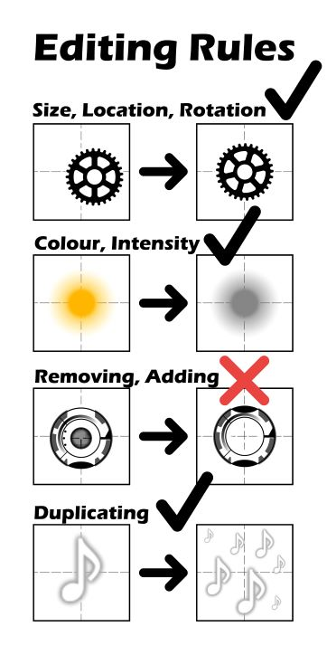

# osb! Storyboarding Contest #1

**L'osb! Storyboarding Contest #1** était un concours de storyboarding organisé par osu! storyboarder banquet, la communauté de storyboarding sur osu!. Il s'agissait de la première itération du concours osb! Storyboarding Contest.

## Calendrier du concours

| Événement | Horodatage (UTC-8) |
| --: | :-- |
| Annonce | 20/04/2019 |
| Phase d'inscription | 20/04/2019/20/05/2019 |
| Phase de soumission | 20/05/2019/20/06/2019 |
| Phase de jugement | 27/06/2019 |
| Annonce des résultats | 27/06/2019 |

## Prix

| Placement | Prix |
| :-: | :-- |
|  | 4 mois d'osu!supporter, badge de profil unique |
|  | 2 mois d'osu!supporter |
|  | 1 mois d'osu!supporter |

## Organisation

L'osb! Storyboarding Contest #1 a été organisé par le personnel du osu! storyboarder banquet.

| Utilisateur | Responsabilité |
| :-- | :-- |
| ::{ flag=CA }:: [Sidetail](https://osu.ppy.sh/users/2036217) | Hôte, administrateur |
| ::{ flag=VN }:: [Hokichi](https://osu.ppy.sh/users/6607303) | Co-hôte, graphiste, juge |
| ::{ flag=GB }:: [WildOne94](https://osu.ppy.sh/users/3482692) | Membre du personnel, juge |
| ::{ flag=AU }:: [Coppertine](https://osu.ppy.sh/users/7279762) | Membre du personnel, juge |
| ::{ flag=DE }:: [Darky1](https://osu.ppy.sh/users/3372928) | Membre du personnel, juge |
| ::{ flag=CA }:: [Marblelemons](https://osu.ppy.sh/users/8286416) | Membre du personnel, juge |
| ::{ flag=BR }:: [Dada](https://osu.ppy.sh/users/9119507) | Juge |
| ::{ flag=ID }:: [LordRaika](https://osu.ppy.sh/users/3265023) | Juge |
| ::{ flag=US }:: [Starrodkirby86](https://osu.ppy.sh/users/410) | Juge |
| ::{ flag=SE }:: [Naxess](https://osu.ppy.sh/users/8129817) | Concepteur du logo |

## Liens

- **[Post de discussion](https://osu.ppy.sh/community/forums/topics/897075)**
- [Feuille de calcul pour le jugement](https://docs.google.com/spreadsheets/d/16hHsR_foAqDAqckcZ33Om-OLxqgtNXzFqWqDSe7gdnU/edit#gid=0)

## Participants

| Storyboardeur | Entrée | Vidéo de présentation |
| :-- | :-- | :-- |
| ::{ flag=CA }:: [Gaia](https://osu.ppy.sh/users/2683648) | [puru - Grimheart (Original Mix & Cut Ver.) \[RED FOX\]](https://drive.google.com/uc?id=1dIBPlOdB00Mu-To8SdAwgGsi9OUSQ1JT) | [#1](https://www.youtube.com/watch?v=F4QL4B4Qgso) |
| ::{ flag=UA }:: [PantyDev](https://osu.ppy.sh/users/5420543) | [Itou Kanako - COSMIC LOOPER (TV Size) \[MAINE COON\]](https://drive.google.com/uc?id=12i-RTXTOM60P1MfBx_QGBMwmB5qOWXbz) | [#1](https://www.youtube.com/watch?v=ucRjWfP6ZSA) |
| ::{ flag=CA }:: [TheDuckMask](https://osu.ppy.sh/users/7405768) | [AVTechNO!xTreow - DYE/Re:flection+ \[SHIBA INU\]](https://drive.google.com/uc?id=1y51gyjGgrrIQJlxkjxNoGRwFu285KaeH) | [#1](https://www.youtube.com/watch?v=dFfXZfOJQPs) |

## Podium

Cette compétition s'est achevée sur le podium suivant :

| Placement | Participant |
| :-: | :-- |
|  | ::{ flag=CA }:: [TheDuckMask](https://osu.ppy.sh/users/7405768) |
|  | ::{ flag=UA }:: [PantyDev](https://osu.ppy.sh/users/5420543) |
|  | ::{ flag=CA }:: [Gaia](https://osu.ppy.sh/users/2683648) |

## Règlement

### Règles générales

- **Vous pouvez choisir n'importe quelle musique, thème et sprites (y compris les vôtres)**. Ceci afin de ne pas limiter votre potentiel et vos idées.
- **Le mapping n'est pas nécessaire**. Il s'agit d'un concours de storyboard !
- L'utilisation des **spirites fournis est facultative**, mais elle est **fortement encouragée car les points sont calculés en fonction des sprites et de leur utilisation**.
- Si vous avez un **changement de nom** pendant la durée du tournoi, veuillez **en informer les organisateurs dès que possible** !
- **Aucune expérience préalable n'est nécessaire**. (Cela inclut une expérience avec l'onglet design de l'éditeur de beatmaps, la programmation et photoshop, bien que ce soit un grand avantage).
- Les prix sont distribués dans les deux semaines qui suivent la publication des résultats.

### Règles de soumission

- **Ce concours est individuel** Cela signifie que la collaboration avec le storyboard est interdite.
- Si vous souhaitez utiliser des illustrations d'un artiste, **demandez l'autorisation / citez-la en conséquence**.
- Si vous souhaitez utiliser des sprites provenant d'autres storyboards, **ne les utilisez pas avant d'avoir obtenu l'autorisation du ou des storyboarders**.
- Pour savoir dans quelle mesure vous pouvez modifier un sprite sans qu'il soit comptabilisé comme faisant partie d'un sprite du pool de sprites, veuillez vous référer à l'image ci-dessous.

- **Ne partagez pas les storyboards, le code et/ou les sprites une fois que vous avez terminé !** (Cela inclut les captures d'écran et/ou les GIF du storyboard.) Les partager vous désavantagera !
- Vous pouvez obtenir des conseils pour réaliser des effets spécifiques que vous avez en tête, mais **ne demandez pas à d'autres de réaliser un effet pour vous** !
- **Si vous avez déjà un storyboard WIP, vous pouvez l'utiliser dans le cadre de ce concours.** Cependant, nous aimerions que le SB que vous nous soumettez soit également utilisé dans une beatmap, sans grandes modifications.
