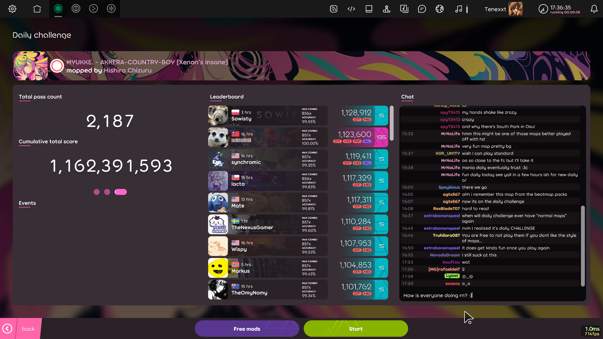

# Daily Challenge

*Daily challenge* is a mode where the main task is to pass a selected beatmap that changes everyday sometimes with specific [mods](wiki/Gameplay/Game_modifier).

## How to play

*Notice: Daily challenge requires an [osu! account](/wiki/Registration), is not available for [silenced](/wiki/Silence) players and is only avaible in osu!(lazer).*

From the main menu, the daily challenge menu can be accessed with the following steps:

1. Click the `Play` button or press `P`.
2. Click the `Daily challenge` button or press `D`.

## Main Menu

 

On enter, the user is presented with an intro containing the beatmap the user has to pass, and the mods they have to pass with.
After the intro ends, the user can view the data for today's challenge and can interact with the chat that is currently only avaible in the daily challenge menu. 

## Selected Beatmaps

Each day will introduce one new map from the featured artist lising with increased difficulty, resetting after a week.

Sometimes, the maps could come with a mod forced onto users, which required them to pass the map with the selected mod.
## Trivia

### History

::: Infobox

:::

- The idea for daily challenge was taken from a comment from waxxx14 requesting a "cup of the day" format from [trackmania](https://en.wikipedia.org/wiki/TrackMania) in osu!, under a lazer dev video, ["deciding what to do with lazer"](https://www.youtube.com/watch?v=xUSxEjQQ1UI)

- The daily challenge launched to the public on July 25, 2024 in osu!(lazer) public relase 2024.725.0.

- On relase, you couldn't use free mods, and you couldn't view the total pass count and the cumulative total score.
