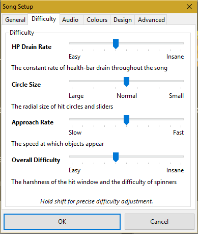

Summary
-------

Normal [difficulties](difficulty) are difficulties in which you must have basic skills to play them. They are the easiest difficulties next to [Easy](Easy_(Difficulty)) difficulties.

[Mapping](Mapping) good Normal difficulties can appear to be hard at times, but after a while, it's pretty simple. Here's how to get things started.

Guidelines
----------

Generally following the most distinctive features of a song. **Recovery times** should be plenty but can be less than in the related Easy map. **Use of 1/2 notes** is encouraged as well as the development of more **interesting beat placements** if the song allows it. **Spacing should be mostly consistent** to teach beginners the correlation between timing and distance. It is **not recommended** to change the distance spacing during the mapping process.

Difficulty setup should use a **low to medium slider velocity, medium drain rate, medium hit accuracy, and a big circle size that is the same or smaller than in the related [Easy](Easy_(Difficulty)) map**. Approach rate should match the higher slider velocity and pacing of the map while leaving enough reaction and planning time without cluttering the screen.

It is also **highly recommended** to avoid these:

-   triplets/streams (1/4 notes)
-   spacing inconsistencies (close AND far placed notes within the same combo(s))

Beginners can easily be confused and disoriented by these, so they are unfit for a Normal difficulty **unless absolutely necessary.** Do not be afraid to ask on #modhelp or on the forum if you are unclear whether these are needed in your map.

Setup
-----

-   HP Drain Rate: 5 or below
-   Circle Size: 3 or 4
-   Approach Rate: 5 or below
-   Overall Difficulty: 5 or below

The [slider velocity](slider_velocity) can vary greatly. Typically, 1.0x to 1.6x works well for a Normal, but at high [BPMs](bpm) you might want to use less than 1.0x. Your difficulty settings and slider velocity settings really depend on whether or not you have an Easy. If you have an Easy, then you want to make it harder than your Easy. If you don't have an Easy, you want to make it so that newbies can still play your map easily.

A [Distance Snap](Distance_Snap) of x1.0 is commonly used because it gives the spacing a speed that's equal to the sliders. However, since you generally move your mouse faster than is necessary, 0.7x to 0.8x potentially gives better flow into the sliders (which is why 0.8x is the default). Experiment a bit and see what works the best for your style, but don't go crazy.

The Actual Mapping
------------------

**Don't worry!** Mapping normal difficulties are pretty easy when you know what you're doing. Listen to the music you are mapping at first. Think about where it would be appropriate to place [beats](Hit_Objects) that should be expected to be on your map. Keep them in your mind.

Note that most of the [notes](Hit_Objects) should be on [white or red Ticks](Beat_Snap_Divisor) (Of course, this does not apply to songs that use 1/3 snap, though this is rare.). Blue ticks (also known as 1/4 snap) are often difficult for newer players to play because of how quick and/or awkward they are when you start playing, so **avoid using them** if you can.

Remember, think of simple [patterns](Mapping_Techniques#Patterns) and note placements that everyone would be able to hit and identify, no matter who plays your normal difficulty^. Remember to use [sliders](Hit_Objects#Sliders) whenever a long note or key is held in the song you are mapping. If the part of the map you're mapping plays better with a slider, add it in there too. You can never make enough awesome sliders in Normal and Easy difficulties^^.

Now, let your imagination run wild! Creating pretty patterns never hurts, and they make your beatmaps look more appealing.

Good luck with your Normal difficulties!

**OTHER NOTES**

^ If you have an [Easy](Easy_(Difficulty)), make sure your Normal is a bit harder than your Easy, of course. If you do not have an Easy, you should still make your Normal suitable for beginners. A 1.6-1.7 star Normal will comfortably make up for an Easy.

^^Well, unless you spam 1/4 sliders everywhere. Or shoehorn 1/2 sliders in for that matter. Certain [BAT members](Beatmap_Appreciation_Team) have been known to rage via PMs over this sort of thing.
