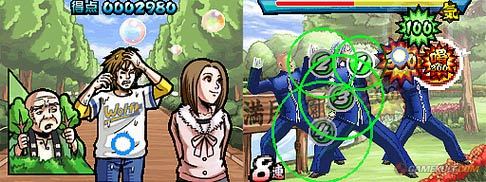

# FAQ

# Introducción

## Nunca he jugado esta cosa "Ouendan" - ¿Qué es?

[Osu! Tatakae! Ouendan](wikipedia:es:Osu!_Tatakae!_Ouendan "wikilink") es un juego de ritmo creado para Nintendo DS. El juego se compone de solo tres elementos: tocar los círculos de la pantalla, arrastrar una bola a través de una trayectoria establecida y rotar un spinner (ruleta) muy rápido. Todos estos elementos son sincronizados con canciones japonesas populares. Se ve algo así en la DS:

Pudes ver los círculos en la pantalla inferior, y en la pantalla superior tienes la historia. Cada etapa es básicamente una historia independiente sobre una persona en problemas. Aquí es donde el Ouendan (Equipo de las Animadoras) viene. A través del poder mágico de los hombres porristas, tienes que ayudar a las personas en problemas.

## ¿Cómo puedo jugar?

*Explicación completa: [osu! Standard](ES:Standard "wikilink")*

Aunque la mayoría de los usuarios de PC no tiene una pantalla táctil a su disposición, este juego fue hecho para ser jugable con un ratón normal, así como cualquier número de dispositivos de entrada que puedas imaginar. Los diferentes estilos de juego pueden ser encontrados en [ésta](ES:Play_Styles "wikilink") página. Existen algunas canciones que prolongan los límites del ratón normal (y de ti), pero todos los beatmaps ([rankeados](ES:Ranked_beatmap "wikilink") y [aprobados](ES:Approved_Beatmap "wikilink")) han sido probados y (la mayoría) son posibles de pasar solo con un ratón.

### Lo Básico del Juego

`Tutorial: `[`Tutorial` `Origina` `(Incluido` `en` `la` `versión` `de` `osu!` `para` `PC)`](https://osu.ppy.sh/beatmapsets/3756)`, `[`Version` `Rankeada` `del` `beatmap`](https://osu.ppy.sh/beatmapsets/19928)

El juego pone énfasis en:

-   La capacidad de adaptación y reacción a los estímulos (así es, los ["Hit Objects"](ES:Hit_Objects "wikilink") aparecen en pantalla a la velocidad de la luz)
-   Entender el ritmo y diseño de la canción.
-   El control sobre tu ratón (o tus habilidades de dedos/uso de bolígrafo si estás usando una tablet en su lugar)
-   Sincronizar tus toques con el objeto que aparece en la pantalla.
-   La habilidad de girar el ratón (o tu dedo/bolígrafo para tablets) en círculos.
-   Tu resistencia física (especialmente en canciones maratón).
-   El correcto posicionamiento del ratón y la coordinación mano-ojo.
-   La capacidad de tu hardware (especialmente tu ratón/tablet).

Estas son algunas de las habilidades esenciales que aprenderás a medida que avances en convertirte en un maestro del ritmo de osu!. Antes de salir para convertirte en un maestro del ritmo, debes aprender lo básico (y teorías) de los objetos.

Vamos a aprender cuáles son los objetos ¿De acuerdo?

#### Hit-circles

-   Aquí puedes ver los círculos que debes presionar.
    -   El anillo que rodea al hit-circle en la parte exterior se encoge gradualmente y debes presionar la nota en el momento exacto en el que el anillo exterior coincide con el borde blanco.
-   Para entender el encanto oculto de los hit-circles, no deberías solo confiar en tu percepción (tus ojos), sino también entender el ritmo del beatmap con tus oídos (auditivo).

#### Sliders

-   Aquí tenemos un slider.
    -   Primero, tienes que presionarlo en el momento correcto, pero esto no termina aquí.
    -   Una bola empezará a moverse a través del trayecto que ves.
    -   Debes mantener presionado el ratón/botón del teclado (o tu dedo/bolígrafo en la tablet) y mantener tu puntero dentro del grueso círculo anaranjado que rodea la bola mientras se mueve.
        -   No puedes controlar el movimiento como quieras, debes seguir la trayectoria.
        -   El círculo anaranjado aparecerá si lo mantienes presionado y desaparecerá cuando dejes de presionarlo.
    -   A veces, como en la imagen de arriba, debes regresar en el final del trayecto y terminar en el principio.
    -   Esto lo indica el símbolo de reversa al final del trayecto.

#### Spinners

-   Este es un spinner.
    -   Debes mantener presionado el botón asignado (normalmente click), y usar el ratón para girar (en el sentido de las agujas del reloj o viceversa) en círculos como un loco antes de que el tiempo (que es, la línea del círculo azul) se agote.
        -   La barra exterior indica lo cerca que estás de acabar.
        -   La pequeña barra bajo el spinner muestra los spins por minuto, quiere decir, el número de vueltas que harás si continúas a esa velocidad durante un minuto.
        -   Si no mantienes ningún botón antes de dar vueltas, no podrás llenar el medidor de SPM.
-   En el DS, esta es una buena manera de rayar tu pantalla táctil (o protector de pantalla), especialmente en las mayores dificultades.
-   En osu!, los spinners han sido atenuados para que no sean molestos de completar.
    -   El máximo número de spins por minuto posible es 477 que es también la velocidad con la que el mod [Auto](ES:Auto "wikilink") gira, mientras que el mod [Spun Out](ES:SO "wikilink") gira a menos de 287 spins por minuto.
    -   Practica y trata de girar en cículos muy pequeños (como hace el mod Auto, pero poniendo un esfuerzo en tu brazo si es que no estás acostumbrado.)
-   \[Ratón\]**Si tu cursor no gira en absoluto, o se mueve estáticamente a pesar de que giras muy rápido. O bien entiende que es el límite de tu ratón o consigue un mejor ratón/mousepad**.
    -   Un ratón convencional puede sufrir este problema, y lo mejor es **empezar a girar lentamente en lugar de girar muy rápido repentinamente** de modo que el ratón pueda detectar lo que estás haciendo.

### Interfaz del Juego

Esta es la interfaz del estilo de juego osu! Standard.

-   La barra superior izquierda muestra tu "salud".
    -   Esta disminuirá a un ritmo constante \[dependiendo de la dificultad del beatmap establecida por el(los) [mapper(s)](ES:Mapper "wikilink"), pero puedes reponerlo presionando las notas en el momento correcto.
    -   Un "hit" (golpe) perfecto ([300](ES:300 "wikilink") o Geki Beat) incrementará tu salud más que un hit mal hecho([50](ES:50 "wikilink")).
    -   Muchos errores quitarán una buena parte de tu salud.
-   Al lado de la barra de salud (a la derecha) se muestra tu puntaje.
-   Debajo del puntaje está tu precisión.
-   El círculo al lado de tu precisión y debajo de tu puntaje es la barra de tiempo, que muestra la duración de la canción.
-   El número en la parte inferior izquierda es el contador de combo/multiplicador de puntaje.

# Otros Modos de Juego

## ¿Qué es "Taiko"?

*Explicación completa: [Taiko](ES:Taiko "wikilink")*

[200px|thumb|right|Jugando Taiko.](image:taiko.jpg "wikilink") [Taiko no Tatsujin](http://es.wikipedia.org/wiki/Taiko_no_Tatsujin) es un juego de ritmo hecho por Namco, que consiste en simular tocar los tambores al ritmo de la música. En osu!, los beatmaps pueden ser jugados al estilo de Taiko no Tatsujin mediante el uso del modo de juego special llamado Taiko.

Como en osu! standard, existen tres elementos en el juego.

### Explicación Básica

<u>**Hit-circles**</u>

-   Estos aparecerán como un círculo ya sea rojo o azul pálido. Estos son llamados como notas rojas (Don) y notas azules (Katu).
    -   Si se trata de una pequeña nota roja, debes presionar el botón de la parte interna del tambor Taiko o golpear la gran superficie plana (centro) del TaTaCon.
    -   Si se trata de una pequeña nota azul, debes presionar el botón del anillo exterior del tambor Taiko o golpear los lados del TaTaCon.
    -   Si se trata de un círculo GRANDE, debes presionar dos tambores sean internos o externos dependiendo del color de la nota para puntos adicionales.
        -   Las notas deben ser presionadas o golpeadas cuando alcancen el pequeño círculo blanco al lado del tambor bajo la barra de estado en la zona de juego.

<u>**Hit balloons**</u>

-   Estos son descritos como pequeñas notas rojas normales, pero con un globo inflable detrás.
    -   Debes golpear el tambor interior continuamente antes de que el contador llegue a cero.
    -   Ganas puntos por cada golpe y puntos de bonificación por hacer estallar el globo.

<u>**Drum rolls**</u>

-   Los Drum rolls aparecerán como una barra amarilla en el área de juego.
    -   Debes golpear el tambor interior (o exterior) continuamente antes de que complete.
        -   Para notas GRANDES, debes golpear ambos botones en el tamborinterior (o exterior) simultáneamente y continuamente antes de que se complete.
    -   Ganas puntos por cada golpe exitoso.
    -   Puedes escoger ignorarlo al precio de perder tus posibles puntos ganados en el drum roll.

<u>**Dendens**</u>

-   Estos aparecen como spinners, con una cuenta regresiva que muestra el tiempo que te queda para completarlo.
    -   Debes golpear el interior y exterior del tambor en orden (como rojo, rojo, azul, azul, rojo, rojo, y así sucesivamente) antes de que el medidor del Denden se llene.
    -   Serán dados puntos de bonificación por golpes extra después de completar el Denden.

### Controles

Los controles por defecto del modo Taiko son:

`Rojo: [Ratón] Click izquierdo, [Teclado] [X] o [C], [TaTaCon] Superficie plana del tambor.`
`Azul: [Ratón] Click derecho, [Teclado] [Z] o [V], [TaTaCon] Superficie exterior del tambor.`
`El lugar del cursor de osu! no importa cuando juegas.`

Puedes configurar los botones del teclado como te parezca cómodo, desde la pestaña de Controles en el menú de Opciones.

## ¿Qué es "Catch the Beat"?

[200px|thumb|right|Jugando Catch The Beat.](image:ctbaqua.jpg "wikilink")

*Explicación completa: [Catch the Beat](ES:Catch_the_Beat "wikilink")*

-   Catch the Beat es el segundo modo de juego especial añadido, después de Taiko.
-   En lugar de hacer clic en los círculos, ahora tienes la tarea de mover al [catcher](ES:Catcher "wikilink") (recolector) en la parte inferior de la pantalla mientras que frutas caen desde arriba.

### Controlando al catcher

Si el mod [relax](ES:Relax "wikilink") es usado, el catcher se controla moviendo el ratón.

-   Por defecto, las flechas izquierda \[&lt;-\] y derecha \[-&gt;\] son usadas para mover al catcher.
-   Presionando la tecla SHIFT con alguna de las flechas, el catcher correrá en la dirección indicada a una velocidad de x1.5 (indicada por un brillante resplandor rodeando al catcher).

## ¿Qué es "osu!mania"?

")

*Explicación completa: [osu!mania](ES:Osu!mania "wikilink")*

-   osu!mania es el tercer modo de juego especial añadido, después de Taiko y CtB.
-   Este modo de juego ha sido inmensamente utilizado en casi todos los grandes juegos de ritmo que requieren una buena coordinación mano/pierna, donde las notas siguen el ritmo dependiendo del BPM y la dificultad, y el jugador debe presionar la tecla correcta en el tiempo correcto para una nota específica. Aunque el modo de juego fue originalmente hecho como imitación del estilo de Beatmania, cambiando el número de teclas, puedes hacer que se vea más como Guitar Hero (5 teclas) o Dance Dance Revolution (4 teclas), etc. Actualmente, puedes establecerlo entre 4 y 8 teclas.

### Controles

  Existen dos diferentes estilos de disposición, *Simétrico* y *De Izquierda a Derecha*. (Pueden ser encontrados en Options-&gt;Controles)

-   El estilo *simétrico* imita la colocación de los botones en DJMAX, en el cual la tecla central es la "barra espaciadora", la cual, crea la sensación de "pisar" el pedal similar a la versión arcade. La tecla central coincide con la columna del medio (solo en 5K y 7K) Y las otras columnas coinciden con sus teclas en su correspondiente lugar.
-   El estilo *De Izquierda a Derecha* imita la colocación de los botones en Beatmania IIDX, Donde la primera columna coincide con la key1, luego, la segunda columna coincide con la key2 y así sucesivamente.

Disposición de teclas *Simétricas* (Para el estilo DJMAX)

-   Botones para la mano *izquierda* — (K1)**A**, (K2)**S**, (K3)**D**, (K4)**F**
-   Botones para la mano *derecha* — (K6)**J**, (K7)**K**, (K8)**L**, (K9)**Ñ**.
-   Botón *central*— (K5)**barra espaciadora**. \[Solo en 5K y 7K\]
-   El botón *especial* — **SHIFT izquierdo** y **control izquierdo "Ctrl"**.

Disposición de teclas*de Izquierda a Derecha* (Para el estilo Beatmania IIDX)

-   De abajo hacia arriba, luego de abajo hacia arriba de nuevo: (K1)**Z**, (K2)**S**, (K3)**X**, (K4)**D**, (K5)**C**, (K6)**F**, (K7)**V**, (K8)**G**, (K9)**B** \[No se usa K9\]
-   El botón *especial* — **SHIFT izquierdo** y **control izquierdo "Ctrl"**.

<table style="width:19%;">
<colgroup>
<col width="3%" />
<col width="15%" />
</colgroup>
<thead>
<tr class="header">
<th align="center">
Tecla
</th>
<th align="center">
Disposición Simétrica
</th>
</tr>
</thead>
<tbody>
<tr class="odd">
<td align="center">
4K
</td>
<td align="center">
K3, K4
</td>
</tr>
<tr class="even">
<td align="center">
5K
</td>
<td align="center">
K3, K4
</td>
</tr>
<tr class="odd">
<td align="center">
6K
</td>
<td align="center">
K2, K3, K4
</td>
</tr>
<tr class="even">
<td align="center">
7K
</td>
<td align="center">
K2, K3, K4
</td>
</tr>
<tr class="odd">
<td align="center">
8K
</td>
<td align="center">
K1, K2, K3, K4
</td>
</tr>
</tbody>
</table>

<table style="width:19%;">
<colgroup>
<col width="3%" />
<col width="15%" />
</colgroup>
<thead>
<tr class="header">
<th align="center">
Tecla
</th>
<th align="center">
Disposición de Izquierda a Derecha
</th>
</tr>
</thead>
<tbody>
<tr class="odd">
<td align="center">
4K
</td>
<td align="center">
K1, K2
</td>
</tr>
<tr class="even">
<td align="center">
5K
</td>
<td align="center">
K1, K2, K3, K4, K5
</td>
</tr>
<tr class="odd">
<td align="center">
6K
</td>
<td align="center">
K1, K2, K3, K4, K5, K6
</td>
</tr>
<tr class="even">
<td align="center">
7K
</td>
<td align="center">
K1, K2, K3, K4, K5, K6, K7
</td>
</tr>
<tr class="odd">
<td align="center">
8K
</td>
<td align="center">
K1, K2, K3, K4, K5, K6, K7, K8
</td>
</tr>
</tbody>
</table>

# Scoring (Puntaje)

*Una explicación detallada del "scoring" puede ser encontrada en la página respectiva de cada modo de juego.*

## Notas

**<u>Notas Normales</u>**

-   SS = 100% de presición
-   S = Encima del 90% de 300s, menos del 1% de 50s y sin errores.
-   A = Encima del 80% de 300s sin errores **o** encima del 90% de 300s.
-   B = Encima del 70% de 300s sin errores **o** encima del 80% de 300s.
-   C = Encima del 60% de 300s.
-   D = Todo lo demás.

<u>**Notas Especiales**</u>

-   SS de plata (SSH) = 100% de precisión con el(los) mod(s) '[hidden](ES:hidden "wikilink")' y/o '[flashlight](ES:flashlight "wikilink")'.
-   S de plata (SH) = Encima del 90% de 300s, menos del 1% de 50s y sin errores con el(los) mod(s) '[hidden](ES:hidden "wikilink")' y/o '[flashlight](ES:flashlight "wikilink")'.

<u>**En cuanto a los "Ranks" (rangos) en la página del perfil**</u>

-   Las notas que obtienes se establecen en tu página de perfil bajo General-&gt;Ranks siempre y cuando estés "online" cuando recibas la nota.
    -   **Jugar Offline** incluso si tu cuenta está "loggeada" **no cuenta**.

`NOTA : Mientras estes jugando de manera "Offline" tus puntuaciones no podrán ser guardadas. `

-   **Las notas dadas a tu perfil dependen de la dificultad, no del betmap en conjunto.**
    -   Por ejemplo, si el beatmap tiene 3 dificultades, y tienes SS en las tres, recibirás 3 SS y no solo una SS en tu perfil.

# Problemas y Preguntas Frecuentes

## ¿Donde puedo encontrar beatmaps?

*Explicación detallada de los beatmaps: [Beatmaps](ES:Beatmaps "wikilink")*

Puedes encontrarlos en la página principal bajo el nombre de "[Beatmaps](https://osu.ppy.sh/p/beatmaplist)".

-   Solo recuerda loggearte en tu cuenta de osu! de antemano o el servidor te tratará de invitado y te prohibirá descargar beatmaps desde el sitio web.

## ¿Puedo desactivar el "Kiai Time"?

No, porque a diferencia del video, estos son integrados en el juego (como parte de los objetos), por lo tanto no puede ser desactivado.

## ¡Los beatmaps son muy difíciles! ¿Dónde puedo encontrar algunos beatmaps más fáciles?

Pokebis ha compilado un conjunto de beatmaps adecuados para principiantes. Puedes encontrarlos aquí: <https://osu.ppy.sh/community/forums/topics/5456>

Además, [la versión rankeada del beatmap del tutorial de osu!](https://osu.ppy.sh/beatmapsets/19928)\] es buena para practicar algunos de los posibles diseños de mapping que encontrarás. Es un excelente beatmap de entrenamiento para jugadores principiantes y experimentados.

Alternativamente, puedes [ordenar la lista de betmaps rankeados por dificultad](https://osu.ppy.sh/?p=beatmaplist&s=3). Los beatmaps más fáciles están encima de la lista.

## ¿Qué hace el nivel de mi perfil realmente?

Absolutamente nada. No hay ningún tipo de diferencia cuando comparas a un jugador Nivel 100 contra un jugador Nivel 1 excepto sus propias habilidades y su experiencia. No existe una desventaja para el nivel más bajo, ni existe una ventaja para el nivel más alto (excepto la experiencia personal y el hardware usado).

El nivel se basa en tu puntaje total acumulado cuando estas "online" con tu cuenta si fallas o pasas el beatmap. [Fórmula aquí](ES:Score#Level "wikilink")

## ¿Por qué las estadísticas de mi perfil son diferentes con las del juego?

Probablemente estés viendo tus estadísticas en el modo de juego incorrecto. Haz Click en el modo que estás jugando en tu perfil. 

## ¿Por qué veo líneas blancas aleatorias en la pantalla cada vez que juego?

Asegúrate de que las teclas asignadas al smoke/skywriting no sean las mismas que las teclas que usas al jugar.

<File:Smoke> effect.jpg| Uso de *smoke* <File:Screenshot085.jpg>| Ubicación de *smoke*

## ¿Por qué no tengo el combo máximo posible cuando no tengo errores?

Soltaste un slider demasiado pronto. También es posible perder el combo si lo empiezas demasiado tarde. [Fuente de la respuesta](http://www.reddit.com/r/osugame/wiki/index)

# Créditos

-   FAQ viejo de peppy
-   Peter Lambert - osu! tutorial ([Tutorial original](https://osu.ppy.sh/beatmapsets/3756), [Versión rankeada](https://osu.ppy.sh/beatmapsets/19928))
-   Entrenamiendo para principiantes de Pokebis [1](https://osu.ppy.sh/community/forums/topics/5456)
-   Wikipedia [2](http://en.wikipedia.org/wiki/Osu!_Tatakae!_Ouendan), [3](http://en.wikipedia.org/wiki/Taiko_no_Tatsujin)
-   Reddit's /r/osugame/wiki [4](http://www.reddit.com/r/osugame/wiki/index)
