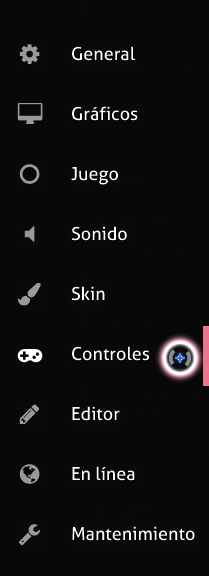
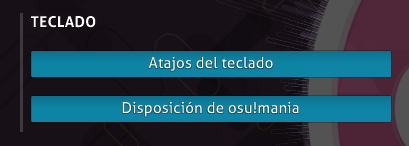

# Preguntas frecuentes

## Introducción a osu!

### Nunca he jugado a esta cosa llamada «Ouendan», ¿qué es?

*[Osu! Tatakae! Ouendan](https://es.wikipedia.org/wiki/Osu!_Tatakae!_Ouendan)* es un juego de ritmo para la *Nintendo DS*. La jugabilidad consiste en solo tres elementos: pulsar círculos en la pantalla táctil, arrastrar una bola por un camino fijo y hacer girar muy rápido un spinner. Todos estos elementos están sincronizados con (versiones de) canciones populares japonesas. Así se ve en la *DS*:

Se pueden ver los círculos de juego en la pantalla inferior y la historia en la pantalla superior. Cada escenario es básicamente una historia autoconclusiva sobre una persona en apuros. Ahí es donde entra en juego el *Ouendan* (equipo de animadores). Mediante el poder mágico de los animadores masculinos, el jugador tiene que ayudar a la gente en apuros.

### ¿Cómo se juega?

*Explicación completa: [osu!](/wiki/Game_mode/osu!)*

Si bien es posible que la mayoría de los jugadores no tengan una pantalla táctil a su disposición, el juego se creó para que se pudiera jugar con un ratón normal, así como con cualquier variación creativa del uso de dispositivos de entrada. Puedes encontrar diferentes estilos de juego en la página de [estilos de juego](/wiki/Gameplay/Play_style). Hay algunas canciones que sobrepasarán los límites del ratón normal y del jugador, pero todos los beatmaps (clasificados y aprobados) han sido probados y (la mayoría) pueden ser pasables usando solo un ratón.

#### Conceptos básicos de la jugabilidad

*Mapa de tutorial: [Tutorial de osu! (new beginnings)](https://osu.ppy.sh/beatmapsets/1011011)*

La jugabilidad pone énfasis en:

- La adaptabilidad y la reacción a los estímulos (es decir, los objetos que aparecen por toda la pantalla a la velocidad de un rayo).
- La comprensión del ritmo y el diseño de la canción.
- El control sobre el dispositivo de entrada.
- La sincronización de los golpes sobre los objetos que aparecen en la pantalla.
- La habilidad de hacer girar el ratón (o el lápiz en el caso de las tabletas) sobre los spinners.
- La resistencia física y la fortaleza mental (especialmente en las canciones más largas, tipo maratón).
- El posicionamiento adecuado y la coordinación entre manos y ojos.

Estas son algunas de las habilidades vitales para convertirse en un *maestro del ritmo de osu!*. El primer paso para comenzar el viaje es aprender los fundamentos (y teorías) de los objetos golpeables (llamados solo *objetos* de aquí en adelante).

##### Círculos

Un fino anillo de color similar, situado en el exterior del círculo, se reducirá con el tiempo. Pulsa sobre la nota en el punto exacto en el que el anillo toque el borde blanco del círculo. Después de pulsar el círculo, aparecerá una explosión que mostrará la puntuación y los cambios de salud dependiendo de la sincronización de la pulsación con el ritmo. El círculo desaparecerá después de la explosión de la puntuación.

Para comprender el encanto oculto de los círculos, no confíes solo en la percepción; siente los latidos y el ritmo del beatmap. Ayudará a hacer malabares con algunos de los patrones de círculos visualmente complejos que se encuentran en dificultades posteriores.

##### Sliders

Primero, pulsa sobre él en el momento adecuado; sin embargo, la cosa no acaba ahí. Una bola comenzará a moverse por el camino. Mantén pulsado el botón del ratón/teclado (o mantén el lápiz sobre la tableta) y sigue la bola dentro del grueso círculo naranja que la rodea mientras se mueve. El círculo exterior naranja, llamado círculo de seguimiento, aparecerá si se sujeta la bola del slider, pero desaparecerá cuando se suelte.

A veces, como se ve en la captura de pantalla anterior, la bola puede invertir su dirección y el jugador debe seguirla hasta el principio del camino o viceversa. La señal visual es una flecha inversa en el círculo final/inicial del camino.

##### Spinners

Mantén pulsado el botón del ratón/teclado (o el lápiz sobre la tableta). A continuación, usa el ratón (o el lápiz) y haz girar el spinner en un movimiento circular (en cualquier dirección) hasta que el círculo del spinner crezca completamente hacia fuera. Un aviso de *Clear* aparecerá para indicar que el spinner se ha completado. Si el spinner se ha completado antes de tiempo, sigue girando para conseguir una bonificación de puntuación y recuperar algo de salud.

El círculo blanco exterior muestra el tiempo que queda para completar el spinner. Este círculo se volverá rojo para indicar que el tiempo está a punto de agotarse. Los beatmaps más antiguos, que usan la *versión 1.0 para las skins*, tendrán un medidor para indicar lo cerca que estás de completar el spinner.

El pequeño cuadro situado debajo del spinner muestra las rotaciones por minuto. El número dentro de ese cuadro se refiere al número de rotaciones posibles, si se continúa haciendo girar el spinner a esa velocidad durante un minuto. Si se suelta el botón del ratón/teclado (o el lápiz deja de tocar la tableta) al principio del giro, el spinner dejará de leer dicho giro.

En la *DS*, esta es una buena forma de rayar la pantalla táctil (o el protector de pantalla), especialmente en las dificultades más altas. En osu!, los spinners se fueron ajustando para que no resulten tan molestos de completar. El número máximo de rotaciones por minuto que se puede conseguir es 477, que es también la velocidad a la que gira el mod [Auto](/wiki/Gameplay/Game_modifier/Auto), mientras que el mod [Spun Out](/wiki/Gameplay/Game_modifier/Spun_Out) gira más despacio, a 287 giros por minuto.

#### Interfaz de juego

La barra superior izquierda es la barra de salud, que disminuirá a un ritmo constante (dependiendo de los ajustes de dificultad del beatmap), pero que puede rellenarse pulsando notas en el momento adecuado o haciendo girar el spinner. Un golpe perfectamente sincronizado (un 300 o Geki) recuperará más salud que un golpe mal sincronizado (50). Un fallo total restará un buen trozo de salud de la barra de salud.

A la derecha de la barra de salud está la puntuación total. Debajo está la precisión. El círculo a la izquierda de la precisión (y debajo de la puntuación) es un indicador de la duración del beatmap. El número de la parte inferior izquierda es el contador del combo/multiplicador de puntuación.

#### Controles

Los controles predeterminados de osu! son:

| Ratón | Teclado | Tableta/Pantalla táctil |
| :-- | :-- | :-- |
| Clic izquierdo (M1) / Clic derecho (M2) | `Z` (K1) / `X` (K2) | Presionar la tableta (M1) / Pulsar la pantalla (M1) |

Los objetos en osu! aceptarán cualquier señal del dispositivo de entrada, siempre y cuando cada objeto haya sido pulsado a tiempo.

Si se usa el mod [Relax](/wiki/Gameplay/Game_modifier/Relax), solo funcionará el cursor del juego. Usa el cursor del juego para seguir los objetos con pulsaciones automáticas. Los spinners tienen que seguir siendo completados.

Si se usa el mod [Auto Pilot](/wiki/Gameplay/Game_modifier/Autopilot), solo funcionará la señal del dispositivo de entrada. Sincroniza las pulsaciones sobre los objetos con el movimiento automatizado del cursor. Los spinners seguirán la velocidad del mod [Spun Out](/wiki/Gameplay/Game_modifier/Spun_Out).

---

## Modos de juego alternativos

### Cómo cambiar el modo de juego

")

Haz clic en el botón `Mode` para **abrir una lista de los modos de juego disponibles en osu!**. Haz clic en el modo de juego deseado y osu! cambiará a ese estilo de modo de juego, junto con el cambio de las tablas de clasificación correspondientes. Como alternativa, presiona la tecla `Ctrl` y `1` (![][Icono de osu!] *[osu!](/wiki/Game_mode/osu!))* / `2` ( ![][Icono de osu!taiko] *[osu!taiko](/wiki/Game_mode/osu!taiko)*) / `3` (![][Icono de osu!catch] *[osu!catch](/wiki/Game_mode/osu!catch)*) / `4` (![][Icono de osu!mania] *[osu!mania](/wiki/Game_mode/osu!mania)*) del teclado para cambiar rápidamente al modo de juego deseado.

### ¿Qué es osu!taiko?

*Explicación completa: [osu!taiko](/wiki/Game_mode/osu!taiko)*

*[Taiko no Tatsujin](https://es.wikipedia.org/wiki/Taiko_no_Tatsujin)* es un juego de ritmo de tambor taiko creado por *Namco* (ahora Bandai Namco). El juego consiste en simular que se toca el tambor taiko al ritmo de la música. En osu!, los beatmaps pueden jugarse con el estilo de *Taiko no Tatsujin* mediante el uso del modo de juego de osu!taiko.

#### Explicación básica

##### Campo de juego

Para los jugadores con experiencia previa en Taiko no Tatsujin:

- No hay bailarines chibi en la parte inferior (deben ser diseñados como parte de un storyboard).
- La barra de salud debe estar al menos 50 % llena para pasar la canción (lo cual no es realmente obvio usando la skin predeterminada; por favor, busca en el [Skin Compendium](https://osu.ppy.sh/community/forums/topics/686664) una skin decente para osu!taiko)
- El *Kiai Time* activa el «Go-Go Time»
  - Los elementos de jugabilidad especiales, como los globos o los caminos divididos, no están implementados (solo se incluyen los básicos)
- Diferencias de los fondos
  - Los beatmaps específicos de osu!taiko suelen tener su propio fondo personalizado, dejando vacía la sección superior
  - Un beatmap con un fondo en forma de vídeo o imagen estática solo ocupará la parte inferior de la pantalla
  - Si hay un elemento de un storyboard, ocupará todo el espacio disponible en pantalla excepto las partes importantes para la jugabilidad

Para los recién llegados al modo osu!taiko, la pantalla se divide en dos secciones diferentes; la superior contiene los elementos de juego, mientras que la inferior contiene una imagen o vídeo para el beatmap. En la parte superior, se encuentra la barra de salud, que, a diferencia de otros modos de juego, comienza vacía y debe llenarse al menos hasta el 50 % o la mitad para pasar la dificultad. En la parte superior central, debajo de la barra de salud, hay un tambor taiko situado en el lado izquierdo y una cinta transportadora en movimiento que lleva los objetos de derecha a izquierda pasando por un doble círculo blanco que sirve como círculo de juicio cerca del tambor taiko. Encima del tambor taiko está la mascota de taiko animada que reaccionará dependiendo del juicio recibido junto con los cambios de color del fondo superior. Por último, en la parte superior derecha aparece la puntuación, la precisión y el progreso del beatmap.

Ten en cuenta que el drenaje de salud está desactivado en osu!taiko, por lo que solo los objetos afectarán a la barra de salud. El combo no se romperá al jugar en un campo vacío. A diferencia de osu!, la celebración del hito de combo es cada 50 golpes consecutivos. La puntuación base se potenciará tras obtener un combo que sea múltiplo de 10, pero se detiene en 100 (límite máximo de combo para la potenciación). Si el combo se rompe, la mejora vuelve a la puntuación base. Durante el Kiai Time, cada golpe exitoso dará al jugador un 20 % más de puntos sobre la puntuación actual. La puntuación obtenida de un golpe se puede comprobar debajo de la precisión en la esquina superior derecha en rojo.

##### Notas de taiko

Cada nota de taiko (o notas, para abreviar) aparecerá como un círculo rojo o azul pálido. Esos círculos de colores se llaman Don (notas rojas) y Katu (notas azules), respectivamente.

Si es una nota roja pequeña, pulsa el botón unido a la parte interior del tambor de taiko o golpea la zona plana grande (centro) del *TaTaCon*. If it is a small blue note, press the button bound to the outer ring of the taiko drum or hit the sides of the *TaTaCon*. Si la nota es un círculo **GRANDE**, pulsa o golpea ambos tambores, el interior o el exterior, según el color de la nota, para obtener el doble de puntos (un solo golpe correcto dará un solo punto).

Las notas deben pulsarse o golpearse en el pequeño círculo blanco situado junto al tambor. Si se pulsa el color equivocado, o los colores rojo y azul al mismo tiempo, se considerará que se ha fallado.

##### Redobles de tambor

Golpea el tambor interior (o exterior) continuamente para conseguir puntos hasta el final del redoble. Para las notas **GRANDES**, pulsa los dos botones del tambor interior (o exterior) de forma simultánea y continua hasta que se complete. Ten en cuenta que los golpes de los redobles son limitados y solo cuentan cuando se golpea en los pequeños círculos, en lugar de redoblar lo más rápido posible como en *Taiko no Tatsujin*.

Los redobles se pueden ignorar sin penalización de salud, ya que no recuperan la barra de salud en absoluto. Sin embargo, costará posibles puntos ganados con el redoble. Cada acierto en el pequeño círculo de acierto da una puntuación estática de 300.

##### Dendens

")

Haz clic en el tambor interior y exterior en orden (como rojo, azul, rojo, azul, rojo, azul...) hasta que el contador del denden alcance 0. El color de inicio no importa (se puede empezar con azul o rojo), y no completarlo tendrá una penalización de salud pero no se romperá el combo. Pulsar el mismo color no disminuirá el contador del denden, hasta que se golpee un color diferente en su lugar.

No incrementan el contador del combo, ni recupera la barra de salud de ninguna manera. Cada golpe del denden exitoso solo otorga una puntuación estática de 300, y la finalización del denden dará una nota perfecta (GREAT).

#### Controles

Los controles predeterminados de osu!taiko son:

| Tipo | Ratón | Teclado | TaTaCon |
| :-- | :-- | :-- | :-- |
| Rojo | Clic izquierdo (I) | `X` (I) / `C` (D) | Superficie plana del tambor |
| Azul | Clic derecho (D) | `Z` (I) / `V` (D) | Superficie externa del tambor |

La ubicación del cursor en el juego no importa cuando se está jugando.

Si se usa el mod [Relax](/wiki/Gameplay/Game_modifier/Relax), la valoración de la puntuación solo tendrá en cuenta la sincronización de los golpes (el mod ajustará automáticamente los golpes al color correcto).

El mando *TaTaCon* se creó principalmente para las versiones caseras de *Taiko no Tatsujin* y *Taiko: Drum Master*.

### ¿Qué es osu!catch?

*Explicación completa: [osu!catch](/wiki/Game_mode/osu!catch)*

osu!catch (antes conocido como *Catch the Beat*) fue el segundo modo de juego añadido a osu! después del modo osu!taiko.

En lugar de pulsar círculos al ritmo de la música, tienes que mover al catcher por la parte inferior de la pantalla mientras las frutas caen desde arriba.

#### Explicación básica

##### Campo de juego

El nivel de zoom del campo de juego está basado en la configuración del CS (tamaño del círculo), donde un valor más bajo del CS indica un mayor nivel de zoom y menos espacio disponible, mientras que un valor más alto de CS implica un menor nivel de zoom y más espacio de movimiento.

El catcher puede moverse de izquierda a derecha, mientras que las frutas caen de arriba hacia abajo. Sin embargo, el catcher no puede moverse más allá de las paredes izquierda y derecha del campo de juego.

Todas las frutas permanecerán en el plato hasta que termine su combo, momento en el cual las frutas rebotarán fuera del plato. El momento y el lugar en que caigan en el plato no importan; ya sea una puntuación completa por atrapar con éxito o fallar.

##### Frutas

Para atrapar estas frutas, asegúrate de que caigan sobre el plato y no fuera de él. Las frutas capturadas siempre otorgarán 300 puntos cada una, incrementarán el combo en 1 y se reflejarán como 300 puntos en la pantalla de resultados.

##### Rastros de frutas

Un rastro típico de frutas consta de dos frutas (inicio y fin), gotas (trayectoria del slider), gotitas (marcas del slider) y más frutas para cada punto de flecha inversa, junto con una trayectoria de slider invertida. Cada gotita otorga 10 puntos y se considera como 50 puntos en la pantalla de resultados. Cada gota otorga 30 puntos, incrementa el combo en 1 y se refleja como 100 puntos en la pantalla de resultados.

Perder la gota romperá el combo (ya que es una marca del slider), pero perder la gotita no romperá el combo. Sin embargo, las gotitas perdidas no se mostrarán en la pantalla de resultados local, pero sí se mostrarán en la clasificación del sitio web como *Miss Droplet*, lo que afecta significativamente a la precisión (por haber perdido la gotita, equivalente a 50 puntos) y a la puntuación (se pierden 10 puntos por cada gotita perdida).

##### Plátanos

Aquí, plátanos grandes caerán del cielo y se reducirán de tamaño hasta el tamaño de captura mientras caen al plato (o no lo hacen). Cada plátano recolectado otorgará una puntuación fija de 1100 puntos, sin importar el modificador ni el multiplicador de combo.

Los plátanos pueden ser ignorados sin penalización de salud. Sin embargo, puede costar puntos adicionales y recuperación de salud al recolectar los plátanos. Notablemente, el mod [Auto](/wiki/Gameplay/Game_modifier/Auto) irá más allá para atrapar *todos* los plátanos sin fallar.

##### Hiperfrutas

Las hiperfrutas son frutas especiales que aparecen para asistir al catcher en la captura de la siguiente fruta cuando se considera que con el dash normal es imposible capturarla en un tiempo estrictamente asignado. Todas las hiperfrutas presentan un distintivo color rojo que rodea a la propia hiperfruta por defecto.

Recolectar la hiperfruta mejorará el dash del catcher a un *hiperdash* (lo suficientemente rápido como para atrapar la siguiente fruta), lo que lo hará brillar en rojo, y dejará un *rastro temporal* rojo en el punto de recolección hasta que la siguiente fruta sea atrapada o caiga, momento en el cual el catcher volverá a la normalidad.

#### Controles del catcher

- De forma predeterminada, las teclas de flecha izquierda `<-`(I) y derecha `->`(D) mueven al catcher.
- Presionar y mantener la tecla `Mayús izq` (D) con una de las teclas de flecha hará que el catcher haga un *dash* en esa dirección a velocidad x2.0 (indicado con un **brillo** del catcher).
  - Como alternativa, mantén pulsado el botón izquierdo (D) del ratón para activar el dash.

La ubicación del cursor en el juego no es relevante durante una partida normal. Si se activa el mod [Relax](/wiki/Gameplay/Game_modifier/Relax), el control del catcher será asumido por el cursor en el juego. Sin embargo, el juego no otorgará una clasificación cuando el mod Relax esté activado (pues esto anula el desafío principal de osu!catch: la velocidad de captura fija y el control del plato de captura).

### ¿Qué es osu!mania?

*Explicación completa: [osu!mania](/wiki/Game_mode/osu!mania)*

osu!mania fue el tercer modo de juego añadido a osu! después de osu!taiko y osu!catch.

El modo ha sido bastamente usado en casi todos los juegos de ritmo de renombre. Requiere de una buena coordinación de manos y/o piernas donde las notas (con su cantidad dependiendo del BPM y la dificultad) se mueven sobre una cinta transportadora. Los jugadores tendrán que presionar a tiempo la tecla correcta para esa nota en concreto. Aunque el modo de juego se creó originalmente como una imitación del estilo de juego de *Beatmania*, osu!mania permite cambiar el número de teclas o girar verticalmente la orientación del campo de juego (esto significa que se puede hacer que se parezca más a *Guitar Hero* \[5 teclas\] o *Dance Dance Revolution* \[4 teclas\] y así sucesivamente).

Al convertir un beatmap no específico del modo, el rango de teclas predeterminado será de entre 4 y 7 teclas.

Con el modificador de juego [xK](/wiki/Gameplay/Game_modifier/xK), los jugadores pueden establecer manualmente el número de teclas de 1 a un total de 9 teclas con una reducción del multiplicador de puntuación. Sin embargo, el modificador de juego no funcionará con beatmaps específicos de osu!mania.

Con el modificador de juego [Co-Op](/wiki/Gameplay/Game_modifier/Co-op), el escenario se dividirá en dos, usará el esquema de control de Co-Op, y permitirá a los jugadores jugar de 2 a un total de 18 teclas con una reducción del multiplicador de puntuación. Ten en cuenta que, si bien el número preestablecido de teclas no se duplicará en los beatmaps específicos de osu!mania, se dividirá el escenario en dos (el jugador de la izquierda de la pantalla tendrá prioridad si el número de teclas es impar), se usará el esquema de control de Co-Op y no se reducirá el multiplicador de puntuación.

#### Explicación básica

##### Campo de juego

De forma predeterminada, el flujo de las notas cae de arriba hacia abajo de la cinta transportadora (la flecha de inicio mostrará hacia dónde fluirán las notas), con el control de teclas en la parte inferior y la línea de juicio por encima del control de teclas. Para cambiar el flujo del campo de juego de abajo hacia arriba, se puede cambiar en la barra lateral de opciones; haz clic en el botón `Disposición de osu!mania` para configurar las teclas de osu!mania y activa manualmente la opción `Invertir verticalmente (estilo DDR)` para esta configuración de teclas.

La barra de salud se encuentra a la derecha de la cinta transportadora. Ten en cuenta que el drenaje de la salud está desactivado en osu!mania, por lo que solo los objetos afectarán a la barra de salud. El combo no se romperá al presionar las teclas en la línea de juicio vacía.

**La velocidad de desplazamiento de las notas** se puede cambiar presionando `Ctrl` (o `Mayús`) con `+` (más rápido) / `-` (más lento) o simplemente `F3` (más rápido) / `F4` (más lento).

##### Notas

Las notas son los círculos de osu!mania. Las notas cayendo deben de ser presionadas en la línea de juicio, con la tecla correspondiente a cada nota. Más teclas deberán de ser presionadas simultáneamente si las notas caen al mismo tiempo. Se dará una explosión en la puntuación cuando se presione la tecla correcta correspondiente a la nota de la línea de juicio.

##### Notas largas

Las notas largas son los sliders y spinners de osu!mania. Cuando las notas largas lleguen a la línea de juicio, pulsa la nota inicial con la tecla correcta, mantenla pulsada y suéltala al final de la nota larga.

La regeneración de la barra de salud se produce lentamente mientras mantienes las notas largas. Dependiendo de la canción y de las características del mapa, es posible que aparezcan otras notas o notas largas mientras se mantengan las notas largas anteriores.

#### Controles

Solía haber dos estilos diferentes de asignaciones de teclas, *simétrico* y *de izquierda a derecha*.

- El estilo *simétrico* imita el posicionamiento de los botones de *DJMAX*, en el cual la tecla central es la `Barra espaciadora` para simular la sensación de pisar el pedal similar a la versión arcade.
  - La tecla central coincide con la columna central (solo números de teclas impares) y la otra columna coincide con las teclas de su lugar correspondiente.
- El estilo *de izquierda a derecha* imita el posicionamiento de los botones de *Beatmania IIDX*, donde la primera columna coincide con la *tecla1*, luego la segunda con la *tecla2* y así sucesivamente.

Asignación de teclas *simétrico* (para el estilo *DJMAX*)

- Para los botones de la mano *izquierda*: `A` (K1), `S` (K2), `D` (K3), `F` (K4).
- Para los botones de la mano *derecha*: `J` (K6), `K` (K7), `L` (K8), `;` (K9).
- Para el botón *central*: `Barra espaciadora` (K5). \[solo para números de teclas impares\]
- Para el botón *especial*: `Mayús izquierdo` y `Ctrl izquierdo`.

| Teclas | I | C | D |
| :-: | :-- | :-: | --: |
| 4K | K3, K4 | - | K6, K7 |
| 5K | K3, K4 | K5 | K6, K7 |
| 6K | K2, K3, K4 | - | K6, K7, K8 |
| 7K | K2, K3, K4 | K5 | K6, K7, K8 |
| 8K | K1, K2, K3, K4 | - | K6, K7, K8, K9 |

Asignación de teclas de *izquierda a derecha* (para el estilo *Beatmania IIDX*)

- Desde abajo hacia arriba y luego desde abajo hacia arriba nuevamente: `Z` (K1), `S` (K2), `X` (K3), `D` (K4), `C` (K5), `F` (K6), `V` (K7), `G` (K8), `B` (K9) \[K9 no se usa\]
- El botón *especial*: `Mayús izquierdo` y `Ctrl izquierdo`.

| Teclas | Asignaciones |
| :-: | :-- |
| 4K | K1, K2, -, K4, K5 |
| 5K | K1, K2, K3, K4, K5 |
| 6K | K1, K2, K3, K4, K5, K6 |
| 7K | K1, K2, K3, K4, K5, K6, K7 |
| 8K | K1, K2, K3, K4, K5, K6, K7, K8 |

---

## Puntuación

*La explicación detallada de la puntuación se puede encontrar en la página correspondiente al estilo de juego del modo o en [el artículo de la puntuación](/wiki/Gameplay/Score)).*

*La explicación detallada del cálculo de la precisión puede encontrarse en la página correspondiente al estilo de juego del modo o en [el artículo de la precisión](/wiki/Gameplay/Accuracy).*

### Grados

#### ![][Icono de osu!] osu!

| Grado | Condición |
| :-: | :-- |
| SS | 100 % de precisión |
| S | Más del 90 % de 300s, como máximo un 1 % de 50s y sin fallos |
| A | Más del 80 % de 300s y sin fallos **O** más del 90 % de 300s |
| B | Más del 70 % de 300s y sin fallos **O** más del 80 % de 300s |
| C | Más del 70 % de 300s |
| D | Cualquier otra cosa |

#### ![][Icono de osu!taiko] osu!taiko

| Grado | Condición |
| :-: | :-- |
| SS | 100 % de precisión |
| S | Más del 95 % de precisión (más del 90 % de GREATs, o menos de 1 GOOD por cada 10 notas) |
| A | Más del 90 % de precisión (más del 80 % de GREATs, o menos de 1 GOOD por cada 5 notas) |
| B | Más del 80 % de precisión (más del 70 % de GREATs, o menos de 1 GOOD por cada 3,33 notas) |

#### ![][Icono de osu!catch] osu!catch

| Grado | Condición |
| :-: | :-- |
| SS | 100 % de precisión |
| S | Precisión del 98,01 % al 99,99 % (es posible obtener un rango S incluso con varios fallos, como en osu!mania) |
| A | Precisión del 94.01 % al 98.00 % |
| B | Precisión del 90,01 % al 94,00 % |
| C | Precisión del 85,01 % al 90,00 % |
| D | Cualquier otra precisión por debajo del 85,00 % |

#### ![][Icono de osu!mania] osu!mania

| Grado | Condición |
| :-: | :-- |
| SS | 100 % de precisión (solo MAXs y/o 300s). |
| S | Más del 95 % de precisión (es posible obtener un rango S incluso con varios fallos, como en osu!catch) |
| A | Más del 90 % de precisión |
| B | Más del 85 % de precisión |
| C | Más del 70 % de precisión |
| D | Cualquier otra cosa |

#### Todos los modos

**Grados especiales:**

- SS plateada (SSH) = SS de grado normal con el mod *[Hidden](/wiki/Gameplay/Game_modifier/Hidden)* y/o *[Flashlight](/wiki/Gameplay/Game_modifier/Flashlight)*.
- S plateada (SH) = S de grado normal con el mod *[Hidden](/wiki/Gameplay/Game_modifier/Hidden)* y/o *[Flashlight](/wiki/Gameplay/Game_modifier/Flashlight)*.

**Respecto a los *rangos* en las páginas de los usuarios:**

- Los grados obtenidos se establecerán en la página de perfil de los usuarios en `Rangos`, siempre y cuando la cuenta de osu! en el juego aún estuviera conectada en línea con el servidor de Bancho al recibir el grado.
  - El **juego sin conexión**, incluso con la cuenta de osu! iniciada, **no se considerará**.
- **Los grados dados para el perfil dependen de la puntuación máxima clasificada/aprobada para la dificultad de un beatmap en ese modo de juego, no como un todo.**
  - Si un beatmap tiene tres dificultades clasificadas, y las tres son SS en osu!catch; se darán tres SS para la sección `Rangos` de osu!catch, no solo una SS dada.
  - Sin embargo, si se ha conseguido una nueva puntuación máxima (gracias a una bonificación de un spinner o a modificadores del juego) al volver a jugar una dificultad clasificada con SS, pero con un grado S, el contador de SS disminuirá en uno y el contador de S aumentará en uno.

## Puntos de rendimiento

*Explicación completa: [Puntos de rendimiento](/wiki/Performance_points)*

Los puntos de rendimiento (o pp para abreviar) son una forma de clasificación que pretende ser más contextualmente relevante para la progresión de un jugador en osu!. Su objetivo es cambiar el enfoque de la progresión de la habilidad, pasando de la cantidad de tiempo jugado a una representación real de la habilidad del jugador. Los puntos de rendimiento se basan en gran medida en la dificultad calculada del beatmap, que se determina mediante un algoritmo único construido para cada modo de juego. Basándose únicamente en la dificultad, se calificará cada una de las puntuaciones y se les asignará un valor de pp. La clasificación por puntos de rendimiento se basa principalmente en el rendimiento en mapas individuales. La forma más fácil de mejorar este valor es obtener buenas puntuaciones en las canciones difíciles y jugar más canciones. Ten en cuenta que los modos de juego se cuentan por separado; jugar a osu!, osu!taiko, osu!catch u osu!mania aumentará el pp del modo de juego respectivo.

Si tienes alguna duda sobre el pp, consulta el [artículo sobre los puntos de rendimiento](/wiki/Performance_points) primero.

---

## Preguntas y problemas comunes

### Generales

#### ¡Creo que he encontrado un error! ¿Dónde lo puedo reportar?

Si tienes un problema técnico general, o si no estás seguro de si el problema que has encontrado es un error o no, puedes crear un mensaje en el [foro de ayuda](https://osu.ppy.sh/community/forums/5). Si crees que has encontrado un problema específico y crítico con osu!, puedes crear un problema en el [repositorio `osu-stable-issues` de GitHub](https://github.com/ppy/osu-stable-issues/issues). Antes de publicar, asegúrate de que nadie ha reportado ya tu problema.

#### ¿Dónde puedo encontrar y descargar los beatmaps?

*Explicación detallada de los beatmaps: [Beatmaps](/wiki/Beatmap)*

En la página principal, en la sección *[Mapas](https://osu.ppy.sh/beatmapsets)*. Solo tienes que iniciar sesión en el sitio web con una cuenta de *osu!* de antemano para permitir la descarga de beatmaps desde el sitio web.

#### ¿Puedo desactivar el Kiai Time?

**No**, porque a diferencia de los vídeos, está integrado en el juego (como una parte de los objetos), por lo que no se puede desactivar.

#### ¡Los mapas son demasiado difíciles! ¿Dónde puedo encontrar mapas más fáciles?

Para osu!, **Pokebis** hizo un paquete de beatmaps apto para principiantes. Se puede encontrar [aquí](https://osu.ppy.sh/community/forums/topics/5456).

Para osu!taiko, **OnosakiHito** hizo un paquete de beatmaps para que los principiantes aprendan a jugar osu!taiko. Se puede encontrar [aquí](https://osu.ppy.sh/community/forums/topics/175867).

Para osu!catch, **Kingkevin30** hizo una buena lista de beatmaps de osu!catch y una explicación básica sobre osu!catch. Se puede encontrar [aquí](https://osu.ppy.sh/community/forums/topics/131067).

Para osu!mania, **Entozer** hizo una lista decente ordenada por dificultades relativas de los jugadores, con **Drace** proporcionando una visión experimentada del juego para los principiantes que se inician en osu!mania. Ambas se pueden encontrar [aquí](https://osu.ppy.sh/community/forums/topics/147552) (la guía de beatmaps de **Entozer**), y [aquí](https://osu.ppy.sh/community/forums/topics/146615) (la guía sobre cómo mejorar de **Drace**).

Como alternativa, la barra de búsqueda de beatmaps del sitio web tiene una función para [ordenar la lista clasificada de beatmaps por dificultad](https://osu.ppy.sh/beatmapsets?sort=difficulty_asc). Los mapas más fáciles están al principio de la lista.

Por último, **Rivenation** hizo un proyecto para la [búsqueda avanzada de beatmaps](https://osu.ppy.sh/community/forums/topics/380485) llamado [osu!search](http://osusearch.com) que no solo tenía las mismas características que la barra de búsqueda oficial de beatmaps, sino que también tenía algunas características interesantes para definir un requisito específico de un beatmap. La barra de búsqueda no oficial de beatmaps se encuentra en [este enlace](http://osusearch.com).

#### ¿Qué hace el nivel de mi perfil?

**Absolutamente nada**. No hay diferencia alguna al comparar a un jugador de nivel 100 con uno de nivel 1, excepto las propias habilidades del jugador y su experiencia en el modo de juego en cuestión. No hay ninguna desventaja para los niveles inferiores ni ninguna ventaja para los niveles superiores (excepto la experiencia personal y el equipo usado).

El nivel se basa en la puntuación total acumulada cuando se está en línea con la cuenta, independientemente de pasar o fallar un beatmap. [Fórmula proporcionada aquí](/wiki/Gameplay/Score).

#### ¿Por qué las estadísticas de mi perfil son diferentes en el juego?

Ten en cuenta que osu! tiene cuatro modos de juego, así que puede que estés viendo el modo de juego equivocado.

")

#### ¿Cómo puedo cambiar las teclas predeterminadas del teclado para el modo de juego que elija?

*Explicación completa: [Opciones](/wiki/Client/Options)*

Desde el icono de *Controles* en la barra lateral de *opciones* como se muestra arriba, en la sección **Teclado** como se muestra abajo.

#### ¿Fin del juego? ¿Dónde me he muerto?

*Explicación completa: [Repetición](/wiki/Gameplay/Replay)*

Después de fallar un beatmap, presiona la tecla `F1` para volver a reproducir la jugada fallida en ese momento. La repetición termina cuando la pantalla se oscurece, con un logotipo de osu en el centro, en lugar de la pantalla de fin del juego. Para volver a ver la repetición, mantén presionada la tecla predeterminada grave/tilde (\`/~) (se puede cambiar en la barra lateral de opciones; dentro de *Atajos del teclado* aparece como **Quick Retry (hold briefly)**) o `Ctrl` + `R` durante un rato.

Debido a que la pantalla de las repeticiones no es estándar, usa la tecla `Esc` para volver al selector de canciones. Volver a jugar (es decir, jugar de verdad) el beatmap en este estado no es posible. Solo funciona en el modo Solo cuando aparece la pantalla de fin del juego. Desde el 24 de agosto de 2020, los jugadores pueden guardar las repeticiones fallidas presionando la tecla `F2` mientras están en la pantalla de muerte.

#### ¿osu! tiene atajos de teclado?

*Lista completa: [Referencia de las teclas de acceso rápido](/wiki/Client/Keyboard_shortcuts)*

Al presionar la tecla `Insertar` (en la configuración predeterminada del teclado) se ocultará, pausará (si se está jugando) y silenciará osu! en la barra lateral de *Windows*. Busca el *logo de osu!* en la barra lateral de *Windows* y haz clic en él para devolver a osu! al estado previo a presionar la tecla. Se le llama **Tecla jefe**, y puede modificarse en `Atajos del teclado` (en `Opciones`, en la sección *Teclado*), situada al final de la sección *Universal*.

Otro atajo interesante es `Alt` + `Entrar`. El atajo activa el botón de modo de pantalla completa en `Opciones`, pero no funciona mientras se está jugando o en el modo multijugador.

#### ¿De qué debo hacer una copia de seguridad cuando instale osu! por primera vez en un dispositivo nuevo?

La carpeta `osu!` completa, incluidos los archivos ocultos, es la respuesta corta. En el nuevo dispositivo, después de ejecutar `osu!install.exe` y completar la instalación de osu! con éxito, copia la carpeta `osu!` de la copia de seguridad y fusiona la carpeta `osu!` en la carpeta `osu!` del nuevo dispositivo. Si te pide fusionar archivos `.dll` o `.exe`, ignóralo. Permite la fusión de todo lo demás, incluidos los archivos `.cfg` y `.db`.

#### ¿Puedo usar osu! en mi dispositivo móvil?

*Lista completa: [Modos de juego personalizados (solo compatible con osu!lazer)](/wiki/Game_mode)*

La versión actual de osu! no es compatible con ninguna plataforma móvil.

Sin embargo, existen otros ports no oficiales de osu! y un único juego oficial derivado para iOS que usa su propia tabla de clasificación y sistema de cuentas.

Algunos de los ports destacados son:

- ![][Icono de osu!] opsu! \[Windows/OS X/Linux/Android\]:
  Port de osu! en Java realizado principalmente por **itdelatrisu** con **fluddokt** proporcionando soporte para la versión de Android.
- ![][Icono de osu!taiko] T-Aiko! v2 \[Android/iOS\]:
  Modo osu!taiko portado por el equipo **low.moe (Guy-kun)** con un nuevo desafío de clasificación diaria y una tabla de clasificación T-Aiko! mejorada.
- ![][Icono de osu!] osu!stream \[iOS\]:
  Experimenta el nuevo modo de juego de osu! para iOS desarrollado por el osu! team desde cero.

### osu!

#### ¿Por qué veo líneas blancas aleatorias en la pantalla cada vez que juego?

Asegúrate de que la combinación de teclas del humo no sea la misma que la usada para presionar las teclas al jugar.

#### ¿Por qué no tengo el máximo combo posible cuando no tengo fallos?

**Un slider fue soltado antes de tiempo (lo que significa que la bola fue soltada antes de haber terminado el punto final del slider).**

Un slider se compone de un punto circular de inicio, círculos más pequeños espaciados conocidos como *marcas*, puntos de flecha inversa (si se usan, se tratarán como puntos circulares de inicio; es un slider al revés) y un punto circular final. Cada uno de esos puntos en un slider sumará uno al combo. Ten en cuenta que el punto del círculo inicial vale 30 puntos, las marcas valen 10 puntos cada una, los puntos de la flecha inversa valen 30 puntos cada uno y el punto del círculo final vale 300 (o geki), 100 (o katu) o 50 puntos, dependiendo de cómo se haya completado el slider.

Las marcas de los sliders solo aparecen dentro de su propia trayectoria de deslizamiento; si las marcas de los sliders están demasiado cerca del círculo inicial o final como se muestra en la imagen de arriba, se ocultarán dentro del círculo inicial o final. Las marcas de los sliders ocultas siguen contando para el combo y la puntuación, por lo que deben recogerse junto con las marcas de los sliders visibles. Si el slider tiene uno o más puntos de flecha inversa, las marcas de los sliders reaparecerán en el mismo lugar para ser recogidas a la inversa.

Si fallas en el momento de pulsar el punto del círculo inicial, fallas en las marcas de los sliders, o fallas en los puntos de la flecha inversa, el combo se romperá (debería sonar un sonido de ruptura de combo cuando el combo es lo suficientemente alto) pero no se considera un fallo. Sin embargo, si se falla el punto del círculo final, el combo no se rompe y no se incrementa en uno. Tampoco se considera un fallo; en su lugar, se dará un 100 (o katu para el final del combo) por todo el slider, asumiendo que al menos el punto del círculo inicial del slider se haya pulsado correctamente, y se hayan completado todas las marcas del slider/puntos de flecha inversa cuando se hayan presentado. En particular, el mod [Sudden Death](/wiki/Gameplay/Game_modifier/Sudden_Death) no activará su efecto de final inmediato cuando se pierda el punto del círculo final (dado que el combo no se rompió, no se activó el efecto de muerte súbita).

Estas situaciones, provocadas por un slider, se les conoce colectivamente como **sliderbreak**. Se puede saber si se ha alcanzado un combo máximo comprobando en la pantalla de resultados si aparece el aviso *Perfect* en el gráfico de rendimiento; si no aparece el aviso *Perfect*, especialmente sin ningún fallo, suele significar que se ha producido uno o más sliderbreaks durante el juego.

[Fuente de la respuesta con ejemplo de prueba en la sección de juegos de stackexchange](https://gaming.stackexchange.com/questions/221663/i-fcd-a-song-why-is-my-combo-lower-than-people-on-the-high-scores)

### osu!taiko

#### ¿Qué hace la opción «Utilizar la skin de Taiko para Taiko» en la sección Skin de las opciones?

El botón solo funcionará si existe una carpeta llamada `taiko` (las mayúsculas no importan) dentro de la carpeta `Skins` del directorio de archivos `osu!`.

Cuando esté activada, usará los elementos de la skin de la carpeta `taiko` cuando se juegue en osu!taiko, independientemente de los elementos taiko de la skin actual. Si la carpeta `taiko` no fue encontrada, o deshabilitada, usará los elementos taiko de la skin actual cuando estén disponibles; predeterminado si todos/ciertos elementos taiko de la skin no fueron encontrados.

**Nota de curiosidad antigua:** La carpeta `taiko` solía contener la skin *[Taiko de LuiginHann](https://osu.ppy.sh/community/forums/topics/41319)*, que podía descargarse desde el ahora obsoleto `osume.exe` (un actualizador de osu! cuando osu! necesitaba actualizarse) en la pestaña Skin. Como el botón no comprueba si la carpeta contiene elementos de la skin de *LuigiHann*, la comunidad se fijó rápidamente en ella y la usó como carpeta personal global para skins de osu!taiko.

### Beatmapping

#### «¡Este beatmap que intentas enviar no es tuyo!»

*Solo para beatmaps no clasificados.*

Por favor, sigue estos pasos:

1. Sal del editor (o cierra osu!) para asegurarte de que los cambios se apliquen correctamente
2. Verifica el nombre de la carpeta del beatmap
   - Si empieza con números, elimínalos. De lo contrario, osu! lo tratará como BeatmapSetID
3. Asegúrate de que el archivo `.mp3` no empieza con números. Si es así, edita el nombre del archivo en los archivos `.osu`.
4. Abre todos los archivos `.osu` con un editor de texto (*Notepad* sirve)
   - Pon tu nombre como creador (y reemplázalo también en el nombre del archivo)
   - Pon el BeatmapID en 0
   - Pon el BeatmapSetID en -1

## Créditos

- Preguntas frecuentes de la web de peppy (`/p/faq/` en la que se basó esta página; actualmente eliminada)
- Entrenamiento para principiantes de Pokebis [\[1\]](https://osu.ppy.sh/community/forums/topics/5456 "Beginner's Training por Pokebis")
- Proyecto TBT de OnosakiHito \[Training Manual For Taiko Beginner v2\] [\[2\]](https://osu.ppy.sh/community/forums/topics/175867 "TBT Project \[Training Manual For Taiko Beginner v2\] por OnosakiHito")
- Proyecto CBT de Kingkevin30 [\[3\]](https://osu.ppy.sh/community/forums/topics/131067 "CBT Project por Kingkevin30")
- Mapas de osu!mania recomendados por Entozer, ordenados por dificultad [\[4\]](https://osu.ppy.sh/community/forums/topics/147552 "osu!mania maps, sorted by difficulty por Entozer")
- Guía de Drace sobre cómo mejorar en osu!mania [\[5\]](https://osu.ppy.sh/community/forums/topics/147552 "\[GUIDE\] How to improve in osu!mania por Drace")
- Búsqueda avanzada de beatmaps de Rivenation [\[6\]](https://osu.ppy.sh/community/forums/topics/380485 "osu!search - Advanced beatmap searching por Rivenation")
- Wikipedia [\[7\]](https://es.wikipedia.org/wiki/Osu!_Tatakae!_Ouendan), [\[8\]](https://es.wikipedia.org/wiki/Taiko_no_Tatsujin)

[Icono de osu!]: /wiki/shared/mode/osu.png
[Icono de osu!taiko]: /wiki/shared/mode/taiko.png
[Icono de osu!catch]: /wiki/shared/mode/catch.png
[Icono de osu!mania]: /wiki/shared/mode/mania.png
