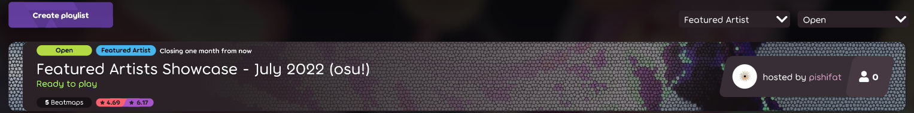

---
tags:
  - FA
  - фа
---

# Плейлисты Featured Artist

В [osu!(lazer)](https://github.com/ppy/osu/releases) каждый месяц размещаются новые **плейлисты, составленные из музыки [Featured Artist](/wiki/Featured_Artists)**, карты в которых замапаны во всех [игровых режимах](/wiki/Game_mode). У таких плейлистов нет строгого формата: их условия, подборка карт, а также призы за прохождение меняются от месяца к месяцу.

")

Открыть плейлисты можно, выбрав в меню osu!(lazer) пункт **играть** и включив фильтр по **Featured Artists** в правом верхнем углу.

## Призы

Игроки, лучше всего прошедшие один из плейлистов Featured Artist, награждаются бейджиками в рамках своего режима (критерии награждения для каждого плейлиста свои).

   

## Прошлые плейлисты

### Июнь 2022

- 8 карт;
- Обязательные моды: [Hidden (HD)](/wiki/Gameplay/Game_modifier/Hidden);
- Моды по желанию (freemod): [No Fail (NF)](/wiki/Gameplay/Game_modifier/No_Fail) и [Mirror (MR)](/wiki/Gameplay/Game_modifier/Mirror);
- Призы выданы игрокам из топ-3 в каждом плейлисте.

### Июль 2022

- 5 карт;
- 15 попыток прохождения на весь плейлист;
- Моды по желанию (freemod): [Hidden (HD)](/wiki/Gameplay/Game_modifier/Hidden), [Hard Rock (HR)](/wiki/Gameplay/Game_modifier/Hard_Rock), [No Fail (NF)](/wiki/Gameplay/Game_modifier/No_Fail) и [Mirror (MR)](/wiki/Gameplay/Game_modifier/Mirror);
- Призы выданы 0.5% лучших игроков в каждом плейлисте.
