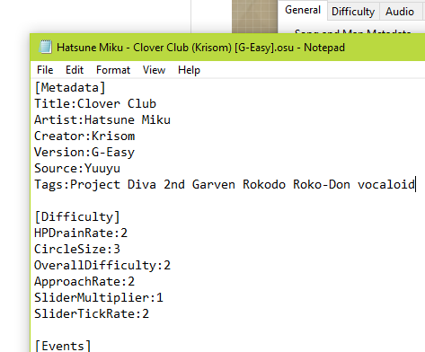

# Finding Metadata

*This guide is based from [Tari's forum post](https://osu.ppy.sh/community/forums/topics/249288).*

The metadata in a osu!beatmap is imperative as it defines the artist, the song name, the genre, and any other
essential information a player needs to know about the song.

## Gathering a song's basic information

First step is finding the basic information of the song's metadata in a music/video streaming platform
service, like [YouTube](https://www.youtube.com) or [SoundCloud](https://soundcloud.com) or searching at [Google](https://google.com).

For English songs, the song name and artist is pretty striaghtforward. However, for Japanese songs (especially anime OSTs),
A little more research is needed to gather their metadata. Only trust metadata from **official sources**.

## Entering the metadata

Once done getting all the needed information, you have two options to enter the metadata to.

#### A : via Song Setup.

 
 
 
#### B : via the ``.osu`` file.

 
 
> Reminder: 
>
> In Song Setup, the Romanised Title field is only available to edit if the game
> detects you have a non-English song title.